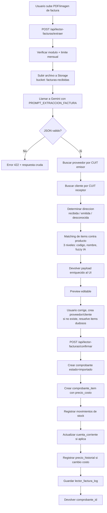

# Nexus — Plan Bloque H: Lector de Facturas con IA

## Estado de implementación (2026-04-21)

El **núcleo funcional** está en el código y en la migración **`046_lector_facturas_fase1.sql`**. Documentación operativa consolidada en **`docs/lector-facturas.md`**.

**Hecho:** tabla `lector_factura_log` + RLS, flag `lector_facturas`, `estado_comprobante.importado`, `comprobante.tipo_operacion` / `proveedor_id`, extensión `cuenta_corriente` y bucket `facturas-recibidas`; `POST /api/lector-facturas/extraer` y `confirmar`; `GET /api/lector-facturas/limite` y `logs`; UI `/lector-facturas` y `/lector-facturas/historial` (flujo tipo IA Precios); sidebar en **Importar** y **Facturación**; acceso app con **`MODULOS_ACCESO_LECTOR_FACTURAS`** (`lector_facturas` **o** `facturador_simple`) vía `requireModuloAny` / `moduloGuardAny`; límite mensual IA compartido con listas/`ia_pdf` (`importacion_log`).

**Pendiente o parcial:** `DELETE /api/lector-facturas/logs/[id]`; rutas `/nueva`, `/logs`, `/logs/[id]` del plan original (reemplazadas por `/historial`); widget dashboard; tests dedicados amplios; transacción única en confirmar.

Las secciones siguientes conservan el **diseño y criterios** del bloque; donde difiere la implementación, prevalece **`docs/lector-facturas.md`**.

---

## Visión general

Nuevo módulo `lector_facturas` (Plan Completo) que permite cargar un PDF o imagen de una **factura recibida** (de proveedor) o **emitida** (a cliente de cuenta corriente), extraer con Gemini todos los datos relevantes (emisor, receptor, items, totales, CAE, etc.) y proponer el alta o actualización automática en el sistema:

- Identifica al **emisor por CUIT** contra la tabla `proveedor`.
- Identifica al **receptor por CUIT** contra la tabla `cliente`.
- Matchea los **items** contra `producto` reutilizando el motor existente del analizador.
- Presenta un preview editable y, al confirmar, crea el comprobante y registra los movimientos correspondientes.

Es el hermano lógico de `ia_precios`: ese extrae **listas de precios**, este extrae **facturas/comprobantes**. Ambos comparten la infraestructura de Gemini, el límite mensual de extracciones y el patrón preview → confirmación.

---

## Objetivos del módulo

- Reducir a segundos la carga manual de facturas recibidas y de cuenta corriente.
- Detectar automáticamente si es una factura de compra (emisor = proveedor conocido) o de venta (receptor = cliente conocido).
- Dejar trazabilidad completa: archivo original en Storage, JSON crudo de Gemini, vínculo al comprobante generado.
- Reutilizar al máximo la infraestructura existente (`llamarGemini`, límite mensual, matching de productos, `registrar_movimiento`, cuenta corriente).
- No romper el flujo fiscal existente: las facturas **recibidas** entran como documento informativo + movimiento de stock (no generan numeración propia), las **emitidas** cargadas por foto quedan como `comprobante` en estado `importado` y no tocan ARCA.

---

## Alcance y no-alcance

### Alcance v7.0

- Carga de PDF/imagen de factura o ticket.
- Extracción IA de cabecera, partes (emisor/receptor) e items.
- Detección de dirección del comprobante (recibida / emitida / desconocida) según CUIT.
- Matching de proveedor/cliente por CUIT con opción de crear si no existe.
- Matching de items contra `producto` en 3 niveles (reutiliza motor del analizador).
- Preview editable con validación de totales (subtotal + IVA ≈ total).
- Confirmación que crea:
  - `comprobante` en estado `importado` (nuevo valor de ENUM).
  - `comprobante_item` con snapshot de `precio_costo`.
  - `movimiento` de entrada (recibida) o salida (emitida).
  - Actualización de `cuenta_corriente` si corresponde.
  - Registro en `precio_historial` si el costo unitario cambió vs. `producto.precio_costo`.
- Límite mensual compartido con `ia_precios` (o independiente, a decidir).

### No-alcance v7.0 (queda para después)

- Emisión electrónica con ARCA desde una factura escaneada (no tiene sentido, ya tiene CAE).
- OCR sin IA como fallback offline (Gemini ya hace OCR).
- Conciliación bancaria o imputación contable por cuenta.
- Lectura de notas de crédito/débito cruzadas con el comprobante original (se carga el documento pero no se vincula al original en v7.0).
- Carga masiva (batch) de muchas facturas en simultáneo.

---

## Flujo principal



---

## Modelo de datos

### Nuevas tablas

#### `lector_factura_log`

Tabla de auditoría/staging que guarda cada extracción. Persiste incluso si el usuario no confirma, para poder reintentar o depurar.

| Campo | Tipo | Descripción |
|---|---|---|
| `id` | UUID PK | |
| `tenant_id` | UUID FK | Tenant que hizo la carga |
| `usuario_id` | UUID FK | Usuario que subió |
| `archivo_url` | TEXT | Path en Storage (bucket `facturas-recibidas`) |
| `archivo_nombre` | TEXT | Nombre original del archivo |
| `archivo_mime` | TEXT | MIME type |
| `archivo_tamano` | INT | Bytes |
| `gemini_raw` | JSONB | JSON completo devuelto por Gemini |
| `datos_extraidos` | JSONB | Datos normalizados y enriquecidos con matches |
| `direccion` | TEXT | `recibida` / `emitida` / `desconocida` |
| `estado` | TEXT | `extraido` / `confirmado` / `descartado` / `error` |
| `comprobante_id` | UUID FK | NULL hasta que se confirma |
| `proveedor_id` | UUID FK | NULL si no matcheó o si es venta |
| `cliente_id` | UUID FK | NULL si no matcheó o si es compra |
| `error_mensaje` | TEXT | Si `estado = error` |
| `created_at` | TIMESTAMPTZ | |
| `updated_at` | TIMESTAMPTZ | |

**Índices:** `idx_lector_factura_log_tenant`, `idx_lector_factura_log_estado`, `idx_lector_factura_log_comprobante`.

### Extensiones sobre tablas existentes

- `modulo_config` agrega flag `lector_facturas` (BOOL, default false, solo Plan Completo).
- `comprobante.estado` agrega valor `importado` al ENUM `estado_comprobante`.
- `tipo_comprobante` agrega valor `factura_recibida` (para compras que no entran por el flujo de venta) — **decisión pendiente**: alternativa es reusar `factura_a/b/c` con un flag `es_entrada` en `comprobante`.
- `precio_historial.origen` incorpora valor `factura_recibida`.
- `importacion_log` ya existe; se agrega `origen = 'lector_factura'` para contar contra el límite mensual (alternativa: contador propio).

### Nueva columna sugerida

`comprobante.tipo_operacion` TEXT con valores `venta` / `compra`. Default `venta`. Esto permite reutilizar toda la tabla `comprobante` para ambos lados sin duplicar entidades, y diferencia claramente las facturas recibidas de las emitidas en queries y reportes.

### Decisión crítica pendiente

**¿Las facturas recibidas se guardan en `comprobante` o en una tabla nueva `factura_compra`?**

Recomendación: **reutilizar `comprobante`** con `tipo_operacion = 'compra'` y `estado = 'importado'`. Ventajas: mismo motor de items, mismo PDF storage, cuenta corriente (invertida, "a pagar") se puede modelar en la misma tabla `cuenta_corriente` sumando un campo `tipo` (cliente / proveedor). Desventajas: la numeración no aplica (el `numero` es el del proveedor, no secuencial propio), hay que tolerar duplicados entre tenants (dos tenants pueden recibir la misma factura) pero el índice `UNIQUE (tenant_id, tipo, numero)` ya aisla.

Si se prefiere separar, habría que crear `factura_compra` + `factura_compra_item` espejando el schema. Más código, menos reutilización.

---

## Integración con Gemini

### Prompt de extracción de factura

```typescript
// src/lib/ia/prompts.ts (nuevo export)

export const PROMPT_EXTRACCION_FACTURA = `Analiza esta imagen o PDF de una factura o comprobante fiscal argentino (Factura A/B/C, Nota de Crédito, Nota de Débito, Remito, Ticket).

Devolvé ÚNICAMENTE un JSON válido con el siguiente formato, sin texto adicional:

{
  "tipo_comprobante": "factura_a" | "factura_b" | "factura_c" | "nota_credito_a" | "nota_credito_b" | "nota_credito_c" | "nota_debito_a" | "nota_debito_b" | "nota_debito_c" | "remito" | "ticket" | "desconocido",
  "letra": "A" | "B" | "C" | null,
  "punto_venta": number | null,
  "numero": number | null,
  "fecha_emision": "YYYY-MM-DD" | null,
  "fecha_vencimiento": "YYYY-MM-DD" | null,
  "emisor": {
    "razon_social": string | null,
    "cuit": string | null,
    "domicilio": string | null,
    "condicion_iva": "responsable_inscripto" | "monotributista" | "exento" | "consumidor_final" | null,
    "ingresos_brutos": string | null,
    "inicio_actividades": "YYYY-MM-DD" | null
  },
  "receptor": {
    "razon_social": string | null,
    "cuit_dni": string | null,
    "domicilio": string | null,
    "condicion_iva": "responsable_inscripto" | "monotributista" | "exento" | "consumidor_final" | null
  },
  "items": [
    {
      "codigo": string | null,
      "descripcion": string,
      "cantidad": number,
      "unidad": string | null,
      "precio_unitario": number,
      "bonificacion": number | null,
      "subtotal": number
    }
  ],
  "subtotal": number | null,
  "iva_21": number | null,
  "iva_10_5": number | null,
  "iva_27": number | null,
  "otros_impuestos": number | null,
  "total": number | null,
  "condicion_pago": string | null,
  "cae": string | null,
  "cae_vencimiento": "YYYY-MM-DD" | null,
  "observaciones": string | null
}

Reglas estrictas:
- El CUIT debe tener exactamente 11 dígitos sin guiones ni espacios.
- Los montos deben ser números (sin "$", sin separadores de miles, punto como decimal).
- Si el comprobante es de tipo B o C, "subtotal" y "total" son iguales y "iva_*" debe ir en null (IVA está incluido).
- Si no encontrás un campo, usá null (no inventes datos).
- "tipo_comprobante" se deduce de la letra impresa (A/B/C) y de la denominación arriba a la derecha.
- Para items, respetá la descripción original del comprobante.
- Si hay descuentos o bonificaciones por línea, restalos del subtotal del item.
- No incluyas renglones de totales, impuestos ni leyendas en el array de items.
- Si el documento no parece una factura, devolvé {"tipo_comprobante": "desconocido", "items": []}.`;
```

### Cliente Gemini

Se **reutiliza** `llamarGemini()` existente en `src/lib/ia/gemini.ts`. Temperatura 0.1, `responseMimeType: 'application/json'`, `maxOutputTokens: 8192` ya están configurados.

### Consideraciones de costo y límite

- Cada extracción de factura cuenta como **una llamada** a Gemini, igual que una lista de precios.
- Se propone **un único contador mensual** compartido entre `ia_precios`, analizador y lector de facturas. Alternativa: contador separado por tipo de origen.
- El archivo se sube a Storage **antes** de llamar a Gemini para evitar perderlo si la llamada falla.

---

## Matching de CUIT

### Función de detección de dirección del comprobante

```typescript
// src/lib/lector-facturas/direccion.ts

import type { SupabaseClient } from '@supabase/supabase-js';

export interface DireccionResultado {
  direccion: 'recibida' | 'emitida' | 'desconocida';
  proveedor_id: string | null;
  cliente_id: string | null;
  crear_proveedor: { razon_social: string; cuit: string } | null;
  crear_cliente: { razon_social: string; cuit_dni: string } | null;
}

export async function detectarDireccion(
  supabase: SupabaseClient,
  tenantId: string,
  tenantCuit: string | null,
  emisorCuit: string | null,
  receptorCuit: string | null,
  emisorRazonSocial: string | null,
  receptorRazonSocial: string | null
): Promise<DireccionResultado> {
  // Normalizar CUITs (solo dígitos)
  const norm = (c: string | null) => c?.replace(/\D/g, '') ?? null;
  const emisorC = norm(emisorCuit);
  const receptorC = norm(receptorCuit);
  const tenantC = norm(tenantCuit);

  // Si el emisor es el tenant => factura emitida
  if (tenantC && emisorC === tenantC) {
    const { data: cliente } = await supabase
      .from('cliente')
      .select('id')
      .eq('cuit_dni', receptorC)
      .maybeSingle();

    return {
      direccion: 'emitida',
      proveedor_id: null,
      cliente_id: cliente?.id ?? null,
      crear_proveedor: null,
      crear_cliente: cliente
        ? null
        : receptorC && receptorRazonSocial
        ? { razon_social: receptorRazonSocial, cuit_dni: receptorC }
        : null,
    };
  }

  // Si el receptor es el tenant => factura recibida
  if (tenantC && receptorC === tenantC) {
    const { data: proveedor } = await supabase
      .from('proveedor')
      .select('id')
      .eq('cuit', emisorC)
      .maybeSingle();

    return {
      direccion: 'recibida',
      proveedor_id: proveedor?.id ?? null,
      cliente_id: null,
      crear_proveedor: proveedor
        ? null
        : emisorC && emisorRazonSocial
        ? { razon_social: emisorRazonSocial, cuit: emisorC }
        : null,
      crear_cliente: null,
    };
  }

  // Fallback: probar match por proveedor conocido
  if (emisorC) {
    const { data: prov } = await supabase
      .from('proveedor')
      .select('id')
      .eq('cuit', emisorC)
      .maybeSingle();
    if (prov) {
      return {
        direccion: 'recibida',
        proveedor_id: prov.id,
        cliente_id: null,
        crear_proveedor: null,
        crear_cliente: null,
      };
    }
  }

  if (receptorC) {
    const { data: cli } = await supabase
      .from('cliente')
      .select('id')
      .eq('cuit_dni', receptorC)
      .maybeSingle();
    if (cli) {
      return {
        direccion: 'emitida',
        proveedor_id: null,
        cliente_id: cli.id,
        crear_proveedor: null,
        crear_cliente: null,
      };
    }
  }

  return {
    direccion: 'desconocida',
    proveedor_id: null,
    cliente_id: null,
    crear_proveedor:
      emisorC && emisorRazonSocial
        ? { razon_social: emisorRazonSocial, cuit: emisorC }
        : null,
    crear_cliente:
      receptorC && receptorRazonSocial
        ? { razon_social: receptorRazonSocial, cuit_dni: receptorC }
        : null,
  };
}
```

---

## Matching de items

Se **reutiliza** el motor de matching del analizador (`V50-ANAL-008`), que ya implementa los tres niveles (código exacto → nombre normalizado → Gemini fuzzy). La única diferencia es que el motor actual está en el contexto de `lista_precios_item`; hay que extraerlo a una función genérica que acepte un array de items y devuelva matches.

Propuesta: **refactor liviano** de `src/lib/analizador/matching.ts` para exponer `matchearItemsContraProductos(items, tenantId, opciones)` reutilizable desde el lector de facturas sin crear entidades persistentes (no hace falta una `lista_precios` para una factura recibida).

---

## API Routes

### `POST /api/lector-facturas/extraer`

Recibe FormData con `archivo`. Devuelve los datos extraídos y enriquecidos sin persistir comprobante (solo `lector_factura_log`).

**Guards:**
- Alguno de: `lector_facturas` o `facturador_simple` (`moduloGuardAny(MODULOS_ACCESO_LECTOR_FACTURAS)`).
- Usuario autenticado; extracción/confirmación con restricciones de rol según ruta (p. ej. visor bloqueado en confirmar).
- Archivo válido: PDF, JPG, PNG, WebP, máx 20 MB.
- Límite mensual de extracciones no superado.

**Response 200:**

```json
{
  "log_id": "uuid",
  "direccion": "recibida" | "emitida" | "desconocida",
  "cabecera": {
    "tipo_comprobante": "factura_a",
    "letra": "A",
    "punto_venta": 4,
    "numero": 12345,
    "fecha_emision": "2026-04-10",
    "cae": "73412...",
    "cae_vencimiento": "2026-04-20"
  },
  "emisor": { "razon_social": "...", "cuit": "...", ... },
  "receptor": { "razon_social": "...", "cuit_dni": "...", ... },
  "proveedor": { "id": "uuid", "nombre": "..." } | null,
  "cliente": { "id": "uuid", "nombre": "..." } | null,
  "crear_proveedor": { ... } | null,
  "crear_cliente": { ... } | null,
  "items": [
    {
      "indice": 0,
      "codigo": null,
      "descripcion": "...",
      "cantidad": 10,
      "unidad": "un",
      "precio_unitario": 1500,
      "subtotal": 15000,
      "match": {
        "producto_id": "uuid" | null,
        "confidence": 0.95,
        "metodo": "nombre_exacto",
        "producto_nombre": "..." | null
      }
    }
  ],
  "totales": {
    "subtotal": 15000,
    "iva_21": 3150,
    "total": 18150
  },
  "validacion": {
    "totales_cuadran": true,
    "advertencias": []
  },
  "extracciones_restantes": 47
}
```

### `POST /api/lector-facturas/confirmar`

Recibe el `log_id` y los datos corregidos por el usuario. Crea el comprobante y registra movimientos.

**Body:**

```json
{
  "log_id": "uuid",
  "direccion": "recibida",
  "proveedor_id": "uuid",
  "cliente_id": null,
  "crear_proveedor": null,
  "crear_cliente": null,
  "tipo_comprobante": "factura_a",
  "tipo_operacion": "compra",
  "fecha": "2026-04-10",
  "numero_externo": "0004-00012345",
  "items": [
    {
      "producto_id": "uuid",
      "crear_producto": null,
      "cantidad": 10,
      "precio_unitario": 1500,
      "precio_costo": 1500
    }
  ],
  "subtotal": 15000,
  "iva_monto": 3150,
  "total": 18150,
  "actualizar_costos": true,
  "afecta_stock": true,
  "afecta_cuenta_corriente": true
}
```

**Flujo:**
1. Validar guards (módulo, rol, ownership del log).
2. Crear proveedor/cliente si `crear_*` no es null.
3. Crear productos nuevos si algún item tiene `crear_producto`.
4. Insertar `comprobante` con `estado = 'importado'` y `tipo_operacion`.
5. Insertar `comprobante_item` con `precio_costo` capturado.
6. Si `afecta_stock = true`:
   - Recibida → `registrar_movimiento` tipo `entrada` por cada item.
   - Emitida → `registrar_movimiento` tipo `salida`.
7. Si `afecta_cuenta_corriente = true`:
   - Recibida → aumenta deuda **a pagar** al proveedor (requiere extender `cuenta_corriente`).
   - Emitida → aumenta deuda del cliente.
8. Si `actualizar_costos = true` (solo recibidas) y el `precio_unitario` difiere del `producto.precio_costo`:
   - UPDATE `producto.precio_costo`.
   - INSERT `precio_historial` con `origen = 'factura_recibida'`.
9. Actualizar `lector_factura_log.estado = 'confirmado'` y `comprobante_id`.

**Response 200:** `{ "comprobante_id": "uuid", "pdf_url": "..." }`.

### `GET /api/lector-facturas/logs`

Listado paginado de extracciones con filtros por estado y fecha. Para la vista de historial.

### `DELETE /api/lector-facturas/logs/[id]` *(no implementado aún)*

Idea: marcar un log como `descartado` (soft delete). Ver **`docs/lector-facturas.md`**.

---

## UI del módulo

### Rutas

```text
/lector-facturas              # Carga, preview, confirmar (equivalente a “nueva” + dashboard del plan)
/lector-facturas/historial    # Listado de extracciones
```

Rutas **no** usadas en la implementación actual: `/lector-facturas/nueva`, `/lector-facturas/logs`, `/lector-facturas/logs/[id]`.

### Componentes principales

- `extraer-factura.tsx` — drop zone y spinner (mismo patrón visual que IA Precios: Brain + Upload, tema púrpura).
- `lector-facturas-client.tsx` — preview editable, totales con `calcularImportes`, confirmación.
- `lector-historial-client.tsx` — tabla de logs vía `GET /api/lector-facturas/logs`.

### Componentes planificados (nombres históricos del plan)

- `upload-factura.tsx` — drop zone, preview del archivo, spinner durante extracción.
- `preview-factura.tsx` — pantalla de preview editable con tres paneles:
  - **Partes** (emisor/receptor, con banner de "Proveedor detectado: X" o "Crear nuevo proveedor").
  - **Items** (tabla con matches; cada fila permite cambiar el producto, crear uno nuevo, o ignorar).
  - **Totales** (subtotal, IVA desglosado, total; advertencia si no cuadra).
- `resolver-item-dialog.tsx` — modal para resolver un item dudoso (elegir producto existente, crear nuevo, descartar).
- `lector-facturas-logs-table.tsx` — historial con filtros.

### Flujo UX

1. Usuario arrastra archivo → spinner "Analizando factura con IA..." (5-30s).
2. Aparece preview con datos precargados:
   - Banner verde si se detectó proveedor/cliente existente.
   - Banner amarillo si detectó CUIT pero no existe en el sistema (con botón "Crear proveedor/cliente").
   - Banner rojo si no detectó dirección.
3. Usuario revisa items, resuelve dudosos, edita cantidades/precios si hace falta.
4. Checkbox "Actualizar costos de productos con este precio" (solo si es recibida).
5. Checkbox "Afectar stock" (default: true).
6. Checkbox "Registrar en cuenta corriente" (default: true si proveedor/cliente tiene cuenta corriente habilitada).
7. Botón "Confirmar carga" → POST a `/confirmar` → redirige a **`/facturacion`**.

---

## Integraciones con módulos existentes

### `modulos`
- Flag `lector_facturas` en `modulo_config` (Plan Completo vía `activar_plan`).
- En UI y APIs del lector, acceso efectivo también si **`facturador_simple`** está activo (`MODULOS_ACCESO_LECTOR_FACTURAS`).

### `ia-precios` y `analizador`
- Comparten `llamarGemini()` y el límite mensual (si se decide contador unificado).
- Reutilizan el motor de matching de productos.

### `facturacion`
- Usa la tabla `comprobante` y `comprobante_item`.
- Nuevo estado `importado` que indica "documento cargado, no emitido por nosotros".
- El listado de comprobantes en `/facturacion` debe filtrar por `tipo_operacion` para no mezclar ventas y compras en la misma vista (o mostrar ambas con un toggle).

### `stock`
- Usa `registrar_movimiento` existente, con nuevos `referencia_tipo = 'factura_recibida'` o `'factura_importada'`.

### `analizador` (cuenta corriente)
- Extender `cuenta_corriente` para soportar **deuda a pagar** (proveedores) además de **deuda a cobrar** (clientes), o crear `cuenta_corriente_proveedor` espejo.
- Recomendación: agregar campo `tipo` (`cliente` / `proveedor`) a la tabla existente, o FK opcional a `proveedor_id` además de `cliente_id`.

### `arca`
- **Sin impacto.** El lector de facturas no emite, solo importa documentos ya emitidos (propios o de terceros). El CAE extraído se guarda de forma informativa en `comprobante.cae` y `comprobante.cae_vencimiento`.

---

## Consideraciones de seguridad y calidad

- RLS obligatorio en `lector_factura_log` con `tenant_id`.
- Bucket `facturas-recibidas` con policies de Storage idénticas a `comprobantes` (solo el tenant dueño lee).
- El JSON crudo de Gemini puede contener datos sensibles (CUITs, domicilios) → no loguear a console en producción.
- Validar que el `numero_externo` + `emisor_cuit` no esté duplicado dentro del tenant (un mismo proveedor no puede facturarle dos veces con el mismo número) → índice UNIQUE parcial.
- Rate limit por tenant: máximo 10 extracciones por minuto para evitar abuso accidental.
- Tests de aislamiento: un tenant no puede leer logs ni archivos de otro.
- Falso positivo en CUIT (Gemini se confunde un dígito): la confirmación **siempre** muestra los datos extraídos al usuario antes de crear el proveedor/cliente; no hay alta silenciosa.

---

## Riesgos técnicos

| Riesgo | Impacto | Mitigación |
|---|---|---|
| Gemini extrae CUIT equivocado y crea un proveedor fantasma | Datos sucios en la tabla proveedor | Confirmación manual siempre. Validar formato CUIT (11 dígitos + dígito verificador). Si el CUIT no valida, bloquear la creación y pedir corrección |
| Totales extraídos no cuadran (subtotal + IVA ≠ total) | Registro contable incorrecto | Validación en backend. Si la diferencia supera 1 peso, bloquear confirmación y pedir corrección manual |
| PDFs de baja calidad o imágenes borrosas | Extracción con errores | Advertir en la UI cuando Gemini devuelve muchos campos null. Permitir al usuario reintentar con otra foto |
| Facturas en formatos no estándar (manuscritas, térmicas borradas) | Gemini falla | Fallback a carga manual tradicional. El módulo no reemplaza la carga manual, la acelera |
| Duplicación: el usuario carga dos veces la misma factura | Doble movimiento de stock / doble deuda | Índice UNIQUE parcial `(tenant_id, emisor_cuit, tipo, punto_venta, numero)` en `comprobante`. Si se detecta duplicado, error 409 |
| Costo desbocado de Gemini si un tenant abusa | Factura alta de API | Límite mensual compartido con `ia_precios`. Warning a partir de 80% de consumo |
| Gemini devuelve JSON malformado | Usuario queda bloqueado | Ya manejado por `ia-precios.md`: regex de fallback + respuesta cruda en el error para debugging |

---

## Roadmap del bloque

### Fase 1 — Fundaciones (DB + módulo)

- Migraciones para `lector_factura_log`, flag de módulo, ENUM `estado = importado`, columna `tipo_operacion`.
- Bucket de Storage `facturas-recibidas`.
- Extensión de `cuenta_corriente` para proveedores.

### Fase 2 — Motor de extracción

- Prompt y cliente (reutilizando Gemini).
- API `/extraer` con detección de dirección y matching de items.
- Refactor del motor de matching del analizador para hacerlo reutilizable.

### Fase 3 — Confirmación y persistencia

- API `/confirmar` que orquesta creación de comprobante, items, movimientos, cuenta corriente y precio_historial.
- Validaciones de totales y duplicados.

### Fase 4 — UI

- Upload y preview con resolución de items dudosos.
- Historial de extracciones.
- Integración al sidebar con guard de módulo.

### Fase 5 — Pulido

- Tests unitarios y de integración.
- Alertas en dashboard (facturas importadas del mes, monto total en compras).
- Documentación de usuario.

---

## Tickets propuestos

| # | ID | Título | Fase | Pts | Dep. |
|---|---|---|---|---|---|
| 1 | V70-LECT-001 | Migración: tabla `lector_factura_log` con RLS | 1 | 3 | V01-INFRA-004 |
| 2 | V70-LECT-002 | Migración: flag `lector_facturas` + ENUM `estado=importado` + columna `tipo_operacion` | 1 | 3 | V70-LECT-001 |
| 3 | V70-LECT-003 | Migración: extender `cuenta_corriente` para proveedores | 1 | 5 | V50-ANAL-004 |
| 4 | V70-LECT-004 | Bucket Storage `facturas-recibidas` con policies RLS | 1 | 2 | V01-INFRA-003 |
| 5 | V70-LECT-005 | Prompt `PROMPT_EXTRACCION_FACTURA` y parser de respuesta | 2 | 3 | V30-IA-001 |
| 6 | V70-LECT-006 | Refactor de `matching.ts` del analizador en función reutilizable | 2 | 5 | V50-ANAL-008 |
| 7 | V70-LECT-007 | Función `detectarDireccion()` con match por CUIT | 2 | 3 | V70-LECT-002 |
| 8 | V70-LECT-008 | API `POST /api/lector-facturas/extraer` (end-to-end extracción) | 2 | 8 | V70-LECT-004, V70-LECT-005, V70-LECT-006, V70-LECT-007 |
| 9 | V70-LECT-009 | API `POST /api/lector-facturas/confirmar` (crear comprobante + movimientos) | 3 | 8 | V70-LECT-008, V70-LECT-003 |
| 10 | V70-LECT-010 | Validación de totales y detección de duplicados | 3 | 3 | V70-LECT-009 |
| 11 | V70-LECT-011 | API `GET /api/lector-facturas/logs` + `DELETE /logs/[id]` | 3 | 3 | V70-LECT-001 |
| 12 | V70-LECT-012 | Componente `upload-factura.tsx` | 4 | 3 | V70-LECT-008 |
| 13 | V70-LECT-013 | Componente `preview-factura.tsx` con tres paneles editables | 4 | 13 | V70-LECT-008 |
| 14 | V70-LECT-014 | Componente `resolver-item-dialog.tsx` | 4 | 5 | V70-LECT-013 |
| 15 | V70-LECT-015 | Página `/lector-facturas/logs` con tabla y filtros | 4 | 5 | V70-LECT-011 |
| 16 | V70-LECT-016 | Integración al sidebar con guard de módulo | 4 | 2 | V70-LECT-002 |
| 17 | V70-LECT-017 | Widget dashboard: facturas importadas del mes | 5 | 3 | V70-LECT-011 |
| 18 | V70-LECT-018 | Tests unitarios: detección de dirección, cálculo de totales, parser | 5 | 5 | V70-LECT-008 |
| 19 | V70-LECT-019 | Tests de integración: flujo completo extracción → confirmación | 5 | 5 | V70-LECT-009 |
| 20 | V70-LECT-020 | Documentación `lector-facturas.md` | 5 | 3 | todas |

**Total:** 20 tickets, ~90 story points.

---

## Criterio de cierre del bloque

Un usuario con **`lector_facturas` o `facturador_simple`** activo:

1. Entra a `/lector-facturas`.
2. Sube una foto de una factura A recibida de un proveedor existente con 5 items conocidos.
3. El sistema detecta al proveedor por CUIT, matchea los 5 items por código/nombre, y muestra todos los totales correctos.
4. Confirma la carga.
5. En `/facturacion` aparece el comprobante con `estado = importado` y `tipo_operacion = compra`.
6. En el stock, los 5 productos suman la cantidad recibida.
7. En la cuenta corriente del proveedor aparece la deuda a pagar.
8. Si alguno de los productos tenía un costo anterior distinto, aparece una fila en `precio_historial`.

---

## Decisiones a validar antes de arrancar

1. **¿Tabla única `comprobante` con `tipo_operacion` o tabla separada `factura_compra`?** (recomendado: única).
2. **¿Contador mensual de IA unificado o separado por tipo (precios vs. facturas)?** (recomendado: unificado, más simple de explicar al usuario).
3. **¿Cuenta corriente única con campo `tipo` o tablas separadas para cliente y proveedor?** (recomendado: única con tipo).
4. **¿Se permite cargar facturas que no son ni del tenant ni de un proveedor/cliente conocido?** (ej: factura suelta que quiero guardar). Recomendación: sí, con `direccion = desconocida`, no genera movimientos pero queda el registro.
5. **¿La factura emitida importada (no emitida por el sistema) descuenta stock?** (recomendado: sí por default, con checkbox para desactivar).
6. **Versionado:** ¿este bloque se ubica como v7.0 o se inserta antes de otra cosa? Actualmente el proyecto está completo hasta v6.0.

---

## Referencias relacionadas

- **`docs/lector-facturas.md`** — Documentación operativa del módulo implementado (rutas, APIs, acceso, código).
- `docs/ia-precios.md` — Infraestructura de Gemini, patrón de preview, límite mensual.
- `docs/analizador.md` — Motor de matching de productos, cuenta corriente.
- `docs/facturacion.md` — Tabla `comprobante`, `comprobante_item`, numeración.
- `docs/stock.md` — `registrar_movimiento`, trazabilidad.
- `docs/base-de-datos.md` — Schema actual de `proveedor`, `cliente`, `comprobante`, migración 046.
- `docs/modulos.md` — Sistema de feature flags.