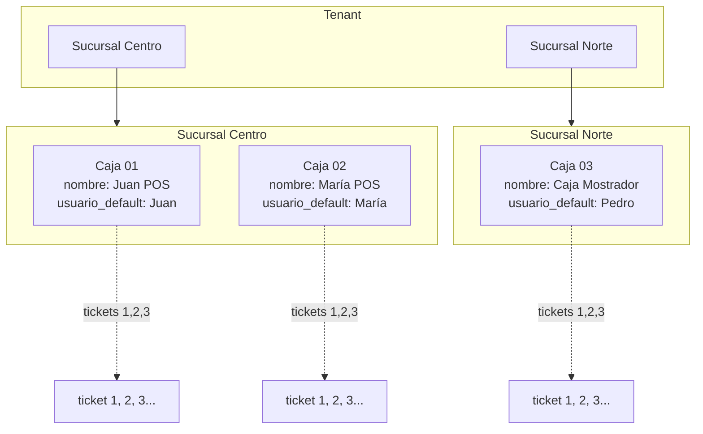

# Plan — Caja por usuario en sucursal + numeración de tickets independiente por caja

## Resumen ejecutivo

**Objetivo:** que **cada cajero** (usuario) tenga **su propia caja** dentro de una sucursal, con **numeración de tickets independiente por caja**. Si en la sucursal "Centro" operan Juan y María a la vez, cada uno emite tickets en su propia secuencia (Caja 01-Juan: 1, 2, 3… / Caja 02-María: 1, 2, 3…), y los reportes/cierres Z se separan por caja.

**Por qué ahora:**

- Hoy `comprobante.tipo='ticket'` numera **secuencial por tenant** (a través de `siguiente_numero_comprobante`). Con 2+ cajeros simultáneos, los tickets se intercalan en una sola secuencia: si Juan emite 100 y María 101, ninguno puede dar a su cliente un correlativo "limpio" propio.
- La columna `comprobante.caja_id` ya existe (VARCHAR(20), nullable, migración `027_pos_comprobante.sql`) pero **nunca se usó**: está marcada explícitamente como "reservado para múltiples cajas (v6.1)" en `docs/base-de-datos.md` y en `PLAN-BLOQUE-F.md` §4.9.
- El modelo de Cierre Z (`V80-CAJA-001`) ya idempotenta por `(tenant_id, caja_id, rango_desde, rango_hasta, tipo_cierre)` — lo único que falta es que `caja_id` deje de ser un string libre y pase a ser un identificador **fuerte** ligado a un usuario y una sucursal.

**Por qué duele:**

- La función `siguiente_numero_comprobante(p_tenant_id, p_tipo)` no contempla `caja_id`. Hay que crear una secuencia paralela **solo para tickets** sin tocar la numeración fiscal (factura A/B/C, NC, presupuesto, remito, recibo) que **debe** seguir siendo única por tenant/tipo (lo exige ARCA y el numerador clásico).
- El índice UNIQUE actual `idx_comprobante_numero(tenant_id, tipo, numero)` impide que dos tickets distintos tengan el mismo número, aunque sean de cajas distintas. Hay que reemplazarlo por uno que incluya `caja_id` **solo para el tipo `ticket`**.
- Toca también: `cierre_z` (ya tiene `caja_id`, hay que materializar la FK), POS UI (mostrar caja activa, validar apertura), reportes (filtros), y `numero_orden` (que sigue siendo por tenant — no cambia).

**Estrategia:** plan en **5 fases reversibles**, no big-bang. Cada fase deja el sistema deployable.

**Estimación gruesa:** 3–4 sprints (6–8 semanas) con 1 dev full-time.

**Alcance explícitamente excluido:**

- **No se cambia la numeración de comprobantes fiscales** (factura A/B/C, notas de crédito, remito, presupuesto, recibo). Esos siguen secuenciales por tenant/tipo. ARCA exige punto de venta único por tenant — modificarlo es alcance de un Plan-J extendido, no de este plan.
- **No se separa el stock por caja.** El stock sigue por sucursal (modelo actual o, si está vigente, `stock_sucursal` del plan "producto único").
- **No se permite que un mismo usuario abra dos cajas a la vez** (regla de negocio: 1 usuario activo = 1 caja abierta).

---

## Estado actual (qué funciona y qué no)

### Lo que ya existe

| Pieza | Estado | Dónde está |
|---|---|---|
| Columna `comprobante.caja_id VARCHAR(20)` | ✅ Existe, nullable, sin uso real | Migración `027_pos_comprobante.sql` |
| Tabla `cierre_z` con `caja_id` | ✅ Cierre Z idempotente por `(tenant_id, caja_id, rango_desde, rango_hasta, tipo_cierre)` | `V80-CAJA-001` |
| Multi-sucursal endurecido (filtros y RLS efectiva) | ✅ Operativo | `qa-multisucursal-hardening-checklist.md` |
| `usuario.tenant_id`, `usuario.rol`, `sucursal_default_id` | ✅ Operativo | `docs/autenticacion.md`, `docs/multi-tenancy.md` |
| `numero_orden` por tenant (agrupa ticket↔factura) | ✅ Operativo | Migración `041`, `Plan-Ordenes.md` |
| `siguiente_numero_comprobante(p_tenant_id, p_tipo)` | ⚠️ No conoce de cajas | Migración `012` |
| Índice UNIQUE `(tenant_id, tipo, numero)` en `comprobante` | ⚠️ Bloquea numeración paralela | Migración `006` |
| Reportes con filtros por caja y operador | ✅ Filtros existen pero `caja_id` es string libre | `V80-REP-004` y `reportes.md` |

### Lo que se rompe sin este plan

- En el POS, dos cajeros simultáneos comparten correlativo de ticket → confunde al cliente y al cajero (no ven una secuencia "limpia" propia).
- El cierre Z usa `caja_id` como string opaco — si dos cajeros rotan, no hay verificación de que un Z pertenece a la persona correcta.
- Los reportes "por caja/operador" agrupan por un campo libre, sin garantía de que un mismo cajero use siempre el mismo string.

---

## Modelo objetivo



**Regla maestra:**

- **Tickets** (`tipo='ticket'`): numeración correlativa **por caja**. Caja 01 ticket #1 y Caja 02 ticket #1 coexisten.
- **Comprobantes fiscales** (factura A/B/C, NC, remito, presupuesto, recibo): numeración correlativa **por tenant/tipo**. No cambia. (Se sigue mostrando con formato `PPPP-NNNNNNNN`).
- **`numero_orden`**: sigue por tenant (agrupa ticket + factura del mismo cobro). No cambia.

---

## Fase 0 — Diseño y decisiones (BLOQUEANTE)

Antes de escribir DDL, hay que cerrar 5 decisiones de diseño. Sin esto el plan sale mal.

### Decisión 1 — ¿Caja como entidad o como par (sucursal, usuario)?

**Opción A — Tabla `caja` propia:** entidad de primera clase. Cada caja tiene `id UUID`, `tenant_id`, `sucursal_id`, `numero` (humano: 1, 2, 3 dentro de la sucursal), `nombre`, `usuario_default_id` (opcional), `activa`.

**Opción B — Caja implícita = (sucursal, usuario):** no hay tabla, se usa `(sucursal_id, usuario_id)` como caja virtual.

**Recomendación: Opción A.** Razones:

1. Una caja puede ser operada por distintos usuarios en distintos turnos (ej: caja 01 la maneja Juan a la mañana y Carlos a la tarde). El `usuario_default` es solo una sugerencia de UI.
2. El número humano de caja ("Caja 01", "Caja 02") debe ser estable y visible al cliente (se imprime en el ticket).
3. Permite cajas físicas que no están asociadas a un usuario (caja administrativa, caja de respaldo).
4. Es alineado con cómo modelan caja Tango, Gestión Express, Bejerman.

### Decisión 2 — ¿Numeración de tickets por caja o por (caja + fecha)?

**Opción A — Por caja (correlativa eterna):** Caja 01 emite ticket 1, 2, 3, …, 99999. Reinicia "nunca" (en la práctica, al pasar millones).

**Opción B — Por caja y día:** Caja 01 emite ticket 1, 2, 3, … hasta cierre Z, y al día siguiente arranca de 1.

**Recomendación: Opción A.** Razones:

1. Coherente con el modelo argentino (factura no reinicia diaria; ticket tampoco).
2. Más simple de implementar: una sola secuencia por caja.
3. El cierre Z ya provee el corte por fecha — el "reinicio diario" es una vista, no un cambio de secuencia.
4. Si el cliente vuelve con un ticket viejo, el número es único y rastreable.

### Decisión 3 — ¿Apertura de caja explícita?

**Opción A — Sí, hay un estado `apertura_caja` y un Z de cierre.** El cajero "abre caja" al inicio del turno (ingresa monto inicial), opera, y cierra con Z al final. Ya emitir tickets sin apertura activa = error.

**Opción B — No, basta con que el usuario tenga la caja asignada.** Tickets se emiten libres; el Z es solo un snapshot.

**Recomendación: Opción A.** Razones:

1. El cierre Z (`V80-CAJA-001`) ya está pensado contra apertura/cierre. Sin apertura explícita, el "monto inicial de efectivo" del Z queda sin referencia.
2. Es el flujo natural de una caja registradora física — el usuario lo entiende.
3. Permite trazabilidad: este turno empezó X cajero a las HH:MM con $Y de fondo, terminó a las HH:MM con $Z.
4. Evita el caso "Juan se olvidó de cerrar Z" → el sistema bloquea operar hasta resolver el turno previo.

### Decisión 4 — ¿Un usuario puede tener varias cajas asignadas?

**Recomendación: sí, pero solo una activa a la vez.**

- Un cajero puede estar habilitado en varias cajas (ej: Juan opera Caja 01 los lunes y Caja 02 los martes), pero solo puede tener **una apertura activa simultánea**.
- Constraint a nivel de aplicación + índice parcial en DB: `UNIQUE (usuario_id) WHERE estado='abierta'` en la tabla de turnos.

### Decisión 5 — ¿Qué pasa con tenants que ya operaron sin caja_id?

Tenants con tickets ya emitidos donde `comprobante.caja_id IS NULL`:

- Backfill: crear una "Caja 01 — Caja general" por sucursal y reapuntar todos los tickets históricos a esa caja.
- La numeración histórica queda como secuencia única de esa caja virtual. No se reorganiza.
- A partir del deploy del modelo nuevo, los tickets nuevos van a la caja real del cajero.

### Criterio de salida de la fase 0

- [ ] Las 5 decisiones documentadas y firmadas (idealmente como addendum a este plan).
- [ ] Diagrama del flujo POS con apertura/cierre explícito.
- [ ] Mockup de la UI de "Mi caja" (selector visible en el POS).

---

## Fase 1 — Esquema nuevo (tablas y migraciones)

**Objetivo:** crear las tablas `caja` y `caja_turno`, agregar la FK fuerte en `comprobante.caja_id`, sin tocar la numeración aún.

### DDL

```sql
-- Migración 110_caja.sql (número tentativo)

-- Tabla de cajas físicas/lógicas
CREATE TABLE caja (
  id UUID PRIMARY KEY DEFAULT gen_random_uuid(),
  tenant_id UUID NOT NULL REFERENCES tenant(id) ON DELETE CASCADE,
  sucursal_id UUID NOT NULL REFERENCES sucursal(id) ON DELETE RESTRICT,
  numero INT NOT NULL,                        -- 1, 2, 3 dentro de la sucursal
  nombre TEXT NOT NULL,                       -- "Caja Juan", "Caja mostrador"
  usuario_default_id UUID REFERENCES usuario(id) ON DELETE SET NULL,
  activa BOOLEAN NOT NULL DEFAULT true,
  created_at TIMESTAMPTZ NOT NULL DEFAULT now(),
  updated_at TIMESTAMPTZ NOT NULL DEFAULT now(),
  CONSTRAINT uk_caja_numero_sucursal UNIQUE (sucursal_id, numero),
  CONSTRAINT chk_caja_numero_positivo CHECK (numero > 0)
);

CREATE INDEX idx_caja_tenant ON caja(tenant_id);
CREATE INDEX idx_caja_sucursal ON caja(sucursal_id);
CREATE INDEX idx_caja_usuario_default ON caja(usuario_default_id) WHERE usuario_default_id IS NOT NULL;

-- RLS (mismo patrón que stock_sucursal)
ALTER TABLE caja ENABLE ROW LEVEL SECURITY;
CREATE POLICY tenant_select_caja ON caja FOR SELECT USING (tenant_id = auth.tenant_id());
CREATE POLICY tenant_insert_caja ON caja FOR INSERT WITH CHECK (tenant_id = auth.tenant_id());
CREATE POLICY tenant_update_caja ON caja FOR UPDATE USING (tenant_id = auth.tenant_id())
  WITH CHECK (tenant_id = auth.tenant_id());
CREATE POLICY tenant_delete_caja ON caja FOR DELETE USING (tenant_id = auth.tenant_id());

CREATE TRIGGER set_caja_updated_at BEFORE UPDATE ON caja
  FOR EACH ROW EXECUTE FUNCTION moddatetime(updated_at);

-- Asignación caja-usuario (N:M opcional)
-- Permite que un usuario pueda operar en varias cajas (ej. backup), 
-- pero el "default" sigue en caja.usuario_default_id.
CREATE TABLE caja_usuario (
  id UUID PRIMARY KEY DEFAULT gen_random_uuid(),
  tenant_id UUID NOT NULL REFERENCES tenant(id) ON DELETE CASCADE,
  caja_id UUID NOT NULL REFERENCES caja(id) ON DELETE CASCADE,
  usuario_id UUID NOT NULL REFERENCES usuario(id) ON DELETE CASCADE,
  created_at TIMESTAMPTZ NOT NULL DEFAULT now(),
  CONSTRAINT uk_caja_usuario UNIQUE (caja_id, usuario_id)
);

CREATE INDEX idx_caja_usuario_tenant ON caja_usuario(tenant_id);
CREATE INDEX idx_caja_usuario_usuario ON caja_usuario(usuario_id);

ALTER TABLE caja_usuario ENABLE ROW LEVEL SECURITY;
-- (4 policies idénticas a caja)

-- Turnos: una apertura es un "turno" abierto que termina con un cierre Z.
CREATE TABLE caja_turno (
  id UUID PRIMARY KEY DEFAULT gen_random_uuid(),
  tenant_id UUID NOT NULL REFERENCES tenant(id) ON DELETE CASCADE,
  caja_id UUID NOT NULL REFERENCES caja(id) ON DELETE RESTRICT,
  usuario_id UUID NOT NULL REFERENCES usuario(id) ON DELETE RESTRICT,
  estado TEXT NOT NULL CHECK (estado IN ('abierto', 'cerrado')),
  abierto_at TIMESTAMPTZ NOT NULL DEFAULT now(),
  cerrado_at TIMESTAMPTZ,
  monto_inicial NUMERIC(12,2) NOT NULL DEFAULT 0 CHECK (monto_inicial >= 0),
  cierre_z_id UUID REFERENCES cierre_z(id),    -- enlace al Z si ya se cerró
  notas TEXT,
  created_at TIMESTAMPTZ NOT NULL DEFAULT now(),
  updated_at TIMESTAMPTZ NOT NULL DEFAULT now()
);

CREATE INDEX idx_caja_turno_tenant ON caja_turno(tenant_id);
CREATE INDEX idx_caja_turno_caja ON caja_turno(caja_id);
CREATE INDEX idx_caja_turno_usuario ON caja_turno(usuario_id);
CREATE INDEX idx_caja_turno_abierto_at ON caja_turno(abierto_at DESC);

-- HARD: un usuario solo puede tener UN turno abierto en todo el tenant.
CREATE UNIQUE INDEX uk_caja_turno_usuario_abierto
  ON caja_turno(usuario_id) WHERE estado = 'abierto';

-- HARD: una caja solo puede tener UN turno abierto.
CREATE UNIQUE INDEX uk_caja_turno_caja_abierto
  ON caja_turno(caja_id) WHERE estado = 'abierto';

ALTER TABLE caja_turno ENABLE ROW LEVEL SECURITY;
-- (4 policies idénticas)

CREATE TRIGGER set_caja_turno_updated_at BEFORE UPDATE ON caja_turno
  FOR EACH ROW EXECUTE FUNCTION moddatetime(updated_at);
```

### Cambio en `comprobante`

```sql
-- Migración 111_comprobante_caja_fk.sql

-- 1. Agregar nueva columna FK fuerte (la vieja VARCHAR(20) se mantiene transitoriamente)
ALTER TABLE comprobante 
  ADD COLUMN caja_uuid UUID REFERENCES caja(id) ON DELETE RESTRICT;

ALTER TABLE comprobante
  ADD COLUMN caja_turno_id UUID REFERENCES caja_turno(id) ON DELETE RESTRICT;

CREATE INDEX idx_comprobante_caja ON comprobante(caja_uuid) WHERE caja_uuid IS NOT NULL;
CREATE INDEX idx_comprobante_turno ON comprobante(caja_turno_id) WHERE caja_turno_id IS NOT NULL;

-- 2. Para tickets: la numeración por caja necesita un nuevo correlativo
ALTER TABLE comprobante 
  ADD COLUMN numero_caja INT;

-- Constraint: si tipo='ticket' y caja_uuid IS NOT NULL, numero_caja DEBE estar definido
ALTER TABLE comprobante
  ADD CONSTRAINT chk_ticket_numero_caja CHECK (
    NOT (tipo = 'ticket' AND caja_uuid IS NOT NULL) OR numero_caja IS NOT NULL
  );

-- Índice UNIQUE para numeración por caja (solo aplica a tickets)
CREATE UNIQUE INDEX uk_comprobante_ticket_caja_numero
  ON comprobante(caja_uuid, numero_caja)
  WHERE tipo = 'ticket' AND caja_uuid IS NOT NULL;
```

### Backfill de cajas históricas

```sql
-- Migración 112_caja_backfill.sql

-- 1. Crear "Caja general" por cada sucursal existente
INSERT INTO caja (tenant_id, sucursal_id, numero, nombre)
SELECT s.tenant_id, s.id, 1, 'Caja general'
FROM sucursal s
WHERE NOT EXISTS (SELECT 1 FROM caja c WHERE c.sucursal_id = s.id);

-- 2. Reapuntar tickets históricos a la caja general de la sucursal del comprobante
UPDATE comprobante c
SET caja_uuid = (
  SELECT id FROM caja
  WHERE sucursal_id = c.sucursal_id AND numero = 1
  LIMIT 1
)
WHERE c.tipo = 'ticket' AND c.caja_uuid IS NULL;

-- 3. Backfill numero_caja: usar el numero existente (todos comparten una sola caja, no hay colisión)
UPDATE comprobante
SET numero_caja = numero
WHERE tipo = 'ticket' AND caja_uuid IS NOT NULL AND numero_caja IS NULL;
```

### Criterio de salida de la fase 1

- [x] Tablas `caja`, `caja_usuario`, `caja_turno` creadas con RLS (`108_caja_por_usuario_fase1.sql`).
- [x] Backfill ejecutado: cada sucursal tiene su Caja general, todos los tickets históricos con `numero` NOT NULL apuntan a ella y reciben `numero_caja`.
- [x] El sistema **sigue funcionando igual** hasta que el POS/API lean `caja_uuid` / `numero_caja` (fase 3).
- [ ] Deploy a producción + monitoreo 1 semana antes de conmutar numeración en POS (fase 3).

---

## Fase 2 — Función de numeración por caja + apertura/cierre

**Objetivo:** crear la nueva función SQL que numere tickets por caja, y los endpoints de apertura/cierre de turno.

### Nueva función SQL

```sql
-- Migración 113_siguiente_numero_ticket_caja.sql

CREATE OR REPLACE FUNCTION siguiente_numero_ticket_caja(
  p_tenant_id UUID,
  p_caja_id   UUID
) RETURNS INTEGER AS $$
DECLARE
  v_siguiente INTEGER;
BEGIN
  -- Validar que la caja pertenece al tenant
  IF NOT EXISTS (
    SELECT 1 FROM caja 
    WHERE id = p_caja_id AND tenant_id = p_tenant_id AND activa = true
  ) THEN
    RAISE EXCEPTION 'Caja % no existe o no pertenece al tenant %', p_caja_id, p_tenant_id;
  END IF;

  SELECT COALESCE(MAX(numero_caja), 0) + 1 INTO v_siguiente
  FROM comprobante
  WHERE tenant_id = p_tenant_id 
    AND tipo = 'ticket'
    AND caja_uuid = p_caja_id;

  RETURN v_siguiente;
END;
$$ LANGUAGE plpgsql SECURITY DEFINER;
```

**Atomicidad:** igual que `siguiente_numero_comprobante` clásica — el índice UNIQUE `uk_comprobante_ticket_caja_numero` previene duplicados si dos requests intentan emitir simultáneamente en la misma caja. Uno gana, el otro reintenta.

### Endpoints de turno

| Método y ruta | Qué hace |
|---|---|
| `POST /api/caja/turno/abrir` | Abre turno para `caja_id` + usuario actual. Body: `{ caja_id, monto_inicial }`. Crea fila en `caja_turno` con `estado='abierto'`. |
| `POST /api/caja/turno/cerrar` | Cierra turno actual del usuario. Genera Cierre Z (reusa `V80-CAJA-001`). Marca `caja_turno.estado='cerrado'`, vincula `cierre_z_id`. |
| `GET /api/caja/turno/actual` | Devuelve el turno abierto del usuario actual (o 404 si no hay). |
| `GET /api/caja/disponibles` | Lista cajas en las que el usuario puede operar (intersección `caja_usuario` + `usuario.sucursal_default_id`). |

### Validaciones (reglas de negocio)

1. **Abrir turno requiere:** usuario asignado a la caja (vía `caja_usuario` o ser `usuario_default_id` de la caja), caja `activa=true`, sucursal de la caja en las sucursales permitidas del usuario.
2. **No abrir turno si:** el usuario ya tiene uno abierto (cualquier caja), la caja ya tiene un turno abierto.
3. **Cerrar turno requiere:** generar el cierre Z. Si el Z falla, el turno queda abierto.
4. **Emitir ticket requiere:** turno abierto del usuario en la caja.

### Criterio de salida de la fase 2

- [x] `siguiente_numero_ticket_caja` operativa (`109_siguiente_numero_ticket_caja.sql`).
- [x] Endpoints de turno: `POST /api/caja/turno/abrir`, `POST /api/caja/turno/cerrar`, `GET /api/caja/turno/actual`, `GET /api/caja/disponibles` (tests automatizados pendientes).
- [x] UI mínima: `/caja/turno` (turno abierto + cierre Z, o abrir caja; menú Facturación → Mi caja).
- [ ] La emisión de tickets por POS **todavía** usa el camino viejo (sin `numero_caja`). Esto es deliberado: en fase 3 se conmuta.

---

## Fase 3 — Conmutación del POS al modelo nuevo

**Objetivo:** que `/facturacion/pos` use la caja del turno activo y emita tickets con `numero_caja`.

### Cambios en el flujo POS

1. **Al entrar a `/facturacion/pos`:** si el usuario no tiene turno abierto, redirigir a `/caja/turno` con CTA "Abrí tu caja para empezar".
2. **Barra superior del POS** (ya existente, ver `PLAN-BLOQUE-F.md` §4.4): agregar el chip "Caja 01 — Juan" visible siempre. Click abre el detalle del turno.
3. **Al emitir ticket** (`POST /api/facturacion/emitir`): el endpoint identifica el turno actual del usuario, toma `caja_uuid` y `caja_turno_id`, y llama a `siguiente_numero_ticket_caja` en lugar de `siguiente_numero_comprobante` cuando `tipo='ticket'`.
4. **El número que se imprime** en el ticket térmico cambia: en lugar de `Ticket Nº 12345` (correlativo tenant), pasa a `Ticket Caja 01 Nº 47` (correlativo caja). Sigue mostrando `numero_orden` para trazabilidad con la factura posterior.

### Cambios en `POST /api/facturacion/emitir`

```typescript
// Pseudocódigo del cambio
if (tipo === 'ticket') {
  const turno = await obtenerTurnoActual(user.id);
  if (!turno) {
    return NextResponse.json({ error: 'Sin caja abierta' }, { status: 409 });
  }
  
  const numeroCaja = await supabase.rpc('siguiente_numero_ticket_caja', {
    p_tenant_id: usuario.tenant_id,
    p_caja_id: turno.caja_id,
  });

  await supabase.from('comprobante').insert({
    // ...campos comunes
    tipo: 'ticket',
    numero: null,                    // <- el correlativo tenant ya no aplica para tickets
    numero_caja: numeroCaja,
    caja_uuid: turno.caja_id,
    caja_turno_id: turno.id,
    sucursal_id: turno.sucursal_id,
    usuario_id: user.id,
  });
}
```

**Decisión sobre `comprobante.numero` para tickets:** queda **null** cuando hay `caja_uuid + numero_caja`. La constraint `chk_ticket_numero_caja` lo permite. La constraint `idx_comprobante_numero (tenant_id, tipo, numero)` debe pasar a parcial:

```sql
DROP INDEX idx_comprobante_numero;
CREATE UNIQUE INDEX idx_comprobante_numero 
  ON comprobante(tenant_id, tipo, numero) 
  WHERE numero IS NOT NULL;
```

### Cambios en el ticket térmico

El layout del PDF/térmico se actualiza para mostrar:

```
SUCURSAL CENTRO
Caja 01 — Juan Pérez
Ticket Nº 47
Orden #12345
2026-04-28 14:32
```

`Orden #12345` sigue siendo `numero_orden` (correlativo por tenant) para que cuando se "fiscalice" el ticket en una factura posterior, el cliente pueda asociar ambos comprobantes.

### Criterio de salida de la fase 3

- [ ] El POS solo deja emitir con turno abierto.
- [ ] Tickets nuevos se numeran por caja.
- [ ] Comprobantes fiscales (factura A/B/C, etc.) **siguen igual** — su numeración es por tenant.
- [ ] Test de concurrencia: 2 cajeros simultáneos emiten tickets, cada secuencia es independiente y sin huecos.
- [ ] Tickets viejos (con `numero` y sin `numero_caja`) siguen siendo legibles en historial.

---

## Fase 4 — UI de gestión de cajas y reportes

**Objetivo:** que el admin pueda crear/editar cajas y los reportes diferencien por caja real.

### Pantalla de gestión de cajas (implementada en `/facturacion/cierre-caja`)

**Nota (2026):** el CRUD de cajas no vive en `/configuracion/cajas`; está integrado en **`/facturacion/cierre-caja`**: selector de sucursal, bloque de gestión (tabla + alta + edición) para **admin**, superadmin o permiso **`sucursales.gestionar`**, y APIs **`/api/configuracion/cajas`**. La ruta `/caja/turno` sigue redirigiendo al POS.

Lo previsto originalmente para `/configuracion/cajas` (solo `admin`, lista por sucursal) queda conceptualmente así:

- **Crear caja:** form con `sucursal`, `numero` (auto-incremental dentro de la sucursal), `nombre`, `usuario_default` (opcional, dropdown de usuarios del tenant), `usuarios_habilitados` (multiselect — quiénes pueden operar esta caja).
- **Editar caja:** mismos campos. No se puede cambiar `sucursal_id` si la caja ya tiene comprobantes.
- **Desactivar caja** (soft delete): `activa=false`. No borra histórico pero la oculta del POS.

**Implementado en la app (parcial respecto a la lista):** número, nombre, activa y usuario sugerido (`usuario_default_id`) por sucursal; **no** hay aún UI para `caja_usuario` (multiselect de operadores) ni bloqueo de cambio de `sucursal_id` con comprobantes.

### Pantalla `/caja/turno`

Visible para cualquier usuario con `facturador_pos` activo:

- Si tiene turno abierto: muestra "Turno abierto en Caja XX desde HH:MM. Iniciado con $YY", botones "Ir al POS" y "Cerrar caja (Z)".
- Si no tiene turno: muestra dropdown de cajas habilitadas, input de monto inicial, botón "Abrir caja".
- Historial de turnos del usuario (últimos 30 días): tabla con caja, abierto, cerrado, ventas totales, link al Z.

### Reportes (`V80-REP-004` y siguientes)

Los filtros por caja en reportes ya existen como string libre. Cambian a:

- Selector dropdown poblado de la tabla `caja` (label: "Caja 01 — Juan Pérez (Centro)").
- Reportes ya endurecidos en `qa-multisucursal-hardening-checklist.md` agregan filtro `caja_id` UUID:
  - `/reportes/ventas-consumidor` (tickets POS por caja).
  - `/facturacion/cierre-caja` (Cierre Z por caja).
  - `/reportes` (resumen): suma sigue siendo a nivel tenant; el detalle por caja es un drill-down.

### Cierre Z por caja

Ya existe (`V80-CAJA-001`) pero recibe `caja_id` como string. Se ajusta:

- `cierre_z.caja_id` pasa a ser FK (UUID) a `caja`. Migración con backfill por nombre.
- Si un Z se cierra y el turno tiene `cierre_z_id` null, se vincula.
- Doble cierre del mismo turno: bloqueado por `chk_caja_turno_cerrado_unico` (constraint a definir).

### Criterio de salida de la fase 4

- [ ] CRUD de cajas funcional.
- [ ] Pantalla `/caja/turno` con apertura y cierre.
- [ ] Reportes filtran por caja real (UUID).
- [ ] Cierre Z lee `caja_id` como FK.

---

## Fase 5 — Cleanup

**Objetivo:** eliminar la columna legacy `caja_id VARCHAR(20)` y dejar el modelo limpio.

```sql
-- Migración 120_drop_caja_id_legacy.sql

ALTER TABLE comprobante DROP COLUMN caja_id;

-- cierre_z también pierde el string viejo si tenía
ALTER TABLE cierre_z DROP COLUMN IF EXISTS caja_id_legacy;
```

### Criterio de salida de la fase 5

- [ ] Columna legacy eliminada.
- [ ] Documentación actualizada (`base-de-datos.md`, `facturacion.md`, `reportes.md`).
- [ ] Pasaron al menos 2 sprints sin regresiones reportadas.

---

## Mapeo Plan → Tickets

Estructura sugerida de tickets para `TICKETS.md`:

| Fase | Ticket | Título | Estimación |
|---|---|---|---|
| 1 | `V120-CAJA-001` | Migración: tablas `caja`, `caja_usuario`, `caja_turno` con RLS | 5 |
| 1 | `V120-CAJA-002` | Migración: FK `caja_uuid` y `numero_caja` en `comprobante` + constraints | 3 |
| 1 | `V120-CAJA-003` | Backfill: Caja general por sucursal + reapuntar tickets históricos | 3 |
| 2 | `V120-CAJA-004` | Función SQL `siguiente_numero_ticket_caja` | 2 |
| 2 | `V120-CAJA-005` | API `POST /api/caja/turno/abrir` | 3 |
| 2 | `V120-CAJA-006` | API `POST /api/caja/turno/cerrar` (vincula con Cierre Z) | 5 |
| 2 | `V120-CAJA-007` | API `GET /api/caja/turno/actual` y `GET /api/caja/disponibles` | 2 |
| 2 | `V120-CAJA-008` | UI mínima: pantalla `/caja/turno` (abrir y cerrar) | 5 |
| 3 | `V120-POS-001` | POS: guard de turno abierto, redirección a `/caja/turno` | 3 |
| 3 | `V120-POS-002` | POS: chip "Caja XX — Usuario" en barra superior | 2 |
| 3 | `V120-POS-003` | API emisión: numerar tickets por caja con `siguiente_numero_ticket_caja` | 5 |
| 3 | `V120-POS-004` | Layout del ticket térmico: caja, número de caja, número de orden | 3 |
| 3 | `V120-POS-005` | Tests de concurrencia: 2 cajeros simultáneos sin colisión | 3 |
| 4 | `V120-CFG-001` | CRUD de cajas en **`/facturacion/cierre-caja`** + APIs `/api/configuracion/cajas` (reemplaza la URL planificada `/configuracion/cajas`) | 5 |
| 4 | `V120-REP-001` | Reportes: filtros con dropdown poblado de tabla `caja` | 3 |
| 4 | `V120-REP-002` | `cierre_z.caja_id` → FK a `caja` con backfill por nombre | 3 |
| 5 | `V120-CLEAN-001` | Drop de columna legacy `comprobante.caja_id VARCHAR(20)` | 2 |
| 5 | `V120-DOC-001` | Documentación: `base-de-datos.md`, `facturacion.md`, `reportes.md` | 3 |
| | **TOTAL** | **18 tickets** | **60 pts** |

---

## Riesgos y mitigaciones

| Riesgo | Probabilidad | Impacto | Mitigación |
|---|---|---|---|
| Olvido de pasar `caja_uuid` en algún caller del POS antiguo | Alta | Alto | Constraint `chk_ticket_numero_caja` rompe ruidosamente. La fase 1 deja columnas nullables y la fase 3 conmuta solo cuando todos los callers están auditados. |
| Tenants en producción ya tienen miles de tickets sin `caja_id` | Media | Medio | Backfill de fase 1 los reapunta a "Caja general" con `numero_caja = numero` viejo. La numeración histórica se preserva. |
| Doble Z del mismo turno por race condition | Baja | Medio | Constraint `uk_caja_turno_caja_abierto` y validación en endpoint de cierre. |
| Cliente confunde "Ticket Caja 01 Nº 47" con "Ticket Nº 47" del competidor | Baja | Bajo | El layout del ticket pone "Caja 01" prominente. Históricamente los comercios argentinos ya usan este formato (ej. supermercados). |
| Apertura de turno bloquea a cajero que olvidó cerrar el día anterior | Media | Bajo | UI clara: "Tenés un turno abierto en Caja XX desde 2026-04-27 — cerralo ahora con Z". Botón a la pantalla de cierre. |
| ARCA: ¿el cambio impacta numeración fiscal? | Baja | Crítico | **No.** Este plan no toca `factura_a/b/c`, `nota_credito_*`, `remito`, `presupuesto`, `recibo`. Solo `ticket`, que no va a ARCA. Confirmado en `Plan-J.md` §9. |
| Reporte de ventas histórico cambia números | Baja | Bajo | Los `comprobante.numero` viejos siguen ahí. Lo único que cambia es que para tickets nuevos hay un `numero_caja` adicional. Las consultas existentes que agrupan por `tenant_id + tipo + fecha` siguen funcionando. |

---

## Convivencia con otros planes

| Plan | Estado | Interacción |
|---|---|---|
| `plan_producto_unico.md` | 🟡 Propuesto | Independiente. Si se hacen los dos, el orden ideal es: producto único primero (cambia `stock_sucursal`), después caja por usuario. Si se hace al revés, la fase 3 de caja debe pasar `sucursal_id` al `registrar_movimiento` ya teniendo cuidado del modelo nuevo. |
| `Plan-J.md` (ARCA por sucursal) | Idea abierta | El presente plan **no** toca numeración fiscal. Si en el futuro se implementa "PdV por sucursal", ese plan deberá considerar también "PdV por caja" si se quiere que cada caja emita facturas con secuencia propia ante ARCA. Hoy no es alcance. |
| `Plan-Ordenes.md` (numero_orden) | ✅ Implementado | `numero_orden` sigue por tenant, agrupa ticket↔factura. **No cambia.** El ticket emitido por una caja y la factura emitida posteriormente comparten `numero_orden`. |
| QA multi-sucursal | ✅ Implementado | El presente plan agrega un nivel adicional de chequeos: usuario solo puede operar en cajas de sucursales que tiene asignadas. La checklist se extiende con: "usuario sin turno abierto no puede emitir ticket". |

---

## Qué dejar como está

- Numeración fiscal (factura A/B/C, NC, remito, presupuesto, recibo): por tenant/tipo, sin tocar.
- `numero_orden`: por tenant, agrupa ticket↔factura.
- Stock: gobernado por la sucursal (modelo actual o `stock_sucursal` si está vigente).
- ARCA: punto de venta único por tenant.
- Cierre Z: snapshot inmutable, ahora con FK fuerte a caja.

## Qué cambiar

- Tickets numeran por caja, no por tenant.
- Cada usuario abre/cierra turno explícitamente.
- `caja` es entidad de primera clase con CRUD propio.
- Reportes filtran por caja real (UUID).
- El ticket térmico imprime caja + cajero.

---

## ¿Vale la pena hacerlo?

**Pros**

- Resuelve el problema concreto: cada cajero ve su propia secuencia, sin intercalado.
- Trazabilidad real: quién operó qué caja, en qué turno, con qué cierre.
- Habilita reportes serios por cajero/caja, no por string libre.
- Alineado con cómo modelan caja Tango, Bejerman, Gestión Express y cualquier ERP serio.

**Contras**

- 60 puntos de trabajo. No es trivial.
- Cambia el flujo del POS (ahora hay que abrir caja antes de operar). Comunicación al cliente.
- Backfill cuidadoso si hay tenants productivos con tickets sin caja.

**Recomendación:** hacerlo, pero **después** de que el plan de "producto único" esté estable. Hacer ambos en paralelo aumenta riesgo de regresiones cruzadas en el POS.