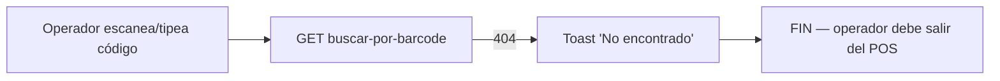
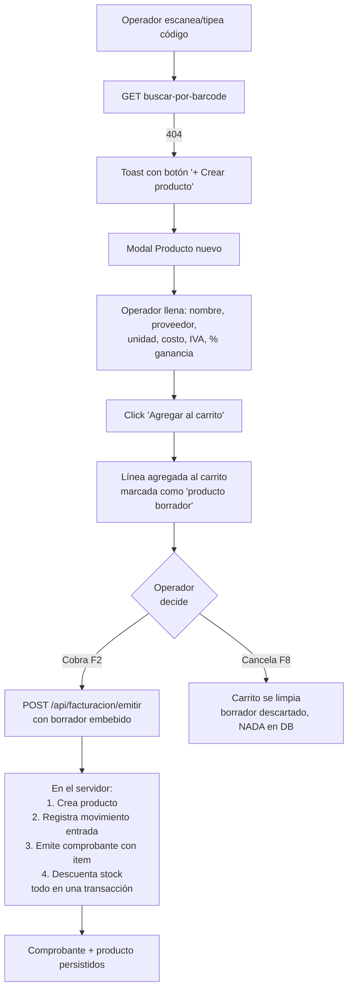
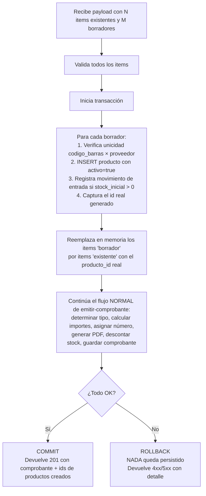

# Plan — Producto "al vuelo" desde el POS (`/facturacion/pos`)

## Resumen ejecutivo

**Objetivo:** que el cajero pueda agregar un producto inexistente al carrito del POS llenando un formulario corto (código, nombre, proveedor, unidad, costo, IVA, % ganancia), y que el producto **se persista en la base de datos solo si la venta se completa (cobro confirmado)**. Si la venta se cancela, el producto nunca se crea: el sistema queda como si nada hubiera pasado.

**Por qué:** el flujo actual obliga al cajero a abandonar el POS para ir a `/productos/nuevo`, perder el contexto de la caja y volver. Frente a un cliente esperando, eso es inaceptable. La idea es que el cajero "vende primero y formaliza después", igual que cuando agrega un producto cualquiera del catálogo: la diferencia es que para los productos al vuelo el alta efectiva en la base de datos se difiere hasta el momento del cobro, junto con la emisión del comprobante.

**Diferencia clave con la solución intuitiva:** NO se llama a `POST /api/productos` en el momento del alta. El producto vive como **borrador en memoria** dentro del carrito hasta que se confirma el cobro. Recién ahí, en la misma transacción que emite el comprobante, se crea el producto en `producto`, se registra el `movimiento` correspondiente y se vincula al `comprobante_item`. Si el cajero cancela (F8), no queda rastro en la base.

**Criterio de cierre:** un cajero escanea o tipea un código que no existe, abre el modal "Producto nuevo", llena código + nombre + proveedor + unidad + costo + IVA + % ganancia, y la línea aparece en el carrito con el precio de venta calculado. Si cobra: se emite el comprobante y queda el producto en `producto` con su movimiento de entrada/salida correctos. Si cancela: el producto nunca existió en la base.

---

## Flujo deseado vs flujo actual

### Hoy



### Con este plan



---

## Decisiones tomadas

| Decisión | Resolución |
|---|---|
| ¿Cuándo se persiste el producto en DB? | **Al confirmar el cobro**, junto con el comprobante, en una sola transacción atómica del servidor. |
| ¿Qué pasa al cancelar la venta (F8)? | **Se descarta todo**. El producto nuevo nunca llega a la base de datos. |
| ¿Qué pasa si vuelven a escanear el mismo código antes de cobrar? | **Nada especial**: el segundo escaneo dispara otra vez el flujo de "no encontrado" porque el producto aún no está en la base. **Si el cajero quiere más unidades del mismo producto borrador, edita la cantidad inline en la línea del carrito.** No se permite "auto-sumar" porque no hay producto al cual sumar. |
| ¿Cómo se ingresa el precio de venta? | El cajero ingresa **costo + % ganancia**, el sistema calcula **precio de venta = costo × (1 + ganancia/100)**, redondeado según la configuración del tenant. El campo se muestra read-only para confirmar visualmente. |
| ¿Stock inicial? | Default 0. Si el cajero pone N > 0, al cobrar se registra una entrada de N y luego una salida por la cantidad vendida (neto = N − vendido). |

---

## Diseño de la solución

### Estructura del cambio

Tres cambios principales:

1. **Frontend — Modal `<CrearProductoBorradorModal />`** que recolecta los datos y agrega un item "borrador" al carrito.
2. **Frontend — Carrito extendido** para que cada línea pueda ser de tipo `producto_existente` o `producto_borrador`, con renderizado diferenciado y restricciones (no permite re-escanear, no permite asignar promo, etc.).
3. **Backend — Endpoint `POST /api/facturacion/emitir` extendido** para aceptar items de tipo borrador. Antes de emitir el comprobante, crea los productos borrador en una sola transacción y luego procede con la emisión normal.

### 5.1. Modal `<CrearProductoBorradorModal />`

Componente nuevo en `src/components/pos/crear-producto-borrador-modal.tsx`. Se abre desde el toast de "no encontrado" en el POS.

**Props:**

```typescript
interface CrearProductoBorradorModalProps {
  open: boolean;
  codigoEscaneado: string;
  tipoBarcode: 'ean_normal' | 'balanza_peso' | 'desconocido';
  pesoBalanza?: number;          // kg, si tipoBarcode === 'balanza_peso'
  proveedorActivoId?: string;    // del filtro del POS, si hay
  onAgregar: (borrador: ProductoBorrador, cantidad: number) => void;
  onClose: () => void;
}
```

**Layout** (modal centrado, ~640px de ancho, scroll vertical si hace falta):

```
┌─────────────────────────────────────────────┐
│ Producto nuevo                          [X]│
├─────────────────────────────────────────────┤
│ Se va a crear cuando confirmes el cobro.    │
│ Si cancelás la venta, no se guarda nada.    │ ← banner gris informativo
│                                             │
│ Código *                                    │
│ [7791234567890_______________]  EAN-13 ✓   │ ← pre-cargado, editable
│                                             │
│ Nombre *                                    │
│ [_________________________________________] │ ← autofoco
│                                             │
│ Proveedor *          Unidad *               │
│ [Coca Cola SA  ▾]    [unidad ▾]            │ ← selectores
│                                             │
│ Costo neto *         IVA *      Ganancia % *│
│ [$ ________]         [21% ▾]    [_____ %]  │
│                                             │
│ ─────────────────────────────────────────── │
│ Precio de venta calculado:                  │
│   Costo + IVA:           $ 1.210,00         │ ← read-only
│   + 30% de ganancia:     $   363,00         │
│   Precio final:          $ 1.573,00         │
│ ─────────────────────────────────────────── │
│                                             │
│ ▾ Más datos (opcional)                      │ ← acordeón
│                                             │
│ Cantidad inicial al carrito: [  1  ]        │
│                                             │
│        [Cancelar]   [Agregar al carrito]   │ ← Enter = Agregar
└─────────────────────────────────────────────┘
```

**Cálculo de precio de venta** (en tiempo real mientras el cajero edita):

```typescript
// Convención del proyecto: costos siempre netos, IVA se suma para mostrar
const costoConIva = costoNeto * (1 + ivaPct / 100);
const precioVenta = round(costoConIva * (1 + gananciaPct / 100), redondeoTenant);
```

El redondeo respeta la configuración del tenant (`redondeo_precio_venta` en `configuracion`, ya existente para IA-precios).

**Acordeón "Más datos"** (cuando se expande):

- Categoría (combobox con autocompletado de categorías existentes; opción "+ Crear nueva" inline).
- Stock inicial (default 0; entero o decimal según unidad).
- Stock mínimo (default 0).
- Checkbox "Es pesable". Si `tipoBarcode === 'balanza_peso'`, viene tildado y bloqueado, y la unidad se fuerza a `kg`.
- Campo PLU (visible solo si "es pesable" está tildado; 1-5 dígitos numéricos).

**Validaciones cliente:**

- Código: 1-50 caracteres después de `trim`. Si falla check digit EAN-13 muestra warning amarillo pero no bloquea.
- Nombre: 1-200 caracteres, no solo whitespace.
- Proveedor: obligatorio (resuelve el potencial conflicto de duplicado de barra entre proveedores; ver Decisión 4 del plan original de POS).
- Unidad: enum `unidad_medida`.
- Costo neto: número ≥ 0.
- IVA: enum del sistema (0, 2.5, 5, 10.5, 21, 27).
- Ganancia: número, puede ser 0 o negativa (rebaja). Permitido para liquidaciones, pero muestra warning si < 0.
- Cantidad inicial: número > 0.

**Validación servidor diferida (al cobrar):** que el código de barras sea único respetando la regla de proveedor (migración `047`). Si al cobrar otro cajero de la misma cadena ya creó el mismo producto, el endpoint de emisión devuelve un error específico que la UI traduce a "Ese código ya existe en el catálogo, refrescá la pantalla".

**Atajos de teclado:**

- `Enter` en cualquier input → submit (si pasan validaciones).
- `Escape` → cancela y cierra modal sin agregar nada al carrito.
- `Tab` con orden lógico: Código → Nombre → Proveedor → Unidad → Costo → IVA → Ganancia → Cantidad → Submit.

### 5.2. Tipo `ProductoBorrador` y carrito extendido

Hoy el carrito del POS guarda items con esta forma (simplificada):

```typescript
type ItemCarrito = {
  producto_id: string;       // FK a producto en la DB
  nombre: string;
  cantidad: number;
  precio_unitario: number;
  // ...
};
```

Se introduce un tipo discriminado:

```typescript
type ProductoBorrador = {
  // Campos que viajan al servidor para crear el producto:
  codigo_barras: string | null;
  codigo: string;                          // SKU = código tipeado
  nombre: string;
  proveedor_id: string;
  categoria_id: string | null;
  unidad: UnidadMedida;
  precio_costo: number;                    // neto
  iva_porcentaje: number;
  ganancia_pct: number;                    // se guarda en metadata para auditoría
  precio_venta: number;                    // pre-calculado en cliente
  stock_inicial: number;
  stock_minimo: number;
  es_pesable: boolean;
  plu: string | null;
  // Identidad temporal en el carrito:
  borrador_id: string;                     // UUID local, p.ej. crypto.randomUUID()
};

type ItemCarrito =
  | {
      tipo: 'existente';
      producto_id: string;
      cantidad: number;
      precio_unitario: number;
      // ...
    }
  | {
      tipo: 'borrador';
      borrador: ProductoBorrador;
      cantidad: number;
      precio_unitario: number;             // = borrador.precio_venta
    };
```

**Reglas del carrito para items borrador:**

- Render visual: la línea muestra un badge amarillo `NUEVO` al lado del nombre.
- Editable inline: cantidad y precio (este último según rol).
- **No se permite re-escanear el mismo código** para sumar +1: como el producto no existe en la base, `buscar-por-barcode` siempre devuelve 404 y el modal vuelve a abrir. La UX correcta es editar la cantidad de la línea existente.
  - Para evitar fricción: cuando un código no encontrado coincide con un borrador ya en el carrito, el toast cambia a "Ya tenés un producto borrador con ese código en el carrito. ¿Editar cantidad?" con botón directo a la línea.
- No se permite asignar promociones (no tiene historial, no hay reglas configuradas para ese producto).
- Persistencia del carrito en `localStorage` (`V60-POS-025`): los borradores se guardan tal cual; al recargar, los borradores siguen ahí porque viven en el state del cliente.

**Cancelación de venta (F8):**

- Confirmación adicional si hay borradores: "Tenés N producto(s) nuevo(s) sin guardar. Al cancelar se descartan. ¿Continuar?".
- Si el cajero confirma, el carrito se limpia. **Nada toca la base de datos.**

### 5.3. Endpoint `POST /api/facturacion/emitir` extendido

Hoy el endpoint recibe items así (extracto):

```typescript
{
  items: Array<{
    producto_id: string;
    cantidad: number;
    precio_unitario: number;
    // ...
  }>;
  // ...
}
```

Se extiende el contrato para aceptar items de tipo borrador:

```typescript
{
  items: Array<
    | {
        tipo: 'existente';
        producto_id: string;
        cantidad: number;
        precio_unitario: number;
        // ...
      }
    | {
        tipo: 'borrador';
        producto_nuevo: {
          codigo_barras: string | null;
          codigo: string;
          nombre: string;
          proveedor_id: string;
          categoria_id: string | null;
          unidad: UnidadMedida;
          precio_costo: number;
          iva_porcentaje: number;
          ganancia_pct: number;
          precio_venta: number;
          stock_inicial: number;
          stock_minimo: number;
          es_pesable: boolean;
          plu: string | null;
        };
        cantidad: number;
        precio_unitario: number;            // debe coincidir con producto_nuevo.precio_venta
      }
  >;
  // resto del payload sin cambios: cliente, tipo_comprobante, metodo_pago, ...
}
```

**Lógica del endpoint** (orden estricto, todo en una sola transacción Postgres):



**Validaciones específicas para borradores en el servidor:**

- Reaplicar todas las validaciones del endpoint `POST /api/productos` (no se confía en el cliente).
- Verificar que `proveedor_id` pertenezca al `tenant_id` del usuario y esté activo.
- Verificar unicidad de `codigo_barras` respetando la regla de la migración `047` (la barra puede repetirse entre productos activos del tenant solo si difieren en `proveedor_id`; si `proveedor_id` es no-nulo y ya existe otra fila activa con esa barra y ese proveedor, retornar 409 con detalle).
- Verificar que `precio_unitario` del item coincida con `producto_nuevo.precio_venta` (el cliente puede haber editado el precio inline después de crear el borrador; en ese caso, el precio del comprobante es el editado pero el `producto.precio_venta` que se guarda es el original del borrador — decisión de diseño, ver sección 8).
- Si es pesable: validar que la unidad sea `kg` o `gramo`.
- Si tiene PLU: validar formato y unicidad por tenant.

**Manejo del descuento de stock:**

- Para items existentes: lógica actual sin cambios.
- Para items borrador: se registran **dos** movimientos en `movimiento`:
  1. Una **entrada** por `stock_inicial` (si > 0), con `referencia_tipo = 'manual'` y motivo `"Stock inicial al crear producto desde POS"`.
  2. Una **salida** por `cantidad` (la del item del comprobante), con `referencia_tipo = 'comprobante'` y `referencia_id = comprobante.id`.

  Esto deja un audit trail limpio: cualquiera que mire el historial del producto ve "entró 5, salió 1, queda 4", todo en el mismo instante. Si `stock_inicial = 0` (default), solo se registra la salida y el stock queda en negativo si la lógica del tenant lo permite (configuración existente).

**Errores específicos:**

- `409 PRODUCTO_BORRADOR_DUPLICADO` — código de barras ya existe en otro producto activo con el mismo proveedor. Body incluye `{ producto_existente_id, producto_existente_nombre }`. La UI puede ofrecer "usar el existente y actualizar el carrito".
- `400 PRODUCTO_BORRADOR_INVALIDO` — algún campo no pasa validación. Body incluye `{ borrador_id, errores: { campo: mensaje } }`.
- `400 PRECIO_INCONSISTENTE` — `precio_unitario` del item no coincide con `producto_nuevo.precio_venta` y la diferencia supera tolerancia. (Configurable: ver sección 8.)

**Compatibilidad hacia atrás:** un cliente que solo envía `{ producto_id, ... }` sin el campo `tipo` se interpreta como `tipo: 'existente'` (default). Cero impacto en `/facturacion/nueva` u otros consumidores del endpoint.

### 5.4. Cambios en el flujo de "no encontrado" del POS

El handler `onScan` actual (`src/app/(dashboard)/facturacion/pos/page.tsx` o equivalente) hoy hace:

```
escaneo → buscar-por-barcode → si 404 → buscar-productos por texto → si 0 resultados → toast rojo
```

Se extiende:

```
escaneo → buscar-por-barcode
  → si 404
    → ¿hay un borrador en el carrito con ese código?
        → sí: toast "Ya está en el carrito como borrador, ¿editar cantidad?"
        → no: buscar-productos por texto
              → si 0 resultados: toast con botones [+ Crear producto] [Cerrar]
                                  Click → abre <CrearProductoBorradorModal />
                                          con codigoEscaneado y tipoBarcode pre-cargados
              → si N resultados: lista de sugerencias (comportamiento actual)
```

El botón `[+ Crear producto]` solo se muestra si:

- Módulo `facturador_pos` activo (siempre lo está acá).
- Rol distinto a `visor`.
- Configuración del tenant `pos_permite_crear_productos = true` (default `true`, ver sección 8).

### 5.5. Configuración del tenant

Nueva clave en `configuracion` (o en `modulo_config`, según convención existente del proyecto):

```typescript
{
  pos_permite_crear_productos: boolean;        // default true
  pos_crear_productos_solo_admin: boolean;     // default false
}
```

UI en `/configuracion/pos`: dos checkboxes en una sección nueva "Alta de productos desde caja". Permite a un comercio que prefiere catálogo controlado deshabilitarlo o restringirlo a admin.

---

## Esquema y migraciones de base de datos

**No se requieren cambios de schema.** El plan reutiliza:

- Tabla `producto` tal cual está (incluye `codigo_barras`, `plu`, `es_pesable`, etc.).
- Tabla `movimiento` con `registrar_movimiento` actual.
- Tabla `comprobante` y `comprobante_item` con `metodo_pago`, `tipo_comprobante` (con `ticket`).

Opcionalmente, se puede agregar una columna informativa para auditoría:

```sql
-- Migración opcional: marcar productos creados desde POS para reportes
ALTER TABLE producto ADD COLUMN creado_desde TEXT;
-- valores: 'manual' (default null = manual histórico), 'pos', 'importador', 'lector_facturas'
```

Esto deja un audit trail útil sin romper nada. El campo se llena en el endpoint de emisión solo para los productos creados desde el flujo borrador.

---

## Tickets propuestos

### Fase 1 — Backend (preparación)

#### V120-POS-NEW-001 — Extender contrato de `POST /api/facturacion/emitir` con items borrador

- Tipo: feature
- Módulo: facturacion / pos
- Prioridad: critical
- Estimación: 5
- Versión: v12.0
- Estado: todo
- Dependencias: ninguna (la base ya existe)

**Descripción:** Modificar el schema de validación del endpoint para aceptar items con `tipo: 'borrador'` que incluyan el payload `producto_nuevo`. La validación debe ser estricta y reusar las reglas de `POST /api/productos`.

**Criterios de aceptación:**

- [ ] El schema Zod (o equivalente) acepta items discriminados por `tipo`.
- [ ] Items legacy (sin `tipo`) se interpretan como `existente` para compatibilidad.
- [ ] Validación de `producto_nuevo`: nombre, proveedor pertenece al tenant, unidad enum, costo ≥ 0, IVA enum, ganancia número, stock_inicial ≥ 0, es_pesable consistente con unidad, PLU formato 1-5 dígitos.
- [ ] Validación de unicidad de `codigo_barras` respetando regla de migración `047`.
- [ ] Tests unitarios cubren cada caso de validación.

#### V120-POS-NEW-002 — Lógica de creación transaccional de productos borrador en `emitir-comprobante`

- Tipo: feature
- Módulo: facturacion
- Prioridad: critical
- Estimación: 8
- Versión: v12.0
- Estado: todo
- Dependencias: V120-POS-NEW-001

**Descripción:** En `src/lib/facturacion/emitir-comprobante.ts`, antes del flujo actual de emisión, detectar items borrador, crearlos como productos reales en la misma transacción Postgres y reemplazarlos en memoria con sus IDs reales. Si cualquier paso falla, rollback total.

**Criterios de aceptación:**

- [ ] Toda la operación corre dentro de una sola transacción de Supabase / Postgres.
- [ ] Por cada borrador: INSERT en `producto`, captura del id, optional `registrar_movimiento` de entrada por `stock_inicial`.
- [ ] Si `stock_inicial > 0`, queda registrado un movimiento `entrada` con motivo "Stock inicial — alta desde POS" antes del movimiento de salida del comprobante.
- [ ] Si cualquier validación o INSERT falla: rollback completo, ningún producto queda persistido, comprobante no se emite.
- [ ] El response incluye `productos_creados: Array<{ borrador_id, producto_id }>` para que el cliente correlacione.
- [ ] Tests de integración: emitir con 2 items existentes y 2 borradores; verificar que ambos productos quedan en `producto`, ambos movimientos en `movimiento`, comprobante con 4 items.
- [ ] Test de rollback: forzar fallo en el segundo borrador; verificar que el primer borrador NO quedó persistido.

#### V120-POS-NEW-003 — Configuración: `pos_permite_crear_productos` y `pos_crear_productos_solo_admin`

- Tipo: feature
- Módulo: configuracion / pos
- Prioridad: high
- Estimación: 2
- Versión: v12.0
- Estado: todo
- Dependencias: ninguna

**Descripción:** Agregar dos flags en la configuración del tenant para gobernar quién puede dar de alta productos desde el POS, exponerlos en `/configuracion/pos`.

**Criterios de aceptación:**

- [ ] Migración aditiva con defaults `true` y `false` respectivamente.
- [ ] Endpoint `GET /api/configuracion/pos` y `PATCH` los exponen.
- [ ] UI en `/configuracion/pos` con dos checkboxes y texto explicativo.
- [ ] El endpoint de emisión rechaza items borrador con 403 si la config los deshabilita o si el rol no aplica.

#### V120-POS-NEW-004 — (Opcional) Columna `producto.creado_desde` para auditoría

- Tipo: feature / migration
- Módulo: stock
- Prioridad: low
- Estimación: 1
- Versión: v12.0
- Estado: todo
- Dependencias: ninguna

**Descripción:** Agregar columna informativa a `producto` para distinguir productos creados al vuelo desde POS, importados, etc. Útil para reportes de "productos creados sin proceso formal de catalogado".

**Criterios de aceptación:**

- [ ] Migración aditiva con default `NULL`.
- [ ] El endpoint de emisión la setea en `'pos'` para borradores.
- [ ] `POST /api/productos` la setea en `'manual'`.
- [ ] El importador la setea en `'importador'`.

---

### Fase 2 — Frontend (modal y wiring)

#### V120-POS-NEW-005 — Componente `<CrearProductoBorradorModal />`

- Tipo: feature
- Módulo: pos
- Prioridad: critical
- Estimación: 8
- Versión: v12.0
- Estado: todo
- Dependencias: V120-POS-NEW-001 (para los tipos)

**Descripción:** Construir el modal con todos los campos descritos en sección 5.1. Cálculo en vivo de precio de venta. Acordeón de campos opcionales. Validaciones inline. Atajos de teclado.

**Criterios de aceptación:**

- [ ] Layout responsivo, ancho máximo ~640px.
- [ ] Campo código pre-cargado y editable (mantiene tipo `ean_normal | balanza_peso | desconocido` detectado).
- [ ] Validación de check digit EAN-13 con warning amarillo no bloqueante.
- [ ] Selector de proveedor con autocompletado, alimentado por `GET /api/pos/proveedores` o equivalente.
- [ ] Selector de categoría con autocompletado y opción "+ Crear nueva" inline (que llama a `POST /api/categorias` y devuelve el id).
- [ ] Campos costo, IVA, ganancia disparan recálculo en vivo de precio de venta.
- [ ] Banner gris arriba: "Se va a crear cuando confirmes el cobro. Si cancelás, no se guarda nada."
- [ ] Acordeón "Más datos" cerrado por defecto.
- [ ] Atajos: Enter submit, Escape cancela, Tab orden lógico.
- [ ] Submit emite evento `onAgregar(borrador, cantidad)` y cierra el modal.
- [ ] Storybook o ejemplo mínimo para QA visual.

#### V120-POS-NEW-006 — Tipo `ProductoBorrador` y carrito discriminado

- Tipo: refactor
- Módulo: pos
- Prioridad: critical
- Estimación: 5
- Versión: v12.0
- Estado: todo
- Dependencias: ninguna

**Descripción:** Refactorizar el tipo de items del carrito para soportar `tipo: 'existente' | 'borrador'`, manteniendo compatibilidad con la persistencia en `localStorage`.

**Criterios de aceptación:**

- [ ] Tipo `ItemCarrito` discriminado por `tipo`.
- [ ] Componentes que renderizan líneas del carrito leen el tipo y muestran badge `NUEVO` para borradores.
- [ ] Edición inline de cantidad y precio funciona en ambos tipos.
- [ ] Items borrador no admiten asignar promo (estado deshabilitado en UI).
- [ ] Carrito persistido en localStorage incluye borradores (estado completo).
- [ ] Migración suave de carritos antiguos en localStorage: items sin `tipo` se interpretan como `existente` al cargar.

#### V120-POS-NEW-007 — Wiring en pantalla POS: trigger del modal y agregado al carrito

- Tipo: feature
- Módulo: pos
- Prioridad: critical
- Estimación: 3
- Versión: v12.0
- Estado: todo
- Dependencias: V120-POS-NEW-005, V120-POS-NEW-006

**Descripción:** En el handler de "no encontrado" del POS, agregar el botón `[+ Crear producto]` al toast y abrir el modal con código + tipo + proveedor activo pre-cargados. Al confirmar, agregar la línea al carrito y cerrar.

**Criterios de aceptación:**

- [ ] Toast "Producto no encontrado" muestra botón `[+ Crear producto]` cuando los permisos lo permiten.
- [ ] Click o `Enter` (mientras el toast está focuseado) abre el modal.
- [ ] Modal recibe `codigoEscaneado`, `tipoBarcode`, `pesoBalanza`, `proveedorActivoId` correctos.
- [ ] Tras `onAgregar`, la línea aparece en el carrito con animación de highlight.
- [ ] Foco vuelve al input de escaneo automáticamente.
- [ ] Beep verde de confirmación.
- [ ] Si el usuario reescanea el mismo código antes de cobrar: toast "Ya está como producto nuevo en el carrito. ¿Editar cantidad?" con botón directo a la línea.

#### V120-POS-NEW-008 — Cancelación de venta con borradores: confirmación extra

- Tipo: feature
- Módulo: pos
- Prioridad: high
- Estimación: 2
- Versión: v12.0
- Estado: todo
- Dependencias: V120-POS-NEW-006

**Descripción:** Cuando el cajero presiona F8 (Cancelar venta) y el carrito tiene al menos un item borrador, mostrar mensaje de confirmación específico: "Tenés N producto(s) nuevo(s) sin guardar. Al cancelar se descartan."

**Criterios de aceptación:**

- [ ] Confirmación normal si el carrito solo tiene items existentes.
- [ ] Confirmación extendida si hay borradores, listando cuántos y con copy claro.
- [ ] Al confirmar: carrito se limpia, localStorage también, NO hay llamada a la API.
- [ ] Si cancela la confirmación: el carrito queda intacto.

#### V120-POS-NEW-009 — Modal de cobro: enviar borradores al endpoint de emisión

- Tipo: feature
- Módulo: pos
- Prioridad: critical
- Estimación: 3
- Versión: v12.0
- Estado: todo
- Dependencias: V120-POS-NEW-002, V120-POS-NEW-006

**Descripción:** Adaptar la llamada a `POST /api/facturacion/emitir` en el modal de cobro (`cobro-modal.tsx`) para que serialice correctamente los items borrador del carrito. Manejar respuestas exitosas y errores específicos de borrador.

**Criterios de aceptación:**

- [ ] El payload enviado distingue items con `tipo: 'existente'` y `tipo: 'borrador'`.
- [ ] Tras respuesta 201: pantalla de éxito muestra "X producto(s) creado(s)" si hubo borradores.
- [ ] Error 409 `PRODUCTO_BORRADOR_DUPLICADO`: pantalla roja con mensaje específico y opción "Reemplazar por producto existente y reintentar".
- [ ] Error 400 `PRODUCTO_BORRADOR_INVALIDO`: pantalla roja con detalle por campo y modal vuelve al estado pre-cobro con la línea del borrador resaltada.
- [ ] Otros errores: comportamiento actual (mensaje genérico, carrito intacto).

---

### Fase 3 — Tests y refinamiento

#### V120-POS-NEW-010 — Tests E2E de flujo completo

- Tipo: test
- Módulo: pos
- Prioridad: high
- Estimación: 5
- Versión: v12.0
- Estado: todo
- Dependencias: V120-POS-NEW-007, V120-POS-NEW-009

**Descripción:** Escribir tests E2E que cubran los caminos felices y los principales casos borde.

**Criterios de aceptación:**

- [ ] Test "happy path": escanear código nuevo → crear borrador → cobrar → verificar producto + comprobante en DB.
- [ ] Test cancelación: crear borrador → F8 → verificar que NO hay producto en DB.
- [ ] Test rollback: forzar error en validación de comprobante → verificar que ningún producto borrador queda persistido.
- [ ] Test conflicto de barra: crear borrador con código que ya existe en otro proveedor → 409 → reintentar con otro proveedor.
- [ ] Test producto pesable: escanear código de balanza con peso → modal pre-tilda "es pesable" → cobrar → verificar `producto.es_pesable = true` y movimiento con cantidad decimal.

#### V120-POS-NEW-011 — Documentación de usuario y técnica

- Tipo: docs
- Módulo: docs
- Prioridad: medium
- Estimación: 2
- Versión: v12.0
- Estado: todo
- Dependencias: V120-POS-NEW-010

**Descripción:** Actualizar `docs/facturacion.md` y `docs/stock.md` con el flujo nuevo. Agregar sección en `docs/activeContext.md` sobre el ajuste.

**Criterios de aceptación:**

- [ ] `docs/facturacion.md` § Terminal POS describe el flujo de creación al vuelo.
- [ ] `docs/stock.md` describe la columna `creado_desde` (si se implementó V120-POS-NEW-004).
- [ ] `docs/activeContext.md` agrega un bullet en "Ajuste posterior" o similar.
- [ ] Mini guía de usuario: "Cómo dar de alta un producto desde caja" con screenshots.

---

## Orden de implementación recomendado

```text
V120-POS-NEW-001 (contrato API)
  ├── V120-POS-NEW-002 (lógica transaccional)
  │     └── V120-POS-NEW-009 (modal cobro)
  ├── V120-POS-NEW-005 (modal UI)
  │     └── V120-POS-NEW-007 (wiring POS)
  └── V120-POS-NEW-006 (tipo carrito)
        ├── V120-POS-NEW-007 (wiring POS)
        └── V120-POS-NEW-008 (cancelar con borradores)

V120-POS-NEW-003 (config) — paralelo, baja prioridad
V120-POS-NEW-004 (audit) — opcional, baja prioridad

V120-POS-NEW-007 + V120-POS-NEW-009
  └── V120-POS-NEW-010 (tests E2E)
        └── V120-POS-NEW-011 (docs)
```

**Sprint 1 (~13 pts):** V120-POS-NEW-001, V120-POS-NEW-002, V120-POS-NEW-006.
**Sprint 2 (~16 pts):** V120-POS-NEW-005, V120-POS-NEW-007, V120-POS-NEW-009, V120-POS-NEW-008.
**Sprint 3 (~10 pts):** V120-POS-NEW-003, V120-POS-NEW-004, V120-POS-NEW-010, V120-POS-NEW-011.

Total estimado: ~39 pts, ~3 sprints con 1 dev full-time.

---

## Riesgos y puntos abiertos

### Riesgos

| Riesgo | Probabilidad | Impacto | Mitigación |
|---|---|---|---|
| Carrito con borrador en localStorage queda obsoleto si se cambia el schema de `ProductoBorrador` | Media | Bajo | Versionar el formato del carrito en localStorage; al detectar versión vieja, descartar borradores con aviso al usuario. |
| Race condition: dos cajeros crean el mismo código de barras simultáneamente | Baja | Medio | El INSERT en `producto` con índice único parcial (ya existe por migración `047`) hace que uno de los dos falle con 409. La UI debe manejar el rollback con mensaje claro. |
| El cajero edita el precio de la línea después de crear el borrador, generando inconsistencia entre `precio_unitario` del item y `producto.precio_venta` que se guarda | Alta | Bajo | Decisión explícita: el precio del comprobante manda para esa venta (`precio_unitario`); el `producto.precio_venta` que se guarda es el calculado en el modal. Si el cajero quiere actualizar el precio del catálogo, lo hace después desde `/productos/[id]`. |
| Tenant con catálogo "controlado" no quiere que cajeros creen productos | — | — | Resuelto por config `pos_crear_productos_solo_admin` (V120-POS-NEW-003). |
| Borrador con datos inválidos llega al cobro y bloquea la venta | Media | Medio | Validación cliente robusta + retry inline en el modal de cobro: si el endpoint rechaza el borrador, abrir un mini-form para corregir el campo problemático sin perder el carrito. |

### Puntos abiertos para confirmar

1. **Tolerancia entre `precio_unitario` y `producto_nuevo.precio_venta`**: ¿exigir igualdad estricta o permitir desvío? Recomendación: igualdad estricta; si el cajero edita el precio inline, se actualiza también `producto_nuevo.precio_venta` en el state del carrito antes de enviar.

2. **¿El producto nuevo se asocia a la sucursal activa del POS?** Hoy `producto.sucursal_id` no es null. El INSERT debe usar la sucursal del usuario / caja. Cuando se ejecute `plan_producto_unico.md`, esto evoluciona a "el producto es del tenant y `stock_sucursal` se pobla con la sucursal activa".

3. **¿Pesable + cantidad inicial decimal?** Sí, el flujo soporta cantidad inicial decimal si la unidad es `kg`/`gramo`. Validado en cliente y servidor.

4. **¿Un producto borrador puede tener foto?** No en v1. La foto se sube después desde `/productos/[id]` cuando el producto ya está persistido. (En v2 se podría agregar drag-and-drop en el modal con upload diferido.)

5. **¿Reportes/dashboards consideran productos creados desde POS distinto?** Solo si se implementa V120-POS-NEW-004. Útil para reportes de "calidad del catálogo" (cuántos productos se crean en plena caja vs proceso formal).

---

## Compatibilidad con `plan_producto_unico.md`

Cuando se ejecute la migración a producto único por tenant + stock por sucursal:

- El INSERT de producto borrador deja de incluir `sucursal_id`.
- Después del INSERT, se inserta una fila en `stock_sucursal` con la sucursal activa del POS y el `stock_inicial`.
- El `registrar_movimiento` se llama con `p_sucursal_id` (parámetro que ya estará en su firma post-fase 3 del plan de producto único).
- El resto del flujo no cambia.

El refactor cuando llegue ese momento es contenido y de bajo riesgo.

---

## Criterio de aceptación global del bloque

Un cajero, en una pantalla `/facturacion/pos` con módulo `facturador_pos` activo:

1. Escanea un código que no existe → ve un toast con botón `[+ Crear producto]`.
2. Click → modal con código pre-cargado.
3. Llena: nombre, proveedor, unidad, costo neto, IVA, % ganancia.
4. Ve en vivo el precio de venta calculado.
5. Confirma → el producto aparece en el carrito como línea con badge `NUEVO`, cantidad 1, precio = precio calculado.
6. (Opcional) Edita cantidad inline a 3.
7. (Opcional) Sigue escaneando otros productos existentes y los suma al carrito.
8. Click `COBRAR` (F2) → método de pago → confirmar.
9. Pantalla verde: "Comprobante #X-0001234 emitido. 1 producto nuevo creado."
10. Verifico en `/productos`: el producto figura con sus datos exactos, stock = 0 si no se puso inicial, o (`stock_inicial − cantidad_vendida`) si se puso inicial.
11. Verifico en `/movimientos`: figura entrada (si aplica) + salida del comprobante.

Y, si en el paso 8 el cajero presiona `F8` en lugar de `COBRAR`:

1. Confirmación: "Tenés 1 producto nuevo sin guardar. ¿Cancelar?".
2. Confirmo → carrito vacío.
3. Verifico en `/productos`: el producto NO existe en la base.
4. Verifico en `/movimientos`: no hay nada.

Si se cumplen ambos escenarios, el bloque está listo para producción.