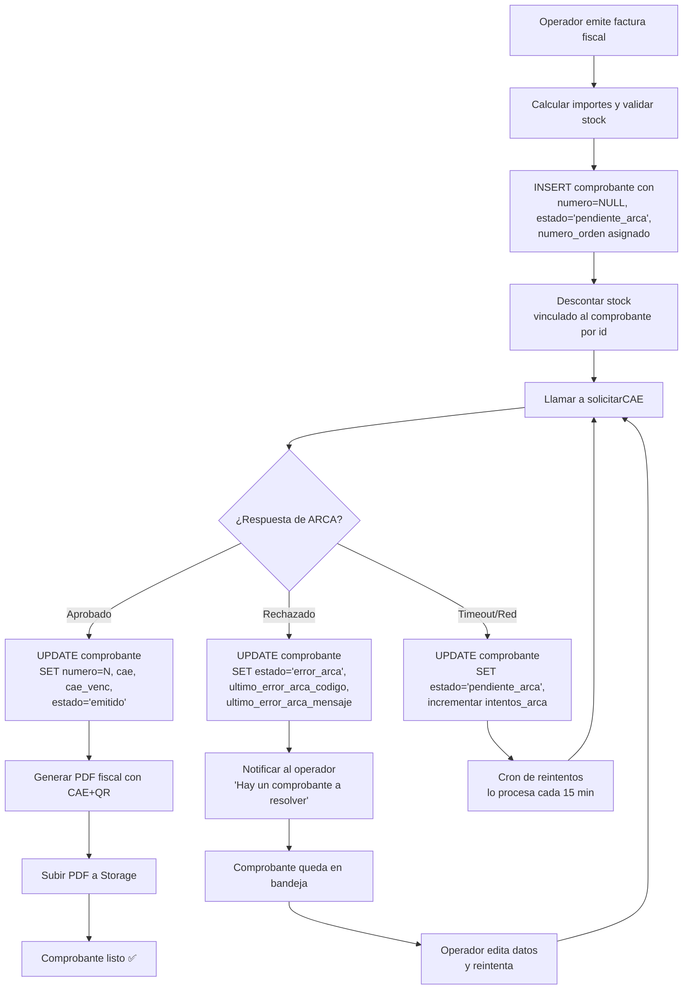

# Nexus — Plan Bloque ARCA Sólido (v9.0)

## 0. Contexto y por qué este plan existe

El sistema viene operando con ARCA desde la v4.0. El flujo actual funciona en el camino feliz, pero tiene un comportamiento problemático que se hace visible apenas hay un error fiscal real (CUIT inválido del receptor, condición IVA mal seteada, importe mal calculado, etc.):

1. El número fiscal se asigna **antes** de pedir el CAE (vía `siguiente_numero_comprobante`, que toma `MAX(numero) + 1` de la tabla `comprobante`).
2. Si ARCA rechaza, el comprobante queda con número fiscal asignado pero sin CAE, en estado `error_arca`.
3. La siguiente factura local toma el número siguiente y sale a pedir CAE.
4. ARCA esperaba el número anterior (porque el anterior nunca obtuvo CAE) y rechaza también la nueva.
5. **Efecto bola de nieve**: todo lo que se emita después queda atascado hasta resolver la primera fallida, pero el sistema no avisa de esto en forma explícita. El usuario sigue facturando "para adelante" creyendo que está bien.

Adicionalmente, hoy no existe una pantalla operativa para **resolver** un comprobante en `error_arca` (corregir el dato malo y reintentar). El estado existe en la base, pero la UI lo muestra como un error final y la única salida es eliminar y rehacer manualmente, lo cual es un calvario fiscal y de usabilidad.

Este plan resuelve los dos problemas con un cambio acotado pero profundo: **el número fiscal lo otorga ARCA, no el sistema local**. El sistema mantiene un correlativo interno (`numero_orden`, ya existente) que es el que ve el operador hasta que la factura obtiene CAE. El PDF fiscal se genera **una sola vez**, cuando el CAE existe.

La versión objetivo es **v9.0** y el prefijo de tickets es `V90-ARCA-XXX`. Migraciones nuevas: a partir de la siguiente disponible (verificar al implementar).

---

## 1. Decisiones clave a tomar antes de arrancar

Antes de tocar nada, hay cuatro definiciones que conviene cerrar porque condicionan toda la implementación. Son más de negocio y operación que técnicas.

### (a) ¿Cuándo se imprime el PDF que el cliente recibe?

Hoy el sistema genera un PDF "preliminar" sin CAE, lo guarda en Storage, y si después llega el CAE lo regenera y reemplaza. Esto significa que durante una ventana de tiempo (que puede ser de segundos o de horas si ARCA está caído), el comprobante existe sin CAE válido.

Hay tres opciones razonables:

- **Opción A — Solo CAE primero**: el PDF fiscal se genera **únicamente** cuando ARCA aprueba. Mientras tanto, el operador ve un "comprobante en proceso" con un número provisorio (`numero_orden`) pero no hay PDF descargable. Es lo más limpio fiscalmente, pero puede frustrar en POS rápido.
- **Opción B — Comprobante provisorio impreso**: se imprime un "comprobante provisorio sin validez fiscal" con el `numero_orden` mientras se espera el CAE. Cuando llega el CAE, se reemplaza por el PDF fiscal definitivo. El cliente puede recibir el provisorio y, si quiere, le mandás el fiscal por mail después.
- **Opción C — Ticket no fiscal + factura posterior** (lo que ya hace el POS): se entrega un ticket no fiscal en el momento, y la factura fiscal se genera cuando el cliente la pide. Este flujo ya existe en el sistema vía `desde_ticket_id`.

**Recomendación**: combinar **A** para emisión directa de factura (`/facturacion/nueva`) y **C** para el POS rápido (que ya está). La Opción B agrega complejidad de UI y no es necesaria si el POS ya cubre el caso de cliente esperando frente al mostrador.

### (b) ¿Qué pasa con los comprobantes que hoy ya están en `error_arca`?

Los tenants que ya tienen ARCA activo pueden tener comprobantes `error_arca` con número fiscal asignado en la base. La migración no puede romper eso. Hay que decidir:

- **Opción A**: dejar los viejos como están (con su número), aplicar el nuevo modelo solo a los nuevos.
- **Opción B**: en la migración, marcar los `error_arca` viejos con un flag `legacy_numbering = true` y en la UI darles un tratamiento especial: o bien resolverlos editando y reintentando (manteniendo el número viejo en lo posible), o bien anularlos formalmente.

**Recomendación**: **Opción A** con auditoría previa. Antes de la migración, listar todos los `error_arca` existentes por tenant y resolverlos a mano (editando y reintentando, o anulando). En tenants productivos esto debería ser cero o casi cero comprobantes.

### (c) ¿Qué tipos de comprobantes entran en este nuevo flujo?

ARCA aplica para `factura_a`, `factura_b`, `factura_c`, `nota_credito_a`, `nota_credito_b`, `nota_credito_c`. Los demás (`presupuesto`, `remito`, `ticket`, `recibo`, comprobantes importados desde el lector de facturas) **no van a ARCA** y conservan su numeración local actual.

**Decisión**: el nuevo modelo aplica únicamente a los seis tipos fiscales. Para todos los demás, `siguiente_numero_comprobante` sigue funcionando igual que hoy. Esto reduce drásticamente el alcance del cambio.

### (d) ¿Cómo se manejan los timeouts de ARCA durante la emisión?

Hoy, si ARCA no responde, el comprobante queda en `pendiente_arca` y la cola de reintentos cada 15 minutos se encarga. Con el nuevo modelo:

- Si ARCA no responde en X segundos durante la emisión, el comprobante queda en `pendiente_arca` **sin número fiscal**.
- La cola sigue funcionando igual: cada 15 minutos toma los `pendiente_arca`, intenta `FECAESolicitar` y, si ARCA aprueba, le asigna el número que ARCA otorgó.
- El operador ve "factura en proceso" en su UI hasta que la cola la resuelve.

**Decisión**: mantener el comportamiento de la cola, solo cambia el momento de asignación del número.

---

## 2. Modelo de datos

Los cambios en la base son **mínimos**. La tabla `comprobante` ya tiene casi todo lo que necesitamos.

### 2.1. Cambios en `comprobante`

**Migración nueva: `070_comprobante_numero_nullable.sql`** (verificar número correlativo al implementar).

```sql
-- 1. Permitir numero nullable en comprobante
ALTER TABLE comprobante ALTER COLUMN numero DROP NOT NULL;

-- 2. El índice UNIQUE existente sobre (tenant_id, tipo, numero) ya tolera NULLs
--    en PostgreSQL (los NULLs no se consideran iguales entre sí).
--    Verificar que el índice sea: idx_comprobante_numero UNIQUE (tenant_id, tipo, numero)

-- 3. Agregar columna para tracking del intento ARCA
ALTER TABLE comprobante ADD COLUMN intentos_arca INTEGER NOT NULL DEFAULT 0;
ALTER TABLE comprobante ADD COLUMN ultimo_error_arca_codigo VARCHAR(20);
ALTER TABLE comprobante ADD COLUMN ultimo_error_arca_mensaje TEXT;
ALTER TABLE comprobante ADD COLUMN ultimo_intento_arca_at TIMESTAMPTZ;

-- 4. Constraint: si tipo es fiscal y estado es 'emitido', numero NO puede ser NULL
ALTER TABLE comprobante ADD CONSTRAINT chk_emitido_fiscal_tiene_numero
  CHECK (
    NOT (tipo IN ('factura_a','factura_b','factura_c',
                  'nota_credito_a','nota_credito_b','nota_credito_c')
         AND estado = 'emitido'
         AND numero IS NULL)
  );

-- 5. Constraint: si estado es 'pendiente_arca' o 'error_arca', numero DEBE ser NULL
--    (regla del nuevo modelo: el número se asigna recién con CAE)
ALTER TABLE comprobante ADD CONSTRAINT chk_pendiente_arca_sin_numero
  CHECK (
    estado NOT IN ('pendiente_arca', 'error_arca') OR numero IS NULL
  );
```

**Consecuencia importante:** la constraint #5 es un cambio de contrato. Hoy un `error_arca` puede tener número; con el nuevo modelo, no. Por eso es crítica la decisión 1(b): los `error_arca` viejos hay que resolverlos antes de aplicar la migración, o agregar un flag de excepción.

### 2.2. Cambios en `arca_config`

Ningún cambio estructural. La columna `ultimo_comprobante` ya existe y se sigue usando, ahora con un rol más activo: **es la fuente de verdad para saber qué número pedirle a ARCA**.

### 2.3. Función SQL nueva: `siguiente_numero_arca`

```sql
CREATE OR REPLACE FUNCTION siguiente_numero_arca(
  p_tenant_id UUID,
  p_tipo      tipo_comprobante,
  p_punto_de_venta INTEGER
) RETURNS INTEGER AS $$
DECLARE
  v_max_local   INTEGER;
  v_ultimo_arca INTEGER;
BEGIN
  -- Tomar el máximo número local con CAE asignado para este tipo y PdV
  SELECT COALESCE(MAX(numero), 0) INTO v_max_local
  FROM comprobante
  WHERE tenant_id = p_tenant_id
    AND tipo = p_tipo
    AND numero IS NOT NULL
    AND cae IS NOT NULL;

  -- Para esta primera versión, usamos el local. La sincronización con ARCA
  -- se hace vía el botón "Sincronizar numeración" antes de operar y vía
  -- FECompUltimoAutorizado al inicio de cada solicitud de CAE en TS.
  RETURN v_max_local + 1;
END;
$$ LANGUAGE plpgsql SECURITY DEFINER;
```

**Por qué se queda con el contador local:** la consulta a ARCA (`FECompUltimoAutorizado`) se hace **siempre** desde el código TypeScript antes de cada `FECAESolicitar`, no desde una función SQL. La función SQL solo da una "primera estimación" que después se corrige contra ARCA en línea.

---

## 3. Flujo nuevo — emisión paso a paso

### 3.1. Diagrama del flujo nuevo



### 3.2. Diferencias clave con el flujo actual

| Paso | Hoy | Nuevo |
|---|---|---|
| Asignación del `numero` | Antes de llamar a ARCA, vía `siguiente_numero_comprobante` | Después de que ARCA aprueba, dentro del UPDATE de éxito |
| Estado inicial al insertar | `emitido` o `pendiente_arca` con número ya puesto | `pendiente_arca` con `numero = NULL` siempre |
| Generación del PDF | Dos veces: una sin CAE y otra con CAE | Una sola vez, ya con CAE |
| Comportamiento si ARCA rechaza | Se consume número fiscal igual, bloquea las siguientes | No se consume número, no bloquea nada |
| Edición posterior | No existe en UI | Pantalla "Resolver error ARCA" (sección 4) |

### 3.3. Detalle del paso "solicitar CAE"

```typescript
// src/lib/facturacion/arca/solicitar-cae-y-asignar-numero.ts (nuevo)

async function solicitarCaeYAsignarNumero(
  supabase: SupabaseClient,
  comprobante: Comprobante
): Promise<{ aprobado: boolean; numero?: number; error?: string }> {
  const config = await getArcaConfig(supabase, comprobante.tenant_id);

  // 1. Consultar a ARCA cuál es el último número autorizado para este tipo
  const ultimoArca = await consultarUltimoComprobante(supabase, config, comprobante.tipo);
  const numeroAPedir = ultimoArca + 1;

  // 2. Armar y enviar FECAERequest con ese número
  const requestXml = buildFECAERequest({ ...comprobante, numero: numeroAPedir });
  const respuesta = await llamarFECAESolicitar(requestXml, config);

  // 3. Procesar respuesta
  if (respuesta.aprobado && respuesta.cae) {
    // Asignar el número y CAE atómicamente
    const { error } = await supabase
      .from('comprobante')
      .update({
        numero: numeroAPedir,
        cae: respuesta.cae,
        cae_vencimiento: respuesta.caeVencimiento,
        estado: 'emitido',
        intentos_arca: comprobante.intentos_arca + 1,
        ultimo_intento_arca_at: new Date().toISOString(),
      })
      .eq('id', comprobante.id)
      .eq('estado', 'pendiente_arca'); // condición para evitar race

    // Actualizar arca_config.ultimo_comprobante
    await supabase
      .from('arca_config')
      .update({ ultimo_comprobante: numeroAPedir })
      .eq('tenant_id', comprobante.tenant_id);

    return { aprobado: true, numero: numeroAPedir };
  }

  // 4. Rechazo: registrar error pero NO asignar número
  await supabase
    .from('comprobante')
    .update({
      estado: 'error_arca',
      ultimo_error_arca_codigo: respuesta.errores[0]?.codigo,
      ultimo_error_arca_mensaje: respuesta.errores[0]?.mensaje,
      intentos_arca: comprobante.intentos_arca + 1,
      ultimo_intento_arca_at: new Date().toISOString(),
    })
    .eq('id', comprobante.id);

  return { aprobado: false, error: respuesta.errores[0]?.mensaje };
}
```

**Punto sutil pero crítico:** entre el momento en que `FECompUltimoAutorizado` devuelve N y `FECAESolicitar` consume N+1, podría haber una emisión concurrente del mismo tenant que intercale. ARCA detectaría el conflicto y devolvería error. Hay tres formas de resolverlo:

- **Lock optimista** (recomendado): si ARCA rechaza con error de número duplicado, reintentar automáticamente una vez consultando otra vez `FECompUltimoAutorizado`. Es código defensivo simple.
- **Lock pesimista en DB**: bloquear `arca_config` con `SELECT FOR UPDATE` antes de pedir CAE. Más simple pero serializa todas las emisiones del tenant.
- **Cola única por tenant**: emitir siempre vía la cola, nunca síncrono. Más complejo, descartado para v1.

**Decisión**: empezar con lock pesimista (es 1 línea de código, sirve para v1) y migrar a lock optimista cuando haya volumen.

### 3.4. Stock e impacto de comprobantes en `pendiente_arca`

Hoy, el stock se descuenta junto con la creación del comprobante. Con el nuevo modelo, **el stock se sigue descontando en la misma transacción que el INSERT del comprobante**, antes de pedir CAE. Esto es deliberado: si ARCA rechaza, el stock ya está descontado y refleja la realidad (la mercadería se entregó, o estaba comprometida).

Si después el comprobante se anula, el stock se devuelve normalmente vía la lógica de anulación existente. No hay cambio acá.

**Decisión**: el stock se descuenta al insertar el comprobante, independientemente del estado ARCA. Igual que hoy.

### 3.5. Cobranza e impacto de comprobantes en `pendiente_arca`

Misma lógica: si la factura se cobra a cuenta corriente, la fila en `cobranza_factura` se crea junto con el comprobante. Si ARCA rechaza, la deuda ya está en cuenta corriente. Si después se anula el comprobante, la deuda se cancela vía la lógica de anulación.

**Decisión**: cobranza no se modifica.

---

## 4. Bandeja "Comprobantes a resolver"

Pantalla nueva en `/facturacion/resolver-arca` (o como sub-vista de `/facturacion`). Muestra la lista de comprobantes en `error_arca` y `pendiente_arca` con muchos intentos, permite editar y reintentar.

### 4.1. Listado

```
┌────────────────────────────────────────────────────────────────────┐
│ Comprobantes a resolver con ARCA (3)                                │
├────────────────────────────────────────────────────────────────────┤
│ Orden #1247  · Factura B  · Cliente Juan Pérez  · $12.450          │
│   Error: 10015 — El CUIT del receptor no existe                     │
│   3 intentos · último hace 12 minutos                               │
│   [Editar y reintentar]  [Anular]                                   │
├────────────────────────────────────────────────────────────────────┤
│ Orden #1244  · Factura A  · Cliente ACME SA  · $89.300             │
│   Error: 10048 — La condición IVA no es válida para Factura A       │
│   1 intento · último hace 2 horas                                   │
│   [Editar y reintentar]  [Anular]                                   │
└────────────────────────────────────────────────────────────────────┘
```

Los comprobantes en este listado **no tienen número fiscal asignado todavía**, pero sí tienen `numero_orden` (correlativo interno por tenant) y todos los demás datos. La UI los muestra con la etiqueta "Orden #N".

### 4.2. Pantalla de edición y reintento

Al hacer click en "Editar y reintentar" se abre un formulario muy similar al de emisión, con todos los datos del comprobante editables:

- **Datos del receptor**: nombre, CUIT/DNI, condición IVA, dirección.
- **Items**: cantidad, precio, producto.
- **Importes**: se recalculan automáticamente.
- **Tipo de comprobante**: editable (puede ser que el error sea precisamente que el tipo no corresponde).

**Restricción importante**: si el operador cambia items o importes, esto puede afectar stock y cuenta corriente. Hay dos enfoques:

- **Enfoque liviano**: solo permitir editar datos del receptor. Si los items están mal, el operador anula y rehace.
- **Enfoque completo**: permitir editar todo, y el reintento revierte movimientos viejos y aplica los nuevos.

**Decisión para v1**: enfoque liviano. Solo se editan datos del receptor (cliente, CUIT, condición IVA). Para arreglar items, se anula y se rehace. Esto reduce la superficie de bugs significativamente.

### 4.3. Botón "Anular"

Marca el comprobante como `anulado`, devuelve el stock vía movimientos de entrada (igual que la lógica actual de anulación), y cierra cualquier `cobranza_factura` asociada. **No hace nada en ARCA**, porque el comprobante nunca obtuvo CAE. Es solo una limpieza local.

### 4.4. Reintento manual

Al hacer click en "Reintentar" en un `error_arca`, se vuelve a llamar a `solicitarCaeYAsignarNumero` con los datos actualizados. Si ARCA aprueba, el comprobante pasa a `emitido` con número y CAE. Si rechaza de nuevo, vuelve a `error_arca` con el nuevo mensaje.

### 4.5. Notificación al operador

Banner persistente en el dashboard cuando hay comprobantes a resolver:

> ⚠ Tenés 2 comprobantes pendientes de resolver con ARCA. [Ir a resolver]

El banner se muestra solo si el módulo `facturador_arca` está activo y hay comprobantes en `error_arca` o en `pendiente_arca` con más de 3 intentos.

---

## 5. Migración y compatibilidad

### 5.1. Pre-migración: auditoría de comprobantes existentes

Antes de aplicar la migración SQL, hay que correr un script que liste comprobantes potencialmente problemáticos:

```sql
-- Listar comprobantes que romperían las nuevas constraints
SELECT tenant_id, id, tipo, numero, estado, created_at
FROM comprobante
WHERE estado IN ('pendiente_arca', 'error_arca')
  AND numero IS NOT NULL;
```

Para cada uno, opciones:
- **Si tiene CAE**: actualizar estado a `emitido`. Probablemente fue una desincronización.
- **Si no tiene CAE pero tiene número**: anularlo (`estado = anulado`) y dejar `numero` como está. La constraint nueva permite anulado con número.

### 5.2. Constraint de `anulado`

Hay que agregar `anulado` a la lista de estados que pueden tener número. La constraint #5 es:

```sql
CHECK (estado NOT IN ('pendiente_arca', 'error_arca') OR numero IS NULL)
```

Esto **permite** que `anulado` tenga número, lo cual es correcto: un comprobante anulado puede haber tenido CAE válido y haberse anulado después.

### 5.3. Convivencia con tenants sin ARCA

Los tenants en Plan Base (sin `facturador_arca`) **no se ven afectados**. Para ellos, las facturas se siguen emitiendo con `siguiente_numero_comprobante` clásico, en estado `emitido` directamente, con número asignado al inicio. La lógica nueva solo se activa cuando el módulo `facturador_arca = true`.

En el código, esto se controla con un branch claro al inicio del endpoint de emisión:

```typescript
if (config.facturador_arca && esTipoFiscal(body.tipo)) {
  return emitirConArcaNuevo(...);  // flujo nuevo
} else {
  return emitirSinArca(...);  // flujo existente
}
```

### 5.4. Rollback

La migración tiene su SQL de rollback al final del archivo (mismo criterio que la migración `065`):

```sql
-- ROLLBACK (manual)
-- ALTER TABLE comprobante ALTER COLUMN numero SET NOT NULL;
-- ALTER TABLE comprobante DROP CONSTRAINT chk_emitido_fiscal_tiene_numero;
-- ALTER TABLE comprobante DROP CONSTRAINT chk_pendiente_arca_sin_numero;
-- ALTER TABLE comprobante DROP COLUMN intentos_arca;
-- ALTER TABLE comprobante DROP COLUMN ultimo_error_arca_codigo;
-- ALTER TABLE comprobante DROP COLUMN ultimo_error_arca_mensaje;
-- ALTER TABLE comprobante DROP COLUMN ultimo_intento_arca_at;
-- DROP FUNCTION siguiente_numero_arca;
```

Para hacer rollback, además, los comprobantes en `pendiente_arca` o `error_arca` con `numero IS NULL` deberían recibir un número antes de que `numero` vuelva a ser NOT NULL. En la práctica, si se hace rollback, se asume que se acepta perder esos comprobantes (anularlos primero).

---

## 6. Tickets

### V90-ARCA-001 — Migración: `numero` nullable y constraints

- Tipo: migración
- Módulo: arca
- Prioridad: critical
- Estimación: 3
- Versión: v9.0
- Estado: pending
- Dependencias: ninguna

**Descripción:** Migración SQL que permite `comprobante.numero` nullable, agrega columnas de tracking de intentos ARCA, y agrega constraints de coherencia entre `estado` y `numero`.

**Criterios de aceptación:**
- [ ] `comprobante.numero` puede ser NULL.
- [ ] Columnas nuevas: `intentos_arca`, `ultimo_error_arca_codigo`, `ultimo_error_arca_mensaje`, `ultimo_intento_arca_at`.
- [ ] Constraint `chk_emitido_fiscal_tiene_numero`: comprobante fiscal en estado `emitido` debe tener número.
- [ ] Constraint `chk_pendiente_arca_sin_numero`: estados `pendiente_arca` y `error_arca` deben tener `numero IS NULL`.
- [ ] Script previo de auditoría que identifica comprobantes incompatibles antes de aplicar la migración.
- [ ] SQL de rollback comentado al final del archivo.

**Notas técnicas:** Sección 2 y 5 del plan. Verificar el número de migración correlativo al implementar.

---

### V90-ARCA-002 — Función SQL `siguiente_numero_arca`

- Tipo: feature
- Módulo: arca
- Prioridad: high
- Estimación: 2
- Versión: v9.0
- Estado: pending
- Dependencias: V90-ARCA-001

**Descripción:** Función SQL que devuelve el siguiente número probable para un comprobante ARCA, basado en el máximo local con CAE.

**Criterios de aceptación:**
- [ ] Función `siguiente_numero_arca(tenant_id, tipo, punto_de_venta)` retorna INTEGER.
- [ ] Solo considera comprobantes con `cae IS NOT NULL`.
- [ ] Retorna 1 si no hay comprobantes previos.
- [ ] Marcada como SECURITY DEFINER.

**Notas técnicas:** Sección 2.3.

---

### V90-ARCA-003 — Refactor: nuevo flujo de emisión con ARCA

- Tipo: refactor
- Módulo: facturacion / arca
- Prioridad: critical
- Estimación: 8
- Versión: v9.0
- Estado: pending
- Dependencias: V90-ARCA-001

**Descripción:** Refactorizar `emitirComprobante` para que, cuando el comprobante es fiscal y `facturador_arca` está activo, NO asigne número al insertar y delegue la asignación a la respuesta de ARCA.

**Criterios de aceptación:**
- [ ] Función `emitirConArcaNuevo` que separa creación local del comprobante y solicitud de CAE.
- [ ] Inserción del comprobante con `numero = NULL` y `estado = 'pendiente_arca'`.
- [ ] Stock se descuenta junto con el INSERT (sin cambios respecto a hoy).
- [ ] Llamada a `solicitarCaeYAsignarNumero`.
- [ ] Si ARCA aprueba: UPDATE atómico con número, CAE, fecha de vencimiento, estado `emitido`.
- [ ] Si ARCA rechaza: UPDATE con `estado = error_arca`, error registrado en columnas nuevas.
- [ ] Si ARCA timeout: UPDATE con `estado = pendiente_arca`, intento incrementado.
- [ ] Tenants sin ARCA siguen el flujo viejo intacto.
- [ ] Tipos no fiscales (presupuesto, remito, ticket, recibo) siguen el flujo viejo.
- [ ] Tests de integración cubriendo los tres caminos (aprobado / rechazado / timeout).

**Notas técnicas:** Sección 3.

---

### V90-ARCA-004 — Lock pesimista en `arca_config` durante solicitud de CAE

- Tipo: feature
- Módulo: arca
- Prioridad: high
- Estimación: 2
- Versión: v9.0
- Estado: pending
- Dependencias: V90-ARCA-003

**Descripción:** Para evitar carreras entre emisiones concurrentes del mismo tenant, tomar un lock sobre `arca_config` antes de llamar a ARCA.

**Criterios de aceptación:**
- [ ] Antes de llamar a `FECAESolicitar`, hacer `SELECT ... FOR UPDATE` sobre `arca_config` del tenant dentro de la transacción.
- [ ] El lock se libera al confirmar la transacción.
- [ ] Test: dos emisiones simultáneas del mismo tenant resultan en números consecutivos sin colisión.

**Notas técnicas:** Sección 3.3. Si en el futuro hay problemas de performance, migrar a lock optimista.

---

### V90-ARCA-005 — Generación de PDF solo cuando hay CAE

- Tipo: refactor
- Módulo: facturacion
- Prioridad: high
- Estimación: 3
- Versión: v9.0
- Estado: pending
- Dependencias: V90-ARCA-003

**Descripción:** Mover la generación del PDF fiscal al momento de la respuesta exitosa de ARCA. Eliminar la generación previa "sin CAE".

**Criterios de aceptación:**
- [ ] El PDF fiscal se genera **una sola vez**, dentro del bloque de éxito de ARCA.
- [ ] El PDF incluye número, CAE, fecha de vencimiento del CAE, y QR de constatación.
- [ ] Comprobantes en `pendiente_arca` y `error_arca` no tienen `pdf_url`.
- [ ] El listado de comprobantes muestra "PDF disponible" solo cuando hay `pdf_url`.

**Notas técnicas:** Sección 3.2.

---

### V90-ARCA-006 — Pantalla "Comprobantes a resolver"

- Tipo: feature
- Módulo: facturacion / arca
- Prioridad: critical
- Estimación: 5
- Versión: v9.0
- Estado: pending
- Dependencias: V90-ARCA-003

**Descripción:** Pantalla nueva que lista comprobantes en `error_arca` y `pendiente_arca` (con muchos intentos), con datos del error y acciones para editar/anular/reintentar.

**Criterios de aceptación:**
- [ ] Ruta `/facturacion/resolver-arca`.
- [ ] Lista los comprobantes con `tipo` fiscal, `estado` en (`error_arca`, `pendiente_arca`), del tenant del usuario.
- [ ] Filtro por sucursal si el usuario está limitado a una sucursal.
- [ ] Muestra `numero_orden`, tipo, cliente, total, código y mensaje de error, número de intentos, fecha del último intento.
- [ ] Botones por fila: "Editar y reintentar", "Anular".
- [ ] Empty state cuando no hay nada a resolver.

**Notas técnicas:** Sección 4.

---

### V90-ARCA-007 — Edición y reintento de comprobante en `error_arca`

- Tipo: feature
- Módulo: facturacion / arca
- Prioridad: critical
- Estimación: 5
- Versión: v9.0
- Estado: pending
- Dependencias: V90-ARCA-006

**Descripción:** Formulario que permite editar **datos del receptor** (cliente, CUIT, condición IVA, dirección) de un comprobante en `error_arca` y reintentar la emisión a ARCA.

**Criterios de aceptación:**
- [ ] Solo se pueden editar datos del receptor. Items, importes y tipo de comprobante NO son editables en v1.
- [ ] Al guardar, llama a `solicitarCaeYAsignarNumero` con los datos actualizados.
- [ ] Si ARCA aprueba, el comprobante pasa a `emitido` con número y CAE, se genera el PDF.
- [ ] Si ARCA rechaza de nuevo, vuelve a `error_arca` con el nuevo mensaje.
- [ ] El formulario muestra el código de error original y permite ver el log de intentos previos.
- [ ] Audit log: cada edición queda registrada en `arca_log`.

**Notas técnicas:** Sección 4.2.

---

### V90-ARCA-008 — Anulación de comprobante en `error_arca`

- Tipo: feature
- Módulo: facturacion / arca
- Prioridad: high
- Estimación: 3
- Versión: v9.0
- Estado: pending
- Dependencias: V90-ARCA-006

**Descripción:** Acción que marca un comprobante en `error_arca` como `anulado`, devuelve stock y cancela cobranza asociada, sin tocar ARCA (porque el comprobante nunca obtuvo CAE).

**Criterios de aceptación:**
- [ ] Endpoint `POST /api/facturacion/[id]/anular-sin-cae`.
- [ ] Solo aplica a comprobantes con `estado = error_arca` y `cae IS NULL`.
- [ ] Cambia estado a `anulado`.
- [ ] Genera movimientos de stock de entrada por cada item (devolución).
- [ ] Si tiene `cobranza_factura` asociada, la cierra (saldo cero, marca anulada).
- [ ] No llama a ARCA.
- [ ] Confirmación en UI con resumen de lo que se va a deshacer.

**Notas técnicas:** Sección 4.3.

---

### V90-ARCA-009 — Banner de comprobantes pendientes en dashboard

- Tipo: feature
- Módulo: dashboard / arca
- Prioridad: medium
- Estimación: 2
- Versión: v9.0
- Estado: pending
- Dependencias: V90-ARCA-006

**Descripción:** Banner persistente en el dashboard que avisa cuando hay comprobantes a resolver, con link directo a la pantalla.

**Criterios de aceptación:**
- [ ] Banner solo aparece si `facturador_arca` está activo.
- [ ] Cuenta comprobantes en `error_arca` + `pendiente_arca` con `intentos_arca >= 3`.
- [ ] Link directo a `/facturacion/resolver-arca`.
- [ ] Cierre temporal del banner (sesión actual) para no ser invasivo.

**Notas técnicas:** Sección 4.5.

---

### V90-ARCA-010 — Adaptar cola de reintentos al nuevo modelo

- Tipo: refactor
- Módulo: arca
- Prioridad: critical
- Estimación: 3
- Versión: v9.0
- Estado: pending
- Dependencias: V90-ARCA-003

**Descripción:** Modificar la Edge Function `reintentar-arca` para que use el nuevo flujo: tomar `pendiente_arca`, llamar a `solicitarCaeYAsignarNumero`, asignar número y CAE si aprueba.

**Criterios de aceptación:**
- [ ] La Edge Function actualizada llama a la misma función `solicitarCaeYAsignarNumero` que usa el endpoint síncrono.
- [ ] Sigue procesando como máximo 10 comprobantes por ciclo.
- [ ] Sigue contando reintentos vía `arca_log` o vía `intentos_arca` (decidir cuál es la fuente de verdad).
- [ ] Después de 3 intentos pasa a `error_arca` (igual que hoy).
- [ ] Tests verifican que un `pendiente_arca` correcto eventualmente se convierte en `emitido` con número.

**Notas técnicas:** Sección 3.4. Cron actual: cada 15 minutos.

---

### V90-ARCA-011 — Auditoría previa y limpieza de comprobantes legacy

- Tipo: setup
- Módulo: arca
- Prioridad: critical
- Estimación: 3
- Versión: v9.0
- Estado: pending
- Dependencias: V90-ARCA-001

**Descripción:** Script de auditoría que se corre antes de la migración, lista comprobantes incompatibles con las nuevas constraints, y guía al admin a resolverlos manualmente.

**Criterios de aceptación:**
- [ ] Script SQL que lista comprobantes en `pendiente_arca` o `error_arca` con `numero IS NOT NULL`.
- [ ] Documentación paso a paso para resolver cada caso (revisar CAE, anular, etc.).
- [ ] Validación: el script se vuelve a correr y debe devolver 0 filas antes de aplicar la migración.

**Notas técnicas:** Sección 5.1. En tenants productivos típicos esto debería ser cero o muy pocos comprobantes.

---

### V90-ARCA-012 — Tests E2E del flujo completo

- Tipo: test
- Módulo: arca
- Prioridad: high
- Estimación: 5
- Versión: v9.0
- Estado: pending
- Dependencias: V90-ARCA-003, V90-ARCA-007, V90-ARCA-010

**Descripción:** Tests end-to-end contra el ambiente de homologación de ARCA que verifican el flujo completo nuevo.

**Criterios de aceptación:**
- [ ] Test: emisión exitosa → comprobante con número y CAE asignados por ARCA.
- [ ] Test: emisión con CUIT inválido → comprobante en `error_arca` sin número.
- [ ] Test: edición del receptor + reintento → comprobante pasa a `emitido`.
- [ ] Test: anulación de un `error_arca` → stock devuelto, sin llamada a ARCA.
- [ ] Test: dos emisiones concurrentes del mismo tenant → números consecutivos sin colisión.
- [ ] Test: timeout simulado → comprobante en `pendiente_arca`, cron lo procesa exitosamente.
- [ ] Test: tres intentos fallidos por timeout → pasa a `error_arca`.
- [ ] Test: tenant sin ARCA emite con flujo viejo intacto.

**Notas técnicas:** Sección 3 y 4. Requiere certificado de homologación.

---

### V90-ARCA-013 — Documentación de operación

- Tipo: docs
- Módulo: arca
- Prioridad: medium
- Estimación: 2
- Versión: v9.0
- Estado: pending
- Dependencias: V90-ARCA-007, V90-ARCA-008

**Descripción:** Actualizar `docs/arca.md` y `docs/facturacion.md` con el nuevo flujo, las nuevas pantallas y los códigos de error comunes con sus soluciones.

**Criterios de aceptación:**
- [ ] `docs/arca.md` refleja el nuevo flujo (numeración asignada por ARCA, bandeja de resolución).
- [ ] `docs/facturacion.md` actualizado en la sección de numeración.
- [ ] Tabla de códigos de error ARCA frecuentes (10015, 10016, 10048, 10063, etc.) con su causa típica y la acción del operador.
- [ ] Capturas (o descripción) de la pantalla de resolución.

**Notas técnicas:** Sección 4 del plan como base.

---

## 7. Orden de implementación recomendado

Este orden minimiza el riesgo y permite validar de a poco. Cada paso se puede mergear y operar antes del siguiente.

**Fase 1 — Fundación (V90-ARCA-001, 002, 011)**: migración de DB, función SQL, auditoría previa. No cambia comportamiento todavía. Después de esta fase, el sistema sigue funcionando exactamente igual.

**Fase 2 — Backend nuevo (V90-ARCA-003, 004, 005)**: refactor del flujo de emisión con ARCA, lock pesimista, PDF solo con CAE. En este punto los tenants con ARCA ya emiten con el modelo nuevo, pero todavía no hay UI de resolución, así que un `error_arca` queda visible solo en el listado general.

**Fase 3 — UI de resolución (V90-ARCA-006, 007, 008, 009)**: bandeja, edición, anulación, banner. En este punto el operador ya puede resolver errores sin entrar a la base.

**Fase 4 — Cola y robustez (V90-ARCA-010)**: adaptar el cron de reintentos al modelo nuevo.

**Fase 5 — QA y docs (V90-ARCA-012, 013)**: tests E2E completos y documentación.

---

## 8. Riesgos y puntos abiertos

**Concurrencia entre emisiones del mismo tenant**: el lock pesimista resuelve el caso simple, pero serializa todas las emisiones del tenant (una por una). Para tenants con alto volumen (muchas cajas POS simultáneas), puede ser un cuello de botella. Mitigación: medir en producción, migrar a lock optimista si se vuelve un problema.

**Comprobantes "huérfanos" en `pendiente_arca`**: si la cola falla por algún motivo (cron caído, certificado vencido, ARCA caído por mucho tiempo), pueden acumularse comprobantes sin número. Mitigación: el banner del dashboard alerta, y el botón "Reintentar" manual está disponible.

**Compatibilidad con el lector de facturas**: los comprobantes importados con el lector de facturas se guardan con `estado = importado` y no van a ARCA. La constraint `chk_pendiente_arca_sin_numero` solo aplica a `pendiente_arca` y `error_arca`, así que `importado` con número está permitido. Verificar en implementación que ninguna constraint nueva impacte el lector.

**Migración de tenants productivos**: en tenants que ya están operando con ARCA, hay que:
1. Avisar con anticipación.
2. Correr la auditoría previa, resolver `error_arca` viejos.
3. Aplicar la migración.
4. Validar que la primera emisión post-migración funciona correctamente.

Esto idealmente se hace en horario de bajo movimiento.

**Punto de venta por sucursal (PLAN-J?)**: este plan asume `tenant.punto_de_venta` único. Si más adelante se implementa "PdV por sucursal" (charlado en sesiones anteriores), las funciones nuevas (`siguiente_numero_arca`, `solicitarCaeYAsignarNumero`) deberán recibir `sucursal_id` y consultar el PdV correcto. Está dejado abierto deliberadamente, no es alcance de v9.0.

---

## 9. Qué dejar como está y qué cambiar

### Dejar como está
- Numeración para tipos no fiscales (`presupuesto`, `remito`, `ticket`, `recibo`, `importado`): sigue con `siguiente_numero_comprobante` clásico.
- `numero_orden` (correlativo interno por tenant) — se mantiene tal cual y gana protagonismo: pasa a ser **el** número visible en la UI mientras un comprobante fiscal todavía no tiene CAE.
- Cola de reintentos cron cada 15 minutos.
- Estructura de `arca_config` y `arca_log`.
- Generación del PDF (la función `generarPDF` no cambia, solo el momento en que se llama).
- Flujo del POS con tickets no fiscales.

### Cambiar
- `comprobante.numero` pasa a ser nullable.
- Se agregan columnas de tracking (`intentos_arca`, etc.).
- El endpoint de emisión bifurca: ARCA nuevo vs sin ARCA.
- El PDF fiscal se genera una sola vez, con CAE.
- Aparece la bandeja de "Comprobantes a resolver" como ruta de UI nueva.
- El cron de reintentos llama al nuevo `solicitarCaeYAsignarNumero`.