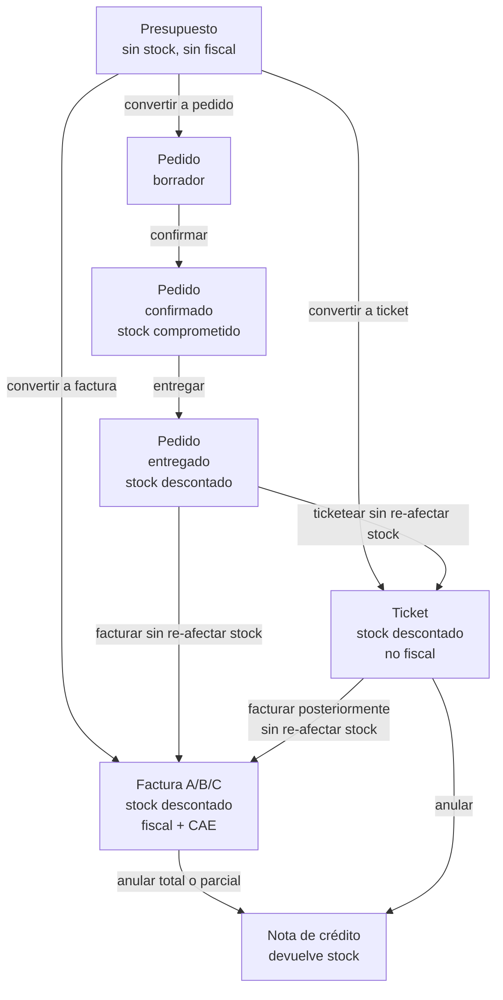

# Nexus — Modelo conceptual de órdenes, presupuestos y comprobantes

Este documento define **explícitamente** qué es cada entidad, qué hace y qué no hace, y cómo se relacionan entre sí. Es la fuente de verdad conceptual para desarrollo y debe reconciliarse con `pedidos.md`, `facturacion.md`, `PLAN-BLOQUE-F.md` y `reportes.md`.

---

## 0. Estado real del sistema — lo que YA EXISTE (importante antes de empezar)

Antes de proponer nuevas columnas o endpoints, este documento reconoce lo que ya está cableado:

### 0.1. `comprobante.numero_orden` ya existe (migración `041`)

Desde la migración **`041_comprobante_numero_orden.sql`** hay una columna **`numero_orden`** en `comprobante` que actúa como **orden de venta interna por tenant** y **enlaza el ticket con la factura fiscal del mismo cobro**. Dos comprobantes (un ticket y su factura posterior, por ejemplo) que representan el mismo hecho económico comparten el mismo `numero_orden`.

Esto es distinto a la numeración correlativa por tipo (`comprobante.numero`, que sigue siendo independiente para cada tipo — factura, ticket, presupuesto, etc., como lo exige ARCA). El `numero_orden` es un identificador **interno** que agrupa comprobantes relacionados entre sí.

### 0.2. Ticket → factura posterior sin re-descontar stock: ya funciona

Si un usuario emite un ticket desde `/pos` y después lo fiscaliza manualmente (genera una factura sobre ese mismo cobro), **el stock no se consume dos veces**. La segunda emisión reutiliza el patrón ya probado en pedido→factura (V30-PED-004): el comprobante fiscal posterior hereda el `numero_orden` del ticket y emite sin afectar stock.

### 0.3. Implicancias para este documento

Las secciones 5 y 10 del documento, escritas antes de descubrir esto, **proponían agregar una columna `facturado_con_id`** al `comprobante`. Eso es **innecesario**: `numero_orden` ya resuelve el problema. La versión actualizada del documento usa `numero_orden` como mecanismo de trazabilidad entre ticket y factura posterior.

Lo que **sí** falta (y sigue siendo alcance válido):

- **Documentar explícitamente** cómo funciona el flujo ticket→factura vía `numero_orden` (hoy está implícito en el código, no en docs).
- **UI completa** para fiscalizar un ticket desde su detalle con un click (puede o no estar cableada según el estado actual; validar).
- **Ajustes de reportes** para que no cuenten dos veces comprobantes del mismo `numero_orden` — si el reporte ya agrupa, no se cambia nada; si no, filtrar.
- **Fix conceptual de cobranza** (sección 11.4): cobranza se crea hoy para toda factura, incluso pagada en el acto. Esto sigue siendo un bug independiente de `numero_orden`.

---

## 1. Glosario — qué es cada cosa

### 1.1. Presupuesto (cotización)

Es una **oferta de precio sin compromiso**. El cliente pregunta "¿cuánto me sale esto?" y se lo mandás por escrito.

- **Naturaleza:** comprobante no fiscal, informativo.
- **Afecta stock:** NO. Ni descuenta ni reserva.
- **Impacto fiscal / ARCA:** ninguno.
- **Numeración propia:** sí, correlativa de presupuestos.
- **Tabla:** `comprobante` con `tipo = 'presupuesto'`.
- **PDF:** sí, se genera y sube a Storage.
- **Caduca:** sí (validez sugerida, ej. 15 días), pero el sistema no lo borra automáticamente.
- **Transiciones posibles:** puede convertirse en **pedido**, en **ticket** o en **factura**.

**No es una orden.** Es una propuesta que puede o no transformarse en una.

---

### 1.2. Pedido (orden reservada pendiente de entrega)

Es una **venta confirmada pero todavía no entregada**. El cliente dijo "sí, lo llevo", pero la mercadería no salió del depósito aún.

- **Naturaleza:** orden interna de trabajo, no fiscal.
- **Afecta stock:** **reserva (stock comprometido)** al confirmar. Descuenta stock real recién al entregar.
- **Impacto fiscal / ARCA:** ninguno por sí mismo.
- **Numeración propia:** sí, correlativa de pedidos.
- **Tabla:** `pedido` (tabla separada de `comprobante`).
- **Máquina de estados:** `borrador → confirmado → entregado → (facturado opcional)` / `borrador|confirmado → cancelado`.
- **Transiciones posibles:** una vez **entregado**, puede emitirse ticket o factura asociada.

**Sí es una orden**, específicamente una orden de reserva/despacho. Es el único flujo que maneja "prometido pero no entregado".

**Casos de uso típicos:**
- Distribuidora que toma pedidos por teléfono y entrega al día siguiente.
- Fábrica que produce contra pedido.
- Área de ventas que cierra acuerdo y el depósito prepara despacho.

---

### 1.3. Ticket (orden de venta al mostrador, no fiscal)

Es una **venta consumada, entregada en el acto, sin documento fiscal**. Típicamente POS, mostrador, consumidor final.

- **Naturaleza:** comprobante no fiscal de venta.
- **Afecta stock:** **sí, descuenta en el acto** (salida inmediata).
- **Impacto fiscal / ARCA:** NO. No va a ARCA, no tiene CAE.
- **Numeración propia:** sí, correlativa de tickets (independiente de facturas).
- **Tabla:** `comprobante` con `tipo = 'ticket'`.
- **PDF / impresión:** térmico 80mm (o 57mm) + PDF A4 de archivo en Storage.
- **Método de pago:** se registra (efectivo/débito/crédito/transferencia/mixto).

**Sí es una orden**, una orden de venta consumada "en negro" (o más precisamente: sin respaldo fiscal formal).

---

### 1.4. Factura (orden de venta fiscal)

Es una **venta consumada con respaldo fiscal**. Factura A/B/C según combinación emisor–receptor.

- **Naturaleza:** comprobante fiscal.
- **Afecta stock:** **sí, descuenta en el acto** (salida inmediata).
- **Impacto fiscal / ARCA:** sí, requiere CAE vía WSFE (Plan Completo).
- **Numeración propia:** sí, por punto de venta y tipo (A/B/C), correlativa según ARCA.
- **Tabla:** `comprobante` con `tipo IN ('factura_a', 'factura_b', 'factura_c')`.
- **PDF:** A4 con QR de constatación AFIP + CAE + vencimiento.

**Sí es una orden**, la versión "en blanco" de la venta consumada.

---

### 1.5. Otros comprobantes (existen y no cambian)

- **Nota de crédito A/B/C** — anulación parcial o total de una factura. Devuelve stock.
- **Remito** — entrega de mercadería sin factura asociada. Descuenta stock.
- **Recibo** — instrumento de cobranza, no es orden ni venta. Registra pago sobre una factura o cuenta corriente.

---

## 2. Resumen en una tabla

| Entidad | ¿Es orden? | Descuenta stock | Reserva stock | Fiscal / ARCA | Tabla | Tipo en `comprobante.tipo` |
|---|---|---|---|---|---|---|
| Presupuesto | No (oferta) | No | No | No | `comprobante` | `presupuesto` |
| Pedido | Sí (reservada) | Al entregar | Al confirmar | No | `pedido` | — |
| Ticket | Sí (consumada) | Inmediato | — | No | `comprobante` | `ticket` |
| Factura | Sí (consumada) | Inmediato | — | Sí | `comprobante` | `factura_a/b/c` |
| Nota de crédito | No (reverso) | Devuelve | — | Sí | `comprobante` | `nota_credito_a/b/c` |
| Remito | No (despacho) | Inmediato | — | No | `comprobante` | `remito` |
| Recibo | No (cobranza) | — | — | No (fiscal limitado) | `comprobante` | `recibo` |

---

## 3. Diagrama de transiciones (ciclo completo)



> **Regla de vinculación:** cuando un comprobante genera otro (pedido→factura, ticket→factura, presupuesto→X), se persiste la relación para trazabilidad completa. Ver sección 7, regla 8.

---

## 4. Flujos operativos explícitos

### 4.1. Presupuesto → Pedido → Entrega → Factura
"Distribuidora que cotiza, el cliente acepta, se prepara y entrega, después se factura."

1. Se emite **presupuesto** (sin stock, sin fiscal).
2. Cliente acepta → se convierte en **pedido** en estado `borrador` (hereda items).
3. Se confirma pedido → stock queda **comprometido** (no descontado).
4. Se entrega → stock se **descuenta** via `registrar_movimiento`.
5. Se factura desde pedido entregado → se crea **factura** vinculada; **no se re-descuenta stock** (ya fue descontado al entregar). `pedido.comprobante_id` se actualiza.

### 4.2. Presupuesto → Factura directa
"Cliente acepta cotización y pide factura inmediata sin paso de despacho."

1. Se emite **presupuesto**.
2. Cliente acepta → "convertir a factura" crea comprobante tipo `factura_*` con los mismos items.
3. Factura descuenta stock en el acto. El presupuesto original se conserva.

### 4.3. Presupuesto → Ticket
"Cliente cotizó pero cierra en el mostrador sin factura."

1. Se emite **presupuesto**.
2. Cliente pasa por caja → "convertir a ticket" crea comprobante tipo `ticket`.
3. Ticket descuenta stock en el acto. El presupuesto original se conserva.

> **Estado actual:** presupuesto→pedido y presupuesto→factura ya existen (ver `V30-PED-005`). **Presupuesto→ticket no existe aún** y debe cablearse análogo a `POST /api/presupuestos/[id]/convertir-a-factura`.

### 4.4. POS directo → Ticket (caso más común)
"Cliente entra al kiosco, se escanea, se cobra, se imprime ticket."

1. Operador escanea productos en `/facturacion/pos`.
2. Confirma cobro, tipo `ticket`.
3. Se emite ticket, descuenta stock, imprime térmico. Fin.

### 4.5. POS directo → Factura A/B/C (caso fiscal inmediato)
"Cliente pide factura desde el principio."

1. Operador cambia tipo a `factura_*` en el POS, selecciona cliente con CUIT/DNI.
2. Confirma cobro → se emite factura, se pide CAE a ARCA, descuenta stock, imprime térmico con QR.

### 4.6. Ticket → Factura posterior (flujo nuevo a implementar)
"El cliente se llevó un ticket y a los 3 días vuelve a pedir factura."

Ver sección 5.

### 4.7. Pedido sin paso por presupuesto
"Cliente llama y pide directo sin cotización."

- Se crea **pedido** en `borrador` directamente, sin presupuesto previo. Sigue flujo 4.1 desde el paso 3.

---

## 5. Ticket → Factura posterior — cómo funciona realmente hoy

**Caso real:** cliente compra por mostrador, se lleva el ticket, días después vuelve y pide factura para rendición o descargo de gasto.

### 5.1. El mecanismo ya existe: `numero_orden`

El sistema ya tiene cableado este flujo usando la columna **`comprobante.numero_orden`** (migración `041`). El principio es:

> El ticket y la factura fiscal posterior **son dos `comprobante` distintos** (cada uno con su propia numeración por tipo), pero **comparten el mismo `numero_orden`**. Esto los agrupa como "un mismo hecho de venta".

Al fiscalizar un ticket:
1. Se crea un nuevo `comprobante` con `tipo = 'factura_a/b/c'` y **el mismo `numero_orden`** que el ticket.
2. La emisión de la factura **no descuenta stock** (ya se descontó al emitir el ticket).
3. Si hay módulo `facturador_arca` activo, se pide CAE vía WSFE.
4. Los reportes agrupan por `numero_orden` para no contar dos veces la misma venta.

### 5.2. Ventajas del mecanismo actual vs. una columna `facturado_con_id`

El planteo original de este documento (en versiones previas) proponía una columna `facturado_con_id` apuntando del ticket a su factura. **El mecanismo `numero_orden` es mejor** porque:

- Es **agrupador** en lugar de puntero: permite naturalmente "N comprobantes de la misma orden" (útil si un ticket se desdobla en varias facturas parciales, o en el futuro para consolidación).
- **Ya existe**, no requiere migración nueva.
- Es **simétrico**: ni el ticket "apunta" a la factura ni viceversa. Ambos son iguales ante el `numero_orden`.
- Permite filtros y agregaciones simples: `GROUP BY numero_orden` → un hecho económico.

### 5.3. Trazabilidad en reportes: la regla de oro

Para evitar el doble conteo en ventas, los reportes que suman `ticket` + `factura_*` deben aplicar la regla:

> **Por cada `numero_orden`, contar solo el comprobante de mayor jerarquía fiscal.** Es decir: si hay factura en la orden, esa es la que cuenta; el ticket "queda opaco" en agregados de venta, pero se sigue viendo en la UI de la orden.

Jerarquía: `factura_a` = `factura_b` = `factura_c` > `ticket` > (no hay otros comprobantes de venta en el modelo).

**Query patrón** (SQL) para listar comprobantes de venta sin duplicar órdenes:

```sql
-- Un comprobante representativo por numero_orden (el de mayor jerarquía fiscal)
WITH jerarquia AS (
  SELECT id, numero_orden, tipo, total, fecha,
    CASE
      WHEN tipo IN ('factura_a', 'factura_b', 'factura_c') THEN 1
      WHEN tipo = 'ticket' THEN 2
      ELSE 99
    END AS rango
  FROM comprobante
  WHERE estado = 'emitido'
    AND tipo IN ('factura_a', 'factura_b', 'factura_c', 'ticket')
    AND tenant_id = current_tenant_id()
)
SELECT DISTINCT ON (numero_orden) id, numero_orden, tipo, total, fecha
FROM jerarquia
WHERE numero_orden IS NOT NULL
ORDER BY numero_orden, rango;

-- Para comprobantes sin numero_orden (caso legacy o ticket que nunca se fiscalizó),
-- se los trata como órdenes individuales.
```

### 5.4. Alcance de ajustes a realizar

Lo que probablemente **ya está hecho** (validar en código):
- Columna `numero_orden` en `comprobante`.
- Lógica de emisión de factura desde ticket reutilizando `numero_orden` sin re-descontar stock.
- Test de PDF leyendo por `numero_orden` (ver `src/test/pdf-orden-29.test.ts`).

Lo que **puede estar parcial o faltante** (validar con tu copiloto antes de codear):

- [ ] **UI de "Fiscalizar ticket"**: botón en el detalle de un ticket (`/facturacion/[id]`) que abre modal con selector de cliente (CUIT/DNI obligatorio), tipo de factura, y emite. Si no existe, cablear.
- [ ] **UI de trazabilidad**: en el detalle de un ticket fiscalizado, mostrar badge "Fiscalizado — ver factura FB-XXXX" con link al otro comprobante del mismo `numero_orden`. En el detalle de la factura: badge "Factura posterior de ticket T-XXXX". Si no existe, cablear.
- [ ] **Listados con agrupación**: en `/facturacion` o listados POS, evaluar si se muestra un badge/ícono discreto en tickets que tienen factura en la misma orden, para evitar que el usuario piense que hay dos ventas.
- [ ] **Queries de reportes** (sección 5.3): verificar que todas las APIs `/api/reportes/*` que suman ventas aplican la regla de jerarquía. Si alguna hace `SUM(total)` sobre `ticket + factura_*` sin deduplicar por `numero_orden`, hay que corregirla.
- [ ] **Documentación**: incorporar una sección en `facturacion.md` explicando `numero_orden` y el flujo ticket→factura. Hoy el mecanismo está cableado pero la documentación conceptual no lo explica.
- [ ] **Validación**: una factura emitida sobre un ticket no debería permitir una segunda factura sobre el mismo `numero_orden` (evitar duplicar). Verificar que la API valida esto.

### 5.5. Tickets de implementación (reducidos vs. versión anterior)

| ID | Título | Pts |
|---|---|---|
| V82-ORD-001 | Auditoría del estado actual de `numero_orden`: endpoints, UI, reportes | 2 |
| V82-ORD-002 | UI de "Fiscalizar ticket" si no existe: botón + modal + emisión | 5 |
| V82-ORD-003 | UI de trazabilidad: badges bidireccionales en detalle de ticket/factura | 3 |
| V82-ORD-004 | Ajustar queries de reportes con regla de jerarquía por `numero_orden` | 5 |
| V82-ORD-005 | Validación: impedir doble fiscalización sobre mismo `numero_orden` | 2 |
| V82-ORD-006 | Documentar `numero_orden` en `facturacion.md` y en este documento | 2 |
| V82-ORD-007 | Tests: end-to-end ticket → fiscalización → reportes sin duplicar | 3 |

**Total:** 7 tickets, ~22 story points (antes eran 32; bajó porque el núcleo ya existe).

> **Nota importante para el copiloto:** antes de empezar cualquier ticket, ejecutar V82-ORD-001 (auditoría). Si parte de los tickets 002-005 ya están implementados, marcarlos como hechos y no rehacerlos. El objetivo es **completar lo que falta**, no reemplazar lo que funciona.

---

## 6. Cadena completa: ejemplos narrativos

### 6.1. Distribuidora — presupuesto → pedido → entrega → factura

> "Una distribuidora le cotiza a un cliente. El cliente acepta y pide que le preparen el pedido para retirar mañana. Al día siguiente retira. A los dos días vuelve y pide factura en vez del remito que le habían dado."

1. **Día 1:** Se emite **presupuesto** #P-0045 con 10 items. Stock sin cambios.
2. **Día 1 (tarde):** Cliente acepta → se convierte a **pedido** #PED-0120 en `borrador`, se confirma → stock **comprometido** 10 unidades.
3. **Día 2:** Cliente retira → pedido pasa a `entregado`, stock **descontado** 10 unidades. Se imprime remito #R-0089.
4. **Día 4:** Cliente pide factura → desde el pedido entregado, "Generar factura" emite **factura B** #FB-0234, vinculada a `pedido.comprobante_id`. **No se re-descuenta stock** (ya se hizo en el paso 3).
5. El remito original queda como comprobante de despacho; la factura es el respaldo fiscal.

**Trazabilidad:** presupuesto P-0045 → pedido PED-0120 → remito R-0089 + factura FB-0234.

### 6.2. Kiosco → ticket → factura posterior (fiscalización)

> "Un cliente compra en el mostrador, paga efectivo y se lleva el ticket. Tres días después vuelve y pide factura para rendir gastos en su empresa."

1. **Día 1:** Operador escanea 5 productos en el POS, cobra en efectivo, imprime **ticket** T-1824. Stock **descontado** 5 unidades. Total: $18.500. El sistema asigna `numero_orden = 1284` al ticket.
2. **Día 4:** Cliente vuelve con el ticket → desde `/facturacion/[id]` del ticket, botón "Fiscalizar" → selecciona cliente "Empresa XYZ SRL" (CUIT cargado) → confirma.
3. Sistema emite **factura B** FB-0235 con los mismos 5 items y total $18.500. La factura hereda el **mismo `numero_orden = 1284`**. **No se descuenta stock** (ya se hizo en el paso 1). Pide CAE a ARCA.
4. En el detalle del ticket T-1824 aparece badge "Fiscalizado — ver FB-0235 (orden #1284)". En el detalle de FB-0235 aparece badge "Factura posterior de ticket T-1824 (orden #1284)".
5. Reportes: agrupados por `numero_orden`, la orden #1284 cuenta una sola vez, tomando el comprobante de mayor jerarquía (la factura). **Total vendido en el mes: sin cambios** — solo cambia qué comprobante representa esa venta al agregar.

**Trazabilidad:** orden #1284 → ticket T-1824 + factura FB-0235 (agrupados por `numero_orden`).

---

## 7. Reglas invariantes (qué no debe pasar nunca)

1. **Un mismo hecho de venta no puede descontar stock dos veces.** Si un pedido entregado se factura, la factura no descuenta. Si un ticket se factura posteriormente, la factura no descuenta (ya se descontó al emitir el ticket).
2. **Un presupuesto no afecta stock bajo ninguna circunstancia.** Ni al crearlo, ni al convertirlo (el efecto lo tiene la entidad destino).
3. **Un pedido no es fiscal por sí mismo.** Para que haya fiscalidad, se emite factura desde el pedido.
4. **Un ticket no tiene CAE.** Nunca va a ARCA. Si se necesita respaldo fiscal → facturar posteriormente (flujo 5).
5. **Numeraciones son independientes** entre: presupuestos, pedidos, tickets, facturas (por tipo/PV), remitos, recibos, NC. Nunca se comparten.
6. **Presupuesto conservado:** convertir un presupuesto **no lo borra**. Queda como registro histórico.
7. **Pedido facturado no se refactura.** `pedido.comprobante_id NOT NULL` bloquea una segunda factura (409).
8. **Ticket fiscalizado no se re-fiscaliza.** Un `numero_orden` que ya tiene un comprobante fiscal (factura A/B/C) no puede generar otro. La API debe validar esto (409 si se intenta).
9. **Trazabilidad siempre persistida:** toda conversión o vinculación entre comprobantes/órdenes queda registrada:
   - `comprobante.numero_orden` → agrupa ticket + factura fiscal del mismo cobro (migración `041`, ya existe).
   - `pedido.comprobante_id` → factura generada desde el pedido (convivencia con `numero_orden`).
   - `cobranza_factura.comprobante_id` → cobranza vinculada a la factura.
   - Presupuesto → destino: hoy solo queda una nota en `pedido.notas`. Sugerencia: reutilizar `numero_orden` también para esta relación.
10. **Reportes de ventas nunca deben sumar dos veces el mismo hecho.** Cualquier query que sume `ticket` + `factura_*` debe agrupar por `numero_orden` y tomar el comprobante de mayor jerarquía fiscal (regla detallada en sección 5.3).

---

## 8. Qué dejar como está y qué cambiar

### Dejar como está
- Tabla `pedido` separada de `comprobante` (está bien diseñado, el pedido tiene máquina de estados propia).
- Flujos presupuesto → pedido y presupuesto → factura (V30-PED-005 ya cubre).
- Flujo pedido → factura (V30-PED-004 ya cubre).
- Tipos de comprobante existentes.
- **Columna `comprobante.numero_orden`** (migración 041) como mecanismo de agrupación de comprobantes del mismo hecho de venta.
- Numeración correlativa por tipo (`comprobante.numero`) — requisito ARCA, no tocar.

### Cambiar / agregar
- **(Auditoría)** V82-ORD-001: revisar qué de la UI y los reportes usa `numero_orden` correctamente y qué falta. Ver sección 5.4 para checklist.
- **(UI, si falta)** Botón "Fiscalizar" en detalle de ticket + badges de trazabilidad bidireccional.
- **(Reportes, si falta)** Aplicar regla de jerarquía por `numero_orden` en queries que suman ventas (sección 5.3).
- **(Consistencia)** Evaluar si el flujo pedido → factura también copia `numero_orden` del pedido al comprobante, para que la orden abarque todo el ciclo presupuesto → pedido → ticket/factura (sección 10.3).
- **(Cobranza, bug conceptual)** Fix de creación condicional de `cobranza_factura` según método de pago — sección 11.4. Es independiente del tema de órdenes.
- **(Docs)** Este documento (`ordenes-modelo-conceptual.md`) + agregar sección dedicada a `numero_orden` en `facturacion.md`.

### NO hacer
- **No eliminar pedidos del modelo.** Cubre el caso "vendido pero no entregado" que ni presupuesto ni ticket/factura cubren. Perfiles Distribuidora / Fábrica / Área de ventas dependen de esto.
- **No fusionar `pedido` con `comprobante`.** Tienen semánticas distintas (pedido tiene estados, comprobante no; pedido reserva stock, comprobante no).
- **No agregar columna `facturado_con_id`.** `numero_orden` ya resuelve el caso.
- **No unificar la numeración fiscal.** ARCA la exige separada por tipo.
- **No implementar consolidación de varios tickets en una factura** en esta iteración.
- **No permitir facturar posteriormente tickets que ya tengan NC asociada** en esta iteración.

---

## 9. Puntos abiertos

Decisiones menores que el copiloto puede validar durante la implementación:

1. **Presupuesto → ticket:** ¿se implementa ya o queda para cuando aparezca el caso? Costo bajo (análogo a presupuesto → factura). Sugerencia: dejar para iteración posterior salvo que un cliente real lo pida.
2. **Caducidad de presupuestos:** ¿el sistema debe marcarlos como "vencidos" después de N días? Hoy no lo hace. Sugerencia: campo `validez_hasta` informativo, sin bloqueo automático.
3. **Columna `origen_presupuesto_id` en `comprobante`/`pedido`:** hoy la conversión desde presupuesto no deja referencia formal en el destino (solo nota textual en `pedido.notas`). Evaluar agregar esta columna si se quiere reportería de conversión (tasa presupuesto → venta). No urgente.
4. **Nomenclatura en UI:** ¿conviene introducir el término "Orden" como paraguas de pedido/ticket/factura en menúes, o mantener los nombres actuales que ya son familiares para el usuario argentino? Recomendación: mantener nombres actuales; este documento es interno para alinear al equipo de desarrollo.
5. **Discrepancia intencional entre cierre Z y reporte de ventas:** cuando se factura posteriormente un ticket de un día ya cerrado, el cierre Z del día original queda "inmutable" (muestra el ticket) pero el reporte de ventas del mismo día recalcula (excluye el ticket, la factura aparece en su fecha propia). Confirmar que este comportamiento es aceptable para el usuario y documentarlo en `reportes.md`.

---

## 10. Numeración e identificación — cómo funciona realmente

### 10.1. Dos "números" coexisten en `comprobante`

El sistema ya maneja **dos niveles de identificación** por comprobante:

**1. `comprobante.numero`** — número **fiscal** correlativo por tipo y punto de venta. Requisito de ARCA: no puede tener huecos. Cada tipo (factura_a, factura_b, ticket, presupuesto, etc.) tiene su propia secuencia independiente via `siguiente_numero_comprobante`. Esto **no se unifica** ni se puede unificar: ARCA lo rechaza.

**2. `comprobante.numero_orden`** — número **interno** por tenant que agrupa comprobantes que representan el mismo hecho económico. Un ticket y su factura posterior comparten `numero_orden`. Un pedido que se factura puede compartir `numero_orden` con su factura (validar en implementación si así está cableado o si usa `pedido.comprobante_id`).

### 10.2. La respuesta a "¿número único de orden atravesando todo?"

> **Sí y no.** Para lo que el usuario final ve como "una misma venta" (ticket + factura posterior), ya hay un número único: `numero_orden`. Para lo fiscal (numeración correlativa que informa a ARCA), sigue y debe seguir siendo independiente por tipo.

Esta dualidad es **correcta** y aplica también en sistemas contables argentinos maduros (Tango, Contasol, Bejerman): conservan una "orden de venta" interna separada del número fiscal.

### 10.3. Trazabilidad de presupuesto y pedido en la orden

**Presupuesto → {pedido, ticket, factura}:** hoy, cuando se convierte un presupuesto, no hay una referencia formal al presupuesto origen (solo una nota en texto). Si se quiere trazabilidad de conversión, se puede:

- **Opción A:** hacer que la conversión presupuesto → destino **reutilice el `numero_orden` del presupuesto**. Así la orden es visible desde el presupuesto hasta la factura.
- **Opción B:** agregar columnas `origen_presupuesto_id` en `pedido` y `comprobante`. Más explícito pero más código.

**Recomendación:** **Opción A**, porque extiende el mecanismo ya existente de `numero_orden` en lugar de inventar uno nuevo. La orden pasa a ser "la línea de vida de un hecho comercial desde que se cotiza hasta que se factura".

**Pedido → factura:** hoy existe `pedido.comprobante_id` (FK del pedido a la factura que generó). Esto funciona bien, pero crea una asimetría: el ticket-factura se agrupa por `numero_orden`, el pedido-factura por FK. Sugerencia para consistencia:

- Cuando un pedido se factura, **copiar el `numero_orden` del pedido (si lo tuviera) al comprobante**. El pedido puede tener su propio `numero_orden` desde creación (alinear migración).
- El `pedido.comprobante_id` se mantiene como atajo rápido de navegación inversa (factura → ¿de qué pedido?), pero la agrupación conceptual es por `numero_orden`.

### 10.4. UI: "Cadena del comprobante" desde el `numero_orden`

En el detalle de cualquier comprobante, mostrar una **timeline de trazabilidad** consultando todos los comprobantes con el mismo `numero_orden`:

```
Orden #1284
├── Presupuesto P-0045 (15/abr) — cotización
├── Pedido PED-0120 (16/abr) — entregado
├── Ticket T-1824 (16/abr) — emitido en caja
└── Factura FB-0234 (20/abr) — fiscalización posterior — estás acá
    └── Cobranza: $8.300 / $18.500 (2 pagos)
```

Esto le da al usuario la sensación de "seguir una sola orden" **usando el mecanismo que ya existe**, sin inventar nada nuevo.

### 10.5. ¿Qué cambia respecto al modelo viejo del documento?

Versiones previas de este documento proponían:
- Columna `comprobante.facturado_con_id` → **ya no es necesaria**, `numero_orden` la reemplaza.
- Columnas `origen_presupuesto_id` en `pedido`/`comprobante` → **opcional**, preferir reusar `numero_orden`.
- Endpoint `POST /api/facturacion/[id]/facturar-posterior` → **sí es necesario si no existe UI para esto**, pero internamente no agrega columnas.

En resumen: el diseño base del sistema es **más sólido de lo que este documento asumía inicialmente**. Las mejoras pendientes son en **documentación, UI y queries de reportes**, no en schema.

---

## 11. Estado de cobranza — cuándo sí y cuándo no corresponde cobrar

Esta es la otra pregunta central: **¿cómo sabe el sistema si un hecho de venta se debe cobrar, ya se cobró, o no corresponde cobrar?**

### 11.1. Regla general

El estado de cobranza **no vive en `comprobante`**, vive en **`cobranza_factura`** (tabla aparte) que referencia al comprobante. Esto está bien diseñado: separa "qué vendí" (inmutable, fiscal) de "cómo va la cobranza" (mutable, operativa).

**Un comprobante genera registro de cobranza solo si:**
1. Es una **factura A/B/C** (no ticket, no presupuesto, no pedido, no remito).
2. Tiene **cliente identificado** (CUIT/DNI).
3. El **método de pago no fue cancelación inmediata en el acto** (ver 11.3).

### 11.2. Qué debe cobrarse y qué no (tabla de verdad)

| Entidad | Genera cobranza | ¿Por qué? |
|---|---|---|
| Presupuesto | **No** | No es venta. No hay hecho económico. |
| Pedido `borrador` / `confirmado` | **No** | No hay venta consumada todavía. |
| Pedido `entregado` **con ticket asociado (no factura)** | **No** (¹) | El ticket cierra el hecho operativo. Si después se factura (ticket→factura), recién ahí se evalúa cobranza según el método de pago de la factura. |
| Pedido `entregado` **sin ningún comprobante** | **Situación irregular** (²) | No debería existir. Ver sección 12. |
| Ticket (POS, efectivo/tarjeta/transferencia) | **No** | Se cobró en el acto. El POS no fía. |
| Factura A/B/C con método **efectivo/débito/crédito/transferencia** (pago al contado) | **No** (²) | Ya se cobró. Se registra el pago inmediato, no queda saldo. |
| Factura A/B/C con método **cuenta corriente** | **Sí** | Cliente se lleva la mercadería a pagar después. Saldo pendiente real. |
| Factura A/B/C **mixta** (parte contado, parte cta cte) | **Sí (parcial)** | Se registra pago inmediato por la parte cobrada, queda saldo por la parte a crédito. |
| Nota de crédito A/B/C | **No, resta** | Reduce el saldo de la factura asociada en `cobranza_factura`. |
| Remito | **No** | No es factura. Si se factura después desde pedido, la factura generada genera su propia cobranza. |
| Recibo | **No** | Es el instrumento que cobra, no lo cobrado. |

**(¹)** Un pedido entregado sin factura es una situación irregular pero posible ("llevátelo y después veo si te hago factura"). Conviene mostrarlo en un reporte aparte como "entregado pendiente de facturar" para que el operador no lo pierda de vista. No entra en cobranza formal hasta que haya factura.

**(²)** **Este es el bug conceptual actual del sistema** — ver 11.4.

### 11.3. Distinción clave: "contado" vs "cuenta corriente"

La factura por sí sola no te dice si hay que cobrar algo. Lo determina **el método de pago al momento de emitirla**:

- **Contado** (efectivo, débito, crédito, transferencia, mixto de esos): **no hay cobranza pendiente**. El dinero entró en el acto. Se registra `pago` asociado al comprobante por el total.
- **Cuenta corriente**: cliente se lleva la factura pero paga después. **Se crea `cobranza_factura` con saldo = total y vencimiento +N días.**
- **Mixto con cta cte** (ej. $5000 efectivo + $15000 cta cte): `pago` por $5000 + `cobranza_factura` con saldo $15000.

### 11.4. Bug conceptual actual a corregir

**Estado actual del sistema** (según `cobranza.md` y `V70-COB-001`):

> "Por cada factura A/B/C emitida con cliente se crea un registro de cobranza con saldo igual al total y vencimiento a 7 días."

Esto está mal: se crea cobranza **incluso si la factura se pagó en el acto en efectivo**. Consecuencias:

- La campana de cobranza muestra facturas que ya están cobradas.
- El aging de clientes infla deuda inexistente.
- El usuario tiene que ir a cada factura y marcarla manualmente como cobrada (duplica trabajo).

**Corrección propuesta** — migración y lógica nueva:

1. La API de emisión ya acepta `metodo_pago` (`efectivo` | `debito` | `credito` | `transferencia` | `mixto` | `cuenta_corriente`). Hoy falta el valor `cuenta_corriente` en el enum (a agregar).
2. En `emitirComprobante`, la creación de `cobranza_factura` pasa a ser **condicional**:
   - Si `metodo_pago !== 'cuenta_corriente'` y no es mixto con cta cte → no crear cobranza. Registrar en cambio un `pago` con `monto = total` y `fecha = fecha_factura`.
   - Si `metodo_pago === 'cuenta_corriente'` → crear cobranza con saldo = total (comportamiento actual).
   - Si `metodo_pago === 'mixto'` y `metodo_pago_detalle.cuenta_corriente > 0` → crear cobranza con saldo = lo que va a cta cte, y registrar `pago` por lo contado.
3. UI en `/facturacion/nueva` y en POS: agregar opción explícita "Cuenta corriente" en el selector de método de pago, con indicador visual claro ("Esta venta queda pendiente de cobro").

### 11.5. ¿Dónde vivir el "estado" de una orden entonces?

Juntando todo, la respuesta a **"¿cómo veo en un vistazo el estado completo de una orden?"** es: se **compone** navegando las referencias, no se guarda en un solo lugar:

```
Para un comprobante C (factura, ticket):

  Estado fiscal      = comprobante.estado ('emitido' | 'anulado' | ...)
  Estado de stock    = implícito (movimiento asociado al emitir)
  Estado de cobranza = SELECT saldo_pendiente FROM cobranza_factura WHERE comprobante_id = C.id
                       (si no existe fila → está cobrado / no aplica)
  Estado de entrega  = si viene de pedido: pedido.estado
                       si es ticket o POS directo: "entregado" implícito

Para un pedido P:

  Estado operativo   = pedido.estado ('borrador' | 'confirmado' | 'entregado' | ...)
  ¿Facturado?        = pedido.comprobante_id IS NOT NULL
  Estado de cobranza = si facturado, seguir a la factura
```

La UI de detalle de cualquier orden/comprobante debería mostrar estos tres/cuatro indicadores juntos como un "panel de estado" para que el usuario tenga la foto completa sin hacer navegación mental.

### 11.6. Tickets de implementación propuestos para el fix de cobranza

| ID | Título | Pts |
|---|---|---|
| V82-COB-FIX-001 | Migración: agregar valor `cuenta_corriente` al enum `metodo_pago` | 1 |
| V82-COB-FIX-002 | `emitirComprobante`: creación condicional de `cobranza_factura` según método | 5 |
| V82-COB-FIX-003 | `emitirComprobante`: registrar `pago` automático cuando es contado | 3 |
| V82-COB-FIX-004 | Soporte de mixto con cta cte en `emitirComprobante` (saldo parcial) | 5 |
| V82-COB-FIX-005 | UI: opción "Cuenta corriente" en selector de método (facturación + POS) | 3 |
| V82-COB-FIX-006 | UI: indicador visual "venta a crédito" en formulario y comprobante emitido | 2 |
| V82-COB-FIX-007 | Migración de datos: para facturas existentes sin pagos, **no hacer nada** (preservar comportamiento histórico); documentar corte. | 2 |
| V82-COB-FIX-008 | Tests: contado sin cobranza, cta cte con cobranza, mixto con saldo parcial | 5 |
| V82-COB-FIX-009 | Documentación en `cobranza.md` y `facturacion.md` | 2 |

**Total:** 9 tickets, ~28 story points.

> **Alcance deliberadamente no incluido:** backfill retroactivo de facturas ya emitidas. Las cobranzas existentes creadas con el comportamiento viejo siguen como están y se saldan manualmente. Introducir el corte por fecha ("a partir del día X la lógica cambia") en `cobranza.md`.