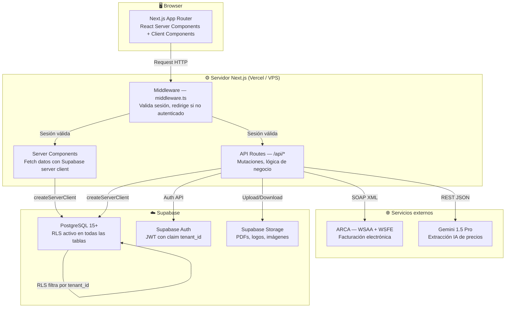
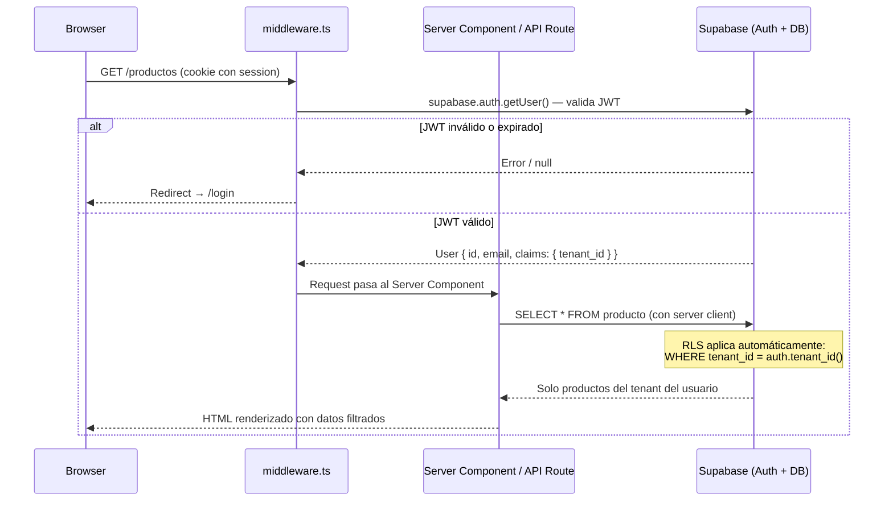

# Nexus — Arquitectura

## Diagrama de capas



---

## Flujo de una request autenticada (punta a punta)



### Detalle paso a paso

1. **Browser** envía un request con la cookie de sesión de Supabase (`sb-access-token`, `sb-refresh-token`).
2. **`middleware.ts`** intercepta el request, crea un Supabase client con `createServerClient`, y llama a `supabase.auth.getUser()` para validar el JWT.
3. Si el JWT es inválido o la sesión expiró, redirige a `/login`.
4. Si el JWT es válido, el request llega al **Server Component** o **API Route**.
5. El Server Component crea su propio Supabase server client (que hereda la sesión del middleware).
6. Al hacer un query (`supabase.from('producto').select('*')`), PostgreSQL aplica las **RLS policies** automáticamente.
7. La policy verifica `tenant_id = auth.tenant_id()`, donde `auth.tenant_id()` extrae el claim `tenant_id` del JWT.
8. El resultado contiene **solo datos del tenant del usuario autenticado**. Nunca se mezclan datos entre tenants.

---

## Estructura de carpetas Next.js

```
smartstock/
├── src/
│   ├── app/                          # App Router de Next.js
│   │   ├── (auth)/                   # Grupo de rutas públicas (login, register)
│   │   │   ├── login/page.tsx        # Página de login
│   │   │   ├── register/page.tsx     # Registro de nuevo tenant + usuario admin
│   │   │   └── layout.tsx            # Layout sin sidebar para auth
│   │   ├── (dashboard)/              # Grupo de rutas protegidas
│   │   │   ├── layout.tsx            # Layout con sidebar, header, guard de módulos
│   │   │   ├── page.tsx              # Dashboard principal con métricas
│   │   │   ├── productos/            # CRUD de productos
│   │   │   ├── movimientos/          # Historial de movimientos de stock
│   │   │   ├── importar/             # Importador: upload → mapeo → preview (IndexedDB; opción pesable por nombre + PLU) → lotes
│   │   │   ├── facturacion/          # Comprobantes: lista, emisión, detalle
│   │   │   │   └── pos/             # Terminal POS con escáner (fullscreen, sin sidebar)
│   │   │   ├── clientes/             # CRUD de clientes
│   │   │   ├── proveedores/          # CRUD de proveedores + perfil de mapeo Excel
│   │   │   ├── pedidos/              # Pedidos con estados (Plan Completo)
│   │   │   ├── presupuestos/         # Presupuestos (Plan Completo)
│   │   │   ├── ia-precios/           # Extracción IA + historial (Plan Completo)
│   │   │   ├── analizador/           # Listas de proveedores, rentabilidad y forecast (Plan Completo)
│   │   │   └── configuracion/        # Config del negocio, plan, ARCA, POS, usuarios
│   │   └── api/                      # API Routes (server-side)
│   │       ├── auth/callback/        # Callback de Supabase Auth (magic link)
│   │       ├── productos/            # CRUD, barcode, `buscar-por-barcode` (POS); `[id]/imagen` → miniatura WebP (`producto-imagenes`)
│   │       ├── movimientos/          # Registrar movimientos
│   │       ├── importar/             # Validar y ejecutar importación
│   │       ├── facturacion/          # Emitir comprobantes + ARCA
│   │       ├── pos/                  # Búsqueda inline y listado de proveedores (guard `facturador_pos`)
│   │       ├── pedidos/              # CRUD de pedidos
│   │       ├── ia/                   # Extracción con Gemini
│   │       └── analizador/           # Matching, simulación y aplicación de listas
│   ├── lib/                          # Lógica de negocio y utilidades
│   │   ├── limits.ts                 # `getUsuariosMaxPorPlan`: tope de usuarios activos solo en plan `base` (`USUARIOS_MAX_PLAN_BASE`)
│   │   ├── supabase/                 # Clientes Supabase (browser, server, middleware)
│   │   ├── normalizador/             # Aliases, mapeo, validación, normalización
│   │   ├── importar/               # Draft + IndexedDB, ejecutar-importación, client-import (lotes); ver `producto/inferir-unidad-stock-desde-texto` (pesable opt-in)
│   │   ├── facturacion/              # PDF generator, numerador, ARCA (afip-https-client, wsaa, wsfe)
│   │   ├── pos/                      # EAN-13 (generar/validar), barcode-parser, utilidades POS
│   │   ├── ia/                       # Cliente Gemini y prompts
│   │   ├── analizador/               # Matching, análisis, simulador, forecast y radar
│   │   ├── cuenta-corriente/         # Deuda de clientes y registro de pagos
│   │   └── utils/                    # Formatters y validators genéricos
│   ├── components/                   # Componentes React
│   │   ├── ui/                       # Componentes base (buttons, inputs, modals)
│   │   ├── layout/                   # Sidebar, header, breadcrumbs
│   │   ├── stock/                    # Tabla de productos, cards de alerta
│   │   ├── importar/                 # Wizard de importación
│   │   ├── facturacion/              # Formulario de comprobante, preview PDF
│   │   ├── pos/                      # BarcodeInput, carrito POS, modal cobro, ticket térmico (QR AFIP si hay CAE)
│   │   ├── pedidos/                  # Formulario de pedido, tabla de estados
│   │   ├── analizador/               # Paneles de listas, simulador y dashboards de rentabilidad
│   │   └── dashboard/                # Widgets de métricas
│   ├── hooks/                        # Custom hooks
│   │   ├── useModulos.ts             # Lee modulo_config, expone flags de módulos
│   │   ├── useTenant.ts              # Datos del tenant actual
│   │   └── useProductos.ts           # Query de productos con filtros
│   └── types/                        # Tipos TypeScript
│       ├── database.ts               # Tipos generados de Supabase (tablas, enums)
│       ├── importacion.ts            # Tipos del pipeline de importación
│       └── facturacion.ts            # Tipos de comprobantes, ARCA
├── public/
│   └── plantillas/
│       └── plantilla_importacion.xlsx  # Plantilla descargable para importar productos
├── supabase/
│   ├── migrations/                   # Migraciones SQL ordenadas (001 → 022)
│   └── seed.sql                      # Datos de prueba
├── docs/                             # Documentación del proyecto (Memory Bank)
├── .env.local                        # Variables de entorno (no se commitea)
├── next.config.js                    # Configuración de Next.js
├── tailwind.config.ts                # Configuración de Tailwind CSS
├── tsconfig.json                     # Configuración de TypeScript
└── package.json                      # Dependencias y scripts
```

---

## Decisiones de diseño

### ¿Por qué App Router y no Pages Router?

App Router es el estándar actual de Next.js 14+. Permite:
- **React Server Components (RSC):** fetch de datos en el servidor sin estado en el cliente, menos JavaScript enviado al browser.
- **Layouts anidados:** el `(dashboard)/layout.tsx` maneja sidebar + guard de autenticación para todas las rutas protegidas, sin repetir lógica.
- **Route Groups:** `(auth)` y `(dashboard)` organizan rutas sin afectar la URL.
- **Streaming y Suspense:** carga progresiva de secciones pesadas (tabla de productos, historial).
- **Server Actions** disponibles si en el futuro se quiere reducir API routes para mutaciones simples.

### ¿Por qué Supabase y no un backend custom?

- Auth, Storage, Realtime y PostgreSQL con RLS en un solo servicio gestionado.
- El SDK de JS integra directamente con Next.js (cookies, server client, middleware).
- RLS nativo en PostgreSQL es la forma más robusta de garantizar aislamiento multi-tenant: la base de datos nunca entrega datos de otro tenant, sin importar bugs en la aplicación.
- Tier gratuito generoso para desarrollo. Escalado lineal de pricing.
- Evita construir y mantener un backend REST/GraphQL separado en esta etapa.

### ¿Por qué deploy único y no un deploy por tenant?

- Un solo codebase, un solo deploy, una sola base de datos. La separación de datos es por `tenant_id` + RLS.
- Simplifica enormemente el deploy, las migraciones y el mantenimiento.
- Escala horizontalmente en Vercel sin intervención manual.
- Si en el futuro se necesita aislamiento de DB por tenant (regulatorio, performance), se puede migrar a schema-per-tenant sin cambiar la app.

### ¿Por qué Vercel inicialmente y VPS después?

- **Vercel (v0.1 → v2.0):** zero-config para Next.js, deploy automático por push, SSL, CDN, Edge Functions. Ideal para validar el producto con los primeros clientes sin invertir en infraestructura.
- **VPS con Docker (v3.0+):** mayor control sobre costos a escala, posibilidad de cron jobs nativos (cola ARCA), persistencia de certificados, y evita límites de Vercel en funciones serverless de larga duración (WSAA/WSFE pueden tardar).

---

## Riesgos técnicos

| Riesgo | Impacto | Probabilidad | Mitigación |
|---|---|---|---|
| Caídas del servicio ARCA | Facturas electrónicas no se pueden emitir, bloquea operación fiscal | Alta | Cola de reintentos con Edge Function cron. Estado `pendiente_arca`. Máximo 3 intentos. Notificación al usuario. El negocio sigue operando con facturación simple |
| Certificados ARCA expiran | Bloquea toda la facturación electrónica del tenant | Media | Alerta automática 30 días antes del vencimiento. Documentación paso a paso para renovación. UI en configuración/arca para subir nuevo certificado |
| Archivos Excel con formatos irregulares | Importación falla o genera datos corruptos | Alta | Normalizador con diccionario de aliases. Perfil de proveedor guardado. Preview obligatorio antes de confirmar. Validación fila por fila con errores detallados. Edición inline |
| Costos de API Gemini | Gasto excesivo en llamadas IA si hay muchos tenants del Plan Completo | Media | Límite mensual de extracciones por plan. Cache de resultados. Fallback a importación manual si se agota el cupo |
| Fuga de datos multi-tenant | Un tenant ve o modifica datos de otro tenant | Baja pero crítica | RLS obligatorio en todas las tablas. `tenant_id` en cada fila. `auth.tenant_id()` extrae el claim del JWT. Tests de aislamiento automatizados. Code review obligatorio para queries sin RLS |
| Saturación de infraestructura | Lentitud o caídas bajo carga | Baja (inicial) | Vercel auto-escala. Supabase permite upgrade de tier. Índices optimizados en las queries más frecuentes. Monitoreo con Vercel Analytics |
| Cambios en la API de ARCA | Endpoints, schemas XML o reglas de validación cambian sin aviso | Media | Capa de abstracción (`afip-https-client.ts`, `wsaa.ts`, `wsfe.ts`, `xml-builder.ts`). Monitoreo de comunicados oficiales de ARCA. Tests contra homologación en CI |

---

## Design system — tokens semánticos (v13.1)

Fuente: `docs/auditoria-ux-ui-smart-stock.md` §7.1, §7.5. Implementación en `src/app/globals.css`. El tema alterna con `next-themes` (`class` en `<html>`, `storageKey: nexus-ui-theme`, `disableTransitionOnChange`).

### Tokens de superficie y texto

| Token CSS | Tailwind (v4) | Light (referencia) | Dark (referencia) | Uso |
|-----------|---------------|--------------------|-------------------|-----|
| `--bg-main` | `bg-bg-main` | #F8F9FA (oklch) | #121212 (oklch) | Fondo de app → `--background` |
| `--bg-surface` | `bg-bg-surface` | casi blanco | #1E1E1E (oklch) | Cards, sidebar → `--card` |
| `--text-primary` | `text-text-primary` | #1A1A1B | #E1E1E1 | Títulos → `--foreground` |
| `--text-secondary` | `text-text-secondary` | #64748B | #94A3B8 | Leyendas → `--muted-foreground` |
| `--accent-primary` | `text-accent-primary` | `--brand-primary` | azul más brillante | CTAs → `--primary` (light) |
| `--border-subtle` | `border-border-subtle` | #E2E8F0 | #2D2D2D | Bordes → `--border` |

No usar `#FFF` / `#000` puros en fondos de aplicación.

### Estados semánticos (icono + color)

| Token | Uso |
|-------|-----|
| `--semantic-success-fg` / `--semantic-success-bg` | Stock OK, operación exitosa |
| `--semantic-arca-error-fg` / `--semantic-arca-error-bg` | Errores de factura electrónica (centro de errores) |
| `--destructive` | Acciones destructivas (shadcn) |

### Contraste WCAG — pares prioritarios

Ratios objetivo según informe §7.5.1–2 (validar con [Adobe Color Contrast Analyzer](https://color.adobe.com/es/contrast-checker) o APCA en DevTools antes de cada release que toque UI).

| Elemento | Variable(s) | Light | Dark | Objetivo |
|--------|-------------|-------|------|----------|
| Texto principal | `--foreground` sobre `--background` | ~18:1 | ~13:1 | AAA |
| Texto secundario | `--muted-foreground` sobre `--background` | ~5.5:1 | ~5:1 | AA |
| Botón acción | `--primary-foreground` sobre `--primary` / brand | ~6.5:1 | ~8:1 | AA / AAA |
| Error ARCA | `--semantic-arca-error-fg` sobre `--semantic-arca-error-bg` | ~6:1 | ~4.6:1 | AA |
| Éxito | `--semantic-success-fg` sobre `--semantic-success-bg` | verificar en PR | verificar en PR | AA |

### Checklist pre-release visual (§7.5.4)

Antes de cerrar una versión que modifique UI:

1. Contrast checker en pares de la tabla anterior (light **y** dark).
2. Chrome DevTools → Rendering → *Emulate vision deficiencies* (protanopia/deuteranopia).
3. Estados de éxito/error llevan **texto o icono**, no solo color.
4. Navegación por teclado: foco visible en controles principales.

### Tipografía (v13.1 — `V131-UXAUD-011`)

Fuente global: **Inter** vía `next/font/google` → variable `--font-sans` en `src/app/layout.tsx`.

| Rol | Clase / token | Tamaño aprox. |
|-----|---------------|---------------|
| Cuerpo | `text-sm` / `text-base` | 14–16 px |
| Etiqueta / leyenda | `text-xs text-muted-foreground` | 12 px |
| Título de sección | `text-base font-semibold` | 16 px |
| Total POS | `.text-pos-total` | clamp 28–36 px, bold |
| Línea ítem POS | `.text-pos-item` | 14 px, tabular-nums |

### UI kit — botones y tablas (v13.1 — `V131-UXAUD-012`)

| Variante | Uso | Dónde se usa |
|----------|-----|--------------|
| `loud` | Acción crítica (sólido + sombra) | COBRAR (POS), Guardar (config), cards dashboard |
| `quiet` | Acción secundaria (borde) | Cancelar venta (POS), Caja (dashboard) |
| `default` | Alias de primario sin sombra extra | Resto de la app |

Tablas (`src/components/ui/table.tsx`): filas pares con `bg-muted/30`, hover con `bg-bg-hover` (`--bg-hover`).

### Layout y espaciado (v13.1 — `V131-UXAUD-015`)

Escala base en `src/app/globals.css` (múltiplos de **8 px**):

- `--space-1`: 8 px
- `--space-2`: 16 px (`--space-m`)
- `--space-3`: 24 px (`--space-l`)
- `--space-4`: 32 px (`--space-xl`)
- `--space-5`: 48 px

Regla de grilla para contenedores principales y vistas de formulario:

- Utility `layout-grid-12-4`:
  - mobile: `repeat(4, minmax(0, 1fr))`
  - desktop (`>=768px`): `repeat(12, minmax(0, 1fr))`
  - hijos directos: `grid-column: 1 / -1` para mantener lectura lineal por sección

Checklist rápido en PRs de UI:

1. Usar escala de 8 px (`--space-*`) para `gap`, `padding`, `margin`.
2. Evitar márgenes arbitrarios no sistemáticos (ej. `7px`, `13px`) en archivos tocados.
3. Mantener `layout-grid-12-4` en el contenedor principal del dashboard y en formularios largos.

---

## Guía de copy para errores (v13.1, `V131-UXAUD-016`)

Convención base: todos los mensajes de error visibles para usuario pasan por `src/lib/errors/user-copy.ts`.

### Regla operativa

1. **Nunca exponer** `error.message` crudo de librerías/stack en UI o payload API.
2. Usar `userFacingErrorCopy(modulo, rawError, fallback)` en cliente (toasts, banners, formularios).
3. Usar `apiErrorPayload(modulo, rawError, fallback)` en rutas `src/app/api/**` que responden errores al frontend.
4. Tono: español rioplatense neutro, profesional cercano, sin mayúsculas sostenidas ni exceso de signos.

### Ejemplos bueno / malo

- **Malo:** `TypeError: Cannot read properties of undefined (reading 'id')`
- **Bueno:** `No pudimos completar la operación en este momento. Probá de nuevo.`

- **Malo:** `ERROR AFIP WSFEV1 10016 CUIT INVALIDO!!!`
- **Bueno:** `El CUIT o DNI informado no pasó la validación fiscal. Revisá el dato y volvé a intentar.`

- **Malo:** `fetch failed ECONNRESET`
- **Bueno:** `Se perdió la conexión durante el cobro. Verificá la red y reintentá.`

- **Malo:** `invalid login credentials`
- **Bueno:** `El correo o la contraseña no coinciden.`

### Cobertura mínima por módulo

- **ARCA:** bandeja, alerta y reintentos.
- **Stock:** movimientos y acciones masivas en catálogo.
- **Importador:** preflight y conversión PDF.
- **POS:** emisión y preparación de cobro QR/terminal.
- **Auth:** alta y acceso local/correo.

---

## Roadmap de versiones

| Versión | Objetivo | Criterio de cierre |
|---|---|---|
| **v0.1 — Fundaciones** | Proyecto Next.js, Supabase, Auth, multi-tenancy con RLS, seed de datos | Un usuario se registra, loguea y ve un dashboard vacío. RLS aísla datos entre tenants |
| **v1.0 — Stock + Importador** | CRUD de productos, movimientos atómicos, alertas, importador Excel completo con normalizador | Se importa un Excel real de un proveedor y el stock queda actualizado correctamente |
| **v1.5 — Facturador simple** | Generador PDF (factura, remito, presupuesto), numeración atómica, CRUD clientes, descuento de stock | Se emite una factura, el PDF se genera correctamente y el stock se descuenta |
| **v2.0 — Lanzamiento** | Dashboard con métricas, feature flags por plan, onboarding, responsive, deploy a producción | Primer cliente real operando en producción |
| **v3.0 — Pedidos + IA** | Pedidos con estados y conversión a factura, presupuestos, extracción IA con Gemini, historial de precios | Una distribuidora actualiza precios subiendo un PDF y genera pedidos |
| **v4.0 — ARCA** | WSAA + WSFE, emisión de facturas A/B/C con CAE, cola de reintentos, modo offline | Factura electrónica emitida con CAE válido en producción |
| **v5.0 — Analizador** | Listas de proveedores persistentes, simulación de márgenes, ranking, forecast, cuenta corriente y radar de inflación | Un comerciante carga una lista, analiza impacto, decide precios y aplica cambios con trazabilidad |
| **v6.0 — POS con escáner** | Códigos de barra en productos (EAN-13, PLU, pesables), impresión de etiquetas, terminal POS fullscreen con captura de escáner, emisión de tickets, impresión térmica | Un operador abre el POS, escanea productos con pistola láser, cobra en efectivo y se imprime un ticket térmico |
