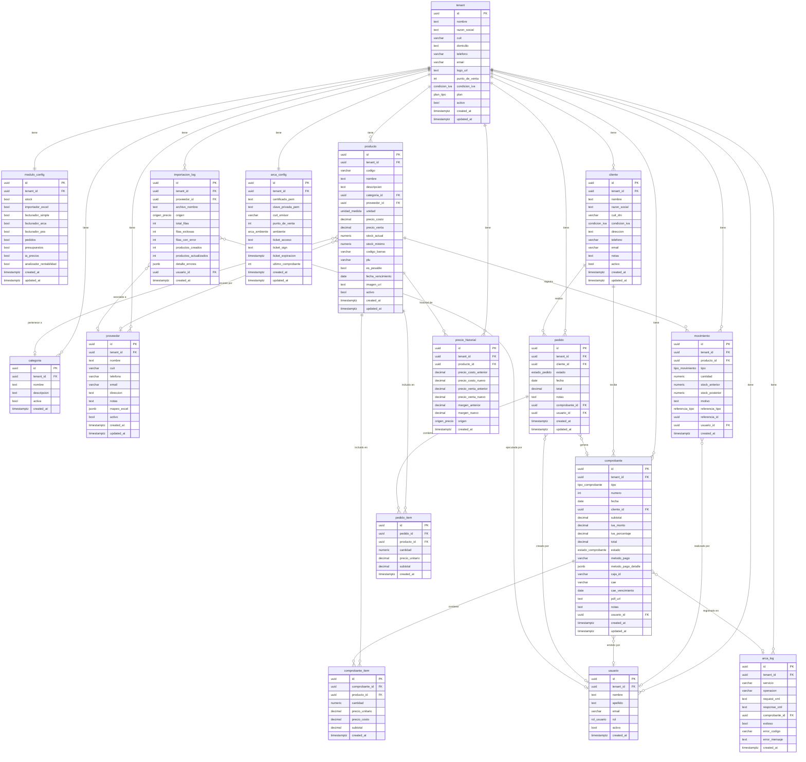

# Nexus — Base de datos

## Diagrama Entidad-Relación (ERD)



---

## ENUMs

| ENUM | Valores | Uso |
|---|---|---|
| `condicion_iva` | `responsable_inscripto`, `monotributista`, `exento`, `consumidor_final` | Condición fiscal del tenant (en `tenant.condicion_iva`) y del cliente (en `cliente.condicion_iva`). Determina qué tipo de comprobante se puede emitir (A, B o C) |
| `rol_usuario` | `admin`, `operador`, `visor` | Rol del usuario dentro del tenant. Controla permisos en la UI y en las API routes |
| `unidad_medida` | `unidad`, `kg`, `litro`, `metro`, `caja`, `pack`, `gramo`, `ml` | Unidad de medida del producto. Se muestra en la tabla de stock y en los comprobantes |
| `tipo_movimiento` | `entrada`, `salida`, `ajuste` | Tipo de movimiento de stock. `entrada` suma, `salida` resta, `ajuste` establece un valor absoluto |
| `referencia_tipo` | `factura`, `pedido`, `importacion`, `manual`, `ajuste_inventario` | Origen del movimiento. Permite trazar qué operación generó cada cambio de stock |
| `tipo_comprobante` | `factura_a`, `factura_b`, `factura_c`, `nota_credito_a`, `nota_credito_b`, `nota_credito_c`, `remito`, `presupuesto`, `ticket` | Tipo de comprobante fiscal o comercial. Determina la numeración, el layout del PDF y si requiere ARCA. `ticket` es no fiscal, con numeración propia y formato térmico |
| `estado_comprobante` | `borrador`, `emitido`, `pendiente_arca`, `error_arca`, `anulado` | Ciclo de vida del comprobante. `pendiente_arca` y `error_arca` solo aplican cuando el módulo ARCA está activo |
| `estado_pedido` | `borrador`, `confirmado`, `entregado`, `cancelado` | Ciclo de vida del pedido. `confirmado` reserva stock, `entregado` lo descuenta, `cancelado` libera la reserva |
| `plan_tipo` | `base`, `intermedio`, `completo` | Plan de suscripción del tenant. Determina qué módulos se habilitan en `modulo_config` y el tope de usuarios activos en app (solo `base`; ver `src/lib/limits.ts`) |
| `arca_ambiente` | `homologacion`, `produccion` | Ambiente ARCA del tenant. Homologación para testing, producción para facturas reales con CAE |
| `origen_precio` | `manual`, `importacion_excel`, `ia_pdf`, `lista_precios` | Origen de un cambio de precio. Se registra en `precio_historial` para trazabilidad |

---

## Descripción de cada tabla

### `tenant`
**Propósito:** Raíz del multi-tenancy. Cada registro representa un negocio/cliente de Nexus.

| Campo clave | Descripción |
|---|---|
| `id` | UUID, PK. Referenciado por todas las demás tablas como `tenant_id` |
| `cuit` | CUIT del negocio. Índice parcial (`WHERE cuit IS NOT NULL`). Usado en comprobantes fiscales |
| `punto_de_venta` | Número de punto de venta para la numeración de comprobantes (default 1) |
| `condicion_iva` | Determina qué tipos de factura puede emitir |
| `plan` | `base` o `completo`. Controla qué módulos se activan |
| `activo` | Soft delete. Si es `false`, el tenant está suspendido |
| `pos_prefs` | JSONB (`{}` por defecto). Preferencias del POS del negocio; normaliza la app (`src/lib/pos/prefs.ts`). Incluye entre otras claves `balanzaTemplates` (hasta dos plantillas opcionales del código de balanza con PLU + gramos; `balanzaTemplate` queda como compatibilidad), `posMostrarStock` para ocultar/mostrar cantidades de stock en `/facturacion/pos` y preferencias visuales del buscador/carrito (ver `docs/facturacion.md`). |
| `business_prefs` | (migración 118) JSONB (`{}` por defecto). Preferencias de negocio relacionadas con operación, catálogo e importación: `unificarProductosEntreProveedores`, `precioCostoSoloSube`, `registrarLotesPorIngreso`, `productosVariantesHabilitado`, `despieceCarniceriaHabilitado`, `mostrarResumenCierreCaja`. Normaliza la app (`src/lib/business-prefs/prefs.ts`). Cada sucursal puede tener un override en `sucursal.business_prefs` (NULL = heredar). |

**Índices:** `idx_tenant_cuit` (parcial sobre CUIT).
**Trigger:** `set_tenant_updated_at` — actualiza `updated_at` automáticamente via `moddatetime`.

---

### `modulo_config`
**Propósito:** Un registro por tenant. Controla qué módulos del sistema están habilitados.

| Campo clave | Descripción |
|---|---|
| `tenant_id` | FK a tenant, UNIQUE — exactamente un registro por tenant |
| `stock`, `importador_excel` | Siempre `true`, no se desactivan |
| `facturador_simple` | Habilitado en Plan Base y Completo |
| `facturador_arca` | Solo Plan Completo. Constraint: requiere `facturador_simple = true` |
| `facturador_pos` | POS con escáner. Constraint: requiere `facturador_simple = true`. Se activa con Plan Completo |
| `pedidos`, `presupuestos`, `ia_precios`, `analizador_rentabilidad` | Solo Plan Completo |
| `lector_facturas` | Lector de facturas con IA (Gemini). Default `false`; `activar_plan(..., 'completo')` lo activa. En la app, el menú y las APIs del lector también admiten acceso si `facturador_simple` está activo (ver `MODULOS_ACCESO_LECTOR_FACTURAS` en código y `docs/lector-facturas.md`) |

**Constraints:**
- `chk_arca_requiere_facturador` — no se puede activar ARCA sin el facturador simple.
- `chk_pos_requiere_facturador` — no se puede activar POS sin el facturador simple.
**Trigger:** `set_modulo_config_updated_at`.

---

### `usuario`
**Propósito:** Usuarios del sistema. La PK es el `id` de `auth.users` (Supabase Auth), lo que vincula la sesión con el perfil del tenant.

| Campo clave | Descripción |
|---|---|
| `id` | UUID, PK. Referencia a `auth.users(id)` — no se genera con uuid_generate_v4 |
| `tenant_id` | FK a tenant. Determina a qué negocio pertenece el usuario |
| `rol` | `admin`, `operador` o `visor`. Controla permisos |
| `activo` | Soft delete. Usuario desactivado no puede operar |

**Regla de negocio (aplicación):** en plan **`base`**, como máximo **`USUARIOS_MAX_PLAN_BASE`** usuarios activos por `tenant_id` (valor en `src/lib/limits.ts`, hoy **5**). En planes **`intermedio`** y **`completo`** no hay tope de usuarios en la app (`getUsuariosMaxPorPlan`). No está modelada como constraint SQL; la validación ocurre en `POST /api/configuracion/usuarios`, `POST /api/configuracion/usuarios/local` y `PATCH` de usuario (ver `src/lib/limits.ts`).

**Índices:** `idx_usuario_tenant`, `idx_usuario_email`.

---

### `categoria`
**Propósito:** Categorías de productos dentro de un tenant. Organización básica del catálogo.

| Campo clave | Descripción |
|---|---|
| `tenant_id` | FK a tenant |
| `nombre` | Nombre único dentro del tenant (índice UNIQUE parcial con `LOWER(nombre)` donde `activa = true`) |

**Índices:** `idx_categoria_tenant`, `idx_categoria_nombre_tenant` (unique parcial).

---

### `proveedor`
**Propósito:** Proveedores del tenant. Además de datos de contacto, almacena el perfil de mapeo Excel para importaciones futuras.

| Campo clave | Descripción |
|---|---|
| `activo` | Default `true`. Un proveedor **inactivo** no se usa en flujos operativos “del día a día” (p. ej. listado de proveedores en POS y catálogos que consumen `GET /api/proveedores` sin `estado=todos`). Sigue pudiéndose consultar por id, reactivar desde el detalle, y en pantallas que piden el listado completo (`?estado=todos`). **Al pasar a inactivo**, el trigger `proveedor_inactivo_desactiva_productos` (migración `069`) desactiva en bloque los **productos** del mismo `tenant_id` con `producto.proveedor_id = id` (no afecta filas que solo lo referencian en `producto_proveedor`). Reactivar el proveedor **no** reactiva esos productos. Ver `docs/stock.md` (CRUD de proveedores) |
| `mapeo_excel` | JSONB con el perfil de mapeo guardado: qué columna del Excel corresponde a qué campo del sistema. Permite reimportar sin configurar de nuevo |

**Estructura del `mapeo_excel`:**
```json
{
  "nombre_archivo_ejemplo": "lista_precios_marzo_2026.xlsx",
  "fila_header": 1,
  "mapeo": {
    "codigo": "COD ART",
    "nombre": "DESCRIPCION",
    "precio_costo": "COSTO",
    "precio_venta": "PVP",
    "stock_actual": null,
    "categoria": "RUBRO",
    "unidad": null
  },
  "columnas_ignoradas": ["OBSERVACIONES", "FOTO"],
  "ultima_importacion": "2026-04-10T14:30:00Z"
}
```

**Índices:** `idx_proveedor_tenant`.
**Triggers:** `set_proveedor_updated_at` (BEFORE UPDATE, `moddatetime`); `proveedor_inactivo_desactiva_productos` (AFTER UPDATE OF `activo`, migración `069`) — si `activo` pasa a `false`, ejecuta `UPDATE producto SET activo = false, updated_at = now()` filtrado por `proveedor_id` y `tenant_id` del registro.

---

### `producto`
**Propósito:** Catálogo de productos. Tabla central del sistema, referenciada por movimientos, comprobantes, pedidos e historial de precios.

| Campo clave | Descripción |
|---|---|
| `codigo` | Código del producto (SKU). Puede repetirse entre productos **activos** del mismo tenant (migración `054_producto_codigo_duplicado_permitido.sql`: se eliminó el índice único por código; hoy se usa un índice de búsqueda no único). En **importaciones**, el “match” con un producto existente es por **misma sucursal**, **mismo** `proveedor_id` (o ambos nulos) **y** el mismo `codigo` **y** el mismo `nombre` (comparado en el código de importación con `trim` + minúsculas) |
| `stock_actual` | Cantidad actual en stock (NUMERIC(12,3) para soportar decimales de productos pesables). Se actualiza atómicamente via `registrar_movimiento` |
| `stock_minimo` | Umbral de alerta (NUMERIC(12,3)). Cuando `stock_actual <= stock_minimo`, aparece en el dashboard |
| `unidad` | Unidad de medida del **inventario y ventas** (`unidad_medida`): todo movimiento se registra en esta unidad |
| `unidad_compra` | Opcional (`unidad_medida`). Presentación en la que suele llegar mercadería del proveedor (caja, pack…). Migración `096_producto_presentacion_compra.sql` |
| `contenido_unidad_compra` | Opcional NUMERIC(18,6). Cantidad de unidades de `unidad` (stock) que contiene **1** unidad de `unidad_compra`. Debe ser &gt; 0 si `unidad_compra` está seteada; si se anula la presentación, ambas columnas en `NULL` |
| `codigo_barras` | Código de barras EAN-13 (hasta 14 dígitos para ITF-14). Puede ser de fábrica o generado internamente con prefijo `20`. Nullable. **Unicidad:** el mismo código puede repetirse en productos activos del mismo tenant solo si **difieren en `proveedor_id`**; si `proveedor_id` es `NULL`, solo puede haber **un** producto activo con esa barra (índice parcial dedicado). En **API**, `POST /api/productos` rechaza crear un producto con barra y sin proveedor si **ya existe** cualquier otro activo con ese `codigo_barras` (hay que asignar proveedor antes de duplicar la barra) |
| `plu` | Price Look-Up, hasta 5 dígitos. Identificador que se configura en la balanza. Solo aplica a productos pesables. Nullable |
| `es_pesable` | Indica si el producto se vende por peso (balanza). Default false. Si true, la unidad debe ser `kg` o `gramo` |
| `fecha_vencimiento` | Opcional. Usada por alertas y listados de vencimiento próximo. Puede cargarse en alta/edición directa o **sincronizarse** desde lotes: el trigger en `producto_lote_ingreso` la iguala al **mínimo** `fecha_vencimiento` entre lotes con `cantidad` > 0 (ver sección `producto_lote_ingreso` y `docs/stock.md` — limitaciones al vender sin consumo de lote) |
| `imagen_url` | Nullable. URL pública de la miniatura del producto (WebP optimizado en Storage). No se edita por `PATCH` del producto: solo la setea el servidor al subir o quitar la foto vía `POST` / `DELETE` en `/api/productos/:id/imagen` (ver `docs/stock.md`) |

**Índices:**
- `idx_producto_codigo_tenant_lookup` — búsqueda/listados por `tenant` + `LOWER(codigo)` en activos (no único; migración `054`)
- `idx_producto_tenant` — listado general
- `idx_producto_categoria`, `idx_producto_proveedor` — filtros
- `idx_producto_nombre` — búsqueda full-text en español con `gin(to_tsvector('spanish', nombre))`
- `idx_producto_stock_bajo` — parcial, solo productos activos con stock bajo el mínimo
- `idx_producto_vencimiento` — parcial, solo productos activos con fecha de vencimiento
- `idx_producto_barcode_tenant_proveedor` — UNIQUE parcial sobre `(tenant_id, codigo_barras, proveedor_id)` WHERE `codigo_barras IS NOT NULL AND activo = true AND proveedor_id IS NOT NULL` (misma barra en distintos proveedores permitida)
- `idx_producto_barcode_tenant_sin_proveedor` — UNIQUE parcial sobre `(tenant_id, codigo_barras)` WHERE `codigo_barras IS NOT NULL AND activo = true AND proveedor_id IS NULL`
- `idx_producto_plu_tenant` — UNIQUE parcial sobre `(tenant_id, plu)` WHERE `plu IS NOT NULL AND activo = true`

**Constraints:**
- `chk_precios_positivos` — `precio_costo >= 0 AND precio_venta >= 0`
- `chk_stock_positivo` — `stock_actual >= 0`
- `chk_plu_requiere_pesable` — `plu IS NULL OR es_pesable = true`
- `chk_pesable_unidad` — `es_pesable = false OR unidad IN ('kg', 'gramo')`

**Triggers:** `set_producto_updated_at`. La desactivación en cascada por proveedor inactivo se aplica desde el trigger en tabla `proveedor` (no hay trigger adicional en `producto`).

**Storage (imágenes de producto):** bucket público `producto-imagenes` (migración `062_producto_imagenes_storage.sql`). Objeto canónico por producto: `{tenant_id}/{producto_id}/preview.webp`. Políticas RLS: lectura pública; escritura/borrado solo si la primera carpeta del path coincide con `current_tenant_id()` (mismo criterio que `tenant-logos`). Procesamiento en API con **sharp**: redimensionado máx. 256 px, salida WebP.

---

### `precio_sucursal`
**Propósito:** Override opcional de precio por producto y sucursal. Si no hay fila, rigen `producto.precio_costo`, `producto.precio_venta` y `producto.porcentaje_ganancia`.

| Campo clave | Descripción |
|---|---|
| `producto_id`, `sucursal_id` | Par único del override. |
| `precio_costo`, `precio_venta` | Overrides opcionales de costo/PVP. NULL hereda del producto. |
| `porcentaje_ganancia` | (migración 146) Ganancia propia de la sucursal. Si tiene valor, el PVP de la fila se calcula desde costo efectivo + ganancia + IVA; si es NULL, un `precio_venta` existente se trata como precio manual legacy. |

**Constraint:** `chk_precio_sucursal_positivo`, `chk_precio_sucursal_ganancia_nonneg`.
**Índices:** `idx_precio_sucursal_tenant`, `uk_precio_sucursal_producto_sucursal`.

---

### `movimiento`
**Propósito:** Registro inmutable de cada cambio de stock. Cada movimiento graba el stock anterior y posterior para trazabilidad completa.

| Campo clave | Descripción |
|---|---|
| `tipo` | `entrada` (suma), `salida` (resta) o `ajuste` (establece valor) |
| `stock_anterior`, `stock_posterior` | Snapshot del stock antes y después del movimiento |
| `referencia_tipo` + `referencia_id` | Par polimórfico que vincula el movimiento a su origen (factura, pedido, importación, etc.) |
| `proveedor_id` | (migración 120) Proveedor que originó la entrada cuando aplica (importación, factura recibida, compra). NULL en ventas/ajustes/transferencias. |

**Constraint:** `chk_cantidad_positiva` — `cantidad > 0`.
**Índices:** `idx_movimiento_tenant`, `idx_movimiento_producto`, `idx_movimiento_fecha` (desc), `idx_movimiento_referencia` (parcial), `idx_movimiento_proveedor` (parcial).

---

### `producto_lote_ingreso`
**Propósito:** (migración 119) Cada ingreso de stock por importación, factura recibida, alta manual o POS al vuelo deja un lote con cantidad, vencimiento, costo y proveedor del ingreso. Permite que un producto unificado tenga varios vencimientos coexistentes (uno por proveedor / por importación).

| Campo clave | Descripción |
|---|---|
| `producto_id`, `sucursal_id`, `proveedor_id` | Lote asociado a producto/sucursal/proveedor (proveedor nullable). |
| `cantidad`, `fecha_vencimiento`, `precio_costo` | Datos del lote en sí. |
| `origen` | `importacion`, `lector_facturas`, `manual`, `pos`, `comprobante_compra`. |
| `importacion_log_id`, `lector_factura_log_id`, `movimiento_id` | Trazas hacia el origen del ingreso. |

**Trigger:** `trg_producto_lote_refresh_vencimiento_aiu` mantiene `producto.fecha_vencimiento` igual al `MIN(fecha_vencimiento)` de los lotes vivos (cantidad > 0). Si no hay lotes vivos con vencimiento, **no** modifica `producto.fecha_vencimiento` (puede quedar la fecha que venía del maestro).
**Función:** `public.fecha_vencimiento_proxima_lote(producto_id)` devuelve la fecha más próxima.
**Índices:** `idx_producto_lote_tenant_producto`, `idx_producto_lote_tenant_producto_vencimiento` (parcial), `idx_producto_lote_tenant_proveedor` (parcial), `idx_producto_lote_movimiento` (parcial).

**Comportamiento operativo (importante para soporte):** el trigger corre **sólo** al insertar/actualizar/borrar filas en esta tabla; **no** al pasar el tiempo ni al registrar **ventas** en `registrar_movimiento`. La **`cantidad`** del lote **no** se descuenta automáticamente al vender; por tanto el “segundo” vencimiento **no** reemplaza al primero en `producto.fecha_vencimiento` hasta que los datos de lote reflejen que el lote más próximo ya no aporta stock (p. ej. `cantidad` en 0 o borrado). Detalle y ejemplos en `docs/stock.md` («Alertas vs. varios lotes»).

---

### `cliente`
**Propósito:** Clientes del tenant. Se referencia en comprobantes y pedidos.

| Campo clave | Descripción |
|---|---|
| `condicion_iva` | Determina qué tipo de factura recibe (A si es RI, B si es CF/monotributista, C si el emisor es monotributista) |
| `cuit_dni` | CUIT o DNI según la condición fiscal |

**Índices:** `idx_cliente_tenant`, `idx_cliente_cuit` (parcial).
**Trigger:** `set_cliente_updated_at`.

---

### `comprobante`
**Propósito:** Facturas, notas de crédito, remitos y presupuestos. Un comprobante tiene items y puede tener datos de ARCA.

| Campo clave | Descripción |
|---|---|
| `tipo` + `numero` | Par único dentro del tenant (índice UNIQUE). La numeración es secuencial por tipo via `siguiente_numero_comprobante`. El tipo `ticket` tiene su propia secuencia |
| `estado` | Ciclo de vida: `borrador` → `emitido` → (opcionalmente `pendiente_arca` → `emitido` con CAE, o `error_arca`) |
| `metodo_pago` | Método de pago del comprobante: efectivo, debito, credito, transferencia, mixto. Nullable (no aplica a presupuestos/remitos) |
| `metodo_pago_detalle` | JSONB con desglose de montos por método para pagos mixtos. Nullable |
| `caja_id` | Identificador de la terminal/caja POS. Nullable, reservado para múltiples cajas (v6.1) |
| `cae`, `cae_vencimiento` | Solo se llenan si el comprobante se aprobó en ARCA |
| `pdf_url` | URL en Supabase Storage del PDF generado |
| `descuento_global_pct`, `recargo_global_pct` | Ajuste comercial global sobre el bruto de ítems (0–100), ver `docs/facturacion.md` |
| `descuento_global_monto`, `recargo_global_monto` | Montos fijos de ajuste global (≥ 0) |
| `imp_trib_comercial` | Importe informado como ImpTrib (tributo 99) por recargos comerciales globales; sumable al recargo por medio de pago en WSFE |

**Migración:** `063_comprobante_descuentos_recargos.sql` (constraints y comentarios en columnas).

**Índices:** `idx_comprobante_numero` (unique), `idx_comprobante_tenant`, `idx_comprobante_cliente`, `idx_comprobante_fecha` (desc), `idx_comprobante_estado`.
**Trigger:** `set_comprobante_updated_at`.

---

### `comprobante_item`
**Propósito:** Items de un comprobante. Cada fila es un producto con cantidad, precio de venta y costo capturado al momento de emitir para permitir análisis de margen real.

| Campo clave | Descripción |
|---|---|
| `precio_costo` | Snapshot del costo del producto al momento de emitir. Se usa para rentabilidad histórica y no debe recalcularse retrospectivamente |
| `descuento_manual_pct`, `recargo_manual_pct` | Descuento/recargo manual 0–100 % sobre el precio unitario **después** de promociones (`063_comprobante_descuentos_recargos.sql`) |

**Constraint:** `chk_item_positivo` — `cantidad > 0 AND precio_unitario >= 0 AND subtotal >= 0`.
**Índice:** `idx_comprobante_item_comprobante`.

---

### `pedido`
**Propósito:** Pedidos de clientes. Tienen un ciclo de vida con estados y pueden convertirse en factura.

| Campo clave | Descripción |
|---|---|
| `estado` | `borrador` → `confirmado` (reserva stock) → `entregado` (descuenta stock) o `cancelado` (libera reserva) |
| `comprobante_id` | FK al comprobante generado cuando el pedido se convierte a factura |

**Índices:** `idx_pedido_tenant`, `idx_pedido_cliente`, `idx_pedido_estado`, `idx_pedido_fecha` (desc).
**Trigger:** `set_pedido_updated_at`.

---

### `pedido_item`
**Propósito:** Items de un pedido. Misma estructura que `comprobante_item`.

**Constraint:** `chk_pedido_item_positivo`.
**Índice:** `idx_pedido_item_pedido`.

---

### `importacion_log`
**Propósito:** Registro de cada importación de datos (Excel, CSV o IA). Guarda métricas y errores detallados.

| Campo clave | Descripción |
|---|---|
| `origen` | `manual`, `importacion_excel` o `ia_pdf` |
| `detalle_errores` | JSONB con array de errores: `{ fila, campo, valor_original, error }` |

**Estructura del `detalle_errores`:**
```json
[
  {
    "fila": 3,
    "campo": "precio_venta",
    "valor_original": "abc",
    "error": "El precio debe ser un número válido"
  }
]
```

**Índices:** `idx_importacion_tenant`, `idx_importacion_fecha` (desc).

---

### `precio_historial`
**Propósito:** Registro de cada cambio de precio de un producto. Permite ver la evolución y calcular márgenes.

| Campo clave | Descripción |
|---|---|
| `precio_costo_anterior/nuevo` | Precio de costo antes y después del cambio |
| `precio_venta_anterior/nuevo` | Precio de venta antes y después del cambio |
| `margen_anterior/nuevo` | Porcentaje de margen calculado |
| `origen` | Qué generó el cambio: edición manual, importación Excel, extracción IA o aplicación de una lista persistida |

**Índices:** `idx_precio_historial_producto` (desc), `idx_precio_historial_tenant` (desc).

---

## Extensiones v5.0 — Analizador de rentabilidad

### Nuevas tablas

| Tabla | Propósito |
|---|---|
| `lista_precios` | Documento persistente de una lista de proveedor cargada por el usuario, con su estado, origen y métricas globales |
| `lista_precios_item` | Items extraídos de la lista, con matching, análisis y decisión del usuario |
| `producto_proveedor` | Relación N:N entre productos y proveedores para conservar costos alternativos e historial comparativo |
| `cuenta_corriente` | Saldo consolidado por cliente |
| `pago` | Pagos registrados contra cuenta corriente o comprobantes |
| `cierre_mensual` | Snapshot/cache de métricas de rentabilidad por período |
| `radar_inflacion` | Agregados cross-tenant anonimizados para tendencias de inflación por rubro/proveedor |

### Ajustes sobre tablas existentes

- `modulo_config` agrega `analizador_rentabilidad`
- `comprobante_item` agrega `precio_costo`
- `precio_historial.origen` incorpora `lista_precios`
- `proveedor.descuento_pct` (NUMERIC(5,2), default 0): descuento estándar acordado; usado como default al **analizar/aplicar** listas de precios del analizador (migración `083`)
- `lista_precios.descuento_proveedor_pct_aplicado` (NUMERIC(5,2), nullable): **snapshot** del % de descuento usado al pasar la lista a estado `aplicada_total` / `aplicada_parcial`; independiente de futuros cambios en `proveedor.descuento_pct` (migración `083`)

### Notas de diseño

- `lista_precios` es una entidad persistente para permitir comparación temporal y auditoría.
- `lista_precios_item.producto_id` puede ser `NULL` hasta que el matching se confirme.
- `producto_proveedor` no reemplaza `producto.proveedor_id`; modela alternativas de abastecimiento.
- `radar_inflacion` no usa `tenant_id`; se protege con policies especiales para lectura y contribución autenticada.

---

## Extensiones v6.0 — POS con escáner

### Ajustes sobre tablas existentes

| Tabla | Cambio | Detalle |
|---|---|---|
| `producto` | Nuevas columnas | `codigo_barras` VARCHAR(14), `plu` VARCHAR(5), `es_pesable` BOOLEAN DEFAULT false |
| `producto` | Nuevos índices | UNIQUE parciales sobre código de barras (por `proveedor_id` y caso sin proveedor) y sobre `(tenant_id, plu)` — ver migración `047` para el ajuste de barras |
| `producto` | Nuevos constraints | `chk_plu_requiere_pesable`, `chk_pesable_unidad` |
| `producto` | Tipo de columna | `stock_actual` y `stock_minimo` de INTEGER a NUMERIC(12,3) |
| `movimiento` | Tipo de columna | `cantidad`, `stock_anterior`, `stock_posterior` de INTEGER a NUMERIC(12,3) |
| `comprobante_item` | Tipo de columna | `cantidad` de INTEGER a NUMERIC(12,3) |
| `pedido_item` | Tipo de columna | `cantidad` de INTEGER a NUMERIC(12,3) |
| `comprobante` | Nuevas columnas | `metodo_pago` VARCHAR(20), `metodo_pago_detalle` JSONB, `caja_id` VARCHAR(20) |
| `modulo_config` | Nueva columna | `facturador_pos` BOOLEAN DEFAULT false |
| `modulo_config` | Nuevo constraint | `chk_pos_requiere_facturador` |
| `tipo_comprobante` | Nuevo valor ENUM | `ticket` |

### Notas de diseño

- El cambio de INTEGER a NUMERIC(12,3) es la modificación más invasiva: toca 4 tablas core y la función `registrar_movimiento`. Es necesaria para soportar productos pesables.
- `codigo_barras`, `plu` y `es_pesable` son ortogonales: un producto puede tener cualquier combinación.
- Código de barras compartido entre artículos: la BD permite la misma barra en **distintos** `proveedor_id`; `GET /api/productos/buscar-por-barcode` acepta `proveedor_id` opcional. Sin `proveedor_id` y con varios candidatos, responde **409** con cuerpo `{ ambiguous: true, tipo, peso? (balanza), productos[] }` (filas completas con relación `proveedor`). El POS abre un **modal** para elegir el artículo; con filtro de proveedor (`GET /api/pos/proveedores` + estado en pantalla) suele resolverse en una sola fila. Alta vía `POST /api/productos`: si la barra ya existe en el tenant y el nuevo producto va **sin** proveedor, la API responde **400** hasta que se asigne proveedor.
- El tipo `ticket` no es fiscal (no va a ARCA) y tiene numeración secuencial propia por tenant.
- `metodo_pago` se usa para reportes e impresión, no afecta cálculos de totales.
- `caja_id` queda nullable y reservada para v6.1 (múltiples terminales).

---

## Extensiones v14.0 — WhatsApp agéntico (identidad + OTP)

### Nuevas tablas

| Tabla | Propósito |
|---|---|
| `whatsapp_actor` | Vincula el número de WhatsApp del remitente (`from_wa_id`) con un `usuario` del tenant y su nivel de confianza (`trust_level`) para operar por chat |
| `whatsapp_auth_challenge` | Guarda el desafío OTP para verificar un número antes de habilitar consultas/acciones sensibles |
| `whatsapp_action_log` | Auditoría de acciones por WhatsApp con doble confirmación e idempotencia (`action_signature`) |
| `whatsapp_agent_feature_flag` | Feature flag por tenant para habilitar/deshabilitar el piloto agéntico sin impactar otros comercios |

### `whatsapp_actor`

**Propósito:** identificar quién escribe por WhatsApp dentro del tenant (owner/admin/operador) y su estado de confianza.

| Campo clave | Descripción |
|---|---|
| `tenant_id`, `usuario_id` | Contexto de negocio y usuario vinculado |
| `from_wa_id` | Número origen de WhatsApp (formato wa id) |
| `rol_whatsapp` | Rol operativo en el canal |
| `trust_level` | `verified`, `unverified`, `blocked` |
| `activo` | Binding vigente |
| `replaced_by_actor_id` | Trazabilidad al actor nuevo cuando cambia el número |

**Restricción principal:** índice único parcial `uq_whatsapp_actor_active_from_wa` para evitar más de un actor activo por `(tenant_id, from_wa_id)`.

### `whatsapp_auth_challenge`

**Propósito:** controlar el flujo OTP de verificación sin almacenar códigos en claro.

| Campo clave | Descripción |
|---|---|
| `otp_hash`, `otp_salt` | Material criptográfico del OTP (no persistir código plano) |
| `expires_at` | Vencimiento del challenge |
| `attempt_count`, `max_attempts` | Control de intentos fallidos |
| `resend_count` | Control de reenvíos |
| `blocked_until` | Ventana de bloqueo temporal por abuso |
| `status` | `pending`, `verified`, `expired`, `blocked`, `cancelled` |
| `verified_at` | Timestamp de verificación exitosa |

### `whatsapp_action_log`

**Propósito:** registrar acciones transaccionales disparadas por WhatsApp con confirmación explícita.

| Campo clave | Descripción |
|---|---|
| `action_type` | Acción de negocio (ej.: `proveedor_pago_directo`) |
| `action_status` | `pending_confirmation`, `executed`, `cancelled`, `error` |
| `action_signature` | Firma SHA-256 canónica para idempotencia por tenant |
| `confirmation_token` | Código corto para segunda confirmación del usuario |
| `confirmation_expires_at` | Límite temporal para confirmar |
| `action_payload` | Parámetros de la acción (snapshot) |
| `result_payload` | Resultado de la ejecución (snapshot) |
| `inbound_message_id` | Mensaje que originó o confirmó la acción |

### `whatsapp_agent_feature_flag`

**Propósito:** controlar rollout del canal agéntico por tenant.

| Campo clave | Descripción |
|---|---|
| `enabled` | Activa/desactiva el motor de consultas/acciones por WhatsApp |
| `rollout_stage` | Etapa operativa (`disabled`, `pilot`, etc.) |
| `notes` | Notas operativas para soporte o seguimiento |

### Política de cambio de número (v14)

1. No migrar el binding activo en caliente.
2. Crear nuevo `whatsapp_actor` con `trust_level=unverified`.
3. Verificar OTP en `whatsapp_auth_challenge`.
4. Marcar actor anterior como `activo=false` y enlazar `replaced_by_actor_id`.

### Parámetros OTP definidos por contrato

- Expiración: **10 minutos**
- Máximo intentos: **5**
- Bloqueo tras exceder intentos: **15 minutos**
- Reenvíos máximos: **3** en ventana de **30 minutos**

### RLS

Se habilita RLS para ambas tablas con policy de lectura por tenant:

- `whatsapp_actor_tenant_select`
- `whatsapp_auth_challenge_tenant_select`

Ambas usan `tenant_id = public.current_tenant_id()`.

---

### `arca_config`
**Propósito:** Configuración de ARCA por tenant. Almacena certificados (encriptados), tickets de acceso y estado del último comprobante.

| Campo clave | Descripción |
|---|---|
| `certificado_pem`, `clave_privada_pem` | Certificado y clave privada para firmar Token Requests de WSAA. Se almacenan encriptados con `ARCA_ENCRYPTION_KEY` |
| `ambiente` | `homologacion` para testing, `produccion` para facturas reales |
| `ticket_acceso`, `ticket_sign`, `ticket_expiracion` | Token de WSAA vigente. Se renueva automáticamente antes de cada operación si expiró |
| `ultimo_comprobante` | Último número de comprobante emitido en ARCA, para sincronización |

**Trigger:** `set_arca_config_updated_at`.

---

### `arca_log`
**Propósito:** Log de todas las interacciones con ARCA. Para debugging y auditoría.

| Campo clave | Descripción |
|---|---|
| `servicio` | `WSAA` o `WSFE` |
| `operacion` | Nombre de la operación (`LoginCms`, `FECAESolicitar`, etc.) |
| `request_xml`, `response_xml` | XMLs completos enviados y recibidos |
| `exitoso` | Si la operación fue exitosa |
| `error_codigo`, `error_mensaje` | Código y descripción del error de ARCA |

**Índices:** `idx_arca_log_tenant` (desc), `idx_arca_log_comprobante` (parcial).

---

## Funciones SQL

### `registrar_movimiento`

Registra un movimiento de stock y actualiza `producto.stock_actual` en una sola transacción atómica. Usa `FOR UPDATE` para prevenir condiciones de carrera.

```sql
CREATE OR REPLACE FUNCTION registrar_movimiento(
  p_tenant_id       UUID,
  p_producto_id     UUID,
  p_tipo            tipo_movimiento,
  p_cantidad        NUMERIC(12,3),
  p_motivo          TEXT DEFAULT NULL,
  p_referencia_tipo referencia_tipo DEFAULT NULL,
  p_referencia_id   UUID DEFAULT NULL,
  p_usuario_id      UUID DEFAULT NULL
) RETURNS movimiento AS $$
DECLARE
  v_stock_anterior  NUMERIC(12,3);
  v_stock_posterior NUMERIC(12,3);
  v_movimiento      movimiento;
BEGIN
  -- Bloquea la fila del producto para evitar race conditions
  SELECT stock_actual INTO v_stock_anterior
  FROM producto
  WHERE id = p_producto_id AND tenant_id = p_tenant_id
  FOR UPDATE;

  IF NOT FOUND THEN
    RAISE EXCEPTION 'Producto no encontrado: %', p_producto_id;
  END IF;

  CASE p_tipo
    WHEN 'entrada' THEN
      v_stock_posterior := v_stock_anterior + p_cantidad;
    WHEN 'salida' THEN
      v_stock_posterior := v_stock_anterior - p_cantidad;
      IF v_stock_posterior < 0 THEN
        RAISE EXCEPTION 'Stock insuficiente. Actual: %, solicitado: %',
          v_stock_anterior, p_cantidad;
      END IF;
    WHEN 'ajuste' THEN
      v_stock_posterior := p_cantidad;
  END CASE;

  UPDATE producto
  SET stock_actual = v_stock_posterior, updated_at = NOW()
  WHERE id = p_producto_id AND tenant_id = p_tenant_id;

  INSERT INTO movimiento (
    tenant_id, producto_id, tipo, cantidad,
    stock_anterior, stock_posterior,
    motivo, referencia_tipo, referencia_id, usuario_id
  ) VALUES (
    p_tenant_id, p_producto_id, p_tipo, p_cantidad,
    v_stock_anterior, v_stock_posterior,
    p_motivo, p_referencia_tipo, p_referencia_id, p_usuario_id
  ) RETURNING * INTO v_movimiento;

  RETURN v_movimiento;
END;
$$ LANGUAGE plpgsql SECURITY DEFINER;
```

> **Nota v6.0:** Los tipos de `p_cantidad`, `v_stock_anterior` y `v_stock_posterior` cambiaron de INTEGER a NUMERIC(12,3) para soportar productos pesables con cantidades decimales (ej: 0.450 kg de manzanas).

**Comportamiento por tipo:**
- `entrada`: suma `p_cantidad` al stock actual.
- `salida`: resta `p_cantidad`. Si el resultado es negativo, lanza excepción `Stock insuficiente`.
- `ajuste`: establece `stock_actual = p_cantidad` (valor absoluto, no delta).

**Seguridad:** `SECURITY DEFINER` permite que la función opere con privilegios elevados para bypasear RLS internamente, ya que recibe `p_tenant_id` como parámetro explícito.

---

### `siguiente_numero_comprobante`

Obtiene el próximo número de comprobante para un tenant y tipo dado.

```sql
CREATE OR REPLACE FUNCTION siguiente_numero_comprobante(
  p_tenant_id UUID,
  p_tipo      tipo_comprobante
) RETURNS INTEGER AS $$
DECLARE
  v_siguiente INTEGER;
BEGIN
  SELECT COALESCE(MAX(numero), 0) + 1 INTO v_siguiente
  FROM comprobante
  WHERE tenant_id = p_tenant_id AND tipo = p_tipo;

  RETURN v_siguiente;
END;
$$ LANGUAGE plpgsql SECURITY DEFINER;
```

**Atomicidad:** esta función debe llamarse dentro de la misma transacción que inserta el comprobante. El índice UNIQUE `idx_comprobante_numero(tenant_id, tipo, numero)` previene duplicados si dos usuarios intentan emitir al mismo tiempo — uno de los dos recibirá un error de constraint y debe reintentar.

---

## Extensiones PostgreSQL requeridas

| Extensión | Propósito |
|---|---|
| `uuid-ossp` | Genera UUIDs v4 para las PKs de todas las tablas (`uuid_generate_v4()`) |
| `pgcrypto` | Funciones criptográficas. Usado para encriptar/desencriptar certificados ARCA en la DB |
| `moddatetime` | Trigger helper que actualiza automáticamente campos `updated_at` en cada UPDATE |

```sql
CREATE EXTENSION IF NOT EXISTS "uuid-ossp";
CREATE EXTENSION IF NOT EXISTS "pgcrypto";
CREATE EXTENSION IF NOT EXISTS "moddatetime";
```

Estas extensiones se habilitan en la migración `001_enums.sql` antes de cualquier otra operación.

---

## Orden de ejecución de migraciones

Las migraciones se ejecutan en orden estricto. Cada una depende de las anteriores. El bloque base documenta `001` a `012`; el bloque de analizador extiende el roadmap con `017` a `022`.

| # | Archivo | Contenido | Depende de |
|---|---|---|---|
| 001 | `001_enums.sql` | Extensiones (`uuid-ossp`, `pgcrypto`, `moddatetime`) + todos los tipos ENUM | Nada |
| 002 | `002_tenant.sql` | Tabla `tenant` con trigger `updated_at` e índice sobre CUIT | 001 (enums `condicion_iva`, `plan_tipo`) |
| 003 | `003_usuario.sql` | Tabla `usuario` con FK a `tenant` y `auth.users` | 002 (tabla `tenant`), 001 (enum `rol_usuario`) |
| 004 | `004_producto.sql` | Tablas `categoria`, `proveedor`, `producto` con triggers, índices y constraints | 002, 001 (`unidad_medida`) |
| 005 | `005_movimiento.sql` | Tabla `movimiento` con índices y constraint de cantidad positiva | 004 (`producto`), 003 (`usuario`), 001 (`tipo_movimiento`, `referencia_tipo`) |
| 006 | `006_facturacion.sql` | Tablas `cliente`, `comprobante`, `comprobante_item` con triggers e índices | 002, 003, 004, 001 (`tipo_comprobante`, `estado_comprobante`, `condicion_iva`) |
| 007 | `007_pedidos.sql` | Tablas `pedido`, `pedido_item` con triggers e índices | 006 (`comprobante`), 004 (`producto`), 003 (`usuario`), 001 (`estado_pedido`) |
| 008 | `008_importacion.sql` | Tabla `importacion_log` | 002, 004 (`proveedor`), 003, 001 (`origen_precio`) |
| 009 | `009_precios.sql` | Tabla `precio_historial` | 004 (`producto`), 001 (`origen_precio`) |
| 010 | `010_arca.sql` | Tablas `arca_config`, `arca_log` | 002, 006 (`comprobante`), 001 (`arca_ambiente`) |
| 011 | `011_rls.sql` | `ENABLE ROW LEVEL SECURITY` + policies SELECT/INSERT/UPDATE/DELETE en las 16 tablas. Función `auth.tenant_id()` y `custom_access_token_hook` | Todas las tablas (002-010) |
| 012 | `012_funciones.sql` | Funciones `registrar_movimiento` y `siguiente_numero_comprobante` | 004, 005, 006 |
| 017 | `017_lista_precios.sql` | Tablas `lista_precios` y `lista_precios_item` con matching y métricas de análisis | 004, 008, 009 |
| 018 | `018_producto_proveedor.sql` | Tabla `producto_proveedor` para costos alternativos por proveedor | 004, 017 |
| 019 | `019_cuenta_corriente.sql` | Tablas `cuenta_corriente`, `pago` y función `registrar_pago` | 006 |
| 020 | `020_cierre_mensual.sql` | Tabla `cierre_mensual` para snapshots mensuales de rentabilidad | 006, 009, 019 |
| 021 | `021_radar_inflacion.sql` | Tabla `radar_inflacion` y función `contribuir_radar` | 017, 018 |
| 022 | `022_flag_analizador.sql` | Columna `analizador_rentabilidad` en `modulo_config` y actualización de `activar_plan` | 002, 017, 018, 021 |
| 024 | `024_producto_barcode.sql` | Columnas `codigo_barras`, `plu`, `es_pesable` en `producto` con índices UNIQUE parciales (barra única por tenant en la versión inicial) y CHECK constraints | 004 |
| 025 | `025_cantidad_decimal.sql` | Migrar `cantidad` de INTEGER a NUMERIC(12,3) en `movimiento`, `comprobante_item`, `pedido_item`, `producto`; actualizar `registrar_movimiento` | 004, 005, 006, 007, 012 |
| 026 | `026_facturador_pos.sql` | Columna `facturador_pos` en `modulo_config`, CHECK constraint, actualización de `activar_plan` | 002, 022 |
| 027 | `027_pos_comprobante.sql` | Valor `ticket` en ENUM `tipo_comprobante`, columnas `metodo_pago`, `metodo_pago_detalle`, `caja_id` en `comprobante` | 006 |
| 041 | `041_comprobante_numero_orden.sql` | Orden de venta interna por tenant; enlaza ticket y factura fiscal del mismo cobro | 006 |
| 042 | `042_mp_point.sql` | Mercado Pago Point: tablas/config POS | 006 |
| 043 | `043_usuario_rls_select_self.sql` | RLS: el usuario puede leer su propia fila en `usuario` | 003, 011 |
| 044 | `044_cobranza_factura.sql` | Cobranza por factura (`cobranza_factura`, etc.) | 006, 019 |
| 045 | `045_recibo_tipo_y_cobranza_pago.sql` | Tipo comprobante `recibo`, ajustes cobranza/pagos | 044 |
| 046 | `046_lector_facturas_fase1.sql` | Lector de facturas IA: `lector_factura_log`, flag `lector_facturas`, `importado`, `tipo_operacion`/`proveedor_id` en `comprobante`, CC proveedor, bucket `facturas-recibidas`, `activar_plan` | 020, 026, 030, 006 |
| 047 | `047_producto_barcode_por_proveedor.sql` | Reemplaza la unicidad global de `codigo_barras` por dos índices parciales: uno con `(tenant_id, codigo_barras, proveedor_id)` si hay proveedor, otro con `(tenant_id, codigo_barras)` si `proveedor_id IS NULL` | 004, 024 |
| 062 | `062_producto_imagenes_storage.sql` | Bucket Storage `producto-imagenes` (público) + policies RLS por tenant; miniaturas para POS | 030 (políticas Storage con `current_tenant_id`) |
| 083 | `083_proveedor_descuento_lista_precios_snapshot.sql` | `proveedor.descuento_pct`; `lista_precios.descuento_proveedor_pct_aplicado` (snapshot al aplicar lista) | 004, 017 |

### Comando para ejecutar

```bash
npx supabase db push
```

Supabase CLI lee los archivos de `supabase/migrations/` en orden alfabético (por eso la numeración 001-022) y ejecuta los que aún no se hayan aplicado.
