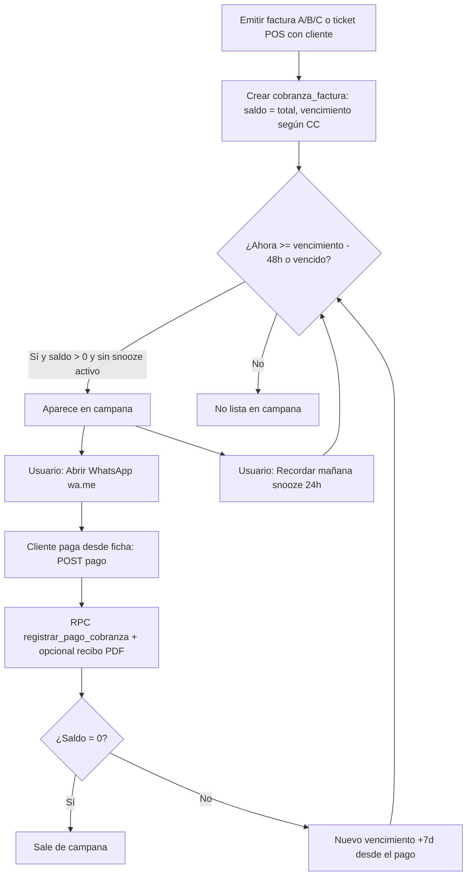

# Nexus — Cobranza por factura y campana WhatsApp (`wa.me`)

## Cuenta corriente distribuidora (configuración opt-in)

Funcionalidades opcionales para mayoristas (por **sucursal** y **caja**; todo desactivado por defecto):

| Preferencia (sucursal) | Efecto |
|------------------------|--------|
| `permitirAjustesPorCaja` | Habilita toggles por caja en Cierre de caja → Cajas del negocio |
| `panelMovimientosDia` | Panel «Movimientos del día» en ficha cliente + badge en listado |
| `permitirLiquidacionItemsDia` | Editar precios de tickets/facturas B-C CC del mismo día (sin CAE) |

| Preferencia (caja) | Efecto |
|--------------------|--------|
| `ticketOcultarImportes` | Ticket térmico en venta **cuenta corriente** sin precios ni totales (solo cantidades y descripción) |

**Activación:** Configuración → Preferencias de negocio → **Por sucursal** → bloque «Cuenta corriente — sucursal distribuidora»; luego Cierre de caja → **Cajas del negocio** → marcar la caja que despacha a CC.

**Persistencia:** al emitir, `metodo_pago_detalle.ticket_ocultar_importes` en el comprobante para reimpresiones coherentes.

**Movimientos del día (Fase B):** con `panelMovimientosDia` activo en la sucursal operativa, la ficha del cliente muestra cargos CC del día (líneas, totales, saldo) y el listado `/cuenta-corriente` muestra «N cargos hoy». API: `GET /api/clientes/[id]/cuenta-corriente/movimientos-dia?sucursal_id=` y `GET /api/cuenta-corriente/cargos-hoy?sucursal_id=`. Fecha calendario en `America/Argentina/Buenos_Aires`.

**Liquidación del día (Fase C):** con `permitirLiquidacionItemsDia` (y panel del día), se pueden editar precios unitarios de tickets / facturas B-C del mismo día sin CAE. `PATCH /api/clientes/[id]/cuenta-corriente/liquidar-items` recalcula totales, `cobranza_factura` y saldo de cuenta corriente. No permite bajar el total por debajo de lo ya cobrado en esa factura.

**Extracto (Fase D):** reporte de movimientos CC por cliente (cargos, NC, pagos) con saldo inicial/final y saldo corrido. Ficha cliente y **Reportes → Extracto cuenta corriente**. API: `GET /api/clientes/[id]/cuenta-corriente/extracto` y `GET /api/reportes/extracto-cuenta-corriente?cliente_id=` (parámetros `periodo`, `desde`/`hasta`, `sucursal_id`, `export=csv`). Requiere módulo `facturador_simple`.

**Edición desde extracto:** en `/cuenta-corriente/[id]`, filas con ícono de lápiz (no visor). **Pagos:** `PATCH /api/clientes/[id]/cuenta-corriente/pagos/[pagoId]` (RPC `actualizar_pago_cliente_extracto`). **Cargos del día** (ticket / factura B-C sin CAE, CC): mismas reglas que liquidación — `GET .../comprobantes/[comprobanteId]/liquidacion` y `PATCH .../liquidar-items`. Requiere `permitirLiquidacionItemsDia` en la sucursal del comprobante.

**Pruebas:** checklist manual en [`docs/qa-cuenta-corriente-distribuidora.md`](qa-cuenta-corriente-distribuidora.md); tests unitarios en `src/test/*cc*` y `cuenta-corriente-distribuidora.test.ts`.

## Visión

Por cada **factura A/B/C** o **ticket POS** emitido **con cliente** se puede crear y mantener un registro de **cobranza** (`cobranza_factura`) con saldo al total y vencimiento según las **condiciones de cuenta corriente** del cliente. Los pagos parciales bajan el saldo, renuevan el vencimiento (+7 días) y se sincronizan con **cuenta corriente** vía `registrar_pago`. La **campana** del dashboard lista deudas en **ventana de 48 h antes del vencimiento** o **vencidas**, con botón para abrir **WhatsApp** con mensaje prearmado (`wa.me`, sin API de pago).

Los **tickets** quedan alineados con el mismo modelo: al emitir venta a cliente, `emitirComprobante` inserta en `cobranza_factura` cuando el tipo compone deuda (facturas fiscales o `ticket`); el helper de dominio es **`comprobanteGeneraRegistroCobranzaVenta`** en `src/lib/cobranza/logic.ts` (incluye `ticket`, no solo `esTipoFacturaVenta`).

## Flujo (diagrama)

## Variables del mensaje WhatsApp (`wa.me`)

El texto se arma en servidor/cliente a partir de datos reales. Campos conceptuales (implementación en `src/lib/cobranza/logic.ts` → `construirUrlWhatsAppCobranza`):

| Variable | Origen |
|----------|--------|
| Saludo con nombre | `cliente.nombre` |
| Tipo de aviso | Copia distinta si estado `vencido` vs `ventana_48h` |
| Tipo + número de factura | `formatearTipoComprobante` + `formatearNumeroComprobante` (PV del tenant) |
| Saldo pendiente | `cobranza_factura.saldo_pendiente` formateado en ARS |
| Vencimiento | `cobranza_factura.vencimiento_at` formateado `es-AR` |
| Enlace PDF | `comprobante.pdf_url` si existe (se trunca el mensaje si la URL total supera ~1600 caracteres codificados) |

El número de destino usa `telefonoArgentinoAE164(cliente.telefono)` → URL `https://wa.me/<digits>?text=<encodeURIComponent(texto)>`.

## Tablas

- `cobranza_factura`: `comprobante_id`, `cliente_id`, `monto_original`, `saldo_pendiente`, `vencimiento_at`, `recordatorio_snooze_until`.
- `cobranza_pago`: líneas de cobro vinculadas a `cobranza_factura`.

## RPC

- `registrar_pago_cobranza(p_cobranza_factura_id, p_monto, p_tipo_pago, p_notas, p_usuario_id)` — atómico; llama a `registrar_pago` para el mismo cliente y `comprobante_id` de la factura.

## API

- `GET /api/cobranza/pendientes` — ítems para la campana.
- `GET /api/cobranza?cliente_id=` — saldos abiertos del cliente (ficha).
- `POST /api/cobranza/[id]/snooze` — pospone recordatorio 24 h.
- `POST /api/cobranza/[id]/pago` — body `{ monto, tipo_pago?, notas?, emitir_recibo? }` (por defecto se emite recibo salvo `emitir_recibo: false`).

## Código

- Lógica de campana y `wa.me`: `src/lib/cobranza/logic.ts`.
- Inserción al emitir comprobante de venta con cliente: `src/lib/facturacion/emitir-comprobante.ts` (condición: `comprobanteGeneraRegistroCobranzaVenta(tipo)` — facturas A/B/C y **tickets**).
- Migraciones: `044_cobranza_factura.sql` (tablas + RLS + RPC `registrar_pago_cobranza`), `045_recibo_tipo_y_cobranza_pago.sql` (enum `recibo` + `recibo_comprobante_id`).

## Recibo (PDF interno)

Tras `POST /api/cobranza/[id]/pago`, si `emitir_recibo` no es `false`, se emite un comprobante tipo **`recibo`** (sin ARCA, sin stock) y se guarda el vínculo en `cobranza_pago.recibo_comprobante_id`. Requiere al menos un **producto activo** en el catálogo (línea técnica para `comprobante_item`). Migración: `045_recibo_tipo_y_cobranza_pago.sql`.

## Historial en ficha de cliente

`GET /api/clientes/[id]/comprobantes` lista facturas A/B/C, tickets y recibos del cliente (según módulos `facturador_simple` / `facturador_pos`). La UI está en `ClienteComprobantesHistorial` (p. ej. sección *Historial de comprobantes* en `/cuenta-corriente/[id]`).

**Estado de cobro en la grilla:** además del estado de emisión del comprobante (emitido, error ARCA, etc.), se muestra un chip de **cobro** cuando aplica:

| Origen | Cómo se calcula `estadoCobro` (pendiente / parcial / pagada) |
|--------|-------------------------------------------------------------|
| Facturas A/B/C | Desde `cobranza_factura.saldo_pendiente` y `monto_original`; si no hubiera fila de cobranza, se asume **pendiente** (comportamiento histórico). |
| Tickets | Igual que facturas si existe fila de cobranza. **Comprobantes antiguos** sin `cobranza_factura` y **sin** `metodo_pago` en el comprobante (p. ej. emisión *pago pendiente* desde el POS antes de unificar tickets en cobranza) se marcan **pendiente de pago** en API para no dejar el ticket sin indicación. |

Texto en UI para saldo impago: **«Pendiente de pago»** (antes *Pendiente*). Los tickets usan el mismo chip que las facturas en la columna *Estado*.

## Emisión en POS sin cobro en caja

Flujo documentado en **`docs/facturacion.md`** (*Terminal POS* → *Cuenta corriente — emisión con pago pendiente*): en `/facturacion/pos` se puede **emitir con pago pendiente**; el comprobante no lleva `metodo_pago` y la deuda queda en cuenta corriente y cobranza.

## Tests

- Unitarios: `src/test/cobranza-logic.test.ts` (inclusión en campana 48h/vencido/snooze, `wa.me`, `comprobanteGeneraRegistroCobranzaVenta`, tipos factura y ticket).

## Mejoras futuras (fuera del ticket cerrado)

- Plantillas de mensaje WhatsApp configurables por tenant.
- Afinar normalización de teléfonos móviles (prefijo `9`).
- Producto interno “solo recibos” para no depender de un producto de catálogo.
- Plazo de 7 días configurable por tenant o por factura.
