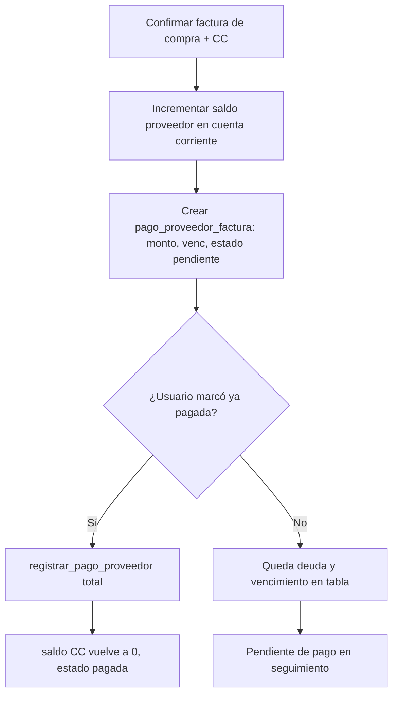

# Cuentas por pagar a proveedores (Fase 1)

## Visión

Cuando se registra un comprobante de **compra** (lector de facturas o carga manual) y se afecta **cuenta corriente a pagar** al proveedor, el sistema crea un seguimiento por factura, espejando el modelo de **cobranza** a clientes: saldo, vencimiento y pagos atómicos vía RPC, más el movimiento en `registrar_pago` hacia la cuenta del proveedor.

## Flujo (Mermaid)

## Base de datos

- **`proveedor`**: `condicion_pago_default` (`contado` | `dias`), `plazo_pago_dias` (obligatorio si a días, \> 0). Restricciones `chk_proveedor_*` en la migración `065_cuentas_por_pagar_proveedor_fase1.sql`.
- **`pago`**: soporta `proveedor_id` (exclusivo con `cliente_id`); usado al registrar pago a proveedor.
- **`pago_proveedor_factura`**: obligación vinculada a `comprobante_id` (compra importada) y `proveedor_id`.
- **`pago_proveedor_movimiento`**: líneas de pago, análogas a `cobranza_pago`.
- **RPC `registrar_pago_cuenta_proveedor`**: inserta en `pago` y baja el saldo de la CC del proveedor.
- **RPC `registrar_pago_proveedor`**: atómica; actualiza la obligación, inserta movimiento y llama a `registrar_pago_cuenta_proveedor` (misma idea que `registrar_pago_cobranza`).

## API

- `POST /api/lector-facturas/confirmar` — acepta `pago` y `fecha_vencimiento_sugerida` (vencimiento extraído por IA, si hay).
- `POST /api/facturacion/compra-proveedor-manual` — mismo cuerpo extendido.
- `PATCH /api/proveedores/[id]` — `condicion_pago_default`, `plazo_pago_dias`.
- `POST /api/pago-proveedor-factura/[id]/pago` — registro de pago posterior (body: `monto`, `tipo_pago`, `notas`, `fecha` opcional). Usa `registrar_pago_proveedor`.
- `POST /api/proveedores/[id]/pago-cuenta` — pago directo al saldo de la cuenta, sin tocar el detalle de `pago_proveedor_factura` (deuda heredada o ajuste). Usa `registrar_pago_cuenta_proveedor`.

## Código

- Lógica: `src/lib/lector-facturas/ejecutar-confirmacion-importado.ts`, helpers `src/lib/cuenta-corriente/pago-proveedor-vencimiento.ts`.
- UI: lector, compra manual, ficha proveedor. En **Proveedores → [proveedor]**: sección **Cuentas por pagar** (lista de facturas con saldo + formulario de pago a la cuenta) en `proveedor-cuentas-por-pagar-client.tsx`.

## Rollback

Comentado al final de la migración `065` (SQL manual).
