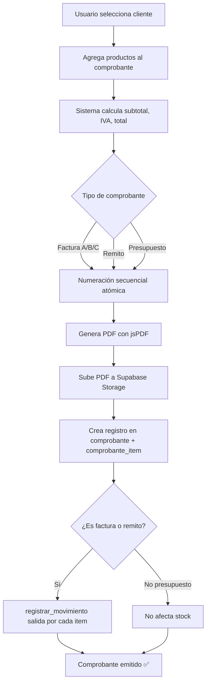
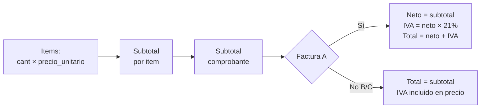

# Nexus — Facturación simple (PDF sin ARCA)

## Visión general

El facturador simple genera comprobantes en PDF usando jsPDF. No tiene integración fiscal. Disponible con el módulo `facturador_simple` (Plan Base y Completo). La integración con ARCA (facturación electrónica con CAE) se documenta en `arca.md` y corresponde al módulo `facturador_arca` del Plan Completo (incluye **cliente HTTPS/TLS** hacia WSAA/WSFE en Node y notas para **Vercel** / OpenSSL 3).



### Comprobantes importados (lector de facturas con IA)

Los documentos cargados desde PDF o imagen con el **lector de facturas** se guardan en `comprobante` con **`estado = importado`**, **`tipo_operacion`** `compra` o `venta`, sin emisión por ARCA. Detalle de flujo, APIs y stock/CC: **`docs/lector-facturas.md`**.

### Número de orden interno (`comprobante.numero_orden`)

Definido en la migración **`041_comprobante_numero_orden.sql`**: correlativo **por tenant**, separado del número fiscal (`comprobante.numero`, secuencias ARCA por tipo).

- **Ticket y factura fiscal posterior** del mismo cobro comparten **`numero_orden`**. La emisión con `desde_ticket_id` reutiliza la orden del ticket, **no** vuelve a mover stock, y actualiza el ticket con **`fiscalizado_por_id`** apuntando a la factura.
- **Agregados de ventas** (dashboard, resumen, ganancias, cierre Z) deben **no duplicar** ticket + factura del mismo orden: helper **`aplanarRepresentativosVentaPorOrden`** en `src/lib/facturacion/ventas-representativas-por-orden.ts` (regla: por orden, prevalece factura A/B/C sobre ticket).
- **Cobranza:** `cobranza_factura` se crea solo para el monto pendiente en cuenta corriente: `metodo_pago: cuenta_corriente`, o parte **`cuenta_corriente`** en `metodo_pago: mixto` (suma de vías = total). Al contado (efectivo, tarjetas, transferencia, mixto sin parte en cuenta corriente) **no** se abre obligación de cobro automática; el saldo en `cuenta_corriente` del cliente solo aumenta por ese monto a crédito.

### Cierre de caja y cajas por sucursal (`/facturacion/cierre-caja`)

Pantalla del módulo **`facturador_simple`**: arqueo, apertura de sesión, **Cierre Z** (`GET`/`POST /api/caja/cierre-z`), historial (`/api/caja/historial-movimientos`) y export CSV. El usuario elige **sucursal operable** y **identificador de caja** (UUID de `public.caja` vía desplegable, o texto libre p. ej. terminal Mercado Pago). Los requests envían **`sucursal_id`** explícito donde la API lo exige (apertura, cierre, historial).

**Gestión de cajas (estructura):** bloque en la misma página para quien puede gestionar sucursales (**admin**, superadmin o permiso **`sucursales.gestionar`**): tabla de cajas de la sucursal seleccionada, alta y edición (`nombre`, `activa`, `usuario_default_id`). APIs: **`GET`** y **`POST /api/configuracion/cajas`**, **`PATCH /api/configuracion/cajas/[id]`** (no desactivar si hay **turno de caja abierto** en esa caja). El modelo de datos (`caja`, `caja_usuario`, turnos POS) se describe en `docs/Plan cajas usuario.md`.

---

## Presupuesto — PDF de cotización formal

El layout dedicado está en **`generarPDFPresupuestoDetallado`** (`src/lib/facturacion/pdf-generator.ts`). Es un formato de **cotización** (no réplica de comprobante AFIP).

- Texto superior en gris: *Cotización formal · Sin validez fiscal · No es factura*.
- Espacio deliberado entre ese texto y el título **PRESUPUESTO** (margen vertical cómodo).
- **Número de presupuesto en el PDF:** solo el número secuencial del comprobante en **8 dígitos** (`formatearNumeroComprobanteAfip`), **sin** prefijo de punto de venta ni guion (no se usa el formato `PPPP-NNNNNNNN` de facturas).
- Incluye datos del emisor, bloque de cliente, tabla de ítems y totales.

Emisión: `POST /api/facturacion/emitir` con `tipo: presupuesto`; pantalla **`/presupuestos/nuevo`**. Conversión a factura conserva ítems y ajustes guardados (ver **`pedidos.md`**).

---

## Descuentos y recargos manuales (por ítem y sobre el total)

Disponibles en **`/facturacion/nueva`** y en la API **`POST /api/facturacion/emitir`**. La lógica central está en **`src/lib/facturacion/ajuste-comercial.ts`**; el orquestador es **`emitirComprobante`** (`src/lib/facturacion/emitir-comprobante.ts`).

### Por ítem

En cada elemento de `items` se pueden enviar **`descuento_manual_pct`** y **`recargo_manual_pct`** (0–100). Se aplican **después** de las promociones del motor, sobre el precio unitario efectivo:

`precio × (1 − desc%/100) × (1 + rec%/100)`

Se persisten en **`comprobante_item.descuento_manual_pct`** y **`comprobante_item.recargo_manual_pct`**.

### Sobre el total de mercadería

Campos opcionales en el body (y bloque «Descuento / recargo sobre el total» en la UI):

| Campo | Rol |
|--------|-----|
| `descuento_global_pct`, `recargo_global_pct` | Porcentaje sobre el bruto ya calculado por ítems |
| `descuento_global_monto`, `recargo_global_monto` | Montos fijos en pesos (no negativos) |

**Orden de aplicación:** % descuento global → % recargo global → descuento fijo → recargo fijo. Si el total quedaría negativo, la API responde **400**.

- **Descuento neto:** escala neto e IVA en facturas con IVA discriminado (criterio alineado al descuento por financiación).
- **Recargo neto:** la parte que no recompone el neto de bienes se suma al total y, con ARCA, se informa como **ImpTrib / tributo 99**. Puede **combinarse** con el recargo por medio de pago. Monto persistido: **`comprobante.imp_trib_comercial`**. Reintento CAE: **`reintentar-cae-comprobante.ts`** arma tributos comercial + financiero.

Columnas globales en **`comprobante`:** `descuento_global_pct`, `recargo_global_pct`, `descuento_global_monto`, `recargo_global_monto`, `imp_trib_comercial` (migración **`063_comprobante_descuentos_recargos.sql`**). Ver también **`docs/base-de-datos.md`**.

El PDF puede mostrar desglose de mercadería (`total_mercaderia`), texto de ajuste comercial global, otros tributos y financiación cuando corresponda.

### Terminal POS

En **`/facturacion/pos`** el carrito puede aplicar descuento o recargo para cobro y ticket en pantalla. Para que el comprobante emitido (ticket/factura) **coincida** con esos importes a nivel persistido y ARCA, hay que enviar en **`emitir`** los mismos campos (`items[].descuento_manual_pct` / `recargo_manual_pct` y/o globales). Hasta que el POS envíe ese body completo, el ajuste del mostrador puede no reflejarse en la fila `comprobante`.

---

## Terminal POS (`/facturacion/pos`)

Pantalla fullscreen del módulo `facturador_pos` (Plan Completo): carrito, escáner, cobro y ticket térmico.

**Proveedor en búsqueda y escáner**

- `GET /api/pos/proveedores` — proveedores activos para el selector (muestra nombre; filtra búsqueda y escáner).
- `GET /api/pos/buscar-productos?q=&proveedor_id=` — resultados incluyen relación `proveedor` y, si existe, **`imagen_url`** (miniatura) para el desplegable de búsqueda.
- `GET /api/productos/buscar-por-barcode?codigo=&proveedor_id=` — misma semántica de `proveedor_id`. Si hay **varios** productos con el mismo código y **no** se envía `proveedor_id`, la API responde **409** con `ambiguous: true`, `tipo`, opcional `peso` (balanza) y `productos[]` con datos completos; el cliente abre un modal para elegir la fila. El producto incluye **`imagen_url`** cuando fue cargada desde la ficha.
- **Códigos con espacios o texto** — El lector y el input del POS envían el código con `trim` en extremos; los espacios **entre** caracteres se conservan para coincidir con `codigo_barras` o `codigo` en base (match exacto vía `parseBarcode` + `buscar-por-barcode`). Si no hay fila, el cliente abre la búsqueda por `GET /api/pos/buscar-productos?q=` usando el mismo criterio (sin colapsar espacios múltiples a uno solo); la API incluye `codigo_barras` en el `OR` de filtro junto con nombre y SKU.

**Código de balanza (PLU + peso / unidad embebida)**

- Por defecto se usa el formato argentino habitual: 13 dígitos numéricos que empiezan con `2`, PLU en 5 posiciones y peso en gramos en 5 posiciones (ver `src/lib/pos/barcode-parser.ts`).
- En **Configuración → Preferencias POS** el administrador puede definir `pos_prefs.balanzaTemplates` (negocio y, opcionalmente, por sucursal): hasta dos cadenas de 8 a 14 caracteres con `X` (dígitos del PLU que emite la balanza), `A` (gramos), `?` (posición ignorada, p. ej. verificador) y dígitos `0-9` como literales obligatorios. `pos_prefs.balanzaTemplate` se conserva como compatibilidad y refleja la primera plantilla. El valor se guarda en el JSON `tenant.pos_prefs` / `sucursal.pos_prefs` (migración `078`).
- Para productos con PLU que se venden por unidad (ej. ajo o brócoli), se puede definir `pos_prefs.balanzaUnidadTemplate`: usa `X` para PLU y `U` para cantidad de unidades. El POS devuelve `tipo=balanza_unidad` y agrega esa cantidad al carrito sin pedir peso manual.
- `GET /api/productos/buscar-por-barcode` fusiona las preferencias efectivas de tenant + sucursal y pasa las plantillas validadas al parser, que las prueba en orden. El PLU extraído se normaliza siempre a **5 dígitos** (`padStart`) para coincidir con `producto.plu`.
- `GET /api/productos/plu-fuera-de-rango?digitos=N` (N = menor cantidad de `X` entre las plantillas configuradas) cuenta productos activos cuyo PLU no cabría en N dígitos; la UI lo usa como advertencia al acortar el campo PLU en alguna plantilla.

**Carrito y totales**

- Cada ítem muestra miniatura (si hay foto), nombre del producto y proveedor en la misma línea.
- El resumen permite **descuento o recargo** sobre el subtotal (% o monto fijo) para cobro en pantalla, modal de pago y ticket térmico.

**Multi-venta — carritos en espera (v13.2, `V132-POS-001`)**

Para resolver el caso de mostrador con cola (mientras un cliente busca la tarjeta, se le cobra a otro), el POS expone hasta **4 ventas paralelas** en mini-pestañas dentro de la misma pantalla. Replica el patrón de POS retail (Square, Lightspeed, Toast) sin abrir pestañas del navegador, que romperían **caja activa**, **terminal MP única** y **emisión ARCA** simultánea.

- **Estado:** store paralelo `ventasEnEspera: VentaEnEsperaSlice<VentaSliceState>[]` + `ventaActivaId` en `src/lib/pos/ventas-en-espera.ts`, scoped por **tenant + caja + cajero** y persistido en `localStorage` con la clave `nexus.pos.ventasEnEspera.v1.{tenant}.{caja}.{user}` (schema versionado, expiración 24 h, custom event `nexus:pos-ventas-en-espera-changed` para sincronizar UI y badge del sidebar). Cada slice serializa `items`, `clienteId`, `tipoComprobante`, `pedidoOrigenId`, `turnoOrigenId`/`turnoOrigenLabel`/`turnoSenaMonto`, `ajusteModo`, `descuentoTipo` y `descuentoValor`.
- **UI:** barra de pestañas (`src/components/pos/ventas-en-espera-tabs.tsx`) entre el topbar y el cuerpo del POS (`Venta 1 · $4.520`, `Venta 2 · vacía`, `+ Nueva`); etiqueta opcional inline (24 chars) sin obligar a tipear; tope visible 4 pestañas + botón Nueva deshabilitado al alcanzarlo.
- **Atajos:** `Alt+N` Nueva venta paralela · `Alt+1..4` saltar entre ventas · `Alt+W` cerrar pestaña activa (sin colisión con `F1`/`F2`/`F3`/`F4`/`F8`/`F9`/`F12` existentes); listados en la ayuda `F1`.
- **Cobro:** `CobroModal` opera solo sobre la venta activa; no se cambió el body de `POST /api/facturacion/emitir`. Al éxito, la slice activa se cierra y queda activa la siguiente (o una nueva vacía).
- **MP Point/QR:** mientras hay un cobro digital en curso (modal abierto), la barra de pestañas pasa a modo deshabilitado y bloquea el cambio o creación de pestañas — equivalente al cross-block original (el modal es exclusivo).
- **Stock:** no se reserva al suspender; `stock_bloqueante` se valida recién al cobrar. Si dos ventas usan la misma unidad, el aviso aparece al cobrar la segunda.
- **Cierre de caja:** el botón "Cierre de caja" del POS chequea si hay ventas en espera con ítems; si las hay, abre un `Dialog` bloqueante con la lista (etiqueta, total, cantidad de ítems) en lugar de abrir el cierre Z. El cierre Z desde `/facturacion/cierre-caja` sigue su flujo habitual.
- **Visibilidad permanente:** contador "N en espera" en el header del POS y badge en la entrada `Punto de venta` del menú lateral (`dashboard-chrome.tsx`), sincronizado vía `subscribeVentasEnEsperaChanges` (custom event + `storage` para cross-tab).
- **Recuperación post-recarga:** las slices del último (tenant, caja, cajero) se rehidratan en silencio al volver al POS. Si no hay slices nuevas pero existe carrito legacy (`smartstock_pos_cart_*`), se respeta el flujo previo `showRestorePrompt`.

Detalle de criterios de aceptación, dependencias y notas técnicas en **`docs/TICKETS.md` → `V132-POS-001`**.

**Cuenta corriente — emisión con pago pendiente**

- Si hay un **cliente** seleccionado (no *Consumidor final*), en el modal de cobro (`CobroModal`) se ofrece **«Emitir con pago pendiente»**: se emite el comprobante elegido en el POS (**ticket** o **factura fiscal**) **sin** registrar medio de pago. El cuerpo de `POST /api/facturacion/emitir` va **sin** `metodo_pago` ni `medio_pago_opcion_id`.
- El importe se registra como deuda: actualización de **cuenta corriente** del cliente y fila en **`cobranza_factura`** (mismo criterio de vencimiento que una factura; detalle en **`docs/cobranza.md`**).
- En el ticket térmico, el medio de pago impreso es **«Cuenta corriente (pendiente)»**. El cobro en efectivo o tarjeta se registra después desde **Cobranza** o la ficha de **cuenta corriente** del cliente.
- Sigue siendo obligatorio **abrir caja** para operar el POS; esta opción no implica movimiento de ingreso en caja hasta que se liquide la deuda.

**Comprobante emitido**

- `POST /api/facturacion/emitir` acepta **descuentos/recargos por ítem** y **globales** (ver *Descuentos y recargos manuales* más arriba). La pantalla **`/facturacion/nueva`** ya los envía. El POS puede seguir calculando el total en el cliente; para persistir el mismo criterio en `comprobante`, ARCA y PDF, el body de emisión debe incluir esos campos cuando el carrito quede alineado con la API.

**Ticket térmico y QR de constatación (módulo `facturador_arca`)**

Cuando la emisión obtiene **CAE** vía WSFE, la respuesta JSON incluye un campo calculado **`qr_url`**: la URL completa del verificador AFIP (`https://www.afip.gob.ar/fe/qr/?p=…`) con el payload en base64. No se persiste en base de datos; se arma en el servidor con `buildQrArcaUrl` en `src/lib/facturacion/arca/qr.ts` (mismo criterio que pyafipws: JSON con `ver`, `fecha`, `cuit`, `ptoVta`, `tipoCmp`, `nroCmp`, `importe`, `moneda` `PES`, `ctz`, documento del receptor, `tipoCodAut` `E`, `codAut` = CAE). Detalle en **`docs/arca.md`** (sección QR de constatación).

El componente del ticket térmico (`src/components/pos/ticket-termico.tsx`) usa **bwip-js** (`import from 'bwip-js/generic'`, `toSVG`, símbolo `qrcode`) para dibujar el QR en **25mm × 25mm** (contenedor en mm; el SVG escala al 100% para impresión térmica). Debajo del QR se imprimen CAE y vencimiento. Si no hay `qr_url` o no hay facturación electrónica, el pie sigue mostrando solo texto cuando corresponda.

---

## Tipos de comprobante soportados

| Tipo | Enum | Afecta stock | Requiere ARCA | Cuándo se usa |
|---|---|---|---|---|
| Factura A | `factura_a` | Sí (salida) | Solo Plan Completo | Emisor RI → Receptor RI |
| Factura B | `factura_b` | Sí (salida) | Solo Plan Completo | Emisor RI → Receptor CF/Mono/Exento |
| Factura C | `factura_c` | Sí (salida) | Solo Plan Completo | Emisor Mono → cualquier receptor |
| Nota de crédito A | `nota_credito_a` | Sí (entrada, devuelve) | Solo Plan Completo | Anulación parcial/total de factura A |
| Nota de crédito B | `nota_credito_b` | Sí (entrada, devuelve) | Solo Plan Completo | Anulación parcial/total de factura B |
| Nota de crédito C | `nota_credito_c` | Sí (entrada, devuelve) | Solo Plan Completo | Anulación parcial/total de factura C |
| Remito | `remito` | Sí (salida) | No | Entrega de mercadería sin factura |
| Presupuesto | `presupuesto` | No | No | Cotización sin compromiso fiscal |

### Determinación automática del tipo de factura

```typescript
// src/lib/facturacion/tipo-comprobante.ts

type CondicionIVA = 'responsable_inscripto' | 'monotributista' | 'exento' | 'consumidor_final';

export function determinarTipoFactura(
  emisor: CondicionIVA,
  receptor: CondicionIVA
): 'factura_a' | 'factura_b' | 'factura_c' {
  if (emisor === 'monotributista' || emisor === 'exento') {
    return 'factura_c';
  }

  if (emisor === 'responsable_inscripto') {
    if (receptor === 'responsable_inscripto') {
      return 'factura_a';
    }
    return 'factura_b';
  }

  return 'factura_c';
}
```

---

## Cálculo de importes



```typescript
// src/lib/facturacion/calcular-importes.ts

interface ItemComprobante {
  producto_id: string;
  cantidad: number;
  precio_unitario: number;
}

interface Importes {
  subtotal: number;
  iva_porcentaje: number;
  iva_monto: number;
  total: number;
  items: (ItemComprobante & { subtotal: number })[];
}

export function calcularImportes(
  items: ItemComprobante[],
  tipoComprobante: string,
  ivaPorcentaje: number = 21
): Importes {
  const itemsCalculados = items.map(item => ({
    ...item,
    subtotal: Math.round(item.cantidad * item.precio_unitario * 100) / 100,
  }));

  const subtotal = itemsCalculados.reduce((sum, item) => sum + item.subtotal, 0);
  const subtotalRedondeado = Math.round(subtotal * 100) / 100;

  const esFacturaA = tipoComprobante === 'factura_a' || tipoComprobante === 'nota_credito_a';

  if (esFacturaA) {
    const ivaMonto = Math.round(subtotalRedondeado * (ivaPorcentaje / 100) * 100) / 100;
    return {
      subtotal: subtotalRedondeado,
      iva_porcentaje: ivaPorcentaje,
      iva_monto: ivaMonto,
      total: Math.round((subtotalRedondeado + ivaMonto) * 100) / 100,
      items: itemsCalculados,
    };
  }

  // Factura B, C, remito, presupuesto: IVA incluido en el precio
  return {
    subtotal: subtotalRedondeado,
    iva_porcentaje: ivaPorcentaje,
    iva_monto: 0,
    total: subtotalRedondeado,
    items: itemsCalculados,
  };
}
```

---

## Numeración secuencial atómica

Cada tipo de comprobante tiene su propia secuencia por tenant. La función `siguiente_numero_comprobante` se ejecuta dentro de la misma transacción que el INSERT para evitar huecos.

```sql
CREATE OR REPLACE FUNCTION siguiente_numero_comprobante(
  p_tenant_id UUID,
  p_tipo      tipo_comprobante
) RETURNS INTEGER AS $$
DECLARE
  v_siguiente INTEGER;
BEGIN
  SELECT COALESCE(MAX(numero), 0) + 1 INTO v_siguiente
  FROM comprobante
  WHERE tenant_id = p_tenant_id AND tipo = p_tipo;

  RETURN v_siguiente;
END;
$$ LANGUAGE plpgsql SECURITY DEFINER;
```

### Wrapper TypeScript

```typescript
// src/lib/facturacion/numerador.ts
import { SupabaseClient } from '@supabase/supabase-js';

export async function obtenerSiguienteNumero(
  supabase: SupabaseClient,
  tenantId: string,
  tipo: string
): Promise<number> {
  const { data, error } = await supabase.rpc('siguiente_numero_comprobante', {
    p_tenant_id: tenantId,
    p_tipo: tipo,
  });

  if (error) throw new Error(`Error al obtener número: ${error.message}`);
  return data as number;
}
```

### Formato de numeración

El número se muestra con formato `PPPP-NNNNNNNN` donde:
- `PPPP` = punto de venta (4 dígitos, de `tenant.punto_de_venta`)
- `NNNNNNNN` = número secuencial (8 dígitos)

```typescript
// src/lib/facturacion/formato.ts

export function formatearNumeroComprobante(
  puntoDeVenta: number,
  numero: number
): string {
  const pv = String(puntoDeVenta).padStart(4, '0');
  const num = String(numero).padStart(8, '0');
  return `${pv}-${num}`;
}

export function formatearTipoComprobante(tipo: string): string {
  const labels: Record<string, string> = {
    factura_a: 'Factura A',
    factura_b: 'Factura B',
    factura_c: 'Factura C',
    nota_credito_a: 'Nota de Crédito A',
    nota_credito_b: 'Nota de Crédito B',
    nota_credito_c: 'Nota de Crédito C',
    remito: 'Remito',
    presupuesto: 'Presupuesto',
  };
  return labels[tipo] ?? tipo;
}
```

---

## Generación de PDF con jsPDF

```typescript
// src/lib/facturacion/pdf-generator.ts
import jsPDF from 'jspdf';
import { formatearNumeroComprobante, formatearTipoComprobante } from './formato';
import { formatCurrency, formatDate } from '@/lib/utils/formatters';

interface DatosEmisor {
  nombre: string;
  razon_social: string | null;
  cuit: string | null;
  domicilio: string | null;
  condicion_iva: string;
  punto_de_venta: number;
  logo_url: string | null;
}

interface DatosCliente {
  nombre: string;
  razon_social: string | null;
  cuit_dni: string | null;
  condicion_iva: string;
  direccion: string | null;
}

interface ItemPDF {
  cantidad: number;
  descripcion: string;
  precio_unitario: number;
  subtotal: number;
}

interface DatosComprobante {
  tipo: string;
  numero: number;
  fecha: string;
  subtotal: number;
  iva_monto: number;
  iva_porcentaje: number;
  total: number;
  notas: string | null;
  cae: string | null;
  cae_vencimiento: string | null;
}

export function generarPDF(
  emisor: DatosEmisor,
  cliente: DatosCliente,
  comprobante: DatosComprobante,
  items: ItemPDF[]
): jsPDF {
  const doc = new jsPDF({ orientation: 'portrait', unit: 'mm', format: 'a4' });
  const pageWidth = doc.internal.pageSize.getWidth();
  const margin = 15;
  let y = margin;

  // === HEADER ===
  // Letra del comprobante (centrada, grande)
  const letra = comprobante.tipo.includes('_a') ? 'A'
    : comprobante.tipo.includes('_b') ? 'B'
    : comprobante.tipo.includes('_c') ? 'C'
    : 'X';

  doc.setFontSize(24);
  doc.setFont('helvetica', 'bold');
  doc.text(letra, pageWidth / 2, y + 8, { align: 'center' });

  // Tipo y número
  const tipoLabel = formatearTipoComprobante(comprobante.tipo);
  const numeroLabel = formatearNumeroComprobante(emisor.punto_de_venta, comprobante.numero);

  doc.setFontSize(14);
  doc.text(`${tipoLabel} Nro ${numeroLabel}`, pageWidth / 2, y + 16, { align: 'center' });

  y += 24;

  // Línea separadora
  doc.setLineWidth(0.5);
  doc.line(margin, y, pageWidth - margin, y);
  y += 6;

  // === DATOS DEL EMISOR ===
  doc.setFontSize(10);
  doc.setFont('helvetica', 'bold');
  doc.text(emisor.razon_social || emisor.nombre, margin, y);
  y += 5;
  doc.setFont('helvetica', 'normal');
  if (emisor.cuit) { doc.text(`CUIT: ${emisor.cuit}`, margin, y); y += 4; }
  if (emisor.domicilio) { doc.text(emisor.domicilio, margin, y); y += 4; }
  doc.text(`Condición IVA: ${formatCondicionIva(emisor.condicion_iva)}`, margin, y);
  y += 4;

  // Fecha (derecha)
  doc.text(`Fecha: ${formatDate(comprobante.fecha)}`, pageWidth - margin, y - 12, { align: 'right' });

  y += 4;
  doc.line(margin, y, pageWidth - margin, y);
  y += 6;

  // === DATOS DEL CLIENTE ===
  doc.setFont('helvetica', 'bold');
  doc.text('Cliente:', margin, y);
  doc.setFont('helvetica', 'normal');
  doc.text(cliente.razon_social || cliente.nombre, margin + 18, y);
  y += 5;
  if (cliente.cuit_dni) { doc.text(`CUIT/DNI: ${cliente.cuit_dni}`, margin, y); y += 4; }
  doc.text(`Condición IVA: ${formatCondicionIva(cliente.condicion_iva)}`, margin, y);
  y += 4;
  if (cliente.direccion) { doc.text(cliente.direccion, margin, y); y += 4; }

  y += 4;
  doc.line(margin, y, pageWidth - margin, y);
  y += 6;

  // === TABLA DE ITEMS ===
  const colX = {
    cant: margin,
    desc: margin + 20,
    precio: pageWidth - margin - 60,
    subtotal: pageWidth - margin - 25,
  };

  doc.setFont('helvetica', 'bold');
  doc.setFontSize(9);
  doc.text('Cant.', colX.cant, y);
  doc.text('Descripción', colX.desc, y);
  doc.text('P. Unit.', colX.precio, y, { align: 'right' });
  doc.text('Subtotal', colX.subtotal, y, { align: 'right' });
  y += 2;
  doc.line(margin, y, pageWidth - margin, y);
  y += 5;

  doc.setFont('helvetica', 'normal');
  for (const item of items) {
    if (y > 250) {
      doc.addPage();
      y = margin;
    }

    doc.text(String(item.cantidad), colX.cant, y);
    doc.text(item.descripcion.substring(0, 50), colX.desc, y);
    doc.text(formatCurrency(item.precio_unitario), colX.precio, y, { align: 'right' });
    doc.text(formatCurrency(item.subtotal), colX.subtotal, y, { align: 'right' });
    y += 5;
  }

  y += 3;
  doc.line(margin, y, pageWidth - margin, y);
  y += 6;

  // === TOTALES ===
  const totalesX = pageWidth - margin;

  doc.setFontSize(10);
  doc.text(`Subtotal:`, totalesX - 50, y);
  doc.text(formatCurrency(comprobante.subtotal), totalesX, y, { align: 'right' });
  y += 5;

  if (comprobante.iva_monto > 0) {
    doc.text(`IVA (${comprobante.iva_porcentaje}%):`, totalesX - 50, y);
    doc.text(formatCurrency(comprobante.iva_monto), totalesX, y, { align: 'right' });
    y += 5;
  }

  doc.setFont('helvetica', 'bold');
  doc.setFontSize(12);
  doc.text(`TOTAL:`, totalesX - 50, y);
  doc.text(formatCurrency(comprobante.total), totalesX, y, { align: 'right' });
  y += 8;

  // === CAE (si tiene) ===
  if (comprobante.cae) {
    doc.setFontSize(8);
    doc.setFont('helvetica', 'normal');
    doc.text(`CAE: ${comprobante.cae}`, margin, y);
    y += 4;
    doc.text(`Vencimiento CAE: ${formatDate(comprobante.cae_vencimiento!)}`, margin, y);
    y += 6;
  }

  // === NOTAS ===
  if (comprobante.notas) {
    doc.setFontSize(8);
    doc.setFont('helvetica', 'italic');
    doc.text(`Obs: ${comprobante.notas}`, margin, y);
  }

  return doc;
}

function formatCondicionIva(condicion: string): string {
  const labels: Record<string, string> = {
    responsable_inscripto: 'Responsable Inscripto',
    monotributista: 'Monotributista',
    exento: 'Exento',
    consumidor_final: 'Consumidor Final',
  };
  return labels[condicion] ?? condicion;
}
```

---

## Probar el PDF sin emitir comprobantes (Vitest)

Sirve para revisar el layout del PDF generado por `generarPDF` **sin** crear comprobantes en la base ni subir archivos a Storage. Los tests escriben archivos en la carpeta `tmp/` del proyecto (ignorada por git).

### Requisitos

- **Siempre:** Node y dependencias instaladas (`npm install`).
- **Para datos de ejemplo (`pdf:demo`):** ninguna variable extra; no usa Supabase.
- **Para datos reales desde la BD (`pdf:orden`):** archivo `.env.local` en la raíz del repo con `NEXT_PUBLIC_SUPABASE_URL` y `SUPABASE_SERVICE_ROLE_KEY` (el test usa el cliente service role solo lectura para leer el comprobante).

### Comandos npm

| Script | Test | Salida | Uso |
|--------|------|--------|-----|
| `npm run pdf:demo` | `src/test/pdf-demo.test.ts` | `tmp/factura-demo.pdf` (con descuento financiero de ejemplo) y `tmp/factura-demo-sin-financiacion.pdf` | Datos **ficticios** fijos en el propio test; útil para iterar diseño del PDF. |
| `npm run pdf:orden` | `src/test/pdf-orden-29.test.ts` | `tmp/factura-orden-29.pdf` | Lee de Supabase el comprobante con **`numero_orden = 29`** (el más reciente si hubiera más de uno) y arma el mismo tipo de payload que usa la app. |

Equivalente directo con Vitest:

```bash
npx vitest run src/test/pdf-demo.test.ts
npx vitest run src/test/pdf-orden-29.test.ts
```

El test `pdf-orden-29` está configurado con entorno **Node** en `vitest.config.ts` (no jsdom), por las dependencias de Supabase en ese entorno.

### Si falla `pdf:orden`

- **No hay comprobante con orden 29:** el test lanza error. Cambiá el número en `src/test/pdf-orden-29.test.ts` (`.eq('numero_orden', 29)`) al que necesites, o emití una venta de prueba con esa orden.
- **Variables de entorno:** verificá que existan `NEXT_PUBLIC_SUPABASE_URL` y `SUPABASE_SERVICE_ROLE_KEY` (Vitest carga `.env.local` vía la configuración del proyecto).

### Abrir el PDF generado

Los archivos son locales. Podés abrirlos desde el explorador de archivos o usar una URL `file:///` (en Windows suele respetar espacios codificados como `%20`). No se publica ningún `https://` automáticamente; el PDF no se sube a un servidor al ejecutar estos tests.

---

## API Route `/api/facturacion/emitir`

Flujo completo de emisión de un comprobante.

**Respuesta (campos relevantes):** además de `comprobante`, `importes` y `promociones_aplicadas`, la respuesta puede incluir **`qr_url`** (`string | null`): URL del verificador AFIP para generar el QR de constatación. Solo viene poblada cuando hubo **CAE** válido en esa emisión (Plan Completo + `facturador_arca`). El cliente POS la usa al imprimir el ticket térmico; no requiere columnas nuevas en `comprobante`.

```typescript
// src/app/api/facturacion/emitir/route.ts
import { createServerClient } from '@/lib/supabase/server';
import { NextResponse } from 'next/server';
import { calcularImportes } from '@/lib/facturacion/calcular-importes';
import { generarPDF } from '@/lib/facturacion/pdf-generator';
import { moduloGuard } from '@/lib/modulos/guard';

interface EmitirRequest {
  tipo: string;
  cliente_id: string;
  items: { producto_id: string; cantidad: number; precio_unitario: number }[];
  notas?: string;
  iva_porcentaje?: number;
}

export async function POST(request: Request) {
  // 1. Verificar módulo
  const guard = await moduloGuard('facturador_simple');
  if (!guard.allowed) return guard.response;

  const supabase = await createServerClient();
  const { data: { user } } = await supabase.auth.getUser();
  if (!user) return NextResponse.json({ error: 'No autenticado' }, { status: 401 });

  const { data: usuario } = await supabase
    .from('usuario')
    .select('rol, tenant_id')
    .eq('id', user.id)
    .single();

  if (!usuario || usuario.rol === 'visor') {
    return NextResponse.json({ error: 'Sin permisos' }, { status: 403 });
  }

  const body: EmitirRequest = await request.json();

  // 2. Obtener datos del tenant
  const { data: tenant } = await supabase
    .from('tenant')
    .select('*')
    .eq('id', usuario.tenant_id)
    .single();

  if (!tenant) return NextResponse.json({ error: 'Tenant no encontrado' }, { status: 500 });

  // 3. Obtener datos del cliente
  const { data: cliente } = await supabase
    .from('cliente')
    .select('*')
    .eq('id', body.cliente_id)
    .single();

  if (!cliente) return NextResponse.json({ error: 'Cliente no encontrado' }, { status: 404 });

  // 4. Obtener datos de productos
  const productoIds = body.items.map(i => i.producto_id);
  const { data: productos } = await supabase
    .from('producto')
    .select('id, codigo, nombre, stock_actual')
    .in('id', productoIds);

  if (!productos || productos.length !== productoIds.length) {
    return NextResponse.json({ error: 'Algunos productos no fueron encontrados' }, { status: 404 });
  }

  const productosMap = new Map(productos.map(p => [p.id, p]));

  // 5. Verificar stock disponible (si no es presupuesto)
  const esPresupuesto = body.tipo === 'presupuesto';
  if (!esPresupuesto) {
    for (const item of body.items) {
      const prod = productosMap.get(item.producto_id)!;
      if (prod.stock_actual < item.cantidad) {
        return NextResponse.json({
          error: `Stock insuficiente para "${prod.nombre}". Disponible: ${prod.stock_actual}, solicitado: ${item.cantidad}`,
        }, { status: 400 });
      }
    }
  }

  // 6. Calcular importes
  const importes = calcularImportes(body.items, body.tipo, body.iva_porcentaje);

  // 7. Obtener siguiente número
  const { data: numero } = await supabase.rpc('siguiente_numero_comprobante', {
    p_tenant_id: usuario.tenant_id,
    p_tipo: body.tipo,
  });

  // 8. Crear comprobante
  const { data: comprobante, error: compError } = await supabase
    .from('comprobante')
    .insert({
      tenant_id: usuario.tenant_id,
      tipo: body.tipo,
      numero,
      fecha: new Date().toISOString().split('T')[0],
      cliente_id: body.cliente_id,
      subtotal: importes.subtotal,
      iva_monto: importes.iva_monto,
      iva_porcentaje: importes.iva_porcentaje,
      total: importes.total,
      estado: 'emitido',
      notas: body.notas || null,
      usuario_id: user.id,
    })
    .select()
    .single();

  if (compError) {
    return NextResponse.json({ error: compError.message }, { status: 500 });
  }

  // 9. Crear items del comprobante
  const itemsInsert = importes.items.map(item => ({
    comprobante_id: comprobante.id,
    producto_id: item.producto_id,
    cantidad: item.cantidad,
    precio_unitario: item.precio_unitario,
    subtotal: item.subtotal,
  }));

  await supabase.from('comprobante_item').insert(itemsInsert);

  // 10. Registrar movimientos de stock (si no es presupuesto)
  if (!esPresupuesto) {
    const esNotaCredito = body.tipo.startsWith('nota_credito');
    const tipoMov = esNotaCredito ? 'entrada' : 'salida';

    for (const item of body.items) {
      const prod = productosMap.get(item.producto_id)!;
      await supabase.rpc('registrar_movimiento', {
        p_tenant_id: usuario.tenant_id,
        p_producto_id: item.producto_id,
        p_tipo: tipoMov,
        p_cantidad: item.cantidad,
        p_motivo: `${formatearTipoComprobante(body.tipo)} #${numero}`,
        p_referencia_tipo: 'factura',
        p_referencia_id: comprobante.id,
        p_usuario_id: user.id,
      });
    }
  }

  // 11. Generar PDF
  const itemsPDF = body.items.map(item => {
    const prod = productosMap.get(item.producto_id)!;
    return {
      cantidad: item.cantidad,
      descripcion: prod.nombre,
      precio_unitario: item.precio_unitario,
      subtotal: item.cantidad * item.precio_unitario,
    };
  });

  const pdf = generarPDF(
    {
      nombre: tenant.nombre,
      razon_social: tenant.razon_social,
      cuit: tenant.cuit,
      domicilio: tenant.domicilio,
      condicion_iva: tenant.condicion_iva,
      punto_de_venta: tenant.punto_de_venta,
      logo_url: tenant.logo_url,
    },
    {
      nombre: cliente.nombre,
      razon_social: cliente.razon_social,
      cuit_dni: cliente.cuit_dni,
      condicion_iva: cliente.condicion_iva,
      direccion: cliente.direccion,
    },
    {
      tipo: body.tipo,
      numero,
      fecha: comprobante.fecha,
      subtotal: importes.subtotal,
      iva_monto: importes.iva_monto,
      iva_porcentaje: importes.iva_porcentaje,
      total: importes.total,
      notas: body.notas || null,
      cae: null,
      cae_vencimiento: null,
    },
    itemsPDF
  );

  // 12. Subir PDF a Supabase Storage
  const pdfBuffer = Buffer.from(pdf.output('arraybuffer'));
  const pdfPath = `${usuario.tenant_id}/comprobantes/${body.tipo}_${numero}.pdf`;

  const { error: uploadError } = await supabase.storage
    .from('comprobantes')
    .upload(pdfPath, pdfBuffer, { contentType: 'application/pdf', upsert: true });

  if (!uploadError) {
    const { data: publicUrl } = supabase.storage
      .from('comprobantes')
      .getPublicUrl(pdfPath);

    await supabase
      .from('comprobante')
      .update({ pdf_url: publicUrl.publicUrl })
      .eq('id', comprobante.id);
  }

  return NextResponse.json({
    comprobante: { ...comprobante, numero },
    importes,
    pdf_url: `${pdfPath}`,
  }, { status: 201 });
}

function formatearTipoComprobante(tipo: string): string {
  const labels: Record<string, string> = {
    factura_a: 'Factura A', factura_b: 'Factura B', factura_c: 'Factura C',
    nota_credito_a: 'NC A', nota_credito_b: 'NC B', nota_credito_c: 'NC C',
    remito: 'Remito', presupuesto: 'Presupuesto',
  };
  return labels[tipo] ?? tipo;
}
```

---

## Listado de comprobantes

```typescript
// src/app/api/facturacion/route.ts
import { createServerClient } from '@/lib/supabase/server';
import { NextResponse, type NextRequest } from 'next/server';

export async function GET(request: NextRequest) {
  const supabase = await createServerClient();
  const { data: { user } } = await supabase.auth.getUser();
  if (!user) return NextResponse.json({ error: 'No autenticado' }, { status: 401 });

  const { searchParams } = new URL(request.url);
  const tipo = searchParams.get('tipo');
  const estado = searchParams.get('estado');
  const clienteId = searchParams.get('cliente_id');
  const pagina = parseInt(searchParams.get('pagina') ?? '1');
  const porPagina = parseInt(searchParams.get('por_pagina') ?? '25');
  const offset = (pagina - 1) * porPagina;

  let query = supabase
    .from('comprobante')
    .select(
      '*, cliente:cliente_id(nombre, razon_social), usuario:usuario_id(nombre, apellido)',
      { count: 'exact' }
    )
    .order('fecha', { ascending: false })
    .order('numero', { ascending: false })
    .range(offset, offset + porPagina - 1);

  if (tipo) query = query.eq('tipo', tipo);
  if (estado) query = query.eq('estado', estado);
  if (clienteId) query = query.eq('cliente_id', clienteId);

  const { data, error, count } = await query;

  if (error) return NextResponse.json({ error: error.message }, { status: 500 });

  return NextResponse.json({
    comprobantes: data,
    total: count,
    pagina,
    por_pagina: porPagina,
  });
}
```

---

## Componente: formulario de emisión

```typescript
// src/components/facturacion/emitir-comprobante.tsx
'use client';

import { useState } from 'react';
import { formatCurrency } from '@/lib/utils/formatters';

interface Producto {
  id: string;
  codigo: string;
  nombre: string;
  precio_venta: number;
  stock_actual: number;
}

interface Cliente {
  id: string;
  nombre: string;
  razon_social: string | null;
  condicion_iva: string;
}

interface ItemForm {
  producto: Producto;
  cantidad: number;
  precio_unitario: number;
}

interface Props {
  clientes: Cliente[];
  productos: Producto[];
  tipoDefault: string;
  onEmitir: (data: {
    tipo: string;
    cliente_id: string;
    items: { producto_id: string; cantidad: number; precio_unitario: number }[];
    notas?: string;
  }) => Promise<void>;
}

export function EmitirComprobante({ clientes, productos, tipoDefault, onEmitir }: Props) {
  const [clienteId, setClienteId] = useState('');
  const [tipo, setTipo] = useState(tipoDefault);
  const [items, setItems] = useState<ItemForm[]>([]);
  const [notas, setNotas] = useState('');
  const [loading, setLoading] = useState(false);

  function agregarItem(productoId: string) {
    const prod = productos.find(p => p.id === productoId);
    if (!prod) return;
    if (items.some(i => i.producto.id === productoId)) return;

    setItems([...items, {
      producto: prod,
      cantidad: 1,
      precio_unitario: prod.precio_venta,
    }]);
  }

  function actualizarItem(index: number, campo: 'cantidad' | 'precio_unitario', valor: number) {
    const nuevos = [...items];
    nuevos[index] = { ...nuevos[index], [campo]: valor };
    setItems(nuevos);
  }

  function eliminarItem(index: number) {
    setItems(items.filter((_, i) => i !== index));
  }

  const subtotal = items.reduce((sum, i) => sum + i.cantidad * i.precio_unitario, 0);
  const esFacturaA = tipo === 'factura_a';
  const ivaMonto = esFacturaA ? subtotal * 0.21 : 0;
  const total = subtotal + ivaMonto;

  async function handleEmitir() {
    if (!clienteId || items.length === 0) return;
    setLoading(true);
    try {
      await onEmitir({
        tipo,
        cliente_id: clienteId,
        items: items.map(i => ({
          producto_id: i.producto.id,
          cantidad: i.cantidad,
          precio_unitario: i.precio_unitario,
        })),
        notas: notas || undefined,
      });
    } finally {
      setLoading(false);
    }
  }

  return (
    <div className="space-y-6">
      {/* Selector de tipo */}
      <div className="grid grid-cols-2 gap-4">
        <div>
          <label className="block text-sm font-medium mb-1">Tipo de comprobante</label>
          <select value={tipo} onChange={e => setTipo(e.target.value)} className="w-full border rounded px-3 py-2">
            <option value="factura_a">Factura A</option>
            <option value="factura_b">Factura B</option>
            <option value="factura_c">Factura C</option>
            <option value="remito">Remito</option>
            <option value="presupuesto">Presupuesto</option>
          </select>
        </div>
        <div>
          <label className="block text-sm font-medium mb-1">Cliente</label>
          <select value={clienteId} onChange={e => setClienteId(e.target.value)} className="w-full border rounded px-3 py-2">
            <option value="">Seleccionar cliente...</option>
            {clientes.map(c => (
              <option key={c.id} value={c.id}>{c.razon_social || c.nombre}</option>
            ))}
          </select>
        </div>
      </div>

      {/* Agregar productos */}
      <div>
        <label className="block text-sm font-medium mb-1">Agregar producto</label>
        <select onChange={e => { agregarItem(e.target.value); e.target.value = ''; }} className="w-full border rounded px-3 py-2">
          <option value="">Buscar producto...</option>
          {productos
            .filter(p => !items.some(i => i.producto.id === p.id))
            .map(p => (
              <option key={p.id} value={p.id}>
                {p.codigo} — {p.nombre} ({formatCurrency(p.precio_venta)})
              </option>
            ))}
        </select>
      </div>

      {/* Tabla de items */}
      {items.length > 0 && (
        <table className="w-full text-sm">
          <thead>
            <tr className="border-b text-left">
              <th className="pb-2">Producto</th>
              <th className="pb-2 w-24">Cantidad</th>
              <th className="pb-2 w-32">Precio</th>
              <th className="pb-2 text-right w-28">Subtotal</th>
              <th className="pb-2 w-12" />
            </tr>
          </thead>
          <tbody>
            {items.map((item, i) => (
              <tr key={item.producto.id} className="border-b">
                <td className="py-2">{item.producto.nombre}</td>
                <td className="py-2">
                  <input
                    type="number" min={1} value={item.cantidad}
                    onChange={e => actualizarItem(i, 'cantidad', parseInt(e.target.value) || 1)}
                    className="w-20 border rounded px-2 py-1"
                  />
                </td>
                <td className="py-2">
                  <input
                    type="number" min={0} step={0.01} value={item.precio_unitario}
                    onChange={e => actualizarItem(i, 'precio_unitario', parseFloat(e.target.value) || 0)}
                    className="w-28 border rounded px-2 py-1"
                  />
                </td>
                <td className="py-2 text-right">{formatCurrency(item.cantidad * item.precio_unitario)}</td>
                <td className="py-2 text-center">
                  <button onClick={() => eliminarItem(i)} className="text-red-500 hover:text-red-700">×</button>
                </td>
              </tr>
            ))}
          </tbody>
        </table>
      )}

      {/* Totales */}
      <div className="text-right space-y-1">
        <p>Subtotal: <span className="font-mono">{formatCurrency(subtotal)}</span></p>
        {esFacturaA && <p>IVA (21%): <span className="font-mono">{formatCurrency(ivaMonto)}</span></p>}
        <p className="text-lg font-bold">Total: <span className="font-mono">{formatCurrency(total)}</span></p>
      </div>

      {/* Notas */}
      <textarea
        value={notas} onChange={e => setNotas(e.target.value)}
        placeholder="Notas u observaciones (opcional)"
        className="w-full border rounded px-3 py-2 text-sm"
        rows={2}
      />

      {/* Emitir */}
      <button
        onClick={handleEmitir}
        disabled={loading || !clienteId || items.length === 0}
        className="w-full bg-primary text-primary-foreground py-3 rounded font-medium disabled:opacity-50"
      >
        {loading ? 'Emitiendo...' : `Emitir ${formatearTipoComprobante(tipo)}`}
      </button>
    </div>
  );
}

function formatearTipoComprobante(tipo: string): string {
  const labels: Record<string, string> = {
    factura_a: 'Factura A', factura_b: 'Factura B', factura_c: 'Factura C',
    remito: 'Remito', presupuesto: 'Presupuesto',
  };
  return labels[tipo] ?? tipo;
}
```

---

## Historial y reimpresión

```typescript
// src/components/facturacion/comprobante-detalle.tsx
'use client';

import { formatCurrency, formatDate } from '@/lib/utils/formatters';
import { formatearNumeroComprobante, formatearTipoComprobante } from '@/lib/facturacion/formato';
import { Download, Printer } from 'lucide-react';

interface ComprobanteDetalle {
  id: string;
  tipo: string;
  numero: number;
  fecha: string;
  subtotal: number;
  iva_monto: number;
  iva_porcentaje: number;
  total: number;
  estado: string;
  pdf_url: string | null;
  cae: string | null;
  cae_vencimiento: string | null;
  notas: string | null;
  cliente: { nombre: string; razon_social: string | null };
  items: { cantidad: number; precio_unitario: number; subtotal: number; producto: { nombre: string } }[];
}

interface Props {
  comprobante: ComprobanteDetalle;
  puntoDeVenta: number;
}

export function ComprobanteDetalle({ comprobante, puntoDeVenta }: Props) {
  return (
    <div className="space-y-6">
      <div className="flex justify-between items-start">
        <div>
          <h1 className="text-xl font-bold">
            {formatearTipoComprobante(comprobante.tipo)}{' '}
            {formatearNumeroComprobante(puntoDeVenta, comprobante.numero)}
          </h1>
          <p className="text-muted-foreground">{formatDate(comprobante.fecha)}</p>
          <p className="text-sm mt-1">
            Cliente: {comprobante.cliente.razon_social || comprobante.cliente.nombre}
          </p>
        </div>
        <div className="flex gap-2">
          {comprobante.pdf_url && (
            <>
              <a
                href={comprobante.pdf_url}
                target="_blank"
                rel="noopener noreferrer"
                className="flex items-center gap-1 border rounded px-3 py-1.5 text-sm hover:bg-muted"
              >
                <Download className="h-4 w-4" /> Descargar
              </a>
              <button
                onClick={() => window.open(comprobante.pdf_url!, '_blank')}
                className="flex items-center gap-1 border rounded px-3 py-1.5 text-sm hover:bg-muted"
              >
                <Printer className="h-4 w-4" /> Imprimir
              </button>
            </>
          )}
        </div>
      </div>

      <table className="w-full text-sm">
        <thead>
          <tr className="border-b text-left">
            <th className="pb-2">Producto</th>
            <th className="pb-2 text-right">Cantidad</th>
            <th className="pb-2 text-right">P. Unitario</th>
            <th className="pb-2 text-right">Subtotal</th>
          </tr>
        </thead>
        <tbody>
          {comprobante.items.map((item, i) => (
            <tr key={i} className="border-b">
              <td className="py-2">{item.producto.nombre}</td>
              <td className="py-2 text-right">{item.cantidad}</td>
              <td className="py-2 text-right">{formatCurrency(item.precio_unitario)}</td>
              <td className="py-2 text-right">{formatCurrency(item.subtotal)}</td>
            </tr>
          ))}
        </tbody>
      </table>

      <div className="text-right space-y-1 text-sm">
        <p>Subtotal: {formatCurrency(comprobante.subtotal)}</p>
        {comprobante.iva_monto > 0 && (
          <p>IVA ({comprobante.iva_porcentaje}%): {formatCurrency(comprobante.iva_monto)}</p>
        )}
        <p className="text-lg font-bold">Total: {formatCurrency(comprobante.total)}</p>
      </div>

      {comprobante.cae && (
        <div className="bg-green-50 border border-green-200 rounded p-3 text-sm">
          <p className="font-medium text-green-800">CAE: {comprobante.cae}</p>
          <p className="text-green-700">Vencimiento: {formatDate(comprobante.cae_vencimiento!)}</p>
        </div>
      )}

      <div className="flex items-center gap-2">
        <span className={`px-2 py-1 rounded text-xs font-medium
          ${comprobante.estado === 'emitido' ? 'bg-green-100 text-green-800' : ''}
          ${comprobante.estado === 'borrador' ? 'bg-gray-100 text-gray-800' : ''}
          ${comprobante.estado === 'anulado' ? 'bg-red-100 text-red-800' : ''}
          ${comprobante.estado === 'pendiente_arca' ? 'bg-yellow-100 text-yellow-800' : ''}
          ${comprobante.estado === 'error_arca' ? 'bg-red-100 text-red-800' : ''}
        `}>
          {comprobante.estado.replace('_', ' ').toUpperCase()}
        </span>
      </div>
    </div>
  );
}
```

---

## Tipos TypeScript

```typescript
// src/types/facturacion.ts

export type TipoComprobante =
  | 'factura_a' | 'factura_b' | 'factura_c'
  | 'nota_credito_a' | 'nota_credito_b' | 'nota_credito_c'
  | 'remito' | 'presupuesto';

export type EstadoComprobante =
  | 'borrador' | 'emitido' | 'pendiente_arca' | 'error_arca' | 'anulado';

export interface Comprobante {
  id: string;
  tenant_id: string;
  tipo: TipoComprobante;
  numero: number;
  fecha: string;
  cliente_id: string | null;
  subtotal: number;
  iva_monto: number;
  iva_porcentaje: number;
  total: number;
  estado: EstadoComprobante;
  cae: string | null;
  cae_vencimiento: string | null;
  pdf_url: string | null;
  notas: string | null;
  usuario_id: string | null;
  created_at: string;
  updated_at: string;
}

export interface ComprobanteItem {
  id: string;
  comprobante_id: string;
  producto_id: string;
  cantidad: number;
  precio_unitario: number;
  subtotal: number;
}
```

---

## Medios de pago y pago mixto

La configuración de recargos o descuentos por método (atajos del POS), planes por `medio_pago_opcion` y la lógica de **pago mixto** (montos parciales que suman la mercadería, ajuste proporcional y coherencia con PDF/ARCA) están documentadas en **[medios-de-pago-y-financiacion.md](./medios-de-pago-y-financiacion.md)**.
