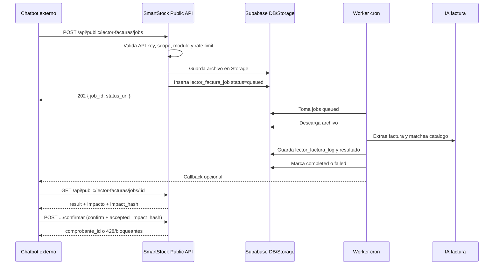

# API dual - Lector de facturas IA

## Objetivo

SmartStock ofrece el lector de facturas IA de dos formas:

1. **API SmartStock**: pensada para chatbots o integraciones conectadas a tenants de SmartStock. Es async, guarda jobs, usa tenant/sucursal, catalago, proveedor/cliente y matching de productos.
2. **API Extractor**: pensada para sistemas externos que solo quieren extraer datos. Es sync, no usa tenant, no matchea productos, no crea jobs y devuelve un JSON limpio.

La API SmartStock permite que un sistema externo, por ejemplo un chatbot conectado a WhatsApp, envie una factura en PDF o imagen y reciba un JSON de preview con los datos extraidos por IA y el matching contra el catalogo de SmartStock.

La API SmartStock es asincronica en tres pasos:

1. El integrador crea un job con `POST /api/public/lector-facturas/jobs`.
2. Un worker procesa el archivo con IA y deja el job en `completed` con `result` (preview + matching).
3. El integrador consulta `GET /api/public/lector-facturas/jobs/:id` y obtiene `impacto` + `impact_hash`.
4. Tras mostrar el impacto al usuario final, aplica con `POST /api/public/lector-facturas/jobs/:id/confirmar` (`confirm: true` + `accepted_impact_hash`).

Opcional en el paso 2: `callback_url` al terminar el procesamiento IA (antes de confirmar).

El mismo motor de impacto y aplicacion usa el sandbox de WhatsApp ([`whatsapp-chatbot-facturas.md`](./whatsapp-chatbot-facturas.md)) via [`confirmacion-chatbot.ts`](../src/lib/lector-facturas/confirmacion-chatbot.ts).

La API Extractor es solo lectura: no usa tenant, jobs ni confirmacion; devuelve JSON en la misma request.

## Componentes

| Componente | Ubicacion | Funcion |
|---|---|---|
| Servicio reusable | `src/lib/lector-facturas/procesar-factura-ia.ts` | Ejecuta la misma extraccion IA, direccion, matching y log del lector de plataforma. |
| Helpers de jobs | `src/lib/lector-facturas/jobs.ts` | Sube/lee archivos de jobs y crea filas en `lector_factura_job`. |
| Auth API keys | `src/lib/api-integraciones/keys.ts` | Valida bearer token, scopes, modulo, sucursal y rate limit. |
| Crear job publico | `src/app/api/public/lector-facturas/jobs/route.ts` | Recibe JSON/base64 o multipart y responde `202`. |
| Consultar job publico | `src/app/api/public/lector-facturas/jobs/[id]/route.ts` | Devuelve estado, `result`, `impacto`, `impact_hash` y estado de aplicacion. |
| Confirmar job publico | `src/app/api/public/lector-facturas/jobs/[id]/confirmar/route.ts` | Preview (`428`) o aplica comprobante con hash aceptado. |
| Confirmacion compartida | `src/lib/lector-facturas/confirmacion-chatbot.ts` | Calcula impacto y ejecuta confirmacion (sandbox + API). |
| Worker | `src/app/api/cron/lector-facturas/process-jobs/route.ts` | Procesa jobs `queued`, llama IA, guarda resultado y dispara callback/resumen WhatsApp. |
| WhatsApp queue | `src/app/api/cron/whatsapp/process-queued/route.ts` | Para adjuntos de factura crea `lector_factura_job` en vez de placeholder. |
| Migracion | `supabase/migrations/167_lector_factura_api_async.sql` | Crea `api_integracion_key` y `lector_factura_job`. |
| API Extractor sync | `src/app/api/public/invoice-extractor/extract/route.ts` | Recibe JSON/base64 y responde factura limpia sin datos SmartStock. |
| Auth Extractor | `src/lib/api-extractor/keys.ts` | Valida keys independientes con scope `invoice:extract`. |
| Motor IA puro | `src/lib/lector-facturas/extraer-factura-ia-pura.ts` | Nucleo compartido de extraccion IA, multipagina, reintento y validacion. |
| Migracion Extractor | `supabase/migrations/168_invoice_extractor_public_api.sql` | Crea `api_extractor_key` y `factura_extractor_log`. |

## Flujo tecnico



## Requisitos

Variables de entorno servidor:

| Variable | Uso |
|---|---|
| `SUPABASE_SERVICE_ROLE_KEY` | Necesaria para crear/consultar jobs publicos y procesarlos desde worker. |
| `CRON_SECRET` | Protege `POST /api/cron/lector-facturas/process-jobs`. |
| `GEMINI_API_KEY` | Usada por el lector IA actual. |

Variables especificas de **API Extractor sync**:

| Variable | Uso |
|---|---|
| `INVOICE_EXTRACTOR_IA_PRIMARY` | Proveedor del extractor: `gemini`, `openrouter` o `auto`. Default: `gemini`. |
| `INVOICE_EXTRACTOR_GEMINI_API_KEY` | API key Gemini solo para el extractor. Si falta, cae a `GEMINI_API_KEY`. |
| `INVOICE_EXTRACTOR_GEMINI_MODEL` | Modelo Gemini del extractor. Default: `gemini-2.5-flash`. |
| `INVOICE_EXTRACTOR_OPEN_ROUTER_API_KEY` | API key OpenRouter solo para el extractor, si se quiere usar OpenRouter. |
| `INVOICE_EXTRACTOR_OPEN_ROUTER_MODELS` | Cadena de modelos OpenRouter solo del extractor. |
| `INVOICE_EXTRACTOR_OPEN_ROUTER_PDF_ENGINE` | Motor PDF de OpenRouter solo del extractor: `cloudflare-ai`, `mistral-ocr` o `native`. |

Estas variables no modifican el lector interno de la app. El lector de SmartStock sigue usando `IA_VISION_PRIMARY`, `OPEN_ROUTER_API_KEY`, `OPEN_ROUTER_MODELS` y `GEMINI_API_KEY`.

Base de datos:

- Ejecutar migraciones, incluyendo `167_lector_factura_api_async.sql`.
- El tenant debe tener habilitado `modulo_config.lector_facturas = true` o `modulo_config.facturador_simple = true`.
- Debe existir al menos un usuario activo `admin` u `operador` si la API key no tiene `usuario_id`.
- Debe existir una sucursal activa si la API key se ata a una sucursal o si el sistema resuelve la principal.

## API keys

Esta seccion corresponde a la **API SmartStock async**. La **API Extractor sync** usa keys separadas documentadas mas abajo.

La API usa:

```http
Authorization: Bearer <api_key>
```

Tambien acepta:

```http
x-api-key: <api_key>
```

La clave real nunca se guarda en texto plano. En `api_integracion_key.key_hash` se guarda `SHA-256(api_key.trim())`.

Scopes disponibles:

| Scope | Permite |
|---|---|
| `lector_facturas:jobs:create` | Crear jobs. |
| `lector_facturas:jobs:read` | Consultar jobs creados por esa misma API key. |
| `lector_facturas:*` | Crear y leer jobs del lector. |
| `*` | Acceso total para integraciones. |

Estados de key:

| Estado | Comportamiento |
|---|---|
| `activa` | Puede operar. |
| `pausada` | Rechazada con 403. |
| `revocada` | Rechazada con 403. |

### Crear una API key manualmente

Ejemplo para generar el hash:

```bash
node -e "console.log(require('crypto').createHash('sha256').update(process.argv[1].trim()).digest('hex'))" "ssk_lfa_demo_123"
```

Ejemplo SQL:

```sql
insert into public.api_integracion_key (
  tenant_id,
  sucursal_id,
  usuario_id,
  nombre,
  key_hash,
  key_preview,
  scopes,
  estado,
  rate_limit_por_minuto
) values (
  '<tenant_id>',
  '<sucursal_id>',
  '<usuario_id>',
  'Chatbot WhatsApp prueba',
  '<sha256_de_la_key>',
  'ssk_..._123',
  array['lector_facturas:jobs:create', 'lector_facturas:jobs:read'],
  'activa',
  10
);
```

`sucursal_id` y `usuario_id` pueden ser `null`. Si `usuario_id` es `null`, SmartStock elige un usuario activo `admin` u `operador` para auditar la operacion.

## Crear job

Endpoint:

```http
POST /api/public/lector-facturas/jobs
Authorization: Bearer <api_key>
Content-Type: application/json
Idempotency-Key: <opcional>
```

Respuesta exitosa:

```http
202 Accepted
```

```json
{
  "job_id": "4a0dbd5e-3e3d-4b11-a2bb-4e28c8e9c101",
  "status": "queued",
  "status_url": "https://app.smartstock.com/api/public/lector-facturas/jobs/4a0dbd5e-3e3d-4b11-a2bb-4e28c8e9c101"
}
```

### JSON con base64

```json
{
  "external_id": "wa-msg-123",
  "idempotency_key": "wa-file-123",
  "callback_url": "https://chatbot.example.com/smartstock/factura-callback",
  "archivos": [
    {
      "nombre": "factura-enero.pdf",
      "mime_type": "application/pdf",
      "base64": "JVBERi0xLjQKJ..."
    }
  ]
}
```

Campos aceptados por archivo:

| Campo | Requerido | Descripcion |
|---|---:|---|
| `base64` | Si | Contenido base64. Puede venir puro o como data URL. |
| `mime_type` | Si | `application/pdf`, `image/jpeg`, `image/png` o `image/webp`. |
| `nombre` | No | Nombre del archivo. |

Aliases soportados:

- `files` en lugar de `archivos`.
- `mimeType` o `type` en lugar de `mime_type`.
- `name` o `filename` en lugar de `nombre`.
- `archivo_base64` o `base64` para mandar un solo archivo sin array.

Ejemplo de un solo archivo:

```json
{
  "external_id": "factura-001",
  "archivo_base64": "data:image/jpeg;base64,/9j/4AAQSkZJRgABAQ...",
  "mime_type": "image/jpeg",
  "nombre": "factura.jpg"
}
```

### Multipart form-data

Endpoint:

```http
POST /api/public/lector-facturas/jobs
Authorization: Bearer <api_key>
Content-Type: multipart/form-data
```

Campos:

| Campo | Requerido | Descripcion |
|---|---:|---|
| `archivo` | Si | Uno o varios archivos. |
| `external_id` | No | ID externo del chatbot/integracion. |
| `idempotency_key` | No | Clave para evitar duplicados. |
| `callback_url` | No | URL para notificacion al finalizar. |

Ejemplo:

```bash
curl -X POST "https://app.smartstock.com/api/public/lector-facturas/jobs" \
  -H "Authorization: Bearer ssk_lfa_demo_123" \
  -H "Idempotency-Key: wa-file-123" \
  -F "external_id=wa-msg-123" \
  -F "callback_url=https://chatbot.example.com/smartstock/factura-callback" \
  -F "archivo=@factura.pdf;type=application/pdf"
```

## Idempotencia

Se recomienda mandar siempre `Idempotency-Key` o `idempotency_key`.

Si se repite la misma clave para el mismo tenant y la misma API key, SmartStock devuelve el job ya creado:

```json
{
  "job_id": "4a0dbd5e-3e3d-4b11-a2bb-4e28c8e9c101",
  "status": "queued",
  "status_url": "https://app.smartstock.com/api/public/lector-facturas/jobs/4a0dbd5e-3e3d-4b11-a2bb-4e28c8e9c101",
  "idempotent_replay": true
}
```

`external_id` sirve para trazabilidad de la integracion. En base de datos es unico por `tenant_id + source + external_id`, por lo que no debe reutilizarse para facturas distintas.

## Consultar job

Endpoint:

```http
GET /api/public/lector-facturas/jobs/:id
Authorization: Bearer <api_key>
```

Solo se pueden consultar jobs del mismo tenant creados por la misma API key.

Estados posibles:

| Estado | Significado |
|---|---|
| `queued` | El job fue creado y espera al worker. |
| `processing` | El worker lo esta procesando. |
| `completed` | Termino correctamente y tiene `result`. |
| `failed` | Fallo y tiene `error`. |

Ejemplo `queued`:

```json
{
  "job_id": "4a0dbd5e-3e3d-4b11-a2bb-4e28c8e9c101",
  "status": "queued",
  "external_id": "wa-msg-123",
  "log_id": null,
  "result": null,
  "error": null,
  "created_at": "2026-05-15T12:00:00.000Z",
  "started_at": null,
  "finished_at": null
}
```

Ejemplo `failed`:

```json
{
  "job_id": "4a0dbd5e-3e3d-4b11-a2bb-4e28c8e9c101",
  "status": "failed",
  "external_id": "wa-msg-123",
  "log_id": null,
  "result": null,
  "error": {
    "code": "worker_error",
    "message": "No se pudo leer factura.pdf"
  },
  "created_at": "2026-05-15T12:00:00.000Z",
  "started_at": "2026-05-15T12:00:10.000Z",
  "finished_at": "2026-05-15T12:00:20.000Z"
}
```

## Resultado exitoso

Cuando el job termina en `completed`, `result` contiene el preview:

```json
{
  "job_id": "4a0dbd5e-3e3d-4b11-a2bb-4e28c8e9c101",
  "log_id": "9b0df3f4-9fd5-47e7-8dbb-845d3ed38f5d",
  "archivo_nombre": "factura-enero.pdf",
  "direccion": "recibida",
  "cabecera": {
    "tipo_comprobante": "factura",
    "letra": "A",
    "punto_venta": 1,
    "numero": 1234,
    "fecha_emision": "2026-05-10",
    "fecha_vencimiento": null,
    "cae": null,
    "cae_vencimiento": null
  },
  "emisor": {
    "razon_social": "Proveedor SA",
    "cuit": "30711111118",
    "domicilio": null,
    "condicion_iva": null
  },
  "receptor": {
    "razon_social": "Mi Comercio",
    "cuit_dni": "20111111112",
    "domicilio": null,
    "condicion_iva": null
  },
  "proveedor": {
    "id": "uuid-proveedor",
    "nombre": "Proveedor SA"
  },
  "cliente": null,
  "crear_proveedor": null,
  "crear_cliente": null,
  "items": [
    {
      "indice": 0,
      "codigo": "ABC123",
      "descripcion": "Yerba mate 1kg",
      "cantidad": 10,
      "unidad": "unidad",
      "precio_unitario": 1200,
      "bonificacion": null,
      "subtotal": 12000,
      "iva_porcentaje": 21,
      "producto_unidad": "unidad",
      "producto_unidad_compra": null,
      "producto_contenido_unidad_compra": null,
      "match": {
        "producto_id": "uuid-producto",
        "producto_nombre": "Yerba mate 1kg",
        "confidence": 1,
        "metodo": "codigo_exacto",
        "requires_review": false
      }
    }
  ],
  "totales": {
    "subtotal": 12000,
    "iva_21": 2520,
    "iva_10_5": null,
    "iva_27": null,
    "percepcion_iibb": null,
    "percepcion_iva": null,
    "impuesto_interno": null,
    "otros_impuestos": null,
    "total": 14520
  },
  "condicion_pago": null,
  "observaciones": null,
  "validacion": {
    "items_cuadran": true,
    "diferencia_subtotal": 0,
    "diferencia_total": 0,
    "advertencias": []
  },
  "multipagina": {
    "total_archivos": 1,
    "total_hojas": 1
  },
  "extracciones_restantes": 42
}
```

Cuando `status` es `completed`, la respuesta de `GET` tambien incluye:

| Campo | Descripcion |
|-------|-------------|
| `impacto` | Resumen de aplicacion: proveedor, items, bloqueantes, advertencias, flags de stock/CC/costos. |
| `impact_hash` | Hash del impacto; el integrador debe reenviarlo al confirmar. |
| `application_status` | `pending`, `blocked`, `applied`, etc. |
| `applied_comprobante_id` | ID si ya se aplico (idempotencia). |
| `applied_at` / `applied_error` | Trazabilidad de aplicacion. |

Si el job termino pero aun no tiene `impacto` persistido, el `GET` lo calcula con `prepararConfirmacionLectorFacturaDesdeResultado` y lo guarda en la fila.

## Confirmar y aplicar job

Scope de API key: `lector_facturas:jobs:confirm`.

Endpoint:

```http
POST /api/public/lector-facturas/jobs/:id/confirmar
Authorization: Bearer <api_key>
Content-Type: application/json
```

### Paso 1 — Obtener impacto (sin aplicar)

Body vacio o sin confirmacion explicita:

```json
{}
```

Respuesta `428 Precondition Required`:

```json
{
  "error": "Confirmacion requerida con confirm=true y accepted_impact_hash.",
  "impacto": {
    "resumen": {
      "proveedor_nombre": "Proveedor SA",
      "total_items": 12,
      "productos_vinculados": 10,
      "productos_nuevos": 0,
      "productos_para_revisar": 2,
      "total": 14520,
      "afecta_stock": true,
      "afecta_cuenta_corriente": true,
      "actualizar_costos": true
    },
    "bloqueantes": [],
    "advertencias": [],
    "conflictos": [],
    "requiere_confirmacion": true
  },
  "impact_hash": "a1b2c3..."
}
```

Usar este payload en la UI del integrador (equivalente al resumen del sandbox antes de `SI <token>`).

### Paso 2 — Aplicar con hash aceptado

```json
{
  "confirm": true,
  "accepted_impact_hash": "a1b2c3..."
}
```

Respuesta exitosa `200`:

```json
{
  "comprobante_id": "uuid-comprobante",
  "actualizaciones_costos": [],
  "impacto": { "...": "..." },
  "impact_hash": "a1b2c3...",
  "idempotent_replay": false
}
```

### Overrides opcionales

Se pueden enviar en el mismo `POST` (preview o aplicacion):

| Campo | Tipo | Efecto |
|-------|------|--------|
| `actualizar_costos` | boolean | Actualiza costos de productos vinculados. |
| `afecta_stock` | boolean | Genera movimientos de entrada. |
| `afecta_cuenta_corriente` | boolean | Registra deuda con proveedor. |
| `precios_items_con_iva_incluido` | boolean | Interpretacion de precios en items. |
| `pago` | object | Pago al proveedor al importar (mismo formato que confirmar en app). |

### Errores de confirmacion

| Status | Causa |
|---:|---|
| `409` | Job no esta en `completed` todavia. |
| `428` | Falta `confirm: true` o `accepted_impact_hash` (devuelve impacto para mostrar). |
| `400` | Body invalido, `pago` mal formado, hash no coincide. |
| `404` | Job no encontrado para esa API key. |

Si `impacto.bloqueantes` no esta vacio, la aplicacion falla hasta resolverlos (items sin match obligatorio, validaciones de negocio, etc.).

Reintentar con el mismo hash y job ya aplicado devuelve `idempotent_replay: true` y el `comprobante_id` existente.

## Matching de productos

El matching replica el lector actual:

1. Busca por codigo interno exacto: `item.codigo` contra `producto.codigo`.
2. Busca por codigo compacto: compara sin espacios, guiones ni separadores.
3. Busca por nombre normalizado.
4. Si aplica, usa IA/fuzzy como fallback.

Reglas importantes:

- Solo usa productos activos del tenant.
- No filtra por proveedor.
- Si hay varios productos activos con el mismo codigo, elige de forma deterministica el producto con menor `id`.
- Si no hay match o la confianza es baja, marca `match.requires_review = true`.
- Umbral actual de revision por confianza: menor a `0.8`.

## Callback opcional

Si se envia `callback_url`, el worker hace `POST` al terminar.

Exito:

```json
{
  "job_id": "4a0dbd5e-3e3d-4b11-a2bb-4e28c8e9c101",
  "status": "completed",
  "result": {
    "job_id": "4a0dbd5e-3e3d-4b11-a2bb-4e28c8e9c101",
    "log_id": "9b0df3f4-9fd5-47e7-8dbb-845d3ed38f5d"
  }
}
```

Error:

```json
{
  "job_id": "4a0dbd5e-3e3d-4b11-a2bb-4e28c8e9c101",
  "status": "failed",
  "error": {
    "code": "worker_error",
    "message": "Error procesando factura IA"
  }
}
```

Notas:

- V1 no firma callbacks.
- Solo se aceptan URLs `http` o `https`.
- El estado del callback queda en `lector_factura_job.callback_status`, `callback_error` y `callback_sent_at`.

## Worker

Endpoint interno:

```http
POST /api/cron/lector-facturas/process-jobs
Authorization: Bearer <CRON_SECRET>
```

Respuesta:

```json
{
  "ok": true,
  "processed": 1,
  "completed": 1,
  "failed": 0
}
```

El worker:

1. Busca hasta 10 jobs `queued`.
2. Los bloquea cambiando a `processing`.
3. Descarga archivos desde Storage.
4. Ejecuta `procesarFacturaIa`.
5. Guarda `lector_factura_log` y `lector_factura_job.resultado`.
6. Marca `completed` o `failed`.
7. Envia callback si existe.
8. Si el job viene de WhatsApp interno, envia resumen al chat.

Ejemplo de cron en Vercel:

```json
{
  "crons": [
    {
      "path": "/api/cron/lector-facturas/process-jobs",
      "schedule": "*/1 * * * *"
    }
  ]
}
```

El scheduler debe llamar con `Authorization: Bearer <CRON_SECRET>` si no se usa el mecanismo interno configurado para agregar headers.

## Integracion WhatsApp interna

Cuando SmartStock recibe una imagen/PDF por WhatsApp y el router lo clasifica como `lector_facturas`:

1. Descarga el media de Meta.
2. Lo guarda en Storage.
3. Crea `lector_factura_job` con `source = 'whatsapp'`.
4. Marca el `whatsapp_processing_job` como `processing`.
5. Encola el mensaje: "Recibi la factura, la estoy procesando con IA..."
6. El worker procesa el job.
7. Al completar, encola un resumen con:
   - proveedor detectado,
   - items leidos,
   - productos vinculados,
   - productos para revisar,
   - total,
   - advertencias principales.

Los jobs creados por la API publica se consultan con la misma API key que los creo. Los jobs internos de WhatsApp se cierran por el flujo de WhatsApp y no quedan expuestos para cualquier API key externa.

## Errores frecuentes

| Status | Causa |
|---:|---|
| `400` | Body invalido, sin archivo, MIME no soportado, archivo demasiado grande. |
| `401` | Falta API key o es invalida. |
| `403` | API key pausada/revocada, scope insuficiente o modulo no habilitado. |
| `404` | Job no encontrado o sucursal inexistente/inactiva. |
| `409` | Confirmar antes de que el job este `completed`. |
| `428` | Confirmacion requerida (preview de impacto en body). |
| `429` | Rate limit de API key o limite mensual IA alcanzado. |
| `500` | Error de DB, Storage o falta usuario de auditoria. |
| `503` | Service role/Gemini no configurado. |

Limites de archivo:

- MIME permitidos: PDF, JPG, PNG, WebP.
- Maximo por archivo: 20 MB.
- Maximo total por factura multipagina: 40 MB.
- Maximo de archivos/hojas: definido por `multipagina.ts`.

## Seguridad y operacion

- Guardar solo hashes de API keys.
- Revocar keys cambiando `estado = 'revocada'`.
- Usar scopes minimos por integracion.
- Usar `rate_limit_por_minuto` bajo durante pilotos.
- Mandar siempre `Idempotency-Key` desde chatbots para evitar duplicados por reintentos.
- No confiar automaticamente en `completed`: revisar `items[].match.requires_review`, `validacion.advertencias` e `impacto.bloqueantes` antes de confirmar.
- Aplicar stock, cuenta corriente y costos solo via `POST .../confirmar` con hash aceptado; no hay aplicacion implicita al completar el job.

## API Extractor sync

La API Extractor es el producto independiente para sistemas que no estan conectados a SmartStock. Recibe una factura y responde el JSON extraido en la misma request.

Endpoint:

```http
POST /api/public/invoice-extractor/extract
Authorization: Bearer <extractor_api_key>
Content-Type: application/json
```

No usa tenant, sucursal, catalogo, proveedor/cliente de SmartStock, jobs ni callbacks.

### API keys del extractor

Las keys viven en `api_extractor_key` y se guardan hasheadas con SHA-256.

Scope inicial:

| Scope | Permite |
|---|---|
| `invoice:extract` | Extraer datos de una factura. |
| `invoice:*` | Acceso a endpoints del extractor. |
| `*` | Acceso total a la API extractor. |

Estados:

| Estado | Comportamiento |
|---|---|
| `activa` | Puede operar. |
| `pausada` | Rechazada con 403. |
| `revocada` | Rechazada con 403. |

Ejemplo para generar hash:

```bash
node -e "console.log(require('crypto').createHash('sha256').update(process.argv[1].trim()).digest('hex'))" "sex_demo_123"
```

Ejemplo SQL:

```sql
insert into public.api_extractor_key (
  nombre,
  key_hash,
  key_preview,
  scopes,
  estado,
  rate_limit_por_minuto
) values (
  'Extractor demo',
  '<sha256_de_la_key>',
  'sex_..._123',
  array['invoice:extract'],
  'activa',
  10
);
```

### Request

Formato recomendado:

```json
{
  "archivo": {
    "nombre": "factura.pdf",
    "mime_type": "application/pdf",
    "base64": "JVBERi0x..."
  }
}
```

Tambien acepta `archivos[]` para multipagina o varias imagenes:

```json
{
  "archivos": [
    {
      "nombre": "pagina-1.jpg",
      "mime_type": "image/jpeg",
      "base64": "/9j/4AAQSkZJRgABAQ..."
    },
    {
      "nombre": "pagina-2.jpg",
      "mime_type": "image/jpeg",
      "base64": "/9j/4AAQSkZJRgABAQ..."
    }
  ]
}
```

Aliases soportados:

- `files` en lugar de `archivos`.
- `mimeType` o `type` en lugar de `mime_type`.
- `name` o `filename` en lugar de `nombre`.
- `archivo_base64` o `base64` para mandar un solo archivo sin objeto `archivo`.

### Response

Respuesta exitosa:

```json
{
  "archivo_nombre": "factura.pdf",
  "cabecera": {
    "tipo_comprobante": "factura_a",
    "letra": "A",
    "punto_venta": 1,
    "numero": 1234,
    "fecha_emision": "2026-05-10",
    "fecha_vencimiento": null,
    "cae": null,
    "cae_vencimiento": null
  },
  "emisor": {
    "razon_social": "Proveedor SA",
    "cuit": "30711111118",
    "domicilio": null,
    "condicion_iva": null
  },
  "receptor": {
    "razon_social": "Cliente SA",
    "cuit_dni": "20111111112",
    "domicilio": null,
    "condicion_iva": null
  },
  "items": [
    {
      "codigo": "ABC123",
      "descripcion": "Yerba mate 1kg",
      "cantidad": 10,
      "unidad": "unidad",
      "precio_unitario": 1200,
      "bonificacion": null,
      "subtotal": 12000
    }
  ],
  "totales": {
    "subtotal": 12000,
    "iva_21": 2520,
    "iva_10_5": null,
    "iva_27": null,
    "percepcion_iibb": null,
    "percepcion_iva": null,
    "impuesto_interno": null,
    "otros_impuestos": null,
    "total": 14520
  },
  "condicion_pago": null,
  "observaciones": null,
  "validacion": {
    "items_cuadran": true,
    "advertencias": []
  },
  "advertencias": [],
  "multipagina": {
    "total_archivos": 1,
    "total_hojas": 1
  }
}
```

La respuesta no incluye `proveedor`, `cliente`, `crear_proveedor`, `crear_cliente`, `match`, `producto_id` ni campos internos de SmartStock.

### Auditoria

La API Extractor guarda auditoria minima en `factura_extractor_log`:

- `api_key_id`
- `archivo_nombre`
- `archivo_mime`
- `archivo_tamano`
- `estado`
- `error_code`
- `error_detail`
- `duracion_ms`
- `meta`

No guarda imagen/base64 ni raw completo de IA por defecto.

## Pruebas recomendadas

Comandos usados para validar la implementacion:

```bash
npx tsc --noEmit --pretty false
npm run test -- src/lib/lector-facturas/procesar-factura-ia.test.ts src/lib/lector-facturas/jobs.test.ts src/lib/api-integraciones/keys.test.ts src/lib/analizador/matching-lector-factura.test.ts
npm run test -- src/lib/lector-facturas/extraccion.test.ts src/lib/lector-facturas/normalizar-linea-lector-factura.test.ts src/lib/lector-facturas/ejecutar-confirmacion-importado.test.ts
```

Checklist de aceptacion para una integracion:

- Crear API key activa con scopes correctos.
- Probar `POST` con base64.
- Probar `POST` con multipart.
- Repetir request con misma `Idempotency-Key` y verificar `idempotent_replay`.
- Ejecutar worker y verificar estado `completed`.
- Consultar `GET` y validar estructura de `result`.
- Probar `callback_url` con exito y error.
- Enviar factura por WhatsApp y verificar mensaje inicial + resumen final.
- Revisar casos con producto matcheado, sin match y codigo duplicado.
