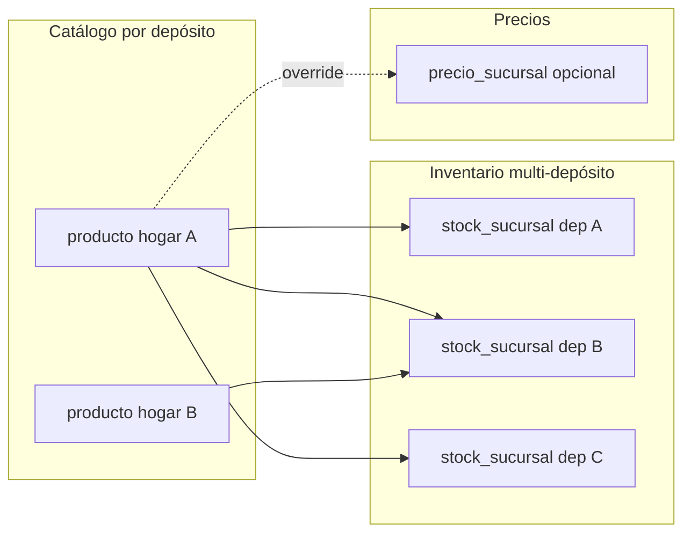

# Plan — Stock por sucursal + catálogo por depósito (convivencia)

## Cierre del plan (2026-04-29)

**Decisión final:** no se implementa **fusión** de filas `producto` en base de datos (la fase 4 original queda **descartada**). El producto sigue modelado como **una fila `producto` por artículo por sucursal de catálogo** (`producto.sucursal_id` = hogar), con **existencias y mínimos por depósito** en **`stock_sucursal`**, **precios opcionales por depósito** en **`precio_sucursal`**, y movimientos / facturación / importación alineados a **`registrar_movimiento`** con **`p_sucursal_id`** (migraciones **105–106**). El **importador** cubre actualización y consistencia por **match `código + unidad`** (y contexto de sucursal de importación + proveedor). Backfill de filas `stock_sucursal` faltantes: migración **`107`** + botón / **`POST /api/productos/materializar-stock-sucursales`** (solo admin). **POS:** búsqueda por código de barras tenant-wide + stock en caja; búsqueda por texto en ticketera (`GET /api/pos/buscar-productos`) en sucursales operables + stock/precio de la caja.

**Fuera de alcance de este plan cerrado:** **fase 6** (eliminar `producto.sucursal_id`, `producto.stock_actual` y triggers de convivencia) — solo tendría sentido con un programa explícito de “un maestro por tenant”; hoy **no está planificado**.

**Lo que no bloquea el cierre:** checklist QA multi-sucursal por release; uso opcional de `supabase/scripts/auditoria-producto-unico.sql` para higiene de datos; addendum legal si el negocio lo exige.

---

## Decisiones registradas (histórico — dueño / producto — 2026-04-28)

Contexto de diseño **antes del cierre**. La fila de **fusión automática** quedó **sin aplicar** por decisión 2026-04-29 (sustituida por operación vía import + `stock_sucursal`).

| Tema | Decisión (histórico) |
|------|----------|
| **Alcance original** | **A:** pensado para aplicar cambios a **todos los tenants** salvo excepciones; el cierre adopta **convivencia** sin job de fusión. |
| **Fusión automática (no ejecutada)** | Regla discutida: solo grupos con catálogo **idéntico** en todas las filas; el negocio **no** avanzó con job ni `merged_into`. |
| **Stock por depósito** | **Hecho:** consolidación operativa vía **`stock_sucursal`** por `(producto_id, sucursal_id)` con triggers de convivencia sobre `producto.stock_*`. |

### Qué era la pregunta 3 (“¿quién resuelve?”) — ejemplo con tu export

En el script de auditoría, un **grupo** = varias filas `producto` activas con el mismo código normalizado y misma unidad.

- **Ejemplo:** varias filas con código `85` y unidad `unidad`, **misma sucursal** (`n_sucursales = 1`), pero `n_nombres_distintos > 1` o `n_precios_venta_distintos > 1`. No son “el mismo artículo duplicado limpio”: son **inconsistencias de carga** o artículos mal cargados.
- Con tu regla (**solo fusionar si todo es igual**), ese grupo **no entra** en fusión automática hasta que en base de datos **unifiques** nombre/precios/etc. (importador, edición masiva, o soporte).
- La pregunta 3 del cuestionario se refería a otro escenario del plan viejo: cuando **sí** quisieras fusionar aunque difiera el nombre o el barcode, **quién** elige qué valor queda (cliente en pantalla vs equipo interno). Con la regla actual, **ese escenario no aplica** para fusión automática.

### Sobre archivos CSV exportados desde Supabase

El editor de Supabase guarda el resultado con **el nombre que elijas al exportar**; no tiene por qué coincidir con el SQL. Si el CSV tiene columnas `tenant_id`, `cod_norm`, `unidad`, `n_filas`, `n_sucursales`, `n_precios_venta_distintos`, `n_barcodes`, `n_nombres_distintos`, `ids`, `sucursales`, corresponde al **detalle de grupos duplicados** (CTE `grupos` del script `auditoria-producto-unico.sql`), **no** a “cliente sucursal membresía”. Renombrá el archivo a algo como `auditoria-producto-duplicados-grupos.csv` para evitar confusiones.

### Realidad sobre “cerrar todo ya” (histórico)

La variante “**un maestro `producto` por tenant** + fusión” quedó **descartada**. El cierre se basa en **convivencia**: catálogo por depósito + **`stock_sucursal`** + importador + POS/reportes ya alineados en repo.

---

## Resumen ejecutivo (estado al cierre)

**Objetivo alcanzado (convivencia):** inventario **multi-depósito** con **`stock_sucursal`** (y **`precio_sucursal`** opcional) manteniendo **varias filas `producto`** cuando el mismo código existe en más de una sucursal de catálogo. El stock “de venta” en cada sucursal se refleja en **`stock_sucursal`** para la caja / movimiento correcto (**106**).

**Qué no se hizo (y quedó explícitamente fuera):** colapsar duplicados a **un solo `producto_id` por tenant** (fusión BD, índice único global código+unidad sin sucursal, etc.).

**Estrategia aplicada:** fases **2–3** en BD + **5** en app para lecturas/escrituras y UX; **fase 4 omitida**; **fase 6 no planificada** en este entregable.

---

## Estado de implementación (código — cierre 2026-04-29)

Resumen de lo **mergeado / en repo** al cerrar el plan (convivencia, sin fusión).

| Fase | Estado | Notas |
|------|--------|--------|
| **0** | Cerrado (herramienta) | Script `auditoria-producto-unico.sql` en repo; corrida en prod confirmada. Clasificación por tenant **opcional** para higiene de datos. |
| **1** | Cerrado (histórico) | Decisiones 2026-04-28 archivadas arriba; la política de **fusión** no se ejecutó. |
| **2** | Hecho (BD) | `104_stock_sucursal_precio_sucursal_convivencia.sql`: `stock_sucursal`, `precio_sucursal`, RLS, backfill, triggers con `producto`. |
| **3** | Hecho (BD + app) | `105` + `106`: `registrar_movimiento` + `stock_sucursal` por depósito del movimiento. API movimientos con `sucursal_id` operable. |
| **4** | **Descartada** | Sin `merged_into`, sin RPC/UI de fusión; el importador y el modelo por depósito sustituyen la necesidad de colapso BD. |
| **5** | **Hecho** (salvo QA release) | Tickets V110-PROD cubiertos en alcance convivencia; ver lista abajo. |
| **6** | **Fuera de alcance** | No se eliminan columnas legacy en este plan; requeriría otro programa. |

**App / APIs entregadas (fase 5):**

- **Listado** `GET /api/productos?alcance=tenant` + UI “Todo el negocio” por defecto (`V110-PROD-001`).
- **Detalle** `GET/PATCH /api/productos/[id]`: alcance por sucursales operables; respuesta incluye `stocks_sucursal`; `PATCH /api/productos/[id]/stock-sucursal` para mínimo/ubicación por depósito; ficha con tabla “Stock por depósito” (`V110-PROD-002`).
- **Importador**: match server-side por **código + unidad** (misma sucursal y proveedor del contexto que antes); preflight y deduplicación alineados (`V110-PROD-004` parcial — el stock del archivo sigue aplicándose vía `registrar_movimiento` → `stock_sucursal`).
- **`precio_sucursal`:** lectura en `GET /api/productos/[id]` (incluye `precio_global`, `precios_sucursal` y precios fusionados en la raíz para vista) y en `GET /api/productos/buscar-por-barcode` para la caja. **Edición:** `PATCH /api/productos/[id]/precio-sucursal` + columnas costo/venta por depósito en la ficha (`V110-PROD-009` — sin feature flag dedicado).
- **QA por release (fuera del cierre formal):** checklist multi-sucursal según necesidad. **Reportes (`V110-PROD-007`):** métricas dashboard `valor_inventario` y alertas stock bajo sobre `stock_sucursal` + sucursales operables; `ventas-articulo` y `reposicion-proveedor` filtran ventas por `comprobante.sucursal_id` y stock/mínimo desde `stock_sucursal` con sucursal activa. **`GET/POST /api/movimientos`:** GET por `movimiento.sucursal_id`; POST con `sucursal_id` opcional (operable). **Vencimientos:** `GET /api/alertas/vencimientos` acota `producto` a `sucursal_id` operable. **Habilitar depósito:** `GET/POST …/stock-sucursal` + UI (`V110-PROD-008`). **`POST /api/productos`:** insert + `stock_sucursal` en sucursales operables (`V110-PROD-003`). **`107` + materializar-stock-sucursales:** backfill admin de filas `stock_sucursal` en todas las sucursales activas. **`GET /api/productos/buscar-por-barcode`:** tenant-wide + stock en caja (`V110-PROD-005`). **`GET /api/pos/buscar-productos`:** catálogo en sucursales operables + dedupe código+unidad + stock/precio caja. **Facturación (`V110-PROD-006`):** **106** en BD + app.
- **Tooling:** `npx tsc --noEmit` sin errores (2026-04-29); mocks `fetch` en tests MP-QR alineados al tipo global; `sucursal_id` en fixtures de tests ARCA cola de reintentos.

---

## Modelo vigente (convivencia — sin fusión)



**Invariantes al cierre del plan**

- **`producto.sucursal_id`:** sucursal **hogar del catálogo** de esa fila; puede haber más de una fila activa con el mismo código+unidad en distintas sucursales (convivencia).
- **`producto.stock_*`:** siguen existiendo; **doble escritura** con `stock_sucursal` vía triggers (**104**) para compatibilidad.
- **`registrar_movimiento` (105–106):** mueve **`stock_sucursal`** del depósito del movimiento; `movimiento.sucursal_id` acota el depósito.
- **Importador:** match **`(tenant + sucursal de importación + proveedor + código + unidad)`**; stock aplicado vía RPC con sucursal correcta.
- **POS:** barcode y búsqueda texto **tenant-wide / operables** con **stock (y precio) de la caja** desde `stock_sucursal` / `precio_sucursal`.
- **`clonar_productos_a_sucursal`:** legacy; en app se prefiere **habilitar depósito** (`stock-sucursal`) para el mismo `producto_id` en otro depósito sin duplicar catálogo cuando no hace falta otra fila `producto`.
- **Imágenes / historial / FKs:** siguen atados al `producto_id` de cada fila hogar (sin repunte masivo por fusión).

---

## Fase 0 — Auditoría de datos reales

**Al cierre del plan:** el script es una **herramienta opcional** de lectura para higiene y reporting; **no** bloquea el modelo convivencia ya desplegado.

### Objetivo

Saber, por cada tenant en producción:

1. Cuántos grupos de productos "duplicados" hay (mismo `codigo + unidad` en distintas sucursales del mismo tenant).
2. Qué tan conflictivos son esos grupos: ¿difieren en precio? ¿en código de barras? ¿en nombre? ¿en proveedor?
3. Cuántos tenants migran "limpio" (cero conflictos) vs cuántos necesitan resolución manual.
4. Cuál es el **peor caso** (tenant más complicado) para dimensionar la UI de resolución.

### Entregable

Script SQL que se corre con rol de servicio y produce un reporte por tenant.

```sql
-- supabase/scripts/auditoria-producto-unico.sql
-- Corre con SUPABASE_SERVICE_ROLE_KEY (bypassa RLS)

WITH grupos AS (
  SELECT
    tenant_id,
    LOWER(TRIM(codigo)) AS cod_norm,
    unidad,
    COUNT(*) AS n_filas,
    COUNT(DISTINCT sucursal_id) AS n_sucursales,
    COUNT(DISTINCT precio_venta) AS n_precios_venta_distintos,
    COUNT(DISTINCT precio_costo) AS n_costos_distintos,
    COUNT(DISTINCT codigo_barras) FILTER (WHERE codigo_barras IS NOT NULL) AS n_barcodes,
    COUNT(DISTINCT LOWER(TRIM(nombre))) AS n_nombres_distintos,
    COUNT(DISTINCT proveedor_id) FILTER (WHERE proveedor_id IS NOT NULL) AS n_proveedores,
    COUNT(DISTINCT iva_porcentaje) AS n_ivas_distintos,
    BOOL_OR(es_pesable) AS algun_pesable,
    BOOL_OR(NOT es_pesable) AS algun_no_pesable,
    SUM(stock_actual) AS stock_total,
    array_agg(id ORDER BY updated_at DESC) AS ids,
    array_agg(sucursal_id ORDER BY updated_at DESC) AS sucursales
  FROM producto
  WHERE activo = true
    AND codigo IS NOT NULL
    AND codigo <> ''
  GROUP BY tenant_id, LOWER(TRIM(codigo)), unidad
  HAVING COUNT(*) > 1
),
resumen_tenant AS (
  SELECT
    tenant_id,
    COUNT(*) AS grupos_duplicados,
    SUM(CASE WHEN n_precios_venta_distintos > 1 THEN 1 ELSE 0 END) AS conflictos_precio_venta,
    SUM(CASE WHEN n_costos_distintos > 1 THEN 1 ELSE 0 END) AS conflictos_costo,
    SUM(CASE WHEN n_barcodes > 1 THEN 1 ELSE 0 END) AS conflictos_barcode,
    SUM(CASE WHEN n_nombres_distintos > 1 THEN 1 ELSE 0 END) AS conflictos_nombre,
    SUM(CASE WHEN n_proveedores > 1 THEN 1 ELSE 0 END) AS conflictos_proveedor,
    SUM(CASE WHEN n_ivas_distintos > 1 THEN 1 ELSE 0 END) AS conflictos_iva,
    SUM(CASE WHEN algun_pesable AND algun_no_pesable THEN 1 ELSE 0 END) AS conflictos_pesable,
    MAX(n_filas) AS max_filas_en_grupo
  FROM grupos
  GROUP BY tenant_id
)
SELECT
  t.id AS tenant_id,
  t.nombre,
  t.plan,
  COALESCE(r.grupos_duplicados, 0) AS grupos_duplicados,
  COALESCE(r.conflictos_precio_venta, 0) AS conflictos_precio_venta,
  COALESCE(r.conflictos_costo, 0) AS conflictos_costo,
  COALESCE(r.conflictos_barcode, 0) AS conflictos_barcode,
  COALESCE(r.conflictos_nombre, 0) AS conflictos_nombre,
  COALESCE(r.conflictos_proveedor, 0) AS conflictos_proveedor,
  COALESCE(r.conflictos_iva, 0) AS conflictos_iva,
  COALESCE(r.conflictos_pesable, 0) AS conflictos_pesable,
  COALESCE(r.max_filas_en_grupo, 0) AS max_filas_en_grupo,
  CASE
    WHEN r.grupos_duplicados IS NULL THEN 'limpio'
    WHEN COALESCE(r.conflictos_precio_venta, 0) + COALESCE(r.conflictos_barcode, 0) + COALESCE(r.conflictos_nombre, 0) = 0 THEN 'trivial'
    WHEN COALESCE(r.conflictos_precio_venta, 0) > 0 OR COALESCE(r.conflictos_barcode, 0) > 0 THEN 'requiere_resolucion'
    ELSE 'menor'
  END AS dificultad_migracion
FROM tenant t
LEFT JOIN resumen_tenant r ON r.tenant_id = t.id
ORDER BY COALESCE(r.grupos_duplicados, 0) DESC;
```

Y un detalle por grupo conflictivo (para los tenants que requieran resolución):

```sql
-- Detalle de los 50 grupos más conflictivos (para diseñar la UI de resolución)
SELECT
  tenant_id,
  cod_norm,
  unidad,
  n_filas,
  n_sucursales,
  n_precios_venta_distintos,
  n_barcodes,
  n_nombres_distintos,
  ids,
  sucursales
FROM grupos
WHERE n_precios_venta_distintos > 1
   OR n_barcodes > 1
   OR n_nombres_distintos > 1
ORDER BY n_filas DESC, n_precios_venta_distintos DESC
LIMIT 50;
```

### Criterio de salida de la fase 0

- [x] Script en repositorio (`supabase/scripts/auditoria-producto-unico.sql`).
- [x] Script ejecutado contra producción (lectura) — confirmado dueño 2026-04-28.
- [x] Reporte exportado (CSV); revisar que el nombre del archivo refleje el contenido (ver sección *Decisiones registradas*).
- [ ] Clasificación de tenants en buckets (`limpio` / `trivial` / `menor` / `requiere_resolucion`) con la **primera query** del script (resumen por tenant), si aún no está archivada.
- [ ] Para tenants con muchos conflictos de datos: plan de **limpieza manual** o tooling en importador / fichas (**sin** fusión BD planificada).
- [x] Decisión de alcance documentada: **todos los tenants** (salvo excepciones explícitas).

---

## Fase 1 — Decisiones de negocio firmadas (histórico)

Contexto de producto / dueño **antes del despliegue de convivencia**. **Estas decisiones no son técnicas**, las firma producto / dueño del proyecto.

### Decisión 1 — Clave de fusión

¿Qué define que dos filas son "el mismo producto"?

**Opción A (recomendada):** `(tenant_id, LOWER(TRIM(codigo)), unidad)`. Coherente con el normalizador del importador.

**Opción B:** `(tenant_id, codigo_barras)` cuando barcode no es nulo. Riesgo: un producto sin barcode no se fusiona aunque tenga el mismo `codigo`.

**Opción C:** matching opcional por `nombre` también. Riesgo: pequeñas variaciones de descripción evitan la fusión y dejan duplicados.

**Recomendación:** **A** como clave primaria de fusión. Si difiere `nombre` → se elige el del producto con `updated_at` más reciente y se guarda log. Si difiere `codigo_barras` → ver decisión 3.

### Decisión 2 — Política de precios

¿Los precios son globales por producto o pueden variar por sucursal?

**Opción A — Solo precio global** (`producto.precio_costo`, `producto.precio_venta`). Más simple, pero **quita una funcionalidad que algunos clientes ya están usando de hecho**.

**Opción B (recomendada) — Precio global + tabla `precio_sucursal` opcional**. La sucursal usa el override si existe, sino el global. Permite migrar sin romper el caso de "el centro vende más caro".

**Recomendación:** **B**. Es el costo marginal de una tabla extra y deja la puerta abierta sin obligar a usarla.

Regla de fusión cuando los precios difieren:
1. Si todas las sucursales tienen el mismo precio → ese es el precio global, no se crean overrides.
2. Si difieren → el precio global = el de la sucursal "principal" del tenant (la que tenga `es_principal = true` o la primera creada). Las demás se materializan como `precio_sucursal`.
3. Documentar y mostrar al usuario en una pantalla de revisión post-migración.

### Decisión 3 — Código de barras

**Hoy:** índice único parcial sobre `(tenant_id, codigo_barras, proveedor_id)` cuando hay proveedor, o `(tenant_id, codigo_barras)` sin proveedor.

**Después:** el barcode debería ser único por **producto del tenant** (un barcode = un producto), independiente de la sucursal. Eso elimina la ambigüedad del POS (el endpoint `buscar-por-barcode` ya no necesita el flag `ambiguous` 409).

Regla de fusión cuando difieren los barcodes en un grupo:
1. Si solo una de las filas tiene barcode → ese gana.
2. Si varias tienen barcode distinto → conflicto explícito, requiere resolución manual del usuario (UI de la fase 4).
3. Si varias tienen el mismo barcode → no hay conflicto.

### Decisión 4 — `stock_minimo` y `ubicacion`

¿Son globales o por sucursal?

**Recomendación:** por sucursal. Tiene sentido que la sucursal A quiera tener mínimo 5 unidades y la B mínimo 20. Van en `stock_sucursal`, no en `producto`.

### Decisión 5 — Imagen del producto

Hoy: una imagen por producto en `{tenant_id}/{producto_id}/preview.webp`.

**Al cierre (sin fusión):** sigue siendo **una imagen por `producto_id`** (cada hogar de catálogo). Cleanup de objetos huérfanos en Storage, si se hace, queda **fuera** de este plan.

### Criterio de salida de la fase 1

- [ ] Documento de decisiones firmado (ideal: addendum a este plan), si el negocio lo exige.
- [x] **N/A (cierre):** la regla de fusión automática documentada en 2026-04-28 quedó **histórica** — **no** se implementó job de fusión; convivencia + import cubren el operativo.
- [ ] El equipo revisó las consecuencias en POS, importador y comprobantes (checklist de release, recomendado).

---

## Fase 2 — Esquema nuevo en convivencia con el viejo

**Objetivo:** crear las tablas nuevas sin tocar las viejas. Trigger sincroniza `producto.stock_actual` ↔ `stock_sucursal.stock_actual`. El sistema sigue funcionando exactamente igual; nada usa el modelo nuevo todavía.

### DDL y sincronización (fuente de verdad en repo)

**Archivo:** `supabase/migrations/104_stock_sucursal_precio_sucursal_convivencia.sql`

| Elemento | Nombre / detalle en migración 104 |
|----------|-----------------------------------|
| Tablas | `public.stock_sucursal`, `public.precio_sucursal` |
| Unique stock | `uk_stock_sucursal_producto_sucursal` (`producto_id`, `sucursal_id`) |
| Unique precio | `uk_precio_sucursal_producto_sucursal` |
| RLS | Policies `tenant_*_stock_sucursal` / `tenant_*_precio_sucursal` con `tenant_id = public.current_tenant_id()` |
| `updated_at` | Triggers `set_stock_sucursal_updated_at`, `set_precio_sucursal_updated_at` → `moddatetime(updated_at)` |
| Backfill | `INSERT … SELECT` desde `producto` activo con `sucursal_id` no nulo; incluye `ubicacion` en `stock_sucursal` |
| Anti-recursión | Sesión `app.suppress_stock_sync` dentro de las funciones de sync |

**Doble escritura `producto` ↔ `stock_sucursal` (fase 2 + convivencia fase 3):**

| Rol | Función PL/pgSQL | Trigger en tabla |
|-----|------------------|------------------|
| Tras `INSERT` en `producto` | `trg_producto_after_insert_stock_sucursal()` | `trg_producto_after_insert_stock_sucursal` |
| Tras `UPDATE` de stock/mín/ubic en `producto` | `trg_producto_after_update_sync_stock_sucursal()` | `trg_producto_after_update_sync_stock_sucursal` (columnas `stock_actual`, `stock_minimo`, `ubicacion`) |
| Tras `UPDATE` en `stock_sucursal` | `trg_stock_sucursal_after_update_sync_producto()` | `trg_stock_sucursal_after_update_sync_producto` (columnas `stock_actual`, `stock_minimo`, `ubicacion`) |

El listado anterior reemplaza el SQL de ejemplo de esta sección (nombres viejos `sync_stock_sucursal_to_producto` / `auth.tenant_id()`); el DDL ejecutable está solo en la migración 104.

### Criterio de salida de la fase 2

- [x] Tablas `stock_sucursal` y `precio_sucursal` creadas con RLS — migración `104_stock_sucursal_precio_sucursal_convivencia.sql`.
- [x] Backfill ejecutado: 1 fila en `stock_sucursal` por cada `producto.activo = true` (incluido en la misma migración).
- [x] Triggers de sincronización `producto` ↔ `stock_sucursal` (incluido en migración 104).
- [ ] Tests automatizados en repo: actualizar `producto.stock_actual` directo se refleja en `stock_sucursal` y viceversa.
- [ ] **Criterio original “nada en la app usa las tablas nuevas”:** superado al avanzar fase 5 en UI/API; la BD de convivencia sigue vigente.
- [ ] Deploy a producción + monitoreo 1 semana (operación / checklist de release).

---

## Fase 3 — Refactor de `registrar_movimiento` y APIs de stock

**Objetivo:** que toda escritura de stock pase por `stock_sucursal`. La fila de `producto` se sigue actualizando por el trigger pero ya no es la fuente de verdad.

### Cambios

**`registrar_movimiento`** recibe `p_sucursal_id` explícito y bloquea la fila de `stock_sucursal` correspondiente a **ese** depósito (migración **106**: ya no exige `p_sucursal_id = producto.sucursal_id`; valida sucursal activa del tenant).

```sql
CREATE OR REPLACE FUNCTION registrar_movimiento(
  p_tenant_id       UUID,
  p_producto_id     UUID,
  p_sucursal_id     UUID,  -- NUEVO parámetro obligatorio
  p_tipo            tipo_movimiento,
  p_cantidad        NUMERIC(12,3),
  p_motivo          TEXT DEFAULT NULL,
  p_referencia_tipo referencia_tipo DEFAULT NULL,
  p_referencia_id   UUID DEFAULT NULL,
  p_usuario_id      UUID DEFAULT NULL
) RETURNS movimiento AS $$
DECLARE
  v_stock_anterior NUMERIC(12,3);
  v_stock_posterior NUMERIC(12,3);
  v_movimiento movimiento;
BEGIN
  SELECT stock_actual INTO v_stock_anterior
  FROM stock_sucursal
  WHERE producto_id = p_producto_id
    AND sucursal_id = p_sucursal_id
    AND tenant_id = p_tenant_id
  FOR UPDATE;

  IF NOT FOUND THEN
    -- Auto-crear fila de stock_sucursal en 0 (caso: producto que nunca tuvo stock en esta sucursal)
    INSERT INTO stock_sucursal (tenant_id, producto_id, sucursal_id, stock_actual, stock_minimo)
    VALUES (p_tenant_id, p_producto_id, p_sucursal_id, 0, 0)
    RETURNING stock_actual INTO v_stock_anterior;
  END IF;

  -- ... (el resto de la lógica igual: case por tipo, validar stock, insertar movimiento, actualizar stock_sucursal)
END;
$$ LANGUAGE plpgsql SECURITY DEFINER;
```

**`movimiento`** gana columna `sucursal_id`:

```sql
ALTER TABLE movimiento ADD COLUMN sucursal_id UUID REFERENCES sucursal(id);
UPDATE movimiento m SET sucursal_id = p.sucursal_id
  FROM producto p WHERE p.id = m.producto_id AND m.sucursal_id IS NULL;
ALTER TABLE movimiento ALTER COLUMN sucursal_id SET NOT NULL;
CREATE INDEX idx_movimiento_sucursal ON movimiento(sucursal_id);
```

### APIs y callers a actualizar

Todos los lugares que llaman `supabase.rpc('registrar_movimiento', ...)` deben pasar `p_sucursal_id`:

- `src/lib/importar/ejecutar-importacion.ts` — usa la sucursal de la importación.
- `src/lib/facturacion/emitir-comprobante.ts` — usa `comprobante.sucursal_id`.
- `src/app/api/movimientos/route.ts` — `p_sucursal_id` = depósito del producto; permiso vía sucursales operables (no exige body `sucursal_id`).
- `src/lib/pos/...` — usa la sucursal activa del POS.
- Cron de cobranza, conversiones de pedidos, devoluciones, etc.

### Criterio de salida de la fase 3

- [x] `registrar_movimiento` acepta `p_sucursal_id` y escribe en `stock_sucursal` — migraciones `105_registrar_movimiento_sucursal_id.sql` y `106_registrar_movimiento_stock_sucursal_caja.sql`.
- [x] Backfill de `movimiento.sucursal_id` (en migración 105).
- [x] Callers en código actualizados (importador, facturación, movimientos API, pedidos, anulaciones, lector, productos, etc.).
- [x] El trigger de fase 2 sigue replicando a `producto.stock_actual` (compatibilidad hacia atrás).
- [ ] QA / tests automatizados de regresión: importación, POS, facturación, cobranza (checklist manual pendiente según release).

---

## Fase 4 — Fusión de productos duplicados (**descartada**)

**Decisión 2026-04-29:** no se implementa job de fusión, columna `merged_into`, ni repunte masivo de FKs. La operación correcta es **mantener filas `producto` por hogar de catálogo**, usar **`stock_sucursal`** (y **107** / materializar) para existencias por depósito, **`/importar`** con match **`código + unidad`** (y contexto de sucursal), y **POS** con stock en caja.

**Archivo histórico:** el borrador de algoritmo + SQL de esta fase vivía en versiones anteriores de este documento y en discusiones de ticket; no hay migración `110_fusion_productos` en el cierre.

### Criterio de salida (N/A)

- [x] **Descartado explícitamente** — sin trabajo pendiente de fusión bajo este plan.

---

## Fase 5 — Refactor de la app (**cerrada** en alcance convivencia)

**Objetivo alcanzado:** UI y APIs usan **`stock_sucursal`** / **`precio_sucursal`** para operación multi-depósito, manteniendo **`producto.sucursal_id`** como hogar de catálogo (sin fusión).

### Cambios principales (resumen al cierre)

| Componente | Antes | Después (cerrado) |
|---|---|---|
| Listado `/productos` | Lista solo sucursal actual | **Hecho:** vista “Todo el negocio” por defecto + `GET ?alcance=tenant` + columna sucursal; una fila `producto` por ítem de catálogo. |
| Detalle `/productos/[id]` | Stock de una sucursal | **Hecho:** `stocks_sucursal` + PATCH mínimo/ubicación + precios por depósito. |
| `POST /api/productos` | Solo fila local | **Hecho:** alta + `stock_sucursal` en sucursales operables; **107** + materializar para backfill. |
| Importador | Match nombre+código… | **Hecho:** match **código + unidad** + stock vía `registrar_movimiento` → `stock_sucursal`. |
| POS barcode + texto | Acotado a sucursal | **Hecho:** tenant-wide / operables + **stock y precio de la caja** (`buscar-por-barcode`, `buscar-productos`, `productos-por-ids`). |
| Comprobantes | — | **`comprobante.sucursal_id`** define depósito de venta; **`106`** descuenta `stock_sucursal` correcto. |
| Clonación catálogo | `clonar_productos_a_sucursal` | **Deprecado en flujo principal;** habilitar depósito vía **`stock-sucursal`**. |
| Reportes | — | **Hecho:** consumo por `comprobante.sucursal_id` + `stock_sucursal` donde aplica. |

### Tickets (estado al cierre)

- `V110-PROD-001` — **Hecho** (listado tenant + API).
- `V110-PROD-002` — **Hecho** (detalle + `stocks_sucursal` + PATCH).
- `V110-PROD-003` — **Hecho** en convivencia (alta + filas `stock_sucursal`; sin “un solo producto por tenant”).
- `V110-PROD-004` — **Hecho** (match código+unidad + movimientos con sucursal).
- `V110-PROD-005` — **Hecho** (barcode + búsqueda POS; EAN único global **no** es objetivo de este plan).
- `V110-PROD-006` — **Hecho** (106 + app); QA release opcional.
- `V110-PROD-007` — **Hecho** en app; QA release opcional.
- `V110-PROD-008` — **Hecho** (habilitar depósito).
- `V110-PROD-009` — **Hecho** (lectura + PATCH precio por depósito).

### Criterio de salida de la fase 5

- [x] UI y APIs operan con **`stock_sucursal`** / **`precio_sucursal`** en flujos de stock y precio por depósito.
- [x] Lecturas/ajustes desde `stock_sucursal` + escritura vía `registrar_movimiento` + triggers **104**.
- [x] Importador alineado a **código + unidad** (duplicados *por diseño* posibles entre sucursales de catálogo; se gestionan con datos + import, no con fusión BD).
- [ ] QA multi-sucursal formal por release (**recomendado**, no bloquea cierre del plan).
- [x] Trigger fase 2 activo (**104**); fase 6 explícitamente fuera de alcance.

---

## Fase 6 — Cleanup legacy (**fuera de alcance** de este plan)

**No aplica** al cierre en modelo convivencia: **`producto.sucursal_id`**, **`producto.stock_*`** y los triggers **104** siguen siendo parte del diseño vigente.

Si en el futuro se definiera un programa de **un maestro por tenant**, recién ahí tendría sentido evaluar drop de columnas, índice único global `(tenant, código, unidad)` sin sucursal, y limpieza de Storage.

### Criterio de salida (N/A bajo este plan)

- [x] **Marcado fuera de alcance** — sin entregables obligatorios.

---

## Riesgos y mitigaciones

| Riesgo | Probabilidad | Impacto | Mitigación |
|---|---|---|---|
| Tenant grande con miles de conflictos en fase 0 | Media | Alto | Migración por tenant, no global. Tenants problemáticos quedan en modelo viejo hasta resolver. |
| Caller olvidado que llama `registrar_movimiento` sin `sucursal_id` | Alta | Alto | Hacer `p_sucursal_id` obligatorio (no DEFAULT). Falla ruidosa, no silenciosa. |
| Doble escritura del trigger genera race conditions | Baja | Medio | El trigger es AFTER y no toca stock_sucursal de vuelta. Tests de concurrencia. |
| Cliente nota cambios de comportamiento en POS | Media | Medio | Comunicación previa. Feature flag para activar modelo nuevo por tenant. |
| Reportes históricos cambian números por una futura fusión | — | — | **N/A:** fusión BD descartada bajo este plan. |
| Bucket de imágenes con archivos huérfanos | Alta | Bajo | Script de cleanup solo si algún día se hace fase 6 u otro refactor mayor. |

---

## ¿Vale la pena hacerlo? (contexto histórico — evaluación pre–convivencia)

La variante “maestro único + fusión” **no se ejecutó**. El **plan cerrado** adoptó **convivencia** (menor costo de migración de datos, mismo multi-depósito operativo). Lo siguiente resume el debate **original**:

**Pros**
- Modelo canónico, alineado con cualquier ERP serio de inventario multi-depósito.
- Catálogo unificado: una sola fuente de verdad para nombre, código, IVA.
- POS sin ambigüedad de barcode.
- Reportes más simples (group by producto_id directo).
- Habilita transferencias entre sucursales bien modeladas.
- Quita la fricción de "clonar productos a otra sucursal".

**Contras**
- Migración compleja, varias semanas de trabajo.
- Riesgo de regresiones en módulos críticos (POS, facturación, importador).
- Si los tenants no piden activamente "no quiero duplicar productos", el ROI es solo arquitectónico.

**Alternativas más livianas (si el ROI no convence)**

1. **Vista materializada `producto_unificado`** que agrupe duplicados por `(tenant, codigo)` solo para el catálogo y reportes. ~10% del trabajo, ~70% del valor visible.
2. **`producto.master_id` self-FK opcional** que permita marcar duplicados sin migrarlos. Stock sigue por fila.
3. **Migrar solo tenants nuevos** al modelo nuevo y dejar los viejos como están. Crea tech debt pero baja riesgo.

---

## Post-cierre (opcional, fuera de este plan)

1. **QA por release:** recorrido multi-sucursal (import, POS, facturación, transferencias, reportes) según checklist del equipo.
2. **Datos:** usar `auditoria-producto-unico.sql` cuando haga falta auditar duplicados o conflictos; corregir en import / fichas (sin fusión).
3. **Documentación operativa:** mantener `stock.md` / importador / multi-tenancy alineados con **106**, **107** y botón materializar si el equipo lo usa en runbooks.

**Plan cerrado el 2026-04-29** — modelo **convivencia** (sin fusión BD, sin fase 6 obligatoria).