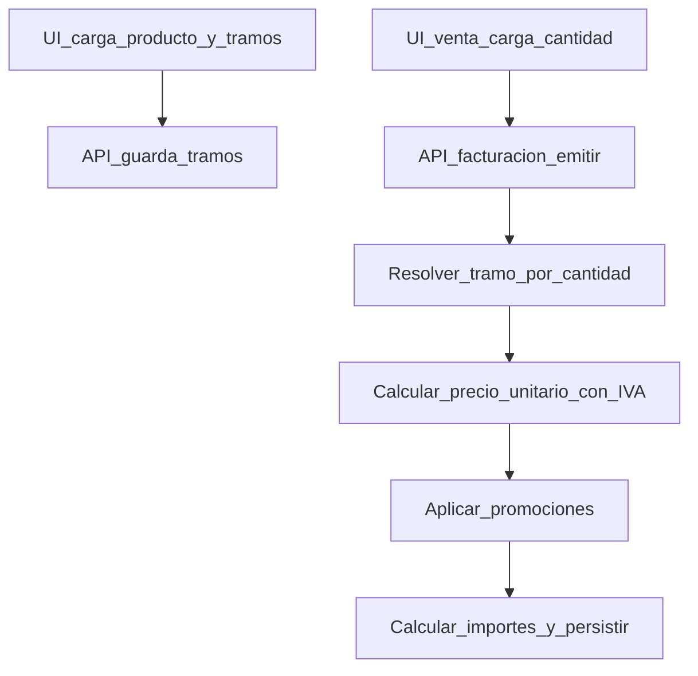

## Plan: ganancia por cantidad (unidad vs caja/pack)

## Objetivo
Permitir configurar **ganancias distintas por cantidad** para un mismo producto (ej. 1u = 60%, 50u = 55%, 300u = 50%), y que el sistema calcule el **precio unitario efectivo** automáticamente según la **cantidad total** (prioridad: tramo de mayor cantidad).

## Estado actual (lo que ya existe)
- El producto tiene un solo `porcentaje_ganancia` y un solo `precio_venta` (IVA incluido) por **unidad base**.
  - Cálculo: `costo * (1 + ganancia/100) * (1 + iva/100)` en [`src/lib/productos/calcular-precio-venta.ts`](src/lib/productos/calcular-precio-venta.ts).
- Existe “presentación de compra” en `producto.unidad_compra` + `producto.contenido_unidad_compra` para representar caja/pack y su equivalencia a unidad base, migración [`supabase/migrations/099_producto_presentacion_compra.sql`](supabase/migrations/099_producto_presentacion_compra.sql).
- En POS y emisión el backend usa `precio_unitario` que viene en el body, y aplica promociones sobre eso (ver [`src/lib/facturacion/emitir-comprobante.ts`](src/lib/facturacion/emitir-comprobante.ts) alrededor de la aplicación de promos y cálculo de importes).
- El panel de precios hoy **simula** “unidad vs caja/pack” pero con **una sola ganancia** para todas las filas (ver [`src/components/producto/precios-compra-venta-panel.tsx`](src/components/producto/precios-compra-venta-panel.tsx)).

## Decisiones ya confirmadas
- Base de la regla: **por cantidad en unidad base** (ej. 1, 50, 300).
- Prioridad: **gana el tramo de mayor cantidad** (si vendés 300, aplica 300+).
- Alcance: aplica a **POS + Facturación/Presupuestos/Pedidos**.

## Diseño propuesto
### 1) Modelo de datos (persistencia)
Crear una tabla nueva por tenant/producto:
- `producto_ganancia_tramo`
  - `id` UUID PK
  - `tenant_id` (FK)
  - `producto_id` (FK)
  - `cantidad_desde` NUMERIC(12,3) NOT NULL (>= 1) — cantidad mínima en unidad base
  - `ganancia_pct` NUMERIC(6,2) NOT NULL (>= 0)
  - `created_at`, `updated_at`
  - Índice único: `(tenant_id, producto_id, cantidad_desde)`

Regla:
- Se busca el tramo con `cantidad_desde <= cantidad` y se elige el de **mayor** `cantidad_desde`.
- Si no hay tramos definidos: fallback al `producto.porcentaje_ganancia` (comportamiento actual).

### 2) Motor de precio unitario efectivo
Agregar una función utilitaria (o módulo) de “pricing por cantidad” que:
- Reciba `precio_costo`, `iva_porcentaje` (o default), `porcentaje_ganancia` base y los tramos.
- Calcule `precio_unitario` final con IVA usando `calcularPrecioVenta`.

Punto clave: el cálculo usa **cantidad total en unidad base**. Para ventas “por caja/pack”, la UI ya conoce `contenido_unidad_compra`; el carrito/servidor deben convertir a base antes de evaluar el tramo.

### 3) UI: editar ganancia por unidad y por caja/pack (y tramos extras)
Extender [`src/components/producto/precios-compra-venta-panel.tsx`](src/components/producto/precios-compra-venta-panel.tsx) para que el simulador no sea solo lectura:
- **Fila “Por 1 unidad base”**: input de `ganancia_pct` (equivale al tramo `cantidad_desde = 1`).
- **Fila “Por 1 caja/pack (contenido_unidad_compra)”**: input de `ganancia_pct` (equivale a `cantidad_desde = contenido_unidad_compra`).
- Mantener “Agregar venta por cantidad (pack)” pero cada fila nueva tendrá:
  - input `cantidad_desde`
  - input `ganancia_pct`
- El panel debe mostrar el **precio final con IVA** calculado por fila usando su ganancia.

Compatibilidad:
- Si el usuario no crea tramos, se sigue usando `producto.porcentaje_ganancia` como hoy.
- Si crea el tramo `1`, podemos opcionalmente sincronizar `producto.porcentaje_ganancia` con ese valor para que el resto de pantallas “antiguas” sigan mostrando algo coherente.

### 4) APIs / backend
- **Lectura/escritura tramos**:
  - Crear endpoints REST para `GET/PUT` de tramos por producto (o integrarlo al `PATCH/PUT` de producto si ya existe).
  - Asegurar RLS por `tenant_id` (similar a otras tablas).
- **Aplicación en emisión**:
  - En [`src/lib/facturacion/emitir-comprobante.ts`](src/lib/facturacion/emitir-comprobante.ts), antes de aplicar promociones:
    - Para cada línea, calcular `precio_unitario_base` desde producto + tramos + cantidad.
    - Usar ese `precio_unitario_base` como `precio_unitario` de entrada al motor de promociones.
  - Mantener posibilidad de override manual (si ya existe en UI) con una regla explícita, p. ej. “si viene un flag `precio_manual=true` no recalcular”.

### 5) Pedidos / Presupuestos
Identificar los puntos donde se arma `precio_unitario` en:
- pedidos (pantallas/API bajo `src/app/(dashboard)/pedidos/` y `src/app/api/pedidos/`)
- presupuestos (bajo `src/app/(dashboard)/presupuestos/` y `src/app/api/presupuestos/`)

y aplicar la misma regla: **precio unitario sugerido** según cantidad (y luego promos si corresponden).

## Migraciones y tipado
- Agregar migración SQL para `producto_ganancia_tramo` + índices + triggers `updated_at` + policies RLS.
- Regenerar/actualizar tipos en [`src/types/database.ts`](src/types/database.ts) si el repo los mantiene en sync.

## Tests
- Unit tests del selector de tramo (cantidad -> tramo elegido) y del cálculo de precio unitario.
- Test de integración mínimo en emisión para verificar que:
  - cantidad 1 usa tramo 1
  - cantidad 50 usa tramo 50
  - cantidad 300 usa tramo 300
  - promos siguen aplicando sobre el precio recalculado

## Diagrama (flujo simplificado)

## Archivos principales a tocar
- [`supabase/migrations/*_producto_ganancia_tramo.sql`](supabase/migrations)
- [`src/components/producto/precios-compra-venta-panel.tsx`](src/components/producto/precios-compra-venta-panel.tsx)
- [`src/lib/productos/calcular-precio-venta.ts`](src/lib/productos/calcular-precio-venta.ts)
- Nuevo: `src/lib/productos/precio-por-tramos.ts` (o similar)
- [`src/lib/facturacion/emitir-comprobante.ts`](src/lib/facturacion/emitir-comprobante.ts)
- (Según hallazgos) módulos de pedidos/presupuestos donde se calcula `precio_unitario`
