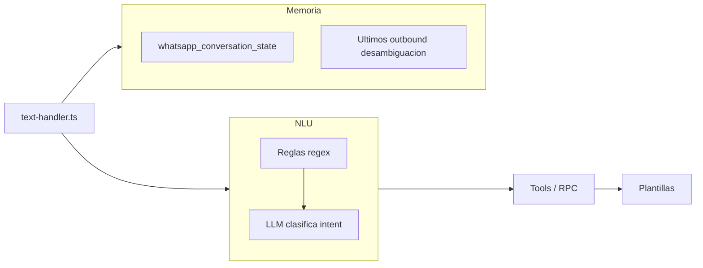
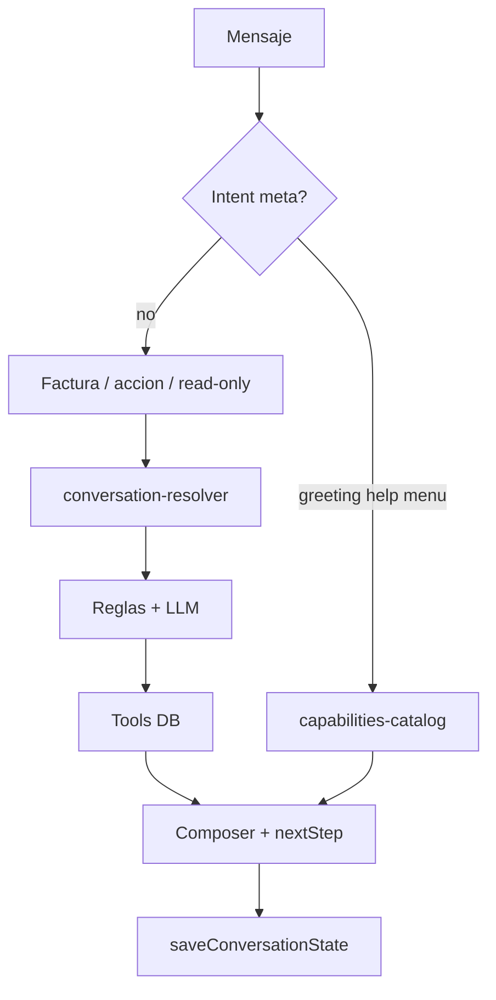

# WhatsApp Chatbot — Roadmap v14.4 (conversacional + adjuntos)

Plan de evolución del agente WhatsApp: **desbloquear adjuntos** (factura imagen/PDF, audio STT), luego **capa de asistente** (saludo, ayuda, menú por módulo/rol) y **memoria conversacional** unificada.

Mantiene arquitectura **tool-first**: datos de reportes/acciones siempre desde DB/tools; el LLM clasifica intents, no inventa cifras.

Índice del chatbot: [`whatsapp-chatbot.md`](./whatsapp-chatbot.md).  
Catálogo actual de capacidades: [`whatsapp-chatbot-capacidades.md`](./whatsapp-chatbot-capacidades.md).  
Tickets: [`TICKETS.md`](./TICKETS.md) — bloque **WHATSAPP v14.4** (`V144-WA-001` … `V144-WA-011`).

---

## Diagnóstico

### Motor híbrido actual

### Por qué no se siente asistente

| Problema | Ubicación |
|----------|-----------|
| `hola` / `ayuda` → `unknown` con catálogo incompleto | `response-composer.ts` |
| Sin intents `greeting` / `help` / `menu` | `read-only-agent.ts` |
| Memoria = slots, sin resumen de turno | `conversation-memory.ts` |
| Follow-ups duplicados (handler vs intent-context) | `text-handler.ts`, `intent-context.ts` |
| Memoria no se guarda tras acciones/facturas | `text-handler.ts` |
| LLM solo clasifica, no redacta respuestas | `read-only-agent.ts` |

### Incidente: jobs en «Esperando sucursal»

Estado `awaiting_branch_confirmation` con `branch_resolution_reason: multiple_active_branches_without_rule`.

| Tipo adjunto | Comportamiento |
|--------------|----------------|
| **Imagen/PDF factura** | `webhook/route.ts` → `resolveBranchByRules`. Varias sucursales activas sin `whatsapp_branch_rule` → el job **no** entra a `process-queued` hasta responder `1`, `2`, etc. por WhatsApp. |
| **Audio** | Código actual omite sucursal (`not_required_audio_stt`). Jobs viejos pueden quedar en espera de sucursal. Requiere feature flag, `OPENAI_API_KEY`, crons `process-queued` y `send-outbound`. |
| **Reintentar (UI)** | Pone `status=queued` sin `branch_id` → facturas vuelven a fallar. |

Código: [`branch-resolution.ts`](../src/lib/whatsapp/branch-resolution.ts), [`process-queued/route.ts`](../src/app/api/cron/whatsapp/process-queued/route.ts).

---

## Fase 0 — Adjuntos y sucursal (prioridad crítica)

**Tickets:** `V144-WA-001` … `V144-WA-004`

### Objetivos

- Imagen/PDF de factura llega a `lector_factura_job` sin quedar colgada.
- Nota de voz transcrita y enrutada al text-handler.
- Usuario informado cuando falta sucursal, flag o STT.

### 0.1 Resolución automática de sucursal

En `branch-resolution.ts`, antes de `multiple_active_branches_without_rule`:

1. Una sola sucursal activa con `es_principal = true` → `resolved_auto` (`principal_branch_default`).
2. Opcional: sucursal del `usuario` vinculado al `whatsapp_actor`.
3. Prompt manual solo si siguen 2+ candidatos sin regla.

### 0.2 UI reglas en `/whatsapp`

CRUD mínimo de `whatsapp_branch_rule` en `whatsapp-jobs-client.tsx` (hoy solo existe en BD).

### 0.3 Mensajes y pipeline

- Mejorar `buildBranchPromptMessage` (contexto factura + comandos ticket).
- Tras confirmar sucursal por WhatsApp: disparar `process-queued` (no solo cron pasivo).
- Verificar `send-outbound` entrega el prompt de sucursal.

### 0.4 Audio

- Outbound si feature flag OFF o STT falla.
- Reparar jobs `voice_note` legacy en `awaiting_branch_confirmation`.
- Reintentar UI: factura exige `branch_id` o fallback; audio puede reprocess directo.

### Criterio de éxito

Subir JPEG → mensaje «Recibí la factura, la estoy procesando…». Nota de voz → respuesta del agente como texto.

---

## Fase 1 — Capa de asistente y descubrimiento

**Tickets:** `V144-WA-005`, `V144-WA-006`

### Objetivos

El usuario descubre capacidades con `hola`, `ayuda`, `menu` sin leer PDF externo.

### Entregables

| Pieza | Descripción |
|-------|-------------|
| `capabilities-catalog.ts` | Catálogo por `modulo_config`, rol, canal; alineado con `whatsapp-chatbot-capacidades.md` |
| Intents `assistant_greeting`, `assistant_help`, `assistant_examples` | Reglas conf ≥ 0.92, fuera de `ACTION_KEYWORDS` |
| `composeGreetingReply` / `composeHelpReply` / `composeExamplesReply` | En `response-composer.ts` |
| Menú incluye voz y facturas | Secciones Facturas + Voz en ayuda |

### Criterio de éxito

`hola` ≠ `no entendí`; menú filtrado por módulos y rol.

---

## Fase 2 — Memoria conversacional unificada

**Tickets:** `V144-WA-007`, `V144-WA-008`, `V144-WA-009`

### Migración estado (v2)

Campos nuevos en `whatsapp_conversation_state`:

| Campo | Uso |
|-------|-----|
| `last_user_message` | Último texto usuario (truncado) |
| `last_bot_summary` | Resumen de una línea del último reply |
| `last_contact_field` | Campo contacto del turno |
| `turn_count` | Primer mensaje / bienvenida |
| `session_started_at` | TTL sesión larga (ej. 24 h) |

### `conversation-resolver.ts`

Unifica `resolveFollowupFromConversationMemory` + `expandMessageWithIntentContext`.

Patrones ampliados: anáforas (`eso`, `de nuevo`), post-acción (`y su saldo`), `pendingPrompt` al LLM.

### Persistencia y next steps

- Guardar estado tras acciones y cierre de ticket factura.
- `suggestNextStep` tras reportes frecuentes (flag V2).

### Criterio de éxito

Follow-ups estables sin depender de dos capas desalineadas.

---

## Fase 3 (opcional) — Pulido LLM de respuesta (hecho)

**Ticket:** `V144-WA-011`

- Flag `WHATSAPP_AGENT_REPLY_POLISH=1` (off por default).
- `composeReplyWithLlmPolish` en `reply-llm-polish.ts`: saludo, ayuda, ejemplos, catálogo `unknown`.
- Validación: montos congelados, sin cifras nuevas; tope de tamaño (no reportes).
- Fallback a plantilla si LLM falla. Runbook: costo/latencia ~6 s / ~450 tokens.

---

## Arquitectura objetivo

---

## Orden de implementación

1. Fase 0 (`V144-WA-001` … `004`)
2. Fase 1 (`V144-WA-005`, `006`)
3. Fase 2 (`V144-WA-007` … `009`)
4. Evals y docs (`V144-WA-010`)
5. Fase 3 (`V144-WA-011`) tras piloto

---

## Variables de entorno relevantes

| Variable | Uso |
|----------|-----|
| `WHATSAPP_CONVERSATION_TTL_MINUTES` | TTL memoria slots (default 30) |
| `WHATSAPP_CONVERSATION_SESSION_HOURS` | TTL sesión larga / `turn_count` (default 24) |
| `WHATSAPP_AGENT_INTENT_LLM` | Clasificador intent |
| `WHATSAPP_STT_PROVIDER` / `OPENAI_API_KEY` | Audio |
| `WHATSAPP_AUTO_FLUSH_OUTBOUND` | Envío prompt sucursal |
| `CRON_SECRET` | `process-queued`, `send-outbound` |
| `WHATSAPP_AGENT_REPLY_POLISH` | Fase 3 |

---

## Fuera de alcance v14.4

- Historial completo multi-turn para RAG
- Export CSV desde WhatsApp
- Pedidos / presupuestos
- Sucursal por chat en reportes read-only (sí en adjuntos vía Fase 0)

---

## Troubleshooting operativo

| Síntoma | Causa probable | Acción |
|---------|----------------|--------|
| Job «Esperando sucursal» + `multiple_active_branches_without_rule` | Varias sucursales, sin regla | Responder `1`/`2` por WA; configurar regla en `/whatsapp` (post `V144-WA-002`) |
| Factura no procesa tras reintentar | `branch_id` null | Confirmar sucursal por chat o esperar `V144-WA-001` |
| Audio sin respuesta | Flag off, STT, cron | Activar flag; `OPENAI_API_KEY`; correr crons |
| Audio en espera sucursal | Job legacy | Reparación `V144-WA-004` |

Ver checklist ampliado en [`whatsapp-agentico-runbook.md`](./whatsapp-agentico-runbook.md#v144-adjuntos-y-sucursal).
