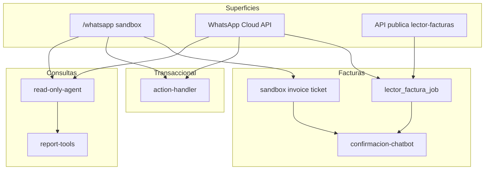

# WhatsApp Chatbot — Indice

Agente conversacional de SmartStock por tenant: consultas read-only, acciones piloto con doble confirmacion y carga de facturas segun el canal. No inventa datos; consulta la base o repregunta.

Indice general de documentacion: [`README.md`](./README.md).

## Requisitos transversales

| Requisito | Detalle |
|-----------|---------|
| Actor WhatsApp | Vinculacion OTP (`whatsapp_actor` + `whatsapp_auth_challenge`). Ver runbook. |
| Feature flag | `whatsapp_agent_feature_flag.enabled = true` por tenant. |
| Modulos | Cada intent exige modulo activo (`modulo_config`). Ver [`modulos.md`](./modulos.md). |
| Rol | Consultas: cualquier actor verificado. Acciones y carga de factura: no `readonly` / `visor`. |

Operacion y piloto: [`whatsapp-agentico-runbook.md`](./whatsapp-agentico-runbook.md).

## Tres canales

| Canal | Uso | Consultas | Acciones | Facturas |
|-------|-----|-----------|----------|----------|
| **Sandbox** (`/whatsapp`) | Pruebas en la app | Texto → mismo motor que live | `simulate` (sin RPC) | Upload + ticket conversacional |
| **WhatsApp live** | Meta Cloud API | Texto + audio (STT) | Ejecuta RPC con `SI <token>` | Adjunto → job + ticket conversacional (revisar/buscar/enlazar/confirmar) |
| **API publica** | Integrador externo | N/A | N/A | Jobs async + `POST .../confirmar` |

Codigo central del motor de texto: [`src/lib/whatsapp/text-handler.ts`](../src/lib/whatsapp/text-handler.ts).

## Mapa de documentacion

| Documento | Contenido |
|-----------|-----------|
| [whatsapp-chatbot-reportes.md](./whatsapp-chatbot-reportes.md) | Catalogo de reportes y consultas puntuales (ventas, stock, deuda, contacto, follow-ups) |
| [whatsapp-chatbot-acciones.md](./whatsapp-chatbot-acciones.md) | Pago proveedor, cobro cliente, ajuste de stock |
| [whatsapp-chatbot-facturas.md](./whatsapp-chatbot-facturas.md) | Ticket de factura en sandbox, comandos de chat, confirmacion de impacto |
| [whatsapp-chatbot-capacidades.md](./whatsapp-chatbot-capacidades.md) | Inventario completo de capacidades (referencia / PDF) |
| [whatsapp-chatbot-roadmap-v14.4.md](./whatsapp-chatbot-roadmap-v14.4.md) | Roadmap v14.4: adjuntos, asistente, memoria (plan + troubleshooting) |
| [whatsapp-agentico-runbook.md](./whatsapp-agentico-runbook.md) | Activacion piloto, rollback, monitoreo, checklist pre-produccion |
| [whatsapp-agent-evals.md](./whatsapp-agent-evals.md) | Suite automatizada v14.4 (192 casos) y gates de release |
| [lector-facturas-api.md](./lector-facturas-api.md) | API async para integradores: jobs, preview, confirmar/aplicar |
| [lector-facturas.md](./lector-facturas.md) | Lector IA en la app (UI `/lector-facturas`) |
| [reportes.md](./reportes.md) | Reportes web: metricas y limites (SKU vs tickets POS) |

Arquitectura del bloque v14: [`whatsapp_agentico_smartstock_7a811cd0.plan.md`](./whatsapp_agentico_smartstock_7a811cd0.plan.md). Tickets: [`TICKETS.md`](./TICKETS.md) (`V140-WA-*` … `V144-WA-*`).



## Flujo de mensaje (sandbox y live)

1. Autenticacion de actor y feature flag.
2. Si hay **ticket de factura activo** y el texto coincide con un comando de ticket → [`handleWhatsAppInvoiceTicketChatCommand`](../src/lib/whatsapp/sandbox.ts) (solo sandbox hoy).
3. Si el texto es confirmacion/cancelacion de **accion pendiente** → [`action-handler.ts`](../src/lib/whatsapp/action-handler.ts).
4. Si no → [`runWhatsAppReadOnlyAgent`](../src/lib/whatsapp/read-only-agent.ts) (reglas + LLM + tools).

## Prueba rapida en sandbox

1. Activar feature flag en `/whatsapp` (ver runbook).
2. Reporte: `ventas hoy` o `resumen del mes`.
3. Accion simulada: `registrar pago proveedor Arcor 1000` → `SI <token>`.
4. Factura: subir PDF/imagen → revisar pendientes → `buscar 1 yerba` → `enlazar 1 2` → `SI <token>`.

Detalle por area en los catalogos enlazados arriba.

## Roadmap v14.4 (completo)

Bloque **WHATSAPP v14.4** en [`TICKETS.md`](./TICKETS.md) (`V144-WA-001` … `V144-WA-011`). Detalle: [`whatsapp-chatbot-roadmap-v14.4.md`](./whatsapp-chatbot-roadmap-v14.4.md).

| Fase | Tickets | Objetivo |
|------|---------|----------|
| **0 — Adjuntos** | `V144-WA-001` … `004` | Sucursal (fallback principal, UI reglas), pipeline post-confirmación, audio STT visible |
| **1 — Asistente** | `V144-WA-005`, `006` | `hola` / `ayuda` / menú por módulo y rol (`capabilities-catalog`) |
| **2 — Memoria** | `V144-WA-007` … `009` | Estado v2, `conversation-resolver`, persistencia tras acciones/facturas |
| **3 — Polish** | `V144-WA-011` | Pulido LLM opcional (`WHATSAPP_AGENT_REPLY_POLISH`) en saludo/ayuda/catálogo |
| **QA** | `V144-WA-010` | Evals + docs (192 casos, gates en CI) |

**Incidente conocido:** jobs en «Esperando sucursal» con `multiple_active_branches_without_rule` al subir factura con varias sucursales sin regla — ver troubleshooting en roadmap v14.4.

## Roadmap v14.3 (completado)

| Ticket | Tema |
|--------|------|
| V143-WA-001 / 002 | NLU: memoria en LLM, reglas + few-shots |
| V143-WA-003 | Cierre de caja (consulta) |
| V143-WA-004 | Ventas por artículo (top SKU) |
| V143-WA-005 | Extracto CC cliente |
| V143-WA-006 | Cobranza por factura |
| V143-WA-007 | POS por caja/operador |
| V143-WA-008 | Contacto proveedor |
| V143-WA-009 | Comparativo vs mes anterior |
| V143-WA-010 | Factura live: ticket post-job |

## No disponible todavia
- Resolución automática sucursal principal para adjuntos — `V144-WA-001`.
- UI reglas sucursal WhatsApp — `V144-WA-002`.
- Reportes de compras/importaciones.
- Exportacion CSV desde WhatsApp.
- Filtros por sucursal en reportes read-only del chat.
- Pedidos / presupuestos desde el chat.

Lista ampliada en [`whatsapp-chatbot-reportes.md`](./whatsapp-chatbot-reportes.md#no-disponible-todavia-desde-el-chatbot).

## Evals

```bash
npx vitest run src/test/whatsapp-agent-evals.test.ts
```

Ver [`whatsapp-agent-evals.md`](./whatsapp-agent-evals.md).
