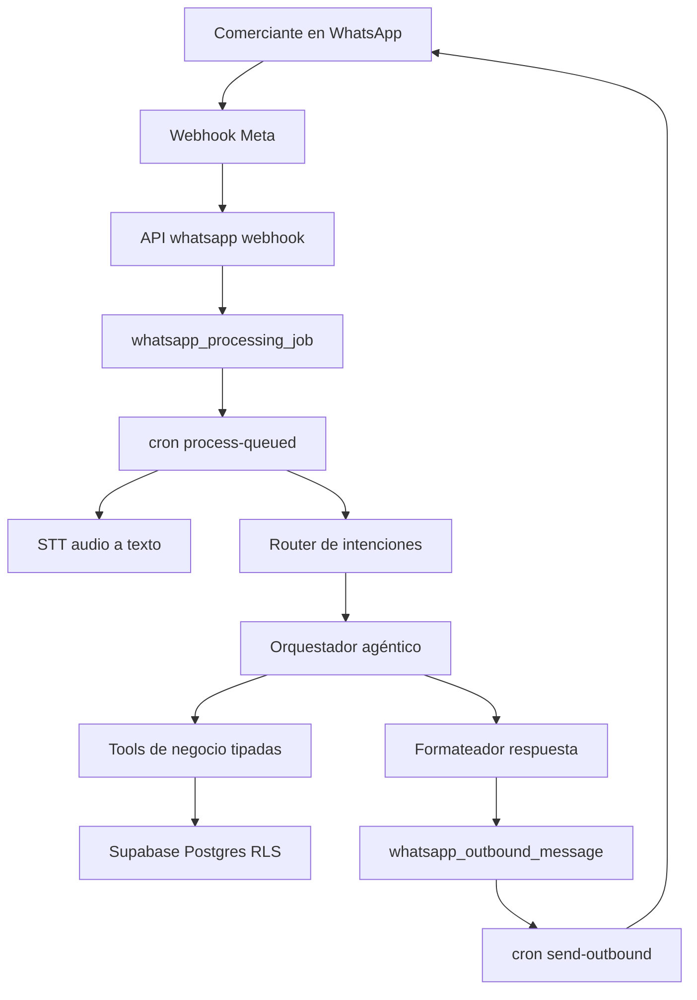

# Plan WhatsApp Agéntico para SmartStock

## Guía en lenguaje sencillo (para quien no es de sistemas)

**Qué problema resolvemos.** Hoy el comerciante usa SmartStock en la computadora o el celular con la app. La idea es que también pueda **preguntar cosas del negocio por WhatsApp**, escribiendo o mandando un audio, y recibir respuestas **basadas en los datos reales** del sistema (no en suposiciones).

**Qué podrá hacer el comerciante (en orden de entrega).**

1. **Primero solo consultas.** Por ejemplo: cuánto debe un cliente, cuánto le debo a un proveedor, cuánto stock hay de un producto, o pedir un reporte sencillo. El sistema **no modifica** datos en esta etapa: solo lee y responde. Así se gana confianza y se reduce el riesgo de errores.
2. **Después, mensajes de voz.** El audio se convierte a texto (como un “dictado”) y se responde igual que si hubiera escrito. Una sola forma de procesar las preguntas evita confusiones.
3. **Más adelante, acciones desde el chat** (por ejemplo registrar un pago o un movimiento de stock). Eso solo cuando las consultas ya funcionen bien. Ahí hará falta **confirmar dos veces** en el chat y dejar **registro de lo que se hizo**, para que no se ejecute nada por error ni dos veces seguidas.

**Cómo sabe el sistema “qué negocio” es y “quién” habla.**

- El **número de WhatsApp del negocio** (el que el cliente usa para escribirle al comercio) ya permite saber **a qué empresa en SmartStock** corresponde el mensaje.
- Para saber **quién** escribe (dueño, empleado, etc.) hace falta **vincular el número personal de WhatsApp** con un usuario del sistema. Eso se hace con un **código de verificación** que llega por el mismo WhatsApp, similar a cuando un banco te manda un código para confirmar algo. Sin ese paso completo, no se habilitan consultas sensibles.

**Si cambia el celular.** No se “mueve” el vínculo a ciegas: se da de alta el número nuevo, se verifica con código, y el número viejo deja de tener permiso. Queda registro de quién reemplazó a quién.

**Seguridad en pocas palabras.**

- Las respuestas salen de **los mismos datos** que ya usa SmartStock hoy.
- Cada operación sensible, cuando exista, pedirá **confirmación explícita** y quedará **trazabilidad**.
- Los códigos de verificación **vencen** (por ejemplo a los 10 minutos) y si alguien prueba muchas veces mal, se **bloquea un rato** para evitar abusos. Los códigos que quedaron “a medias” se marcan como vencidos automáticamente para no acumular basura.

**Cómo se va a desplegar.** No se prende para todos el primer día: se puede **activar comercio por comercio**, probar con pocos, medir si la gente entiende las respuestas y si hay errores, y recién ahí ampliar.

**Qué no es este proyecto (al inicio).** No es un chatbot que inventa números ni que “adivina” el stock: si hace falta un dato, el sistema lo **busca en la base de datos** o en los mismos reportes que ya existen. Tampoco es obligatorio montar otro servidor aparte: se apoya en lo que SmartStock ya tiene.

---

## Recomendación técnica (costo/tiempo/riesgo)

- Usar **Meta WhatsApp Cloud API existente** (ya integrado) para no reescribir canal.
- Implementar núcleo agéntico en backend de Next.js con **tools internas tipadas** (consultas SQL vía Supabase) y política `read-first`.
- Para audio: **STT en Google/Gemini** (misma familia tecnológica que ya usan en IA) para reducir complejidad operativa.
- **No arrancar con RAG**: iniciar con prompt + catálogo de tools; incorporar RAG solo si el corpus de documentación operacional crece y supera el límite práctico.

## Arquitectura objetivo

## Identidad y sesión WhatsApp (bloqueante inicial)

- Separar identidad de canal en dos capas:
  - `tenant` por `phone_number_id` en `whatsapp_channel` (ya existe).
  - `actor` por `from_wa_id` vinculado a `usuario` (nuevo binding).
- Crear contrato de sesión de canal:
  - `whatsappSession = { tenantId, actorId, actorRole, fromWaId, trustLevel }`.
  - `trustLevel` mínimo recomendado: `verified`, `unverified`, `blocked`.
- Definir onboarding seguro del número:
  - alta desde panel interno (owner/admin),
  - challenge OTP por WhatsApp,
  - confirmación y activación del vínculo `from_wa_id <-> usuario_id`.
- Si no hay binding válido:
  - bloquear tools sensibles,
  - responder con flujo de verificación o mensaje de no autorización.

Archivos base a aprovechar:
- [src/app/api/whatsapp/webhook/route.ts](src/app/api/whatsapp/webhook/route.ts)
- [src/lib/whatsapp/inbound.ts](src/lib/whatsapp/inbound.ts)
- [supabase/schema.sql](supabase/schema.sql)

## Fase 0 — Fundaciones y seguridad

- Definir contrato de feature: intents, permisos por rol y límites por tenant/sucursal.
- Crear política de seguridad para operaciones sensibles:
  - `consulta`: permitida por defecto con control de módulo/tenant.
  - `accion`: requiere confirmación explícita + guardrails + auditoría.
- Definir catálogo inicial de intents:
  - deuda proveedor
  - deuda cliente cuenta corriente
  - stock por producto
  - reportes básicos (ventas, reposición, deuda)
- Definir tabla(s) de identidad WhatsApp y auditoría:
  - `whatsapp_actor` (tenant, from_wa_id, usuario_id, rol_whatsapp, verified_at, activo),
  - `whatsapp_auth_challenge` (otp hash, expiración, intentos, estado).
- Regla obligatoria para tools internas:
  - validar `tenantId` y alcance de sucursal explícitamente en cada tool antes de ejecutar query,
  - no depender solo de RLS para aislamiento agéntico.

Archivos base a aprovechar:
- [src/app/api/whatsapp/webhook/route.ts](src/app/api/whatsapp/webhook/route.ts)
- [src/lib/api/tenant-session.ts](src/lib/api/tenant-session.ts)
- [src/lib/api/permissions.ts](src/lib/api/permissions.ts)

## Contrato técnico cerrado (antes de codear)

### 1) `whatsapp_actor` (binding número ↔ usuario ↔ tenant)

- Campos mínimos:
  - `id` (uuid pk), `tenant_id` (fk), `usuario_id` (fk), `from_wa_id` (text), `rol_whatsapp` (text/enum),
  - `trust_level` (`verified|unverified|blocked`),
  - `activo` (bool),
  - `verified_at` (timestamptz),
  - `created_at`, `updated_at` (timestamptz),
  - `replaced_by_actor_id` (uuid nullable, self-fk opcional para trazabilidad).
- Restricciones recomendadas:
  - unique activo por número en tenant: `(tenant_id, from_wa_id, activo=true)`.
  - único actor activo por usuario en tenant (opcional según negocio): `(tenant_id, usuario_id, activo=true)`.
- Política de cambio de número (definida):
  - no migrar binding en caliente,
  - crear nuevo actor `unverified`,
  - validar OTP,
  - desactivar actor anterior (`activo=false`) y enlazar `replaced_by_actor_id`.

### 2) `whatsapp_auth_challenge` (OTP)

- Campos mínimos:
  - `id` (uuid pk), `tenant_id`, `actor_id`, `channel_phone_number_id`,
  - `otp_hash`, `otp_salt`, `expires_at`,
  - `attempt_count`, `max_attempts`,
  - `resend_count`, `blocked_until`,
  - `status` (`pending|verified|expired|blocked|cancelled`),
  - `created_at`, `updated_at`, `verified_at`.
- Parámetros hardcodeados iniciales:
  - `expires_in = 10m`
  - `max_attempts = 5`
  - `cooldown_after_block = 15m`
  - `max_resend = 3` por ventana de `30m`
- Comportamiento:
  - al exceder intentos: `status=blocked` + `blocked_until`,
  - al expirar: `status=expired`,
  - éxito: `status=verified` + `verified_at` y `whatsapp_actor.trust_level=verified`.
  - housekeeping de huérfanos: expirar automáticamente registros `pending` con `expires_at < now()`.
- Mantenimiento recomendado:
  - job programado (cron) cada 5-10 min que ejecute:
    - `UPDATE whatsapp_auth_challenge SET status='expired', updated_at=now() WHERE status='pending' AND expires_at < now();`
  - opcional: trigger defensivo en lecturas críticas para evitar operar con challenges vencidos que no hayan sido barridos aún.

### 3) `action_signature` (idempotencia y auditoría)

- Definición canónica:
  - `action_signature = sha256(wamid + "|" + tool_name + "|" + canonical_json(params) + "|" + tenant_id)`
- Reglas de `canonical_json(params)`:
  - ordenar claves alfabéticamente,
  - remover espacios superfluos,
  - normalizar fechas a ISO 8601,
  - normalizar decimales con formato estable.
- Persistencia recomendada:
  - guardar `action_signature`, `wamid`, `tool_name`, `tool_version`, `tenant_id`, `actor_id`, `params_snapshot`, `result_snapshot`, `created_at`.
  - unique `(tenant_id, action_signature)` para deduplicación dura.

### 4) Estado de sesión de canal WhatsApp

- Contrato:
  - `whatsappSession = { tenantId, actorId, actorRole, fromWaId, trustLevel }`
- Reglas:
  - sin `tenantId`: rechazar mensaje (canal no asociado),
  - con `tenantId` pero sin actor verificado: solo flujo de verificación y respuestas limitadas,
  - con `trustLevel=blocked`: negar tools y devolver instrucción de desbloqueo.

## Fase 1 — Motor conversacional read-only (MVP robusto)

- Implementar `text-handler` único para texto directo y texto proveniente de audio.
- Construir `intent-classifier` + `slot-filling` (cliente/proveedor/producto/período) con fallback a repregunta.
- Hardening del classifier:
  - primero reglas determinísticas para intents obvios,
  - luego LLM para casos ambiguos,
  - incluir ejemplos negativos (consultas fuera de catálogo) para reducir tool hallucination.
- Registrar telemetría desde el primer release:
  - `intent_detected`, `intent_confidence`, `fallback_reason`, `tool_selected`, `latency_ms`.
- Crear **tools read-only** con interfaces estrictas y validación Zod:
  - `getProveedorDebt(proveedorNombre|id)`
  - `getClienteDebt(clienteNombre|id)`
  - `getProductStock(productoNombre|id, sucursal?)`
  - `getReport(reportType, rangoFechas, sucursal?)`
- Reusar consultas existentes antes de crear nuevas:
  - [src/app/api/reportes/clientes-deuda/route.ts](src/app/api/reportes/clientes-deuda/route.ts)
  - [src/app/api/alertas/stock-bajo/route.ts](src/app/api/alertas/stock-bajo/route.ts)
  - [src/app/api/proveedores/[id]/cuenta-corriente/route.ts](src/app/api/proveedores/[id]/cuenta-corriente/route.ts)
  - [src/app/api/clientes/[id]/cuenta-corriente/route.ts](src/app/api/clientes/[id]/cuenta-corriente/route.ts)

## Fase 2 — Audio end-to-end

- Extender parser inbound para tipos `audio/voice`.
- Extender routing de jobs para rama `audio_transcription`.
- Integrar STT y normalización de transcript.
- Soportar pipeline de formatos WhatsApp (`.ogg/opus`) con transcode seguro cuando el proveedor STT no acepte el formato nativo.
- Enviar transcript al mismo `text-handler` para evitar duplicación de lógica.

Archivos a extender:
- [src/lib/whatsapp/inbound.ts](src/lib/whatsapp/inbound.ts)
- [src/lib/whatsapp/job-routing.ts](src/lib/whatsapp/job-routing.ts)
- [src/app/api/cron/whatsapp/process-queued/route.ts](src/app/api/cron/whatsapp/process-queued/route.ts)

## Fase 3 — Acciones transaccionales seguras

- Agregar capa `action-tools` separada de `query-tools`.
- Patrón de doble confirmación en WhatsApp para cambios de estado/montos.
- Idempotencia por `wamid + action_signature` para evitar duplicados.
- Auditoría en tabla de trazas de agente (entrada, tool invocada, resultado, usuario, tenant, timestamp).

Candidatos de acción (gradual):
- registrar pago en cuenta corriente
- registrar movimiento de stock
- generar pedido/propuesta

## Fase 4 — Observabilidad, calidad y escalado

- Métricas avanzadas (sobre eventos ya capturados desde Fase 1): precisión de intent, tiempo de respuesta, tasa de fallback, tasa de error por tool.
- Alertas operativas en crons (`process-queued`, `send-outbound`) y reintentos con backoff.
- Test plan completo:
  - unit tests de clasificación/validación
  - integration tests por tool
  - e2e webhook texto/audio
  - pruebas de permisos RLS/tenant isolation
- Estrategia de rollout:
  - feature flag por tenant
  - piloto con 1–2 comercios
  - ampliación gradual por módulo

## Procedimientos correctos de entrega

- Documentar arquitectura y decisiones en `docs/` (flujo, seguridad, playbook operativo).
- Crear tickets por fases (sin mezclar múltiples entregables grandes en un solo PR).
- Cada fase con criterios de aceptación verificables y checklist de QA.
- Go-live solo después de:
  - pruebas de regresión en APIs existentes
  - validación de permisos
  - monitoreo activo de errores

## Resultado esperado

- Comerciantes consultan deuda, stock y reportes por WhatsApp (texto y audio) con respuestas confiables.
- Sistema estable por diseño (guardrails, idempotencia, auditoría, feature flags).
- Base escalable para sumar nuevos intents, tools y automatizaciones sin romper el core.
